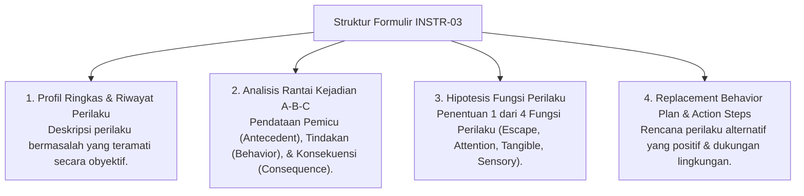

# P5-04-03: Formulir Analisis Diagnostik Perilaku FBA (INSTR-03)

## Status Dokumen
* **Status**: 🌟 **A+ (Tervalidasi & Siap Diimplementasikan)**
* **Sub-Domain**: `05 Assessment Framework / 04 Assessment Instruments`
* **Penanggung Jawab Keilmuan**: Dewan Keilmuan TUMBUH (*Pakar Bimbingan Konseling & Pakar Arsitektur PBIS Restoratif*)

---

## 1. Spesifikasi Formulir FBA Restoratif (INSTR-03)

Formulir FBA (INSTR-03) digunakan oleh Tim Bimbingan Konseling (BK) untuk mendiagnosis penyebab pemicu di balik masalah perilaku santri yang kronis/berulang.

---

## 2. Standar Pengisian & Re-Evaluasi

- Formulir FBA diisi melalui sesi konseling privat dengan santri dan wawancara musyrif kamar.
- Re-evaluasi dilakukan 2 pekan setelah pelaksanaan *Replacement Behavior Plan*.
