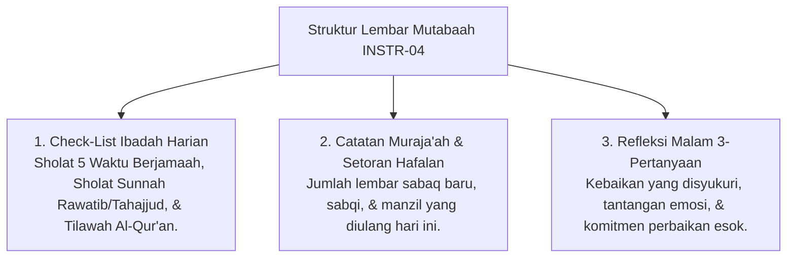

# P5-04-04: Instrumen Jurnal Mutabaah dan Portofolio Adab (INSTR-04)

## Status Dokumen
* **Status**: 🌟 **A+ (Tervalidasi & Siap Diimplementasikan)**
* **Sub-Domain**: `05 Assessment Framework / 04 Assessment Instruments`
* **Penanggung Jawab Keilmuan**: Dewan Keilmuan TUMBUH (*Pakar Desain Kurikulum Adab & Pakar Psikologi Belajar*)

---

## 1. Spesifikasi Jurnal Mutabaah INSTR-04

Jurnal INSTR-04 adalah lembar mutabaah reflektif pribadi yang diisi oleh santri setiap malam sebelum tidur untuk memantau ibadah harian dan pembiasaan adabnya.

---

## 2. Portofolio Capaian Adab Santri

Seluruh entri INSTR-04 terakumulasi secara otomatis menjadi **Portofolio Adab Santri Digital** yang dapat dilampirkan dalam pengajuan transisi Tangga TUMBUH.
