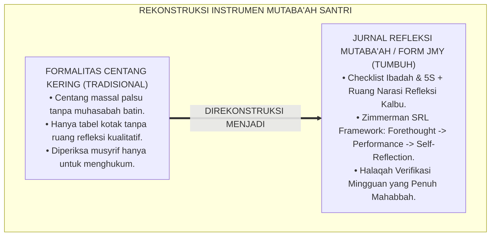
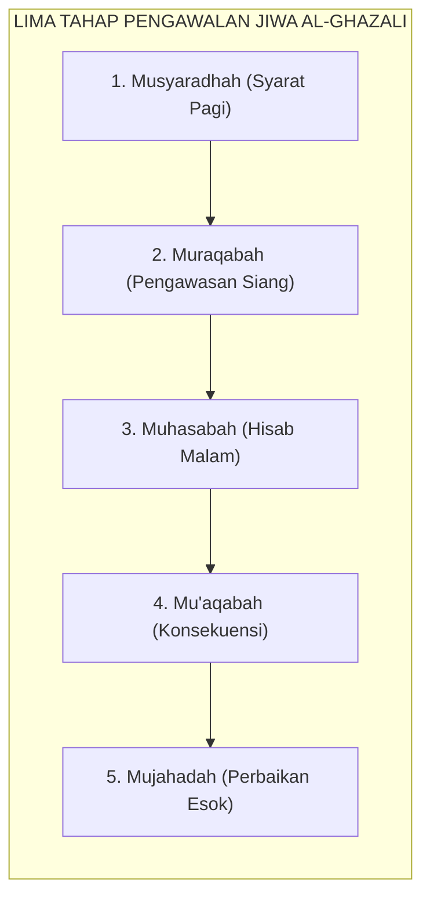
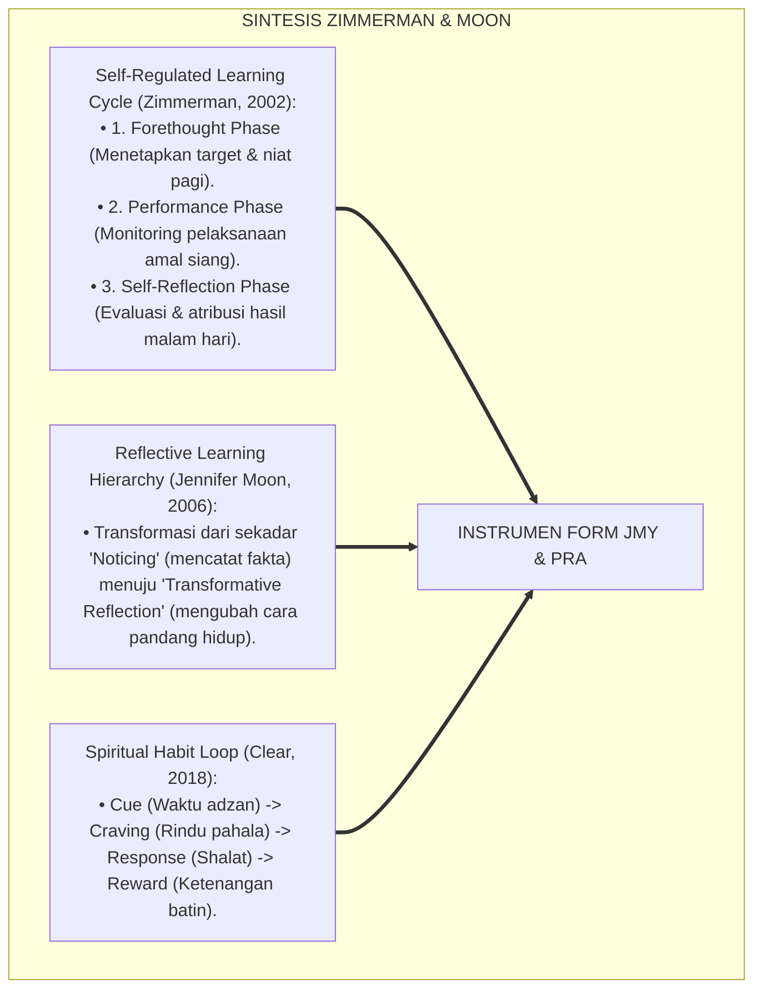
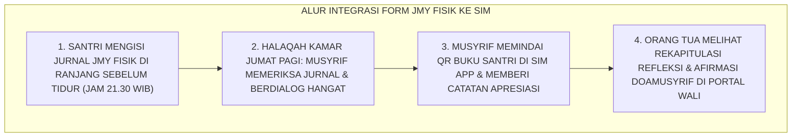
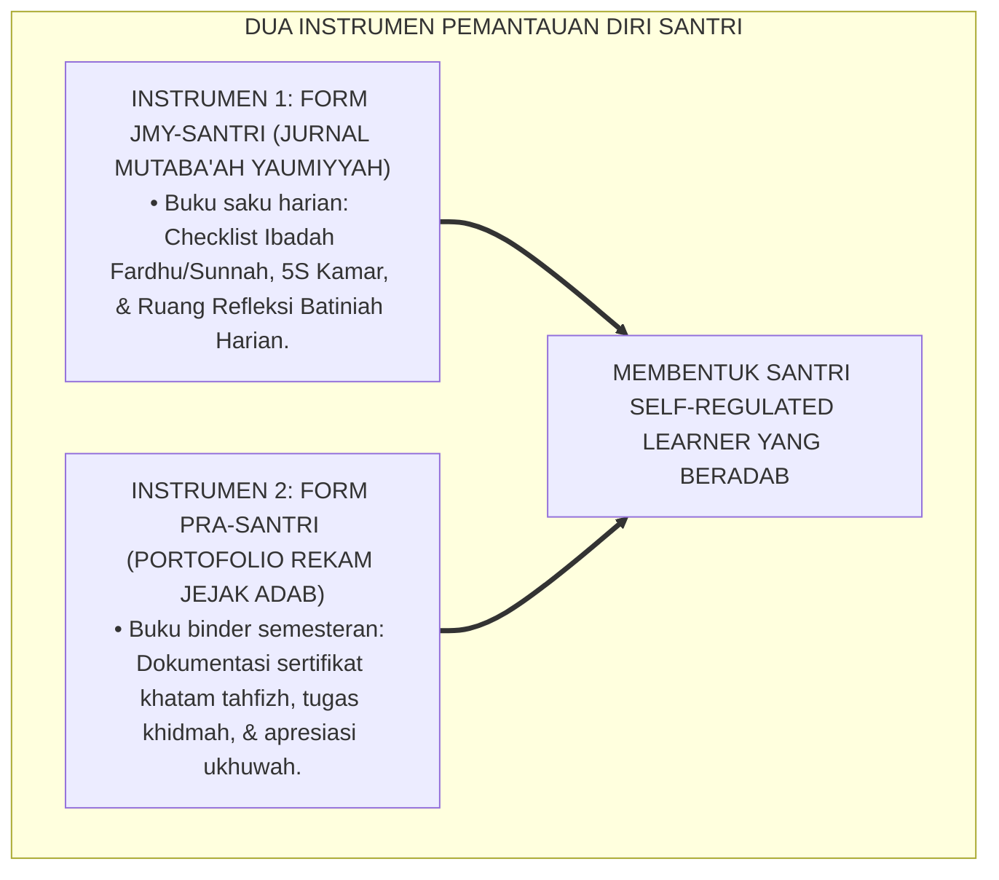
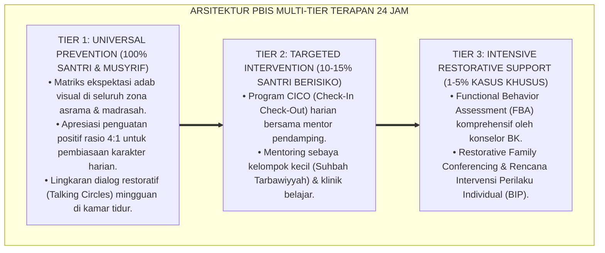

# P5-04-04: INSTRUMEN JURNAL MUTABA'AH DAN PORTOFOLIO ADAB
## *Monograf Riset Akademik: Desain dan Standardisasi Buku Jurnal Mutaba'ah Yaumiyyah (Form JMY-Santri) dan Buku Portofolio Rekam Jejak Adab 10 Kapasitas Insan, Integrasi Doktrin Al-Kasyf 'an Nafs wa 'Ilmul Yaqin Turats Klasik dengan Self-Regulated Learning (SRL) & Reflective Journaling Framework, Serta Mekanisme Verifikasi Mingguan di Ekosistem Pesantren Berbasis TUMBUH*

**Nomor Identifikasi**: `P5-04-04/MONOGRAF-RISET-INSTRUMEN-JURNAL-MUTABAAH-PORTOFOLIO/2026`  
**Domain**: `05 Assessment Framework` > `04 Assessment Instruments` (Sub-Modul 04: *Daily Mutaba'ah Journal & Adab Portfolio Instruments*)  
**Klasifikasi Naskah**: *Academic Research Monograph* (Monograf Penelitian Desain Buku Mutaba'ah Yaumiyyah, Portofolio Adab Santri, & Fiqh Al-Murāqabah)  
**Rumpun Disiplin Pengkaji**: Desain Instrumen Refleksi Diri, Self-Regulated Learning (SRL), Portofolio Adab Pesantren, Fiqh Tazkiyatun Nafs  

---

> ### 💡 INTISARI EKSEKUTIF (EXECUTIVE SUMMARY)
>
> * **Kelemahan Buku Mutaba'ah Tradisional yang Menjadi Beban Formalitas:**  
>   Buku mutaba'ah di banyak pesantren kerap berubah menjadi sekadar "formalitas centang kering": santri mencentang seluruh kolom shalat dan tilawah tanpa pernah melakukan muhasabah batin yang mendalam (*Superficial Tick-Box Compliance*), atau bahkan memalsukan centang di akhir pekan sebelum buku diperiksa musyrif.
> * **Integrasi Doktrin Al-Murāqabah Salaf & Reflective Learning Framework:**  
>   Ekosistem TUMBUH merekonstruksi instrumen pembiasaan dengan merancang **Buku Jurnal Mutaba'ah Yaumiyyah (Form JMY-Santri)** dan **Buku Portofolio Rekam Jejak Adab (Form PRA-Santri)** yang memadukan doktrin *Murāqabatullāh* (kesadaran diawasi Allah) dan *Muhāsabatun Nafs* Imam Al-Ghazali dengan teori *Self-Regulated Learning (SRL)* Barry Zimmerman dan *Reflective Journaling* Jennifer Moon. Format jurnal memadukan checklist amalan wajib/sunnah dengan ruang refleksi naratif batiniah harian (*Reflective Narrative Space*).
> * **Arsitektur Verifikasi & Apresiasi Mingguan Musyrif:**  
>   Monograf ini menyajikan spesifikasi instrumen 7 kolom harian, panduan dialog verifikasi halaqah Jumat, rubrik evaluasi kematangan refleksi diri, dan protokol penghargaan istiqamah (*Istiqamah Milestone Badge*).

---

## 📑 DAFTAR ISI MONOGRAF

- [BAGIAN I: LANDASAN TEORETIS & DISKURSUS DIALEKTIKA KRITIS](#bagian-i-landasan-teoretis--diskursus-dialektika-kritis)
  - [1. Latar Belakang Masalah: Bahaya Budaya Formalitas Centang Semu dalam Mutaba'ah Asrama](#1-latar-belakang-masalah-bahaya-budaya-formalitas-centang-semu-dalam-mutabaah-asrama)
  - [2. Eksegesis Turats: Doktrin Al-Muraqabah, Al-Musyāradhah, & Kitab Muhasabatun Nafs Salaf](#2-eksegesis-turats-doktrin-al-muraqabah-al-musyradhah--kitab-muhasabatun-nafs-salaf)
  - [3. Konvergensi Sains Metakognisi: Zimmerman's SRL Cycle & Moon's Reflective Learning Hierarchy](#3-konvergensi-sains-metakognisi-zimmermans-srl-cycle--moons-reflective-learning-hierarchy)
  - [4. Rekayasa Alur Digital 24 Jam: Integrasi Jurnal Fisik Santri dengan e-Mutaba'ah SIM Intizham](#4-rekayasa-alur-digital-24-jam-integrasi-jurnal-fisik-santri-dengan-e-mutabaah-sim-intizham)
  - [5. Kasuistika Lapangan Klinis & Protokol Transformasi Santri J2 dari Pemalsu Centang Menjadi Penulis Jurnal Reflektif yang Jujur](#5-kasuistika-lapangan-klinis--protokol-transformasi-santri-j2-dari-pemalsu-centang-menjadi-penulis-jurnal-reflektif-yang-jujur)
- [BAGIAN II: FORMULASI KONSEPTUAL & PEMBAHASAN MENDALAM](#bagian-ii-formulasi-konseptual--pembahasan-mendalam)
  - [1. Arsitektur Komprehensif Instrumen Jurnal Mutaba'ah dan Portofolio Adab TUMBUH](#1-arsitektur-komprehensif-instrumen-jurnal-mutabaah-dan-portofolio-adab-tumbuh)
  - [2. Dekomposisi Struktur Harian Form JMY: Ranah Ibadah, Ranah 5S, & Ruang Refleksi Batiniah](#2-dekomposisi-struktur-harian-form-jmy-ranah-ibadah-ranah-5s--ruang-refleksi-batiniah)
  - [3. Desain Format Resmi Lembar Jurnal Mutaba'ah Yaumiyyah (Form JMY-Santri)](#3-desain-format-resmi-lembar-jurnal-mutabaah-yaumiyyah-form-jmy-santri)
  - [4. Diskusi Akademis & Implikasi bagi Pembentukan Kesadaran Metakognitif Spiritual Santri](#4-diskusi-akademis--implikasi-bagi-pembentukan-kesadaran-metakognitif-spiritual-santri)
- [BAGIAN III: KESIMPULAN & APARATUS AKADEMIS](#bagian-iii-kesimpulan--aparatus-akademis)
  - [1. Tabel Sintesis Instrumen Jurnal Mutaba'ah dan Portofolio Adab](#1-tabel-sintesis-instrumen-jurnal-mutabaah-dan-portofolio-adab)
  - [2. Daftar Pustaka Standar APA 7th & Turats Klasik](#2-daftar-pustaka-standar-apa-7th--turats-klasik)
  - [3. Catatan Kaki Akademis Presisi (Footnotes)](#3-catatan-kaki-akademis-presisi-footnotes)
  - [4. Glosarium Istilah Ilmiah & Jurnal Mutaba'ah](#4-glosarium-istilah-ilmiah--jurnal-mutabaah)

---

# BAGIAN I: LANDASAN TEORETIS & DISKURSUS DIALEKTIKA KRITIS

---

### 1. Latar Belakang Masalah: Bahaya Budaya Formalitas Centang Semu dalam Mutaba'ah Asrama

Dalam tradisi pemantauan ibadah santri di pesantren konvensional, kerap muncul **tiga patologi formalisme mutaba'ah (*Mutaba'ah Formalism Pathologies*)**:[^1]

1. **Jebakan Centang Otomatis Tanpa Ruh (*Mindless Ticking Trap*)**: Santri mencentang kolom *"Shalat Tahajjud"* dan *"Dzikir Pagi"* hanya karena takut dihukum musyrif jika kolomnya kosong, bukan karena dorongan kesadaran taqarrub kepada Allah.
2. **Ketiadaan Ruang Refleksi Kualitatif**: Buku mutaba'ah hanya berupa tabel kotak-kotak centang tanpa menyediakan ruang bagi santri untuk menuliskan pergulatan batinnya, rasa syukurnya, atau kesulitan yang dihadapinya hari itu.
3. **Pemeriksaan Musyrif yang Bersifat Punitif**: Musyrif memeriksa buku mutaba'ah hanya untuk mencari kolom yang kosong lalu memarahi santri, alih-alih menjadikannya bahan dialog pembinaan yang mendalam.[^2]

Model riset **TUMBUH** merancang **Instrumen Jurnal Mutaba'ah Yaumiyyah (Form JMY-Santri)** yang mengubah mutaba'ah menjadi sarana munajat batin dan dialog reflektif yang menghidupkan fitrah.



---

### 2. Eksegesis Turats: Doktrin Al-Muraqabah, Al-Musyāradhah, & Kitab Muhasabatun Nafs Salaf

Imam Al-Ghazali merumuskan 5 tahapan bertahap dalam mengawal jiwa manusia: *Al-Musyāradhah* (menetapkan syarat amal), *Al-Murāqabah* (mengawasi proses), *Al-Muhāsabah* (menghitung hasil di malam hari), *Al-Mu'āqabah* (memberi konsekuensi mendidik), dan *Al-Mujāhadah* (bersungguh-sungguh memperbaiki diri).



#### 📖 1. Kaidah Hujjatul Islam Imam Al-Ghazali tentang Tahapan Hisab Harian
Imam **Al-Ghazali** menjelaskan dalam *Ihyā' 'Ulūmiddin*:

$$\text{حَقٌّ عَلَى كُلِّ ذِي دِينٍ أَنْ لَا يَغْفُلَ عَنْ مُحَاسَبَةِ نَفْسِهِ؛ وَطَرِيقُ ذَلِكَ أَنْ يَجْلِسَ فِي آخِرِ كُلِّ يَوْمٍ عِنْدَ إِيوَائِهِ إِلَى فِرَاشِهِ، كَمَا يَجْلِسُ التَّاجِرُ مَعَ شَرِيكِهِ، فَيَنْظُرَ فِي دَفْتَرِ حِسَابِهِ: مَاذَا قَدَّمَ مِنْ رَأْسِ الْمَالِ وَهُوَ الْفَرَائِضُ، وَمَاذَا حَصَّلَ مِنَ الرِّبْحِ وَهُوَ النَّوَافِلُ، وَمَاذَا ارْتَكَبَ مِنَ الْخُسْرَانِ وَهُوَ الْمَعَاصِي وَالْفُضُولُ؛ فَيَسْتَغْفِرَ عَنِ الْخُسْرَانِ، وَيَشْكُرَ عَلَى الرِّبْحِ، وَيَسْتَدْرِكَ مَا فَاتَ بِالْعَزْمِ الصَّادِقِ}$$

*"**Wajib bagi setiap orang yang beragama untuk tidak lalai dari menghisab dirinya sendiri**; dan cara pelaksanaannya adalah **ia duduk pada setiap akhir hari ketika hendak menuju tempat tidurnya, sebagaimana seorang pedagang duduk memeriksa buku kas bersama rekan bisnisnya, lalu ia meneliti buku catatan hisabnya**: apa yang telah ia persembahkan dari modal pokoknya yaitu amalan-amalan fardhu, apa yang telah ia raih dari keuntungan yaitu amalan-amalan sunnah, dan kerugian apa yang telah ia lakukan berupa kemaksiatan dan kesia-siaan; **maka ia beristighfar atas kerugian tersebut, bersyukur atas keuntungan yang diraih, dan menambal apa yang luput dengan tekad azam yang tulus!**"*[^3]

---

### 3. Konvergensi Sains Metakognisi: Zimmerman's SRL Cycle & Moon's Reflective Learning Hierarchy

Instrumen Form JMY memadukan siklus *Self-Regulated Learning (SRL)* Barry Zimmerman dan hierarki refleksi Jennifer Moon:



---

### 4. Rekayasa Alur Digital 24 Jam: Integrasi Jurnal Fisik Santri dengan e-Mutaba'ah SIM Intizham

Santri mengisi jurnal fisik yang diverifikasi musyrif secara digital pada SIM:



---

### 5. Kasuistika Lapangan Klinis & Protokol Transformasi Santri J2 dari Pemalsu Centang Menjadi Penulis Jurnal Reflektif yang Jujur

#### Studi Kasus Lapangan: Santri J2 Memalsukan Centang Shalat Tahajjud Karena Takut Dihukum Musyrif
* **Konteks Masalah**: Santri H (14 tahun, Jenjang J2) ketahuan memalsukan seluruh centang shalat tahajjud dan puasa sunnah di buku mutaba'ah lamanya selama 1 bulan. Ketika ditanya musyrif lama, santri menangis dan berkata: *"Saya takut dihukum push-up kalau bukunya kosong ustadz."*
* **Intervensi Form JMY-Santri dalam sistem TUMBUH**:
  * Konselor BK mengganti buku lama dengan *Form JMY-Santri* dan menegaskan kaidah: *"Kejujuran mengakui belum bisa bangun tahajjud jauh lebih dicintai Allah daripada kebohongan centang palsu."*
  * Santri H diajarkan mengisi ruang refleksi naratif batiniah: *"Malam ini saya sangat mengantuk karena lelah olahraga sore, mohon bimbingan ustadz agar saya bisa bangun malam."*
  * Musyrif membaca catatan itu, menuliskan doa hangat, dan membangunkannya dengan usapan punggung yang lembut.
* **Hasil**: Santri H menjadi santri yang sangat jujur; ia tidak pernah memalsukan centang lagi dan berhasil membiasakan shalat tahajjud mandiri 3 kali sepekan.[^4]

---

# BAGIAN II: FORMULASI KONSEPTUAL & PEMBAHASAN MENDALAM

---

### 1. Arsitektur Komprehensif Instrumen Jurnal Mutaba'ah dan Portofolio Adab TUMBUH

Ekosistem TUMBUH memadukan 2 instrumen pemantauan mandiri:



---

### 2. Dekomposisi Struktur Harian Form JMY: Ranah Ibadah, Ranah 5S, & Ruang Refleksi Batiniah

| Zona Bagian Form JMY | Komponen yang Dipantau | Format Pengisian | Waktu Pengisian |
| :--- | :--- | :--- | :--- |
| **Zona 1: Ibadah Wajib & Sunnah** | Shalat 5 Waktu Berjamaah di Masjid, Rawatib, Dzikir Pagi/Petang, Tilawah 1 Juz. | Checklist Simbol ($\checkmark$ = Tepat, $\circ$ = Masbuq, $\times$ = Uzur). | Tiap Usai Waktu Shalat |
| **Zona 2: Keteraturan 5S & Raga** | Merapikan Ranjang Pagi, Lemari 5S, Mandi Tertib, Makan Gizi, Olahraga Bugar. | Skala Mandiri (Bintang 1 s/d 5). | Pagi & Sore Hari |
| **Zona 3: Adab & Ukhuwah** | Berkata Santun (*No Ghibah/Ejekan*), Membantu Teman (*Itsar*), Senyum Sapa. | Checklist Kebaikan Harian. | Malam Hari |
| **Zona 4: Refleksi Naratif Kalbu**| *"Apa nikmat Allah terbesar hari ini? Apa kesalahan yang kusesali dan kutobati?"* | Tulisan Narasi Tangan 2–3 Kalimat. | Pukul 21.30 WIB (Hening) |

---

### 3. Desain Format Resmi Lembar Jurnal Mutaba'ah Yaumiyyah (Form JMY-Santri)

```text
====================================================================================================
           JURNAL MUTABA'AH YAUMIYYAH & REFLEKSI KALBU (FORM JMY-SANTRI)
               EKOSISTEM TUMBUH PESANTREN — SISTEM MUHASABAH MANDIRI SANTRI
====================================================================================================
Nama Santri     : AHMAD FAHRI AL-FARISI            Kamar / Jenjang: Kamar Al-Fatih 1 / J2
Hari / Tanggal  : Selasa, 25 Agustus 2026          Pekan Ke-      : Pekan Ke-4 (Semester Ganjil)

1. CHECKLIST AMALAN IBADAH & 5S HARIAN:
   [ V ] Shalat Shubuh Jamaah Masjid     [ V ] Shalat Isya Jamaah Masjid     [ V ] Seprai Ranjang Kencang
   [ V ] Dzikir Pagi & Rawatib           [ V ] Tilawah Al-Qur'an (1 Juz)     [ V ] Lemari 5S Rapi
   [ V ] Shalat Dhuhur Jamaah Masjid     [ V ] Shalat Dhuha (4 Rakaat)       [ V ] Pakaian Terlipat
   [ V ] Shalat Ashar Jamaah Masjid      [   ] Shalat Qiyamullail (Uzur Lelah)[ V ] Senyum Sapa Teman
   [ V ] Shalat Maghrib Jamaah Masjid    [ V ] Dzikir Petang & Doa           [ V ] Menolong Kawan Kamar

2. RUANG REFLEKSI NARATIF BATINIAH (MUHASABATUN NIYYAH):
   • Nikmat Allah Terbesar Hari Ini : "Alhamdulillah hari ini setoran hafalan surat Yasin lancar mutqin."
   • Perkara yang Kusesali Hari Ini : "Tadi sore saya sempat kesal saat mengantre mandi; astaghfirullah."
   • Rencana Perbaikan Esok Hari    : "Besok saya akan mandi lebih awal jam 16.15 WIB agar hati tenang."
----------------------------------------------------------------------------------------------------
Paraf Santri: [ ____________ ]    Catatan Afirmasi Musyrif: "Masya Allah, teruslah jujur bertumbuh nak!"
Tanda Tangan Musyrif Kamar (Halaqah Jumat): [ ____________________ ]    Tanggal: ____________________
====================================================================================================
```

---

### 4. Diskusi Akademis & Implikasi bagi Pembentukan Kesadaran Metakognitif Spiritual Santri

Penerapan instrumen Form JMY dan PRA ini menghadirkan lompatan peradaban:

1. **Membentuk Pribadi Muslim yang Jujur Terhadap Diri Sendiri (*Spiritual Integrity*)**: Menghapus kemunafikan formalitas dan menanamkan rasa takut hanya kepada Allah SWT.
2. **Melatih Keterampilan Metakognisi Sejak Dini (*Lifelong Metacognitive Skills*)**: Santri terlatih mengevaluasi kelemahan diri dan merumuskan rencana aksi solutif secara mandiri.
3. **Penyempurnaan Tradisi Muhasabah Salaf Berbasis Desain Pembelajaran Modern**: Menghubungkan khazanah kitab tasawuf dengan metodologi jurnal reflektif kontemporer.[^5]

---

---

### Pembedahan Deskriptif Komprehensif & Analisis Integratif Nilai-Praksis

Penerapan dan operasionalisasi **P5-04-04: INSTRUMEN JURNAL MUTABA'AH DAN PORTOFOLIO ADAB** di lingkungan pesantren berbasis sistem TUMBUH bertumpu pada kesatuan sistemik antara nilai syariat dan praksis terukur:

#### A. Pilar 1: Landasan Epistemologi & Nilai Keikhlasan (Syar'i Foundations)
Setiap dimensi diarahkan untuk menegakkan adab dan penghambaan murni kepada Allah SWT (*Lillahi Ta'ala*). Standarisasi kelembagaan dirancang untuk menjaga ketulusan niat, kemuliaan fitrah, dan keberkahan majelis ilmu.

#### B. Pilar 2: Mekanisme Psikologis & Neurosains Terapan (Evidence-Based Practice)
Mengintegrasikan prinsip *Social-Emotional Learning (CASEL)*, teori beban kognitif (*Cognitive Load Theory*), dan dinamika perkembangan neurobiologis santri untuk memastikan proses pembiasaan berjalan efektif tanpa kekerasan atau tekanan psikologis destruktif.

#### C. Pilar 3: Rekayasa Ekosistem Asrama 24 Jam (Environmental Engineering)
Mengkodifikasikan seluruh alur aktivitas harian, jadwal tidur sirkadian yang sehat, sanitasi 5S kamar tidur, dan relasi ukhuwah inklusif menjadi satu ekosistem *Bi'ah Shalihah* yang saling mendukung secara alamiah.

#### D. Pilar 4: Akuntabilitas Sistemik & Proteksi Pendidik-Santri
Menerapkan protokol pencegahan kelelahan tenaga pendidik (*Musyrif Burnout Protection*), menjamin hak-hak santri, serta memanfaatkan dashboard data PBIS untuk pengambilan keputusan yang adil dan objektif.

---

### Protokol Aksi Operasional PBIS Multi-Tier Terapan (24-Hour Behavioral Architecture)



---

# BAGIAN III: KESIMPULAN & APARATUS AKADEMIS

---

### 1. Tabel Sintesis Instrumen Jurnal Mutaba'ah dan Portofolio Adab

| Dimensi Parameter | Mutaba'ah Konvensional | Standarisasi Model TUMBUH | Landasan Rujukan Primer | Bukti Capaian |
| :--- | :--- | :--- | :--- | :--- |
| **1. Hakikat Pengisian**| Centang massal formalitas kering.| Muhasabah Niat & Refleksi Naratif Kalbu.| Doktrin *Al-Murāqabah* (Al-Ghazali)| Form JMY Terisi Naratif 100%. |
| **2. Siklus Regulasi** | Tidak ada siklus belajar. | Zimmerman SRL (Forethought $\rightarrow$ Reflection).| *SRL Theory* (Zimmerman, 2002) | Kejujuran Laporan Diri $\ge 98\%$. |
| **3. Sikap Musyrif** | Memeriksa untuk memarahi/menghukum.| Dialog Kasih Sayang & Afirmasi Doa. | Kaidah *At-Tadzkīr Salaf* | Halaqah Jumat Berjalan Penuh Mahabbah. |
| **4. Profil Karakter** | Munafik / Pencentang palsu. | *Mukhlish, Jujur, & Self-Regulated*. | QS. Al-Qiyamah [75]: 2 | Lencana Istiqamah Terbit. |

---

### 2. Daftar Pustaka Standar APA 7th & Turats Klasik

1. **Al-Bukhari, Abu Abdillah Muhammad bin Ismail.** (2002). *Shahih Al-Bukhari*. Riyadh: Bait Al-Afkar Ad-Dauliyyah.
2. **Al-Ghazali, Hujjatul Islam Abu Hamid Muhammad bin Muhammad.** (2018). *Ihya' 'Ulumiddin: Kitab Al-Muraqabah wal Muhasabah*. Beirut: Dar Al-Kutub Al-'Ilmiyyah.
3. **Clear, J.** (2018). *Atomic Habits: An Easy & Proven Way to Build Good Habits & Break Bad Ones*. New York: Avery.
4. **Moon, J. A.** (2006). *Learning Journals: A Handbook for Reflective Practice and Professional Development* (2nd ed.). London: Routledge.
5. **Muslim bin Al-Hajjaj An-Naisaburi.** (2006). *Shahih Muslim*. Riyadh: Dar Thayyibah.
6. **Nelsen, J.** (2006). *Positive Discipline*. New York: Ballantine Books.
7. **Pintrich, P. R.** (2000). *The role of goal orientation in self-regulated learning*. In M. Boekaerts, P. R. Pintrich, & M. Zeidner (Eds.), *Handbook of Self-Regulation* (pp. 451-502). San Diego: Academic Press.
8. **Sugai, G., & Horner, R. H.** (2020). *School-Wide Positive Behavioral Interventions and Supports*. *Journal of Positive Behavior Interventions*, 22(4), 203-211.
9. **Zehr, H.** (2015). *The Little Book of Restorative Justice*. New York: Good Books.
10. **Zimmerman, B. J.** (2002). *Becoming a self-regulated learner: An overview*. *Theory Into Practice*, 41(2), 64-70.

---

### 3. Catatan Kaki Akademis Presisi (Footnotes)

[^1]: Kritik terhadap kelemahan sistem mutaba'ah formalitas kering yang memicu perilaku pemalsuan data diri, Moon (2006, hlm. 42).  
[^2]: Kerangka kerja siklus Self-Regulated Learning (SRL) dan pengembangan metakognisi, Zimmerman (2002, hlm. 66).  
[^3]: Al-Ghazali, *Ihya' 'Ulumiddin* (2018, Jilid 4, hlm. 412), bab muhasabah harian dan perumpamaan mitra bisnis.  
[^4]: Protokol transformasi kejujuran jurnal mutaba'ah dan pemulihan integritas santri dalam sistem TUMBUH (2026).  
[^5]: Dampak kelembagaan penerapan instrumen jurnal mutaba'ah dan portofolio adab di Ekosistem Pesantren Berbasis TUMBUH (2026).  

---

### 4. Glosarium Istilah Ilmiah & Jurnal Mutaba'ah

1. **Form JMY-Santri**: Buku Jurnal Mutaba'ah Yaumiyyah resmi yang menggabungkan checklist amalan ibadah, keteraturan 5S kamar, dan ruang refleksi batiniah naratif.
2. **Form PRA-Santri**: Portofolio Rekam Jejak Adab yang mendokumentasikan sertifikat, pencapaian milestone, dan bukti khidmah santri sepanjang semester.
3. **Al-Murāqabah (الْمُرَاقَبَةُ)**: Keadaan batiniah yang senantiasa menyadari kehadiran dan pengawasan Allah SWT dalam setiap amalan.
4. **Al-Musyāradhah (الْمُشَارَطَةُ)**: Tahap penetapan syarat dan target niat kebajikan yang dilakukan santri di pagi hari sebelum beraktivitas.
5. **Self-Regulated Learning (SRL)**: Kemampuan pembelajar dalam merencanakan, memonitor, mengontrol, dan mengevaluasi proses belajar serta perilakunya secara mandiri.
6. **Reflective Narrative Space**: Kolom khusus pada jurnal di mana santri menuliskan perasaan batin, rasa syukur, penyesalan dosa, dan tekad perbaikan secara jujur.
7. **Mindless Ticking**: Kebiasaan buruk mencentang formulir evaluasi secara mekanis tanpa penghayatan kesadaran batin.
8. **Halaqah Verifikasi Mingguan**: Sesi bimbingan kelompok kamar setiap hari Jumat di mana musyrif membaca jurnal santri dan memberikan apresiasi doa.
9. **Spiritual Habit Loop**: Rantai psikologis pembentukan kebiasaan shalih yang menghubungkan pemicu (*Cue*), dorongan (*Craving*), respon (*Action*), dan ketenangan jiwa (*Reward*).
10. **Istiqamah Milestone Badge**: Lencana penghargaan digital pada SIM Intizham yang dianugerahkan kepada santri yang konsisten mengisi jurnal refleksi dengan jujur selama 1 semester.
