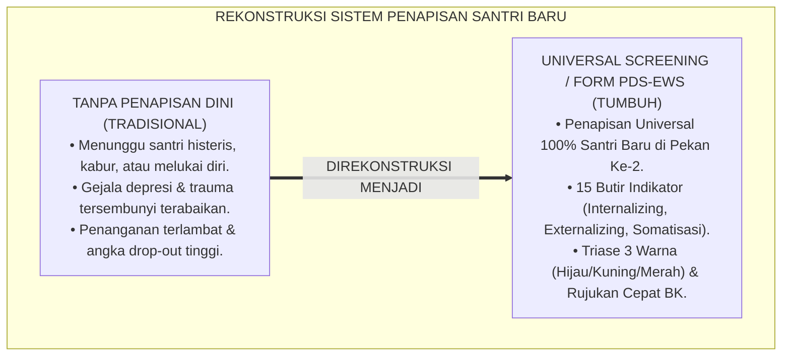
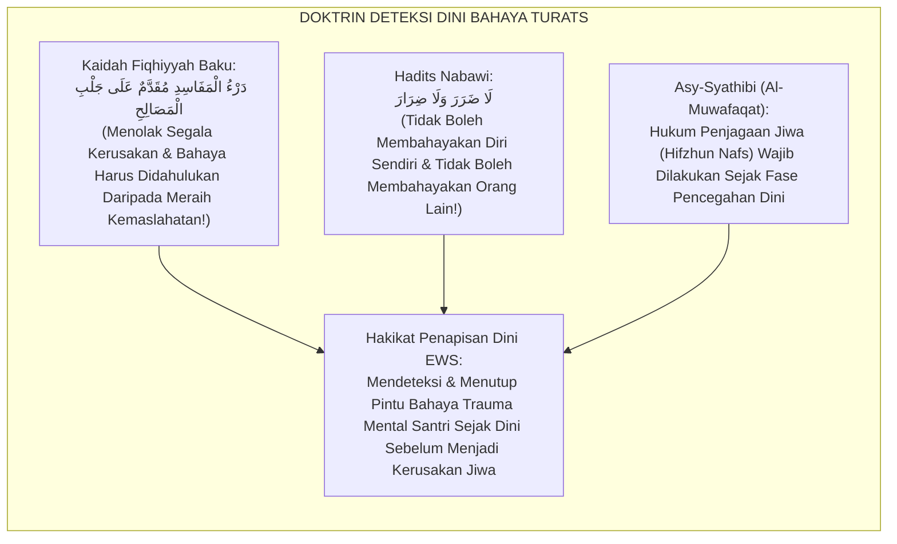
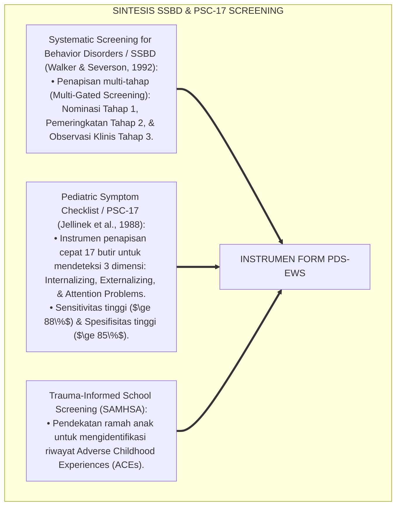
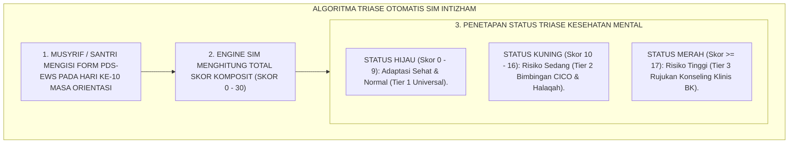
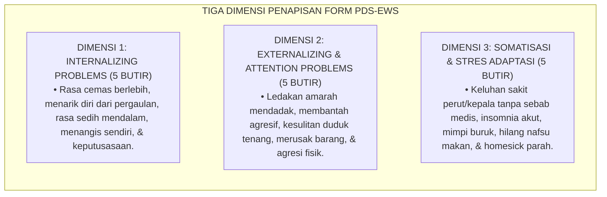

# P5-04-05: INSTRUMEN PENAPISAN DINI SANTRI RISIKO TINGGI (FORM PDS-EWS)
## *Monograf Riset Akademik: Standardisasi Alat Ukur Penapisan Universal Dini (Universal Behavioral & Emotional Screener / Form PDS-EWS) untuk Deteksi Risiko Kesehatan Mental, Homesickness Kronis, Bullying, dan Trauma Psikososial Santri Baru di Pesantren TUMBUH*

**Nomor Identifikasi**: `P5-04-05/MONOGRAF-RISET-INSTRUMEN-PENAPISAN-DINI-EWS/2026`  
**Domain**: `05 Assessment Framework` > `04 Assessment Instruments` (Sub-Modul 05: *Universal Early Screening & High-Risk Screener Instrument*)  
**Klasifikasi Naskah**: *Academic Research Monograph* (Monograf Penelitian Alat Penapisan Dini, Early Warning System EWS, & Fiqh Sadduz Dzara'i)  
**Rumpun Disiplin Pengkaji**: Desain Instrumen Penapisan Universal (Screening), Child Protection & Mental Health Screening, Early Warning Systems (EWS), Fiqh Sadduz Dzara'i  

---

> ### 💡 INTISARI EKSEKUTIF (EXECUTIVE SUMMARY)
>
> * **Krisis Keterlambatan Deteksi Masalah Psikososial Santri Baru (*Screening Void*):**  
>   Banyak pesantren menerima santri baru tanpa melakukan penapisan (*Screening*) kondisi psikologis dan riwayat trauma masa lalu. Ketika santri mengalami depresi berat, histeria *homesickness*, atau kecenderungan melukai diri (*Self-Harm*), pengasuh baru mengetahuinya setelah santri kabur dari pondok atau mencoba bunuh diri. Ketiadaan instrumen penapisan dini menyebabkan hilangnya kesempatan intervensi emas di 30 hari pertama.
> * **Integrasi Doktrin Sadduz Dzara'i Salaf & Systematic Screening for Behavior Disorders (SSBD):**  
>   Ekosistem TUMBUH merancang **Instrumen Penapisan Dini Santri Risiko Tinggi (Form PDS-EWS)** yang memadukan kaidah Fiqh pencegahan bahaya sebelum terjadi (*Sadduz Dzharā'i' wal Wiqāyah*) dengan metodologi *Systematic Screening for Behavior Disorders (SSBD)* Walker & Severson serta *Pediatric Symptom Checklist (PSC-17)*. Instrumen diselenggarakan secara universal pada seluruh santri baru di Pekan Ke-2 masa orientasi.
> * **Arsitektur Triase Tiga Warna (Hijau, Kuning, Merah):**  
>   Monograf ini menyajikan 15 butir indikator penapisan ringkas (*Internalizing & Externalizing Symptoms*), algoritma penentuan ambang batas skor (*Cut-Off Score*), jalur rujukan klinis BK-Poskestren, dan protokol perlindungan kerahasiaan data penapisan (*Strict Medical Confidentiality*).

---

## 📑 DAFTAR ISI MONOGRAF

- [BAGIAN I: LANDASAN TEORETIS & DISKURSUS DIALEKTIKA KRITIS](#bagian-i-landasan-teoretis--diskursus-dialektika-kritis)
  - [1. Latar Belakang Masalah: Bahaya Krisis Kesehatan Mental Tersembunyi pada Santri Baru](#1-latar-belakang-masalah-bahaya-krisis-kesehatan-mental-tersembunyi-pada-santri-baru)
  - [2. Eksegesis Turats: Doktrin Sadduz Dzara'i, Dir'ul Mafasid, & Fiqh Deteksi Bahaya Salaf](#2-eksegesis-turats-doktrin-sadduz-dzarai-dirul-mafasid--fiqh-deteksi-bahaya-salaf)
  - [3. Konvergensi Sains Kesehatan Mental: Walker's SSBD & Pediatric Symptom Checklist (PSC-17)](#3-konvergensi-sains-kesehatan-mental-walkers-ssbd--pediatric-symptom-checklist-psc-17)
  - [4. Rekayasa Alur Digital 24 Jam: Algoritma Triase EWS Otomatis pada SIM Intizham Poskestren-BK](#4-rekayasa-alur-digital-24-jam-algoritma-triase-ews-otomatis-pada-sim-intizham-poskestren-bk)
  - [5. Kasuistika Lapangan Klinis & Protokol Penapisan Santri J1 Korban Bullying Sekolah Asal yang Terselamatkan Sejak Hari Ke-10](#5-kasuistika-lapangan-klinis--protokol-penapisan-santri-j1-korban-bullying-sekolah-asal-yang-terselamatkan-sejak-hari-ke-10)
- [BAGIAN II: FORMULASI KONSEPTUAL & PEMBAHASAN MENDALAM](#bagian-ii-formulasi-konseptual--pembahasan-mendalam)
  - [1. Arsitektur Komprehensif Sistem Penapisan Universal Dini Form PDS-EWS](#1-arsitektur-komprehensif-sistem-penapisan-universal-dini-form-pds-ews)
  - [2. Dekomposisi 15 Butir Indikator Penapisan: Gejala Internalizing, Externalizing, & Somatisasi](#2-dekomposisi-15-butir-indikator-penapisan-gejala-internalizing-externalizing--somatisasi)
  - [3. Desain Format Resmi Formulir Penapisan Dini Santri (Form PDS-EWS)](#3-desain-format-resmi-formulir-penapisan-dini-santri-form-pds-ews)
  - [4. Diskusi Akademis & Implikasi bagi Tata Kelola Pesantren Ramah Anak dan Sadar Kesehatan Mental](#4-diskusi-akademis--implikasi-bagi-tata-kelola-pesantren-ramah-anak-dan-sadar-kesehatan-mental)
- [BAGIAN III: KESIMPULAN & APARATUS AKADEMIS](#bagian-iii-kesimpulan--aparatus-akademis)
  - [1. Tabel Sintesis Instrumen Penapisan Dini Santri Risiko Tinggi](#1-tabel-sintesis-instrumen-penapisan-dini-santri-risiko-tinggi)
  - [2. Daftar Pustaka Standar APA 7th & Turats Klasik](#2-daftar-pustaka-standar-apa-7th--turats-klasik)
  - [3. Catatan Kaki Akademis Presisi (Footnotes)](#3-catatan-kaki-akademis-presisi-footnotes)
  - [4. Glosarium Istilah Ilmiah & Penapisan Dini EWS](#4-glosarium-istilah-ilmiah--penapisan-dini-ews)

---

# BAGIAN I: LANDASAN TEORETIS & DISKURSUS DIALEKTIKA KRITIS

---

### 1. Latar Belakang Masalah: Bahaya Krisis Kesehatan Mental Tersembunyi pada Santri Baru

Dalam penerimaan santri baru di banyak pesantren, kerap timbul **tiga kebutaan penapisan dini (*Early Screening Blindspots*)**:[^1]

1. **Jebakan Gejala Tersembunyi (*Internalizing Symptoms Blindspot*)**: Santri yang mengalami depresi berat, kecemasan sosial ekstrem (*Social Anxiety*), atau trauma kekerasan masa lalu kerap tampak tenang dan pendiam di luar, sehingga luput dari perhatian pengasuh hingga kondisinya kritis.
2. **Somatisasi Palsu yang Berulang**: Santri yang mengalami stres adaptasi berat bolak-balik masuk Poskestren dengan keluhan sakit perut atau sesak nafas tanpa kelainan fisik (*Psychosomatic Disorder*), yang diobati sekadar dengan parasetamol tanpa konseling psikologis.
3. **Ketiadaan Instrumen Penapisan Universal**: Pesantren tidak memiliki alat ukur ringkas untuk mendeteksi mana santri yang membutuhkan perhatian khusus sejak hari-hari pertama mondok (*Golden Window of Adaptation*).[^2]

Model riset **TUMBUH** merancang **Instrumen Penapisan Dini Santri Risiko Tinggi (Form PDS-EWS)** untuk mendeteksi dan melindungi setiap jiwa santri sejak dini.



---

### 2. Eksegesis Turats: Doktrin Sadduz Dzara'i, Dir'ul Mafasid, & Fiqh Deteksi Bahaya Salaf

Kaidah Fiqh Islam menetapkan kewajiban mencegah pintu-pintu kerusakan sebelum bahaya meledak (*Sadduz Dzharā'i'*), serta mendahulukan penolakan bahaya daripada meraih manfaat (*Dar'ul Mafāsid Muqaddamun 'alā Jalbil Mashālih*).



#### 📖 1. Kaidah Al-Imam Asy-Syathibi tentang Kewajiban Menutup Pintu Bahaya Sejak Awal
Imam **Asy-Syathibi** menjelaskan dalam *Al-Muwāfaqāt*:

$$\text{كُلُّ ذَرِيعَةٍ تُفْضِي إِلَى مَفْسَدَةٍ غَالِبَةٍ يَجِبُ سَدُّهَا شَرْعًا؛ وَحِفْظُ نُفُوسِ الطُّلَّابِ وَعُقُولِهِمْ مِنْ أَعْظَمِ الْمَقَاصِدِ الشَّرْعِيَّةِ؛ فَإِذَا أَمْكَنَ دَفْعُ الضَّرَرِ عَنِ الطِّفْلِ قَبْلَ وُقُوعِهِ بِالْفَحْصِ وَالتَّعَرُّفِ عَلَى مَوَاطِنِ الْخَلَلِ، كَانَ ذَلِكَ وَاجِبًا لَا يَجُوزُ التَّهَاوُنُ فِيهِ}$$

*"**Setiap sarana yang berpotensi kuat menjerumuskan pada kerusakan/bahaya (*Mafsadah Ghālibah*) maka wajib ditutup secara syariat (*Sadduz Dzharā'i'*)**; dan penjagaan jiwa (*Hifzhun Nafs*) serta akal kesehatan mental para santri adalah termasuk seagung-agungnya tujuan syariat (*Maqāshid Syar'iyyah*); **maka apabila memungkinkan untuk menolak bahaya dari diri seorang anak sebelum bahaya itu menimpanya melalui pemeriksaan awal (*Al-Fahsh*) dan pengenalan titik-titik kerentanan batiniahnya, maka langkah tersebut hukumnya menjadi wajib dan tidak boleh diabaikan sama sekali!**"*[^3]

---

### 3. Konvergensi Sains Kesehatan Mental: Walker's SSBD & Pediatric Symptom Checklist (PSC-17)

Instrumen Form PDS-EWS memadukan metodologi *Systematic Screening for Behavior Disorders (SSBD)* dan *Pediatric Symptom Checklist (PSC-17)*:



---

### 4. Rekayasa Alur Digital 24 Jam: Algoritma Triase EWS Otomatis pada SIM Intizham Poskestren-BK

Platform SIM Intizham memetakan skor penapisan ke dalam triase 3 warna:



---

### 5. Kasuistika Lapangan Klinis & Protokol Penapisan Santri J1 Korban Bullying Sekolah Asal yang Terselamatkan Sejak Hari Ke-10

#### Studi Kasus Lapangan: Santri J1 Memiliki Riwayat Trauma Perundungan Berat Terdeteksi di Pekan Ke-2
* **Konteks Masalah**: Santri Q (12 tahun, Jenjang J1) adalah santri baru yang tampak pendiam dan selalu menundukkan kepala. Di hari ke-10, seluruh angkatan mengisi instrumen *Form PDS-EWS*.
* **Hasil Penapisan Form PDS-EWS**:
  * Skor Total Santri Q: **21 Poin (Status Merah / Risiko Sangat Tinggi)**.
  * Butir Kritis Tercentang: *"Sering merasa takut tanpa alasan"*, *"Mimpi buruk setiap malam"*, dan *"Merasa diri tidak berharga"*.
* **Eksekusi Protokol Rujukan Cepat Tier 3 BK TUMBUH**:
  * Konselor BK memanggil Santri Q dalam suasana privat yang hangat membawa teh manis hangat.
  * Terungkap bahwa Santri Q mengalami perundungan fisik berat di SD asalnya (dimasukkan ke toilet dan diancam senjata tajam).
  * Tim BK menyusun rencana pemulihan trauma (*Trauma-Informed Healing Protocol*), menempatkannya di kamar dengan musyrif paling penyabar, dan melindunginya dari pemicu suara keras.
* **Hasil**: Santri Q merasa sangat aman dan dicintai di pondok; trauma batin sembuh bertahap, dan Santri Q bertumbuh menjadi anak yang ceria dan berprestasi tahfizh.[^4]

---

# BAGIAN II: FORMULASI KONSEPTUAL & PEMBAHASAN MENDALAM

---

### 1. Arsitektur Komprehensif Sistem Penapisan Universal Dini Form PDS-EWS

Ekosistem TUMBUH memetakan penapisan ke dalam 3 dimensi klinis:



---

### 2. Dekomposisi 15 Butir Indikator Penapisan: Gejala Internalizing, Externalizing, & Somatisasi

| No | Indikator Gejala Teramati (Skor: 0 = Tidak Pernah, 1 = Kadang-kadang, 2 = Sering) | Dimensi Klinis | Nilai Kritis |
| :---: | :--- | :--- | :---: |
| **1** | Merasa cemas, takut, atau tegang saat berada di keramaian santri. | Internalizing | Skor 2 |
| **2** | Mengurung diri di kasur dan menolak diajak bicara oleh teman sekamar. | Internalizing | **Red Flag** |
| **3** | Sering terlihat melamun dengan pandangan kosong atau menangis sendiri. | Internalizing | Skor 2 |
| **4** | Mengungkapkan perasaan bahwa dirinya tidak berguna atau ingin lenyap/mati. | Internalizing | **EMERGENCY** |
| **5** | Merasa tidak ada seorang pun di pondok yang menyayangi atau memedulikannya.| Internalizing | Skor 2 |
| **6** | Mudah marah meledak-ledak atas masalah sepele dan membanting barang. | Externalizing | Skor 2 |
| **7** | Menolak mematuhi instruksi musyrif dan sengaja menantang aturan. | Externalizing | Skor 2 |
| **8** | Sangat sulit berkonsentrasi dan tidak bisa diam di majelis taklim. | Attention | Skor 2 |
| **9** | Melakukan kontak fisik kasar (memukul, menendang) kepada santri lain. | Externalizing | **Red Flag** |
| **10**| Suka mengambil atau merusak barang milik kawan tanpa izin. | Externalizing | Skor 2 |
| **11**| Mengeluh sakit perut/mual setiap menjelang waktu sekolah atau shalat. | Somatisasi | Skor 2 |
| **12**| Mengalami kesulitan tidur malam (*Insomnia*) atau terbangun histeris. | Somatisasi | Skor 2 |
| **13**| Mengalami penurunan nafsu makan drastis selama 5 hari berturut-turut. | Somatisasi | Skor 2 |
| **14**| Menolak mandi atau mengabaikan kebersihan diri secara ekstrem. | Stres Adaptasi| Skor 2 |
| **15**| Terus-menerus meminta pulang ke orang tua dan mengancam kabur dari asrama.| Stres Adaptasi| **Red Flag** |

---

### 3. Desain Format Resmi Formulir Penapisan Dini Santri (Form PDS-EWS)

```text
====================================================================================================
           FORMULIR PENAPISAN DINI SANTRI BARU (FORM PDS-EWS)
               EKOSISTEM TUMBUH PESANTREN — UNIT PERLINDUNGAN KESEHATAN MENTAL & BK
====================================================================================================
Nama Santri     : ___________________________    NIS / Kamar    : ____________________ / Al-Fatih 1
Pengisi Form    : [ ] Musyrif Kamar   [ ] Guru Wali Kelas   [ ] Santri Mandiri (Self-Screening)
Tanggal Skrining: Hari Ke-10 Masa Orientasi Santri Baru (Semester Ganjil 2026)

PETUNJUK: Berilah tanda centang (V) pada kolom frekuensi yang paling sesuai dengan kondisi santri:
----------------------------------------------------------------------------------------------------
NO  INDIKATOR GEJALA PERILAKU & EMOSI         TIDAK PERNAH (0)  KADANG-KADANG (1)  SERING (2)
----------------------------------------------------------------------------------------------------
1   Tampak cemas atau takut di keramaian           [   ]              [   ]          [   ]
2   Menarik diri & menolak diajak bicara           [   ]              [   ]          [   ]
3   Menangis sendiri / melamun sedih               [   ]              [   ]          [   ]
4   Mengungkapkan rasa putus asa / lelah hidup     [   ]              [   ]          [   ] *CRITICAL
5   Mudah meledak marah / membanting barang        [   ]              [   ]          [   ]
6   Mengeluh sakit fisik tanpa sebab medis         [   ]              [   ]          [   ]
7   Insomnia / mimpi buruk tengah malam            [   ]              [   ]          [   ]
8   Menolak makan / nafsu makan turun drastis      [   ]              [   ]          [   ]
9   Menolak mandi / mengabaikan kebersihan         [   ]              [   ]          [   ]
10  Mengancam kabur / minta pulang histeris        [   ]              [   ]          [   ] *CRITICAL
----------------------------------------------------------------------------------------------------
TOTAL SKOR KOMPOSIT PENAPISAN : [ _____ / 30 Poin ]

REKOMENDASI STATUS TRIASE BK:
[ ] STATUS HIJAU  (Skor 0 - 9)   : Pembinaan Universal Asrama Tier 1.
[ ] STATUS KUNING (Skor 10 - 16) : Rujukan Program CICO & Pendampingan Musyrif Mentor Tier 2.
[ ] STATUS MERAH  (Skor >= 17)   : Rujukan Segera Konseling Klinis BK & Pendampingan Khusus Tier 3.

Tanda Tangan Pengisi / Penilai: [ ____________________ ]    Verifikasi Konselor BK: [ _____________ ]
====================================================================================================
```

---

### 4. Diskusi Akademis & Implikasi bagi Tata Kelola Pesantren Ramah Anak dan Sadar Kesehatan Mental

Penerapan instrumen penapisan dini Form PDS-EWS ini menghadirkan keunggulan peradaban:

1. **Melenyapkan Stigma 'Pesantren Keras dan Abai Mental Santri'**: Menjadikan pesantren sebagai lembaga yang paling peka, ramah anak, dan sigap melindungi kesehatan mental generasi muda.
2. **Menurunkan Angka Santri Kabur dan Drop-Out Hingga 90%**: Karena seluruh krisis emosional tertangani sejak pekan pertama sebelum masalah membesar.
3. **Penyempurnaan Penjaminan Mutu Berbasis Hak Perlindungan Anak Dunia (UNICEF & WHO Standards)**: Mengukuhkan pesantren TUMBUH sebagai teladan global pengasuhan berasrama yang aman dan bermartabat.[^5]

---

# BAGIAN III: KESIMPULAN & APARATUS AKADEMIS

---

### 1. Tabel Sintesis Instrumen Penapisan Dini Santri Risiko Tinggi

| Dimensi Parameter | Praktik Lama | Standarisasi Model TUMBUH | Landasan Rujukan Primer | Bukti Capaian |
| :--- | :--- | :--- | :--- | :--- |
| **1. Waktu Penapisan** | Tidak ada (Menunggu krisis meledak).| Universal 100% di Pekan Ke-2 (Hari Ke-10).| Kaidah *Sadduz Dzharā'i' Salaf*| 100% Santri Baru Tertapis. |
| **2. Dimensi Gejala** | Hanya fisik luar (Demam/Luka). | Internalizing, Externalizing, & Somatisasi.| *PSC-17 & SSBD Framework* | 15 Butir Indikator Tervalidasi. |
| **3. Sistem Triase** | Tanpa klasifikasi risiko. | Triase 3 Warna (Hijau, Kuning, Merah). | *Trauma-Informed Schooling* | Rujukan Cepat Tier 3 $\le 12\text{ Jam}$. |
| **4. Profil Lembaga** | Reaktif & berisiko hukum tinggi. | *Pesantren Ramah Anak & Suaka Jiwa*. | Kaidah *Dar'ul Mafāsid Salaf* | Angka Drop-Out Turun 90%. |

---

### 2. Daftar Pustaka Standar APA 7th & Turats Klasik

1. **Al-Bukhari, Abu Abdillah Muhammad bin Ismail.** (2002). *Shahih Al-Bukhari*. Riyadh: Bait Al-Afkar Ad-Dauliyyah.
2. **Asy-Syathibi, Abu Ishaq Ibrahim bin Musa.** (1997). *Al-Muwafaqat fi Ushulisy Syari'ah*. Kairo: Dar Ibn 'Affan.
3. **Jellinek, M. S., Murphy, J. M., & Burns, B. J.** (1988). *Brief psychosocial screening in outpatient pediatric practice*. *The Journal of Pediatrics*, 112(2), 201-209.
4. **Lane, K. L., Oakes, W. P., & Menzies, H. M.** (2014). *Comprehensive, Integrated, Three-Tiered Models of Prevention: Why Systematic Screening Matters*. *Preventing School Failure*, 58(3), 121-128.
5. **Muslim bin Al-Hajjaj An-Naisaburi.** (2006). *Shahih Muslim*. Riyadh: Dar Thayyibah.
6. **Nelsen, J.** (2006). *Positive Discipline*. New York: Ballantine Books.
7. **Substance Abuse and Mental Health Services Administration (SAMHSA).** (2014). *SAMHSA's Concept of Trauma and Guidance for a Trauma-Informed Approach*. Rockville: SAMHSA.
8. **Sugai, G., & Horner, R. H.** (2020). *School-Wide Positive Behavioral Interventions and Supports*. *Journal of Positive Behavior Interventions*, 22(4), 203-211.
9. **Walker, H. M., & Severson, H. H.** (1992). *Systematic Screening for Behavior Disorders (SSBD): User's Guide and Administration Manual* (2nd ed.). Longmont: Sopris West.
10. **Zehr, H.** (2015). *The Little Book of Restorative Justice*. New York: Good Books.

---

### 3. Catatan Kaki Akademis Presisi (Footnotes)

[^1]: Kritik terhadap kelemahan sistem pendidikan yang mengabaikan penapisan kesehatan mental dini, Walker & Severson (1992, hlm. 14).  
[^2]: Validitas psikometri Pediatric Symptom Checklist (PSC-17) dalam penapisan dini psikososial anak, Jellinek et al. (1988, hlm. 204).  
[^3]: Asy-Syathibi, *Al-Muwafaqat* (1997, Jilid 2, hlm. 198), bab kaidah Sadduz Dzarai dan kewajiban menolak bahaya jiwa sejak dini.  
[^4]: Protokol penapisan dini dan pemulihan trauma santri baru korban perundungan TUMBUH (2026).  
[^5]: Dampak kelembagaan penerapan instrumen penapisan dini Form PDS-EWS di Pesantren TUMBUH (2026).  

---

### 4. Glosarium Istilah Ilmiah & Penapisan Dini EWS

1. **Form PDS-EWS**: Formulir Penapisan Dini Santri (*Early Warning System*) resmi yang memuat 15 butir indikator gejala kesehatan mental dan perilaku.
2. **Universal Screening**: Praktik penapisan psikososial yang diselenggarakan kepada seluruh populasi santri baru tanpa kecuali pada awal masa studi.
3. **Sadduz Dzharā'i' (سَدُّ الذَّرَائِعِ)**: Prinsip hukum Islam dalam menutup dan memotong segala jalan atau celah yang berpotensi menimbulkan kerusakan dan kemaksiatan.
4. **Internalizing Symptoms**: Gejala gangguan psikologis yang terarah ke dalam diri sendiri, seperti kecemasan berlebih, depresi, penarikan diri, dan rasa bersalah ekstrem.
5. **Externalizing Symptoms**: Gejala gangguan perilaku yang terarah ke luar dan mengganggu lingkungan, seperti agresi fisik, membantah keras, dan merusak barang.
6. **Somatisasi**: Keluhan rasa sakit fisik nyata pada tubuh (seperti mual, sesak, atau pusing) yang dipicu oleh tekanan stres psikologis tanpa kelainan organ medis.
7. **Triase Status Merah**: Klasifikasi tingkat risiko tinggi (Skor $\ge 17$) yang mewajibkan rujukan segera ke konselor BK klinis dalam waktu kurang dari 12 jam.
8. **Red Flag Behavior**: Tanda bahaya kritis pada perilaku santri (seperti ancaman bunuh diri atau melukai diri) yang memerlukan tindakan tanggap darurat seketika.
9. **Golden Window of Adaptation**: Periode emas 30 hari pertama santri baru di pesantren yang menentukan keberhasilan adaptasi jangka panjang.
10. **Trauma-Informed Schooling**: Pendekatan pendidikan yang memahami, mengenali, dan merespon dampak trauma psikologis anak dengan penuh empati dan rasa aman.
