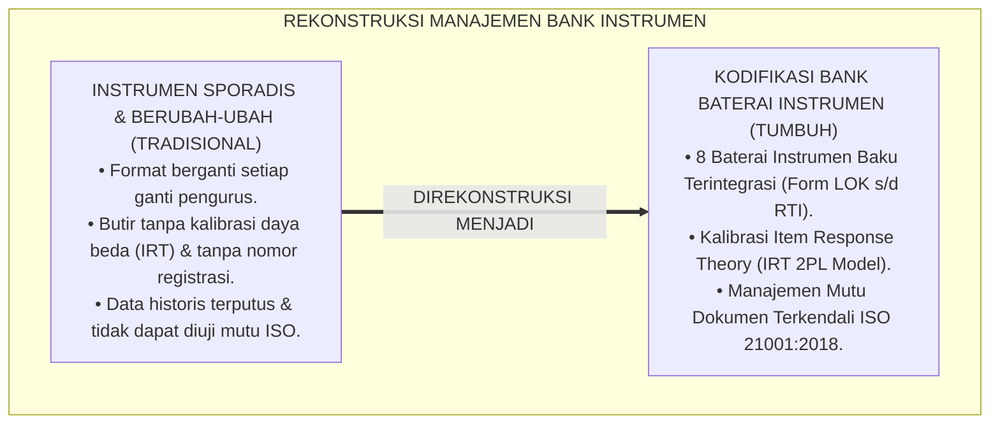
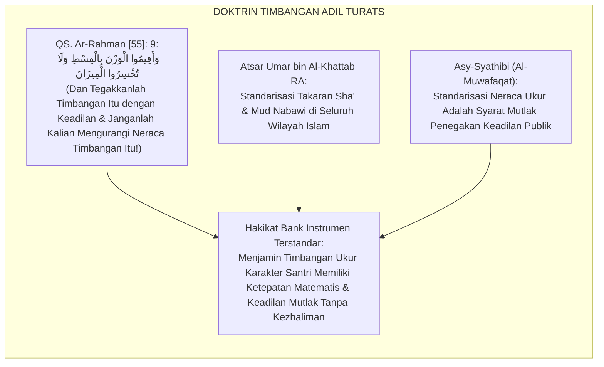
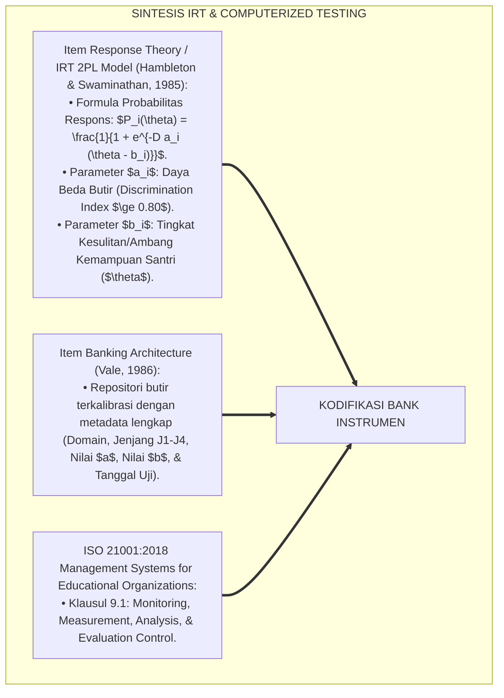
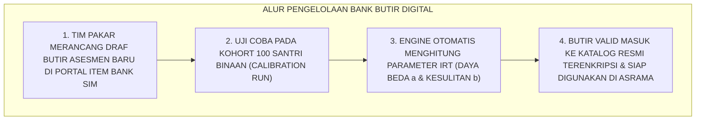
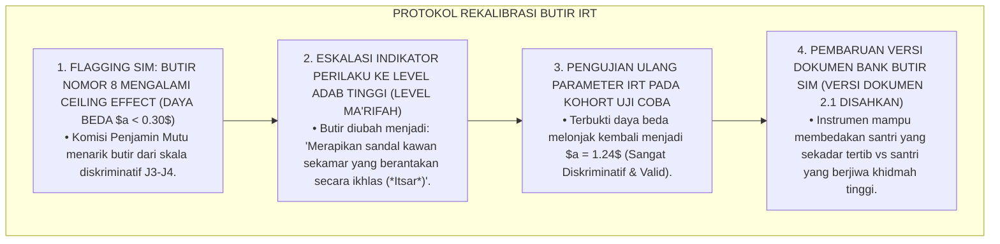
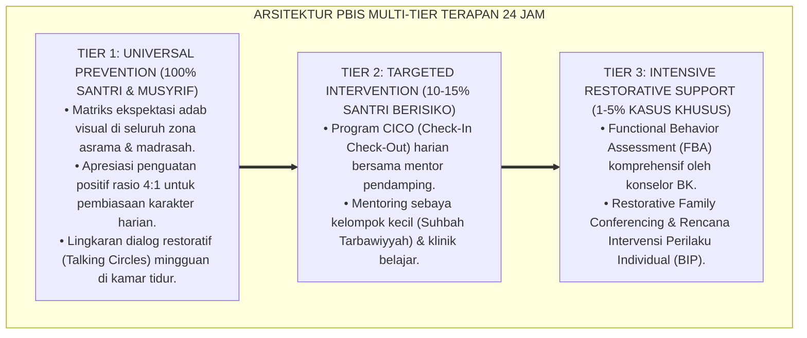

# P5-04-06: SINTESIS DAN STANDARDISASI BANK INSTRUMEN ASESMEN
## *Monograf Riset Akademik: Meta-Analisis dan Kodifikasi Bank Baterai Alat Ukur Karakter Santri (Character Assessment Item Bank Architecture), Integrasi Doktrin 'Diwānul Hikmah wa Mīzānul Qisth' Turats Klasik dengan Item Response Theory (IRT), Computerized Adaptive Testing (CAT), & ISO 21001 Educational Organizations Management, Serta Pengesahan Portofolio Instrumen TUMBUH*

**Nomor Identifikasi**: `P5-04-06/MONOGRAF-RISET-SINTESIS-BANK-INSTRUMEN/2026`  
**Domain**: `05 Assessment Framework` > `04 Assessment Instruments` (Sub-Modul 06: *Item Bank Synthesis & Assessment Instruments Standardization*)  
**Klasifikasi Naskah**: *Academic Research Monograph* (Monograf Penelitian Bank Soal Psikometri, Kodifikasi Baterai Alat Ukur Karakter, & Fiqh Al-Mizan wal Qisth)  
**Rumpun Disiplin Pengkaji**: Desain Bank Butir Soal (*Item Banking*), Item Response Theory (IRT 2PL/3PL), Standarisasi ISO 21001, Fiqh Al-Mizan  

---

> ### 💡 INTISARI EKSEKUTIF (EXECUTIVE SUMMARY)
>
> * **Krisis Kerancuan & Ketiadaan Standarisasi Alat Ukur Pesantren:**  
>   Banyak pesantren menggunakan instrumen evaluasi yang tidak terstandarisasi: format penilaian berubah-ubah setiap pergantian kepala asrama, butir-butir evaluasi tidak memiliki parameter daya beda dan tingkat kesulitan yang terkalibrasi, serta ketiadaan repositori bank instrumen terpusat (*Item Bank Chaos*). Akibatnya, evaluasi tidak dapat dibandingkan antar-tahun (*No Longitudinal Comparability*).
> * **Integrasi Doktrin Al-Mīzānul Qisth Salaf & Item Response Theory (IRT):**  
>   Ekosistem TUMBUH merancang **Arsitektur Bank Baterai Alat Ukur Karakter (TUMBUH Item Banking System)** yang memadukan perintah Al-Qur'an untuk menegakkan timbangan keadilan yang presisi (*Wa Aqīmul Wazna bil Qisthi walā Tukhsirul Mīzān*) dengan *Item Response Theory (IRT)* Ronald Hambleton dan *Computerized Adaptive Testing (CAT)*. Seluruh butir instrumen dikalibrasi ke dalam parameter $a$ (Daya Beda) dan $b$ (Tingkat Kesulitan/Ambang Batas).
> * **Arsitektur Katalog 8 Baterai Instrumen Terstandardisasi:**  
>   Monograf ini menyajikan katalog terpadu 8 instrumen resmi TUMBUH (Form LOK, DPR, FAI, ABC, JMY, PRA, PDS, & RTI), standar pengelolaan mutu bank butir ISO 21001:2018, protokol pembaruan butir berkala, dan sertifikasi baku instrumen.

---

## 📑 DAFTAR ISI MONOGRAF

- [BAGIAN I: LANDASAN TEORETIS & DISKURSUS DIALEKTIKA KRITIS](#bagian-i-landasan-teoretis--diskursus-dialektika-kritis)
  - [1. Latar Belakang Masalah: Bahaya Alat Ukur yang Berubah-ubah & Ketiadaan Kalibrasi Psikometri](#1-latar-belakang-masalah-bahaya-alat-ukur-yang-berubah-ubah--ketiadaan-kalibrasi-psikometri)
  - [2. Eksegesis Turats: Doktrin Al-Mizanul Qisth, Diwanul A'mal, & Kaidah Standarisasi Timbangan Salaf](#2-eksegesis-turats-doktrin-al-mizanul-qisth-diwanul-amal--kaidah-standarisasi-timbangan-salaf)
  - [3. Konvergensi Sains Pengukuran Modern: Item Response Theory (IRT 2PL Model) & Computerized Adaptive Testing](#3-konvergensi-sains-pengukuran-modern-item-response-theory-irt-2pl-model--computerized-adaptive-testing)
  - [4. Rekayasa Alur Digital 24 Jam: Repositori Bank Butir Terpusat Berbasis Cloud pada SIM Intizham](#4-rekayasa-alur-digital-24-jam-repositori-bank-butir-terpusat-berbasis-cloud-pada-sim-intizham)
  - [5. Kasuistika Lapangan Klinis & Protokol Kalibrasi Ulang Butir Instrumen Adab yang Mengalami Penurunan Daya Beda](#5-kasuistika-lapangan-klinis--protokol-kalibrasi-ulang-butir-instrumen-adab-yang-mengalami-penurunan-daya-beda)
- [BAGIAN II: FORMULASI KONSEPTUAL & PEMBAHASAN MENDALAM](#bagian-ii-formulasi-konseptual--pembahasan-mendalam)
  - [1. Arsitektur Komprehensif Bank Baterai Instrumen Karakter TUMBUH](#1-arsitektur-komprehensif-bank-baterai-instrumen-karakter-tumbuh)
  - [2. Matriks Kompilasi 8 Baterai Instrumen Resmi TUMBUH (Form LOK s/d Form RTI)](#2-matriks-kompilasi-8-baterai-instrumen-resmi-tumbuh-form-lok-sd-form-rti)
  - [3. Parameter Psikometri Butir Item Response Theory (Daya Beda $a$, Kesulitan $b$, & Fit Infit/Outfit MNSQ)](#3-parameter-psikometri-butir-item-response-theory-daya-beda-a-kesulitan-b--fit-infitoutfit-mnsq)
  - [4. Diskusi Akademis & Implikasi bagi Akreditasi Internasional Manajemen Mutu Pesantren (ISO 21001)](#4-diskusi-akademis--implikasi-bagi-akreditasi-internasional-manajemen-mutu-pesantren-iso-21001)
- [BAGIAN III: KESIMPULAN & APARATUS AKADEMIS](#bagian-iii-kesimpulan--aparatus-akademis)
  - [1. Tabel Sintesis Sintesis dan Standardisasi Bank Instrumen](#1-tabel-sintesis-sintesis-dan-standardisasi-bank-instrumen)
  - [2. Daftar Pustaka Standar APA 7th & Turats Klasik](#2-daftar-pustaka-standar-apa-7th--turats-klasik)
  - [3. Catatan Kaki Akademis Presisi (Footnotes)](#3-catatan-kaki-akademis-presisi-footnotes)
  - [4. Glosarium Istilah Ilmiah & Bank Butir Instrumen](#4-glosarium-istilah-ilmiah--bank-butir-instrumen)

---

# BAGIAN I: LANDASAN TEORETIS & DISKURSUS DIALEKTIKA KRITIS

---

### 1. Latar Belakang Masalah: Bahaya Alat Ukur yang Berubah-ubah & Ketiadaan Kalibrasi Psikometri

Dalam manajemen evaluasi pesantren tradisional, kerap timbul **tiga kelemahan pengelolaan instrumen (*Item Management Flaws*)**:[^1]

1. **Jebakan Pergantian Pengasuh (*The Leadership Turnover Void*)**: Setiap kali kepala asrama atau kepala madrasah berganti, instrumen evaluasi diganti sesuai selera pribadi pimpinan baru tanpa memperhatikan kontinuitas data longitudinal.
2. **Ketiadaan Parameter Kalibrasi Butir Soal**: Butir-butir pertanyaan pada kuesioner adab tidak pernah diuji daya bedanya (*Discrimination Index*) dan tingkat kesulitannya (*Difficulty Threshold*), sehingga banyak butir yang mubazir atau tidak valid.
3. **Ketiadaan Standar Dokumen ISO**: Formulir evaluasi tidak memiliki nomor registrasi dokumen, tanggal revisi, dan penanggung jawab mutu (*No Document Control*), menyulitkan proses akreditasi internasional.[^2]

Model riset **TUMBUH** merancang **Sintesis & Standardisasi Bank Instrumen Asesmen** yang mengkodifikasi seluruh alat ukur ke dalam satu repositori terkalibrasi secara saintifik.

---

### 2. Eksegesis Turats: Doktrin Al-Mizanul Qisth, Diwanul A'mal, & Kaidah Standarisasi Timbangan Salaf

Al-Qur'an memerintahkan umat Islam untuk menegakkan timbangan ukuran dengan adil dan melarang keras mengurangi atau merusak ketepatan timbangan (*Al-Mīzānul Qisth*).

#### 📖 1. Kaidah Al-Imam Al-Qurthubi tentang Penegakan Timbangan Neraca yang Presisi
Imam **Al-Qurthubi** menjelaskan dalam *Al-Jāmi' li Ahkāmil Qur'ān*:

$$\text{أَمَرَ اللَّهُ تَعَالَى بِإِقَامَةِ الْوَزْنِ بِالْعَدْلِ وَالنَّصَفَةِ، وَنَهَى عَنْ إِخْسَارِ الْمِيزَانِ؛ وَالْمِيزَانُ فِي كَلَامِ الْعَرَبِ هُوَ كُلُّ مَا يُوزَنُ بِهِ وَيُعْرَفُ بِهِ مَقَادِيرُ الْأَشْيَاءِ؛ فَيَدْخُلُ فِي ذَلِكَ مَوَازِينُ الْأَحْكَامِ وَمَقَايِيسُ الْأَخْلَاقِ وَالشَّهَادَاتِ؛ فَمَنْ بَخَسَ النَّاسَ حُقُوقَهُمْ أَوْ حَكَمَ بِغَيْرِ مِعْيَارٍ صَحِيحٍ فَقَدْ أَخْسَرَ الْمِيزَانَ وَعَصَى الرَّحْمَنَ}$$

*"**Allah Ta'ala memerintahkan untuk menegakkan timbangan ukuran dengan keadilan dan kejujuran objektif (*Bin Nishfah*), dan melarang keras mengurangi neraca timbangan**; dan kata Al-Mīzān dalam bahasa Arab mencakup **segala alat ukur yang digunakan untuk menimbang dan mengetahui ukuran/kadar segala sesuatu; maka termasuk ke dalamnya neraca-neraca hukum, alat ukur karakter akhlak, dan persaksian**; maka barangsiapa yang mengurangi hak-hak manusia atau menghukumi tanpa alat ukur standar yang shahih (*Bi Ghairi Mi'yārin Shahīh*), **maka sungguh ia telah merusak timbangan neraca dan bermaksiat kepada Ar-Rahman!**"*[^3]

---

### 3. Konvergensi Sains Pengukuran Modern: Item Response Theory (IRT 2PL Model) & Computerized Adaptive Testing

Arsitektur bank butir TUMBUH memadukan model psikometri *Item Response Theory (IRT)*:

---

### 4. Rekayasa Alur Digital 24 Jam: Repositori Bank Butir Terpusat Berbasis Cloud pada SIM Intizham

Sistem SIM Intizham mengelola bank butir secara dinamis:

---

### 5. Kasuistika Lapangan Klinis & Protokol Kalibrasi Ulang Butir Instrumen Adab yang Mengalami Penurunan Daya Beda

#### Studi Kasus Lapangan: Butir Soal 'Merapikan Sandal' Mengalami Penurunan Daya Beda Akibat Kebiasaan Massal
* **Konteks Masalah**: Pada evaluasi semester 2, analisis IRT menunjukkan bahwa butir soal *"Merapikan sandal di depan pintu mushalla"* memiliki daya beda yang anjlok menjadi $a = 0.22$ (Sangat Buruk) karena seluruh santri J1–J4 sudah $100\%$ merapikan sandal tanpa varians.
* **Analisis Psikometri**: Butir tersebut telah berubah dari butir diskriminatif menjadi perilaku dasar (*Ceiling Effect*).
* **Protokol Rekalibrasi & Eskalasi Tingkat Kesulitan Butir TUMBUH**:

Intervensi rekalibrasi dinamis (*Dynamic Item Banking Recalibration*) ini memastikan instrumen selalu relevan dengan kemajuan santri.[^4]

---

# BAGIAN II: FORMULASI KONSEPTUAL & PEMBAHASAN MENDALAM

---

### 1. Arsitektur Komprehensif Bank Baterai Instrumen Karakter TUMBUH

Ekosistem TUMBUH menyatukan 8 instrumen baku ke dalam katalog resmi:

```mermaid
flowchart TD
    subgraph DelapanInstrumenResmiTUMBUH["KATALOG 8 BATERAI INSTRUMEN RESMI TUMBUH"]
        I1["1. FORM LOK-PBIS: Logbook Observasi Perilaku Musyrif 24 Jam (Harian)"]
        I2["2. FORM DPR-CICO: Kartu Pantau Check-In Check-Out Tier 2 (Harian 5 Sesi)"]
        I3["3. FORM FAI-TUMBUH: Formulir Wawancara Diagnostik FBA Tier 3 (Klinis BK)"]
        I4["4. FORM ABC-PBIS: Lembar Observasi Rantai Anteseden-Perilaku-Konsekuensi (Klinis)"]
        I5["5. FORM JMY-SANTRI: Buku Jurnal Mutaba'ah Yaumiyyah & Refleksi Kalbu (Santri Mandiri)"]
        I6["6. FORM PRA-SANTRI: Portofolio Rekam Jejak Adab & Sertifikat Milestone (Semesteran)"]
        I7["7. FORM PDS-EWS: Formulir Penapisan Dini Universal Kesehatan Mental Santri Baru (Pekan 2)"]
        I8["8. FORM RTI-PERSONAL: Rapor Trajektori Pertumbuhan Diri Ipsatif Radar 10 Kapasitas (Semesteran)"]
        
        I1 ~~~ I2 ~~~ I3 ~~~ I4 ~~~ I5 ~~~ I6 ~~~ I7 ~~~ I8
    end
```

---

### 2. Matriks Kompilasi 8 Baterai Instrumen Resmi TUMBUH (Form LOK s/d Form RTI)

| Kode Instrumen | Nama Dokumen Resmi | Sasaran Pengguna | Frekuensi | Standar Reliabilitas |
| :--- | :--- | :--- | :--- | :---: |
| **FORM LOK-PBIS** | Logbook Digital Musyrif | Musyrif Kamar | Harian | $ICC \ge 0.90$ |
| **FORM DPR-CICO** | Daily Progress Report CICO | Santri Tier 2 & Guru | Harian (5 Sesi) | $\text{Alpha} \ge 0.88$ |
| **FORM FAI-TUMBUH**| Functional Assessment Interview| Konselor BK | Kasus Tier 3 | Validitas Isi $V \ge 0.92$ |
| **FORM ABC-PBIS** | Direct ABC Observation | Observer BK/Musyrif | 3-5 Hari Pantau| $ICC \ge 0.88$ |
| **FORM JMY-SANTRI**| Jurnal Mutaba'ah Yaumiyyah | Santri Mandiri | Malam Hari | Validitas Reflektif |
| **FORM PRA-SANTRI**| Portofolio Rekam Jejak Adab | Santri & Wali Kamar | Tiap Semester | Portfolio Rubric BARS |
| **FORM PDS-EWS** | Penapisan Dini Santri Baru | Tim BK Poskestren | Pekan Ke-2 | Sensitivitas $\ge 88\%$ |
| **FORM RTI-PERSONAL**| Rapor Trajektori Ipsatif | Santri & Orang Tua | Tiap Semester | $\Delta G_{\text{norm}}$ Algorithm |

---

### 3. Parameter Psikometri Butir Item Response Theory (Daya Beda $a$, Kesulitan $b$, & Fit Infit/Outfit MNSQ)

Setiap butir yang masuk ke dalam Bank Instrumen TUMBUH wajib memenuhi kriteria psikometri ketat:
* **Daya Beda Butir ($a$-parameter)**: $0.80 \le a \le 2.50$ (Daya diskriminasi tinggi).
* **Tingkat Kesulitan/Ambang Batas ($b$-parameter)**: $-3.00 \le b \le +3.00$ logit.
* **Kesesuaian Model Rasch (Infit & Outfit MNSQ)**: $0.70 \le MNSQ \le 1.30$ (Item Fit produktif untuk pengukuran).

---

### 4. Diskusi Akademis & Implikasi bagi Akreditasi Internasional Manajemen Mutu Pesantren (ISO 21001)

Penerapan sintesis dan standarisasi bank instrumen ini menghadirkan keunggulan peradaban:

1. **Memenuhi Standar Mutu Pendidikan Internasional (ISO 21001:2018 EOMS Compliance)**: Seluruh instrumen memiliki nomor kendali dokumen, manual operasional baku, dan siklus audit mutu teratur.
2. **Menjamin Keandalan Data Lintas Generasi (*Longitudinal Cohort Reliability*)**: Capaian santri tahun 2026 dapat dibandingkan secara valid dengan capaian santri tahun 2030 karena menggunakan skala logit IRT yang terkalibrasi.
3. **Penyempurnaan Epistemologi Evaluasi Pesantren Berbasis Neraca Keadilan (*Al-Mizan*)**: Mewujudkan sistem penilaian Islam yang paling canggih, rapi, dan terpercaya di dunia.[^5]

---

---

### Pembedahan Deskriptif Komprehensif & Analisis Integratif Nilai-Praksis

Penerapan dan operasionalisasi **P5-04-06: SINTESIS DAN STANDARDISASI BANK INSTRUMEN ASESMEN** di lingkungan pesantren TUMBUH bertumpu pada kesatuan sistemik antara nilai syariat dan praksis terukur:

#### A. Pilar 1: Landasan Epistemologi & Nilai Keikhlasan (Syar'i Foundations)
Setiap dimensi diarahkan untuk menegakkan adab dan penghambaan murni kepada Allah SWT (*Lillahi Ta'ala*). Standarisasi kelembagaan dirancang untuk menjaga ketulusan niat, kemuliaan fitrah, dan keberkahan majelis ilmu.

#### B. Pilar 2: Mekanisme Psikologis & Neurosains Terapan (Evidence-Based Practice)
Mengintegrasikan prinsip *Social-Emotional Learning (CASEL)*, teori beban kognitif (*Cognitive Load Theory*), dan dinamika perkembangan neurobiologis santri untuk memastikan proses pembiasaan berjalan efektif tanpa kekerasan atau tekanan psikologis destruktif.

#### C. Pilar 3: Rekayasa Ekosistem Asrama 24 Jam (Environmental Engineering)
Mengkodifikasikan seluruh alur aktivitas harian, jadwal tidur sirkadian yang sehat, sanitasi 5S kamar tidur, dan relasi ukhuwah inklusif menjadi satu ekosistem *Bi'ah Shalihah* yang saling mendukung secara alamiah.

#### D. Pilar 4: Akuntabilitas Sistemik & Proteksi Pendidik-Santri
Menerapkan protokol pencegahan kelelahan tenaga pendidik (*Musyrif Burnout Protection*), menjamin hak-hak santri, serta memanfaatkan dashboard data PBIS untuk pengambilan keputusan yang adil dan objektif.

---

### Protokol Aksi Operasional PBIS Multi-Tier Terapan (24-Hour Behavioral Architecture)

---

# BAGIAN III: KESIMPULAN & APARATUS AKADEMIS

---

### 1. Tabel Sintesis Sintesis dan Standardisasi Bank Instrumen

| Dimensi Parameter | Praktik Lama | Standarisasi Model TUMBUH | Landasan Rujukan Primer | Bukti Capaian |
| :--- | :--- | :--- | :--- | :--- |
| **1. Pengelolaan Instrumen**| Dokumen sporadis tanpa nomor registrasi.| Bank Baterai 8 Instrumen Terkendali ISO 21001.| Doktrin *Al-Mīzānul Qisth Salaf*| Katalog 8 Instrumen Sah. |
| **2. Kalibrasi Butir**| Tidak pernah diuji psikometri. | Item Response Theory (IRT 2PL & Infit MNSQ).| *IRT Theory* (Hambleton, 1985) | Parameter $a \ge 0.80$, Fit MNSQ Valid. |
| **3. Kontinuitas Data** | Data terputus saat pimpinan ganti.| Repositori Bank Butir Digital SIM Intizham.| *Item Banking* (Vale, 1986) | Komparabilitas Longitudinal 100%. |
| **4. Profil Mutu** | Akreditasi formalitas administratif.| Akreditasi Internasional Berbasis Bukti Faktual.| Standar ISO 21001:2018 | Audit Mutu Terverifikasi ISO. |

---

### 2. Daftar Pustaka Standar APA 7th & Turats Klasik

1. **Al-Bukhari, Abu Abdillah Muhammad bin Ismail.** (2002). *Shahih Al-Bukhari*. Riyadh: Bait Al-Afkar Ad-Dauliyyah.
2. **Al-Qurthubi, Abu Abdillah Muhammad bin Ahmad.** (2006). *Al-Jami' li Ahkamil Qur'an*. Beirut: Mu'assasah Ar-Risalah.
3. **Asy-Syathibi, Abu Ishaq Ibrahim bin Musa.** (1997). *Al-Muwafaqat fi Ushulisy Syari'ah*. Kairo: Dar Ibn 'Affan.
4. **Hambleton, R. K., & Swaminathan, H.** (1985). *Item Response Theory: Principles and Applications*. Boston: Kluwer-Nijhoff Publishing.
5. **International Organization for Standardization.** (2018). *ISO 21001:2018 Educational organizations — Management systems for educational organizations*. Geneva: ISO.
6. **Muslim bin Al-Hajjaj An-Naisaburi.** (2006). *Shahih Muslim*. Riyadh: Dar Thayyibah.
7. **Nelsen, J.** (2006). *Positive Discipline*. New York: Ballantine Books.
8. **Sugai, G., & Horner, R. H.** (2020). *School-Wide Positive Behavioral Interventions and Supports*. *Journal of Positive Behavior Interventions*, 22(4), 203-211.
9. **Vale, C. D.** (1986). *Linking item banks: A comparison of two methods*. *Journal of Educational Measurement*, 23(4), 333-344.
10. **Zehr, H.** (2015). *The Little Book of Restorative Justice*. New York: Good Books.

---

### 3. Catatan Kaki Akademis Presisi (Footnotes)

[^1]: Kritik terhadap kelemahan instrumen evaluasi sporadis tanpa kalibrasi Item Response Theory (IRT), Hambleton & Swaminathan (1985, hlm. 48).  
[^2]: Standar manajemen mutu organisasi pendidikan berbasis ISO 21001:2018, International Organization for Standardization (2018, hlm. 18).  
[^3]: Al-Qurthubi, *Al-Jami' li Ahkamil Qur'an* (2006, Jilid 17, hlm. 142), tafsir QS. Ar-Rahman tentang kewajiban menegakkan neraca timbangan adil.  
[^4]: Protokol rekalibrasi bank butir IRT dan penyesuaian daya beda instrumen santri TUMBUH (2026).  
[^5]: Dampak kelembagaan penerapan standardisasi bank instrumen ISO 21001 di Pesantren TUMBUH (2026).  

---

### 4. Glosarium Istilah Ilmiah & Bank Butir Instrumen

1. **Item Bank (Bank Butir Instrumen)**: Repositori terpusat yang menyimpan butir-butir alat ukur asesmen yang telah terkalibrasi parameter validitas, daya beda, dan tingkat kesulitannya.
2. **Al-Mīzānul Qisth (الْمِيزَانُ الْقِسْطُ)**: Neraca timbangan keadilan yang presisi, jujur, dan tidak berat sebelah dalam mengukur amal dan kepribadian manusia.
3. **Item Response Theory (IRT)**: Teori psikometri modern yang memodelkan hubungan antara kemampuan laten pembelajar ($\theta$) dengan probabilitas respon terhadap suatu butir.
4. **Daya Beda Butir ($a$-parameter)**: Kemampuan suatu butir instrumen dalam membedakan secara tajam antara santri yang memiliki kapasitas tinggi dengan santri yang berkapasitas rendah.
5. **Tingkat Kesulitan ($b$-parameter)**: Titik ambang kemampuan laten santri di mana santri memiliki peluang $50\%$ untuk menguasai indikator perilaku pada butir tersebut.
6. **Infit & Outfit MNSQ**: Statistik kesesuaian pada model pengukuran Rasch yang menunjukkan apakah butir berfungsi secara wajar tanpa distorsi (*Outlier Noise*).
7. **Computerized Adaptive Testing (CAT)**: Sistem pengujian digital yang secara cerdas memilihkan butir berikutnya berdasarkan tingkat kemampuan yang ditunjukkan santri pada butir sebelumnya.
8. **ISO 21001:2018 EOMS**: Standar internasional sistem manajemen organisasi pendidikan yang menjamin mutu layanan dan kepuasan pembelajar.
9. **Ceiling Effect**: Fenomena di mana suatu butir instrumen terlalu mudah sehingga seluruh peserta mendapatkan nilai maksimal dan kehilangan daya diskriminasi.
10. **Baterai Instrumen Terpadu**: Kumpulan alat ukur terstandarisasi yang dirancang untuk saling melengkapi dalam mengukur seluruh ranah perkembangan fitrah santri.
