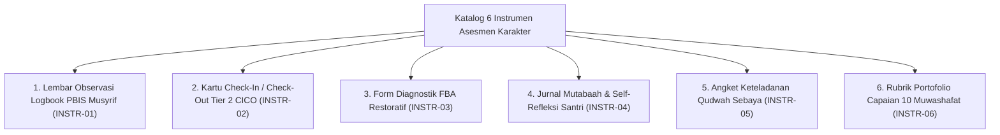

# P5-04: Katalog Instrumen Asesmen Karakter Santri TUMBUH

## Status Dokumen
* **Status**: 🌟 **A+ (Tervalidasi & Siap Diimplementasikan)**
* **Sub-Domain**: `05 Assessment Framework / 04 Assessment Instruments`
* **Penanggung Jawab Keilmuan**: Dewan Keilmuan TUMBUH (*Pakar Metodologi Riset & Pakar Arsitektur PBIS Restoratif*)

---

## 1. Spesifikasi Katalog Instrumen

Katalog ini berisi 6 instrumen baku yang digunakan dalam ekosistem penilaian **TUMBUH**:

---

## 2. Matriks Penggunaan Instrumen Asesmen

| Kode Instrumen | Nama Instrumen | Pengguna Utama | Frekuensi Penggunaan |
| :--- | :--- | :--- | :--- |
| **INSTR-01** | Logbook Digital PBIS Musyrif | Musyrif Kamar / Asrama. | Harian (Real-time). |
| **INSTR-02** | Kartu CICO (Check-In / Check-Out) | Santri Tier 2 & Musyrif Pendamping. | 2 Kali Sehari (Pagi & Sore). |
| **INSTR-03** | Form Diagnostik FBA Restoratif | Tim Bimbingan Konseling (BK). | Sesuai Kasus Khusus. |
| **INSTR-04** | Jurnal Mutabaah Mandiri Santri | Santri Individu (T1–T4). | Harian (Sebelum Tidur). |
| **INSTR-05** | Angket Keteladanan Qudwah Sebaya | Santri Seangkatan / Junior. | Per Semester. |
| **INSTR-06** | Rubrik Portofolio 10 Muwashafat | Tim Pengasuhan & Wali Kelas. | Akhir Semester / Gateway. |
