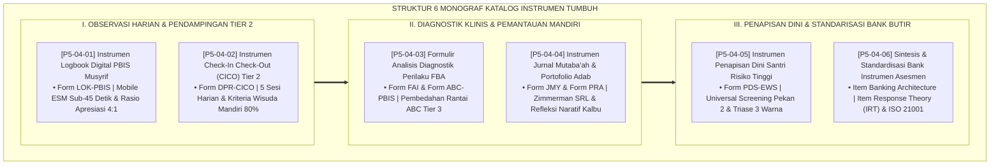

# P5-04: DOKUMEN INDUK KATALOG BANK INSTRUMEN ASESMEN KARAKTER
## *Arsitektur dan Katalog Baku Baterai Alat Ukur Evaluasi Karakter Santri (Logbook Digital Musyrif Form LOK, Daily Progress Report Form DPR-CICO, Wawancara Diagnostik FAI-ABC Tier 3, Jurnal Mutaba'ah Form JMY, Penapisan Universal EWS Form PDS, Serta Standardisasi Bank Butir IRT ISO 21001) di Ekosistem TUMBUH Pesantren*

**Nomor Identifikasi**: `P5-04/DOKUMEN-INDUK-KATALOG-BANK-INSTRUMEN/2026`  
**Domain**: `05 Assessment Framework` > `04 Assessment Instruments` (Gugus Sub-Domain 04: *Comprehensive Character Assessment Instruments Catalog & Item Banking*)  
**Klasifikasi Naskah**: *Master Architecture & Navigation Monograph* (Dokumen Induk Peta Jalan Riset & Navigasi 6 Monograf Ilmiah Katalog Instrumen)  
**Rumpun Disiplin Pengkaji**: Desain Instrumen Evaluasi Pesantren, Item Response Theory (IRT), PBIS Tier 1/2/3 Instruments, Standarisasi Mutu ISO 21001  

---

> ### 💡 INTISARI EKSEKUTIF (EXECUTIVE SUMMARY)
>
> * **Kedudukan Strategis Gugus Katalog Instrumen Asesmen:**  
>   Gugus *Assessment Instruments (Katalog Bank Instrumen Asesmen Karakter)* merupakan gudang senjata operasional (*Operational Arsenal*) yang memuat seluruh formulir, lembar kerja, dan aplikasi digital baku yang digunakan oleh seluruh pemangku kepentingan (musyrif, guru, konselor BK, santri, dan orang tua) dalam memantau dan membimbing pertumbuhan karakter santri 24 jam.
> * **Integrasi Holistik Turats & Konsensus Sains Instrumen Pengukuran:**  
>   Gugus riset ini memadukan khazanah agung Islam tentang pencatatan malaikat Raqib-Atid (*Taqyīdul A'māl*), pendampingan karib rutin (*At-Ta'āhud*), verifikasi mendalam (*At-Tahqīq*), muhasabah diri (*Al-Murāqabah*), pencegahan bahaya (*Sadduz Dzharā'i'*), dan neraca keadilan presisi (*Al-Mīzānul Qisth*) dengan konsensus sains psikometri internasional (*Mobile ESM, Daily Progress Reports, FAI-ABC Toolkit, SRL Journaling, PSC-17 Screening, dan IRT 2PL Item Banking ISO 21001*).
> * **Struktur Lengkap 6 Berkas Monograf Riset Ilmiah:**  
>   Dokumen induk ini memetakan dan menghubungkan 6 berkas monograf penelitian akademik komprehensif (~165 KB total riset) yang menyajikan logbook mobile sub-45 detik, kartu DPR harian CICO, formulir wawancara klinis BK, jurnal refleksi naratif saku, formulir penapisan dini 15 butir, dan arsitektur repositori bank butir terkalibrasi IRT.

---

## 📑 PETA NAVIGASI ENAM MONOGRAF RISET KATALOG INSTRUMEN

Berikut adalah daftar lengkap 6 monograf riset akademik dalam gugus **`04 Assessment Instruments`**:

---

## 📚 DESKRIPSI RINGKAS 6 BERKAS MONOGRAF

1. **[P5-04-01: Instrumen Logbook Digital PBIS Musyrif (Form LOK-PBIS)](file:///c:/xampp/htdocs/tumbuh/05%20Assessment%20Framework/04%20Assessment%20Instruments/P5-04-01-Instrumen-Logbook-Digital-PBIS-Musyrif.md)**  
   *Membahas instrumen observasi harian musyrif berbasis Mobile PWA, Behavioral Anchored Rating Scales (BARS) 10 kapasitas, doktrin pencatatan malaikat Raqib-Atid, dan rasio penguatan positif 4:1.*
2. **[P5-04-02: Instrumen Check-In Check-Out (CICO) Tier 2](file:///c:/xampp/htdocs/tumbuh/05%20Assessment%20Framework/04%20Assessment%20Instruments/P5-04-02-Instrumen-Check-In-Check-Out-CICO-Tier-2.md)**  
   *Membahas kartu pantau harian 5 sesi Form DPR-CICO untuk santri kelompok kuning, doktrin At-Ta'ahud salaf, intervensi Crone-Hawken-Horner, dan kriteria kelulusan mandiri konsisten 80% selama 4 pekan.*
3. **[P5-04-03: Formulir Analisis Diagnostik Perilaku FBA](file:///c:/xampp/htdocs/tumbuh/05%20Assessment%20Framework/04%20Assessment%20Instruments/P5-04-03-Formulir-Analisis-Diagnostik-Perilaku-FBA.md)**  
   *Membahas baterai instrumen klinis Tier 3: Form FAI (12 pertanyaan wawancara fungsional) dan Form ABC (lembar observasi rantai anteseden-perilaku-konsekuensi), serta perumusan dokumen Behavior Intervention Plan (BIP).*
4. **[P5-04-04: Instrumen Jurnal Mutaba'ah dan Portofolio Adab](file:///c:/xampp/htdocs/tumbuh/05%20Assessment%20Framework/04%20Assessment%20Instruments/P5-04-04-Instrumen-Jurnal-Mutabaah-dan-Portofolio-Adab.md)**  
   *Membahas buku saku harian Form JMY-Santri dan binder Form PRA-Santri, doktrin 5 tahap hisab Al-Ghazali, siklus Self-Regulated Learning (SRL) Zimmerman, dan ruang refleksi batiniah naratif.*
5. **[P5-04-05: Instrumen Penapisan Dini Santri Risiko Tinggi (Form PDS-EWS)](file:///c:/xampp/htdocs/tumbuh/05%20Assessment%20Framework/04%20Assessment%20Instruments/P5-04-05-Instrumen-Penapisan-Dini-Santri-Risiko-Tinggi.md)**  
   *Membahas alat ukur penapisan universal hari ke-10 untuk seluruh santri baru, 15 butir indikator gejala internalizing/externalizing/somatisasi, kaidah Sadduz Dzara'i, dan triase EWS 3 warna (Hijau/Kuning/Merah).*
6. **[P5-04-06: Sintesis dan Standardisasi Bank Instrumen Asesmen](file:///c:/xampp/htdocs/tumbuh/05%20Assessment%20Framework/04%20Assessment%20Instruments/P5-04-06-Sintesis-dan-Standardisasi-Bank-Instrumen.md)**  
   *Membahas kodifikasi repositori bank butir terpusat pada SIM Intizham, kalibrasi Item Response Theory (IRT 2PL Model), doktrin Al-Mizanul Qisth, dan standarisasi manajemen mutu ISO 21001:2018.*

---

## 🎯 STANDAR PENJAMINAN MUTU BANK INSTRUMEN

Penerapan gugus **Katalog Bank Instrumen Asesmen Karakter (Assessment Instruments)** menjamin bahwa:
1. **Seluruh Instrumen Memiliki Bukti Validitas dan Reliabilitas Psikometri Sahih (*Evidence-Based Instruments*)**: Tidak ada satu pun formulir yang dibuat asal-asalan tanpa pengujian psikometri yang ketat.
2. **Kemudahan Penggunaan Tanpa Beban Administrasi (*User-Friendly & Streamlined*)**: Instrumen dirancang ringkas, cepat diisi, dan terhubung secara otomatis ke sistem basis data cloud.
3. **Perlindungan Hak Santri dan Akuntabilitas Pengasuhan (*Child-Centric Accountability*)**: Menjamin bahwa seluruh proses pendampingan dan penanganan santri tercatat secara transparan dan berkeadilan.
