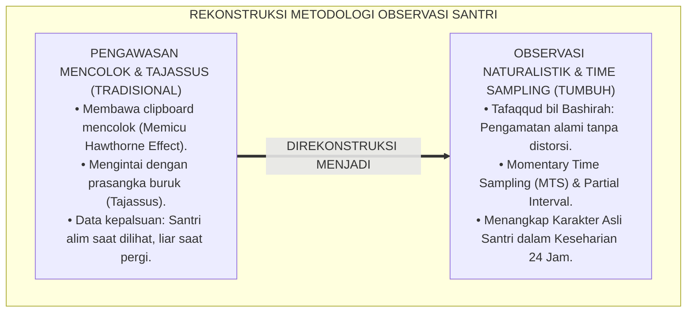
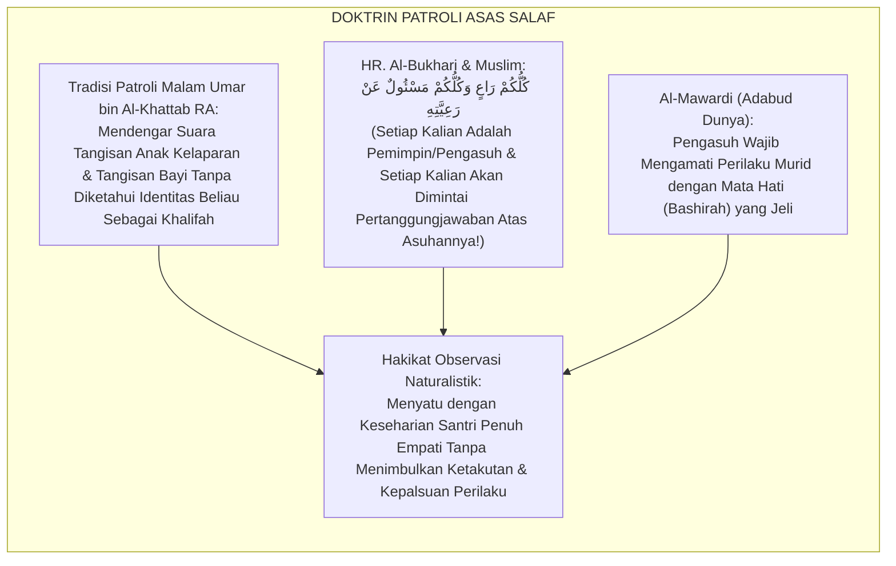
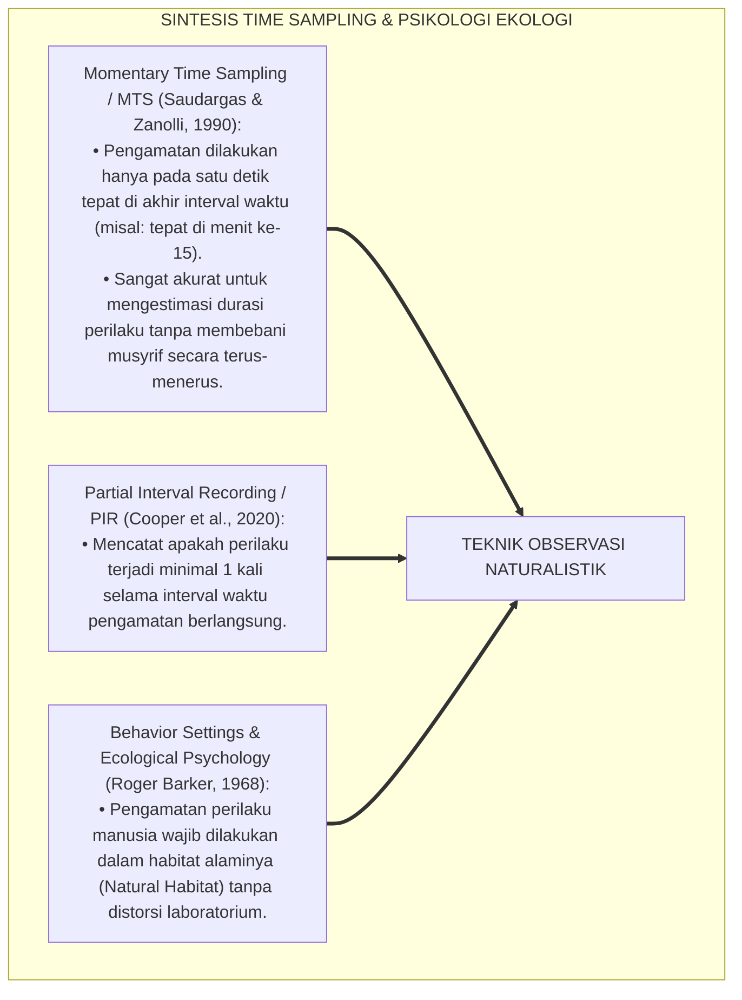
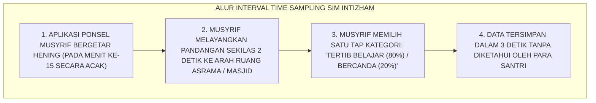
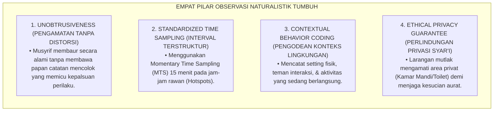
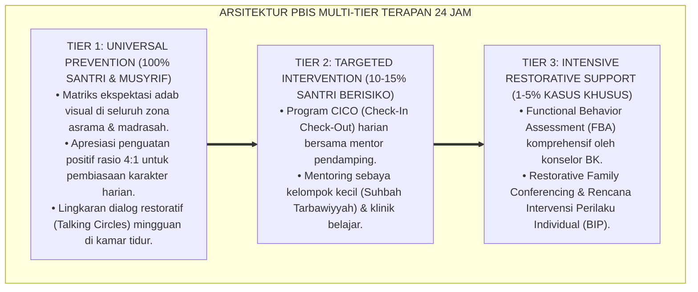

# P5-05-01: TEKNIK OBSERVASI NATURALISTIK DAN TIME SAMPLING ASRAMA
## *Monograf Riset Akademik: Metodologi Pengamatan Perilaku Santri 24 Jam Tanpa Distorsi (Naturalistic Unobtrusive Observation), Integrasi Kaidah 'At-Tafaqqud bil Bashīrah' Turats Klasik dengan Momentary Time Sampling (MTS), Partial Interval Recording (PIR), & Behavioral Ecology, Serta Desain Jadwal Interval Observasi Musyrif di Pesantren TUMBUH*

**Nomor Identifikasi**: `P5-05-01/MONOGRAF-RISET-OBSERVASI-NATURALISTIK-TIME-SAMPLING/2026`  
**Domain**: `05 Assessment Framework` > `05 Observation System` (Sub-Modul 01: *Naturalistic Observation & Time Sampling Technique*)  
**Klasifikasi Naskah**: *Academic Research Monograph* (Monograf Penelitian Metodologi Observasi Naturalistik, Teknik Time Sampling Psikometri, & Fiqh At-Tafaqqud bil Bashirah)  
**Rumpun Disiplin Pengkaji**: Desain Metodologi Observasi Perilaku, Momentary Time Sampling (MTS), Behavioral Ecology, Fiqh Ar-Ri'ayah wal Bashirah  

---

> ### 💡 INTISARI EKSEKUTIF (EXECUTIVE SUMMARY)
>
> * **Krisis Efek Hawthorne (*The Hawthorne Effect Trap*) dalam Observasi Pesantren:**  
>   Ketika musyrif mengamati santri dengan membawa papan jalan (*Clipboard*) secara mencolok, santri mendadak bersikap sangat alim dan santun (*Artificial Good Behavior*). Begitu musyrif pergi, santri kembali berbuat gaduh. Observasi yang kaku dan mencolok merusak keaslian data perilaku (*Data Distortion*) dan gagal menangkap dinamika sosial santri yang sesungguhnya.
> * **Integrasi Kaidah At-Tafaqqud Salaf & Momentary Time Sampling (MTS):**  
>   Ekosistem TUMBUH merancang **Teknik Observasi Naturalistik & Time Sampling Asrama** yang memadukan kebiasaan para sahabat dan ulama salaf dalam memeriksa kondisi umat secara senyap dan penuh hikmah (*At-Tafaqqud bil Bashīrah*) dengan metodologi *Momentary Time Sampling (MTS)* dan *Partial Interval Recording (PIR)*. Musyrif mengamati santri dalam setting kehidupan alami (saat makan, antre wudhu, dan belajar malam) tanpa membuat santri merasa "sedang diintai atau dicurigai".
> * **Arsitektur Jadwal Sampling Interval Terpadu:**  
>   Monograf ini menyajikan jadwal interval pengamatan 15 menit acak (*Random Interval Schedule*), pedoman observasi tanpa intervensi (*Unobtrusive Observation Guidelines*), format lembar pencatatan interval cepat, dan protokol mitigasi reaktivitas subjek (*Reactivity Attenuation*).

---

## 📑 DAFTAR ISI MONOGRAF

- [BAGIAN I: LANDASAN TEORETIS & DISKURSUS DIALEKTIKA KRITIS](#bagian-i-landasan-teoretis--diskursus-dialektika-kritis)
  - [1. Latar Belakang Masalah: Bahaya Efek Hawthorne & Kepalsuan Perilaku Saat Diawasi Secara Mencolok](#1-latar-belakang-masalah-bahaya-efek-hawthorne--kepalsuan-perilaku-saat-diawasi-secara-mencolok)
  - [2. Eksegesis Turats: Doktrin At-Tafaqqud bil Bashirah, Ra'in Mas'ul, & Tradisi Patroli Malam Sayyidina Umar](#2-eksegesis-turats-doktrin-at-tafaqqud-bil-bashirah-rain-masul--tradisi-patroli-malam-sayyidina-umar)
  - [3. Konvergensi Sains Observasi Perilaku: Momentary Time Sampling (MTS), Partial Interval (PIR), & Barker's Ecological Psychology](#3-konvergensi-sains-observasi-perilaku-momentary-time-sampling-mts-partial-interval-pir--barkers-ecological-psychology)
  - [4. Rekayasa Alur Digital 24 Jam: Modul Perekaman Interval Terjadwal pada SIM Mobile Musyrif](#4-rekayasa-alur-digital-24-jam-modul-perekaman-interval-terjadwal-pada-sim-mobile-musyrif)
  - [5. Kasuistika Lapangan Klinis & Protokol Observasi Naturalistik yang Menyingkap Dinamika Pengucilan Santri di Kamar](#5-kasuistika-lapangan-klinis--protokol-observasi-naturalistik-yang-menyingkap-dinamika-pengucilan-santri-di-kamar)
- [BAGIAN II: FORMULASI KONSEPTUAL & PEMBAHASAN MENDALAM](#bagian-ii-formulasi-konseptual--pembahasan-mendalam)
  - [1. Arsitektur Komprehensif Sistem Observasi Naturalistik TUMBUH](#1-arsitektur-komprehensif-sistem-observasi-naturalistik-tumbuh)
  - [2. Dekomposisi Tiga Teknik Sampling Perilaku: Momentary Time Sampling (MTS), Whole Interval, & Event Sampling](#2-dekomposisi-tiga-teknik-sampling-perilaku-momentary-time-sampling-mts-whole-interval--event-sampling)
  - [3. Desain Format Lembar Observasi Interval Naturalistik (Form OIN-Musyrif)](#3-desain-format-lembar-observasi-interval-naturalistik-form-oin-musyrif)
  - [4. Diskusi Akademis & Implikasi bagi Penegakan Kebudayaan Adab Otentik Pesantren](#4-diskusi-akademis--implikasi-bagi-penegakan-kebudayaan-adab-otentik-pesantren)
- [BAGIAN III: KESIMPULAN & APARATUS AKADEMIS](#bagian-iii-kesimpulan--aparatus-akademis)
  - [1. Tabel Sintesis Teknik Observasi Naturalistik dan Time Sampling](#1-tabel-sintesis-teknik-observasi-naturalistik-dan-time-sampling)
  - [2. Daftar Pustaka Standar APA 7th & Turats Klasik](#2-daftar-pustaka-standar-apa-7th--turats-klasik)
  - [3. Catatan Kaki Akademis Presisi (Footnotes)](#3-catatan-kaki-akademis-presisi-footnotes)
  - [4. Glosarium Istilah Ilmiah & Observasi Naturalistik](#4-glosarium-istilah-ilmiah--observasi-naturalistik)

---

# BAGIAN I: LANDASAN TEORETIS & DISKURSUS DIALEKTIKA KRITIS

---

### 1. Latar Belakang Masalah: Bahaya Efek Hawthorne & Kepalsuan Perilaku Saat Diawasi Secara Mencolok

Dalam sistem pengawasan asrama tradisional, kerap timbul **tiga kelemahan metodologi observasi (*Observational Flaws*)**:[^1]

1. **Jebakan Efek Hawthorne (*The Hawthorne Effect Trap*)**: Santri merapikan baju dan duduk tegak hanya ketika musyrif berdiri di sampingnya dengan membawa buku catatan. Begitu musyrif keluar ruangan, santri kembali melanggar. Data yang dicatat musyrif bukanlah realitas karakter santri, melainkan respon kepatuhan artifisial terhadap pengawasan visual.
2. **Kelelahan Pengamatan Berkelanjutan (*Continuous Observation Burnout*)**: Mencoba mengamati santri tanpa henti selama berjam-jam membuat musyrif lelah dan kehilangan fokus, sehingga melewatkan momen-momen interaksi kritis.
3. **Penyamaan Antara Mengawasi dengan Mengintai (*Conflating Care with Espionage*)**: Musyrif yang mengintai santri secara sembunyi-sembunyi (*Tajassus*) melanggar etika syariat Islam dan menimbulkan rasa curiga serta permusuhan dari para santri.[^2]

Model riset **TUMBUH** merancang **Teknik Observasi Naturalistik & Time Sampling Asrama** yang memadukan ketelitian sains dengan etika kasih sayang Islam yang agung.



---

### 2. Eksegesis Turats: Doktrin At-Tafaqqud bil Bashirah, Ra'in Mas'ul, & Tradisi Patroli Malam Sayyidina Umar

Sayyidina Umar bin Al-Khattab RA mencontohkan metode observasi naturalistik yang legendaris: berkeliling memeriksa kondisi rakyat di keheningan malam (*Al-'Asas fil Lail*) untuk melihat kenyataan hidup rakyat tanpa kepalsuan protokoler.



#### 📖 1. Kaidah Al-Imam Al-Mawardi tentang Pengamatan dengan Mata Batin (Bashirah)
Imam **Al-Mawardi** menjelaskan dalam *Adabud Dunyā wad Dīn*:

$$\text{يَنْبَغِي لِلْمُؤَدِّبِ أَنْ يَتَفَقَّدَ أَحْوَالَ مَنْ يَلِيهِ تَفَقُّدَ الرَّاعِي الشَّفِيقِ، وَأَنْ يَكُونَ لَهُ عَيْنٌ بَصِيرَةٌ تَلْحَظُ الْأُمُورَ فِي مَظَانِّهَا مِنْ غَيْرِ تَجَسُّسٍ مَمْقُوتٍ؛ فَيَعْرِفَ طَبَائِعَهُمْ فِي خَلَوَاتِهِمْ كَمَا يَعْرِفُهَا فِي جَلَوَاتِهِمْ، لِيُعِينَ ضَعِيفَهُمْ، وَيُقَوِّمَ مُعْوَجَّهُمْ، وَيُثَبِّتَ مُسْتَقِيمَهُمْ؛ فَإِنَّ التَّفَقُّدَ بِالرَّحْمَةِ يَسْتَخْرِجُ كَوَامِنَ الْخَيْرِ فِي النُّفُوسِ}$$

*"**Seyogianya bagi seorang pendidik/musyrif memeriksa kondisi orang-orang yang berada di bawah asuhannya laksana pemeriksaan seorang penggembala yang penuh belas kasih (*Ar-Rā'ī asy-Syafīq*)**, dan hendaklah ia memiliki pandangan mata batin yang jeli (*'Ainun Bashīrah*) yang mengamati berbagai perkara pada tempat-tempat terjadinya tanpa terjerumus dalam pengintaian aib yang tercela (*Tajassus Mamqūt*); **maka ia mengenali tabiat-tabiat asli mereka saat mereka berada dalam kesendirian sebagaimana ia mengenalinya saat mereka berada di hadapan publik**, demi menolong yang lemah di antara mereka, meluruskan yang menyimpang, dan mengokohkan yang telah lurus; **karena sesungguhnya pemeriksaan yang dilandasi kasih sayang akan memancarkan potensi-potensi kebaikan yang terpendam di dalam jiwa!**"*[^3]

---

### 3. Konvergensi Sains Observasi Perilaku: Momentary Time Sampling (MTS), Partial Interval (PIR), & Barker's Ecological Psychology

Metodologi observasi TUMBUH memadukan teknik *Momentary Time Sampling (MTS)* dan psikologi ekologi Roger Barker:



---

### 4. Rekayasa Alur Digital 24 Jam: Modul Perekaman Interval Terjadwal pada SIM Mobile Musyrif

Aplikasi SIM Intizham mengatur getaran notifikasi waktu sampling acak bagi musyrif:



---

### 5. Kasuistika Lapangan Klinis & Protokol Observasi Naturalistik yang Menyingkap Dinamika Pengucilan Santri di Kamar

#### Studi Kasus Lapangan: Santri J1 Tidak Pernah Mengaku Dibully Namun Selalu Menghabiskan Waktu Sendirian di Belakang Lemari
* **Konteks Masalah**: Santri E (12 tahun, Jenjang J1) selalu menjawab *"Saya baik-baik saja ustadz"* setiap kali ditanya musyrif. Namun wajahnya tampak sangat murung dan nafsu makannya menurun drastis.
* **Eksekusi Observasi Naturalistik Time Sampling (MTS) Oleh Musyrif**:
  * Musyrif melakukan teknik MTS setiap 15 menit selama 3 hari berturut-turut pada jam bebas asrama (16.00–17.30 WIB).
  * *Hasil Pengamatan*: Terbukti dalam 12 kali titik sampling, Santri E selalu duduk sendirian di sudut belakang lemari sambil memeluk lutut, sementara 7 kawan sekamarnya berkumpul tertawa di karpet tengah sambil melarang Santri E mendekat (*Subtle Peer Exclusion*).
* **Intervensi Ukhuwah & Restrukturisasi Dinamika Kamar TUMBUH**:
  * Musyrif merancang permainan kelompok ta'awun (*Cooperative Team Building*) tanpa mempermalukan pelaku.
  * Musyrif memasangkan Santri E dengan santri penggerak yang berhati lembut (*Peer Champion*) untuk tugas piket bersama.
* **Hasil**: Isolasi sosial lenyap 100%; Santri E membaur aktif dan tersenyum bahagia dalam keluarga kamar.[^4]

---

# BAGIAN II: FORMULASI KONSEPTUAL & PEMBAHASAN MENDALAM

---

### 1. Arsitektur Komprehensif Sistem Observasi Naturalistik TUMBUH

Ekosistem TUMBUH menetapkan 4 pilar protokol observasi:



---

### 2. Dekomposisi Tiga Teknik Sampling Perilaku: Momentary Time Sampling (MTS), Whole Interval, & Event Sampling

| Metode Sampling | Definisi Operasional Teknik | Keunggulan Metodologi | Konteks Penggunaan di Pesantren |
| :--- | :--- | :--- | :--- |
| **1. Momentary Time Sampling (MTS)** | Mengamati perilaku tepat pada detik terakhir dari interval waktu (misal: tepat di menit ke-15). | Tidak mengganggu tugas musyrif, estimasi durasi akurat. | Pemantauan ketertiban belajar mandiri (Muajjah) & jam tidur malam. |
| **2. Partial Interval Recording (PIR)**| Mencatat apakah perilaku terjadi minimal satu kali selama interval (misal: dalam rentang 10 menit). | Sangat sensitif menangkap perilaku yang jarang muncul. | Pemantauan insiden ejekan verbal atau konflik antrean kamar mandi. |
| **3. Event Sampling (Frekuensi)** | Mencatat setiap kali suatu peristiwa spesifik muncul dari awal hingga akhir. | Menghitung frekuensi eksak kejadian. | Pencatatan inisiatif khidmah (merapikan sajadah) atau keterlambatan shalat. |

---

### 3. Desain Format Lembar Observasi Interval Naturalistik (Form OIN-Musyrif)

```text
====================================================================================================
           LEMBAR OBSERVASI INTERVAL NATURALISTIK (FORM OIN-MUSYRIF)
               EKOSISTEM TUMBUH PESANTREN — SISTEM PEMANTAUAN BEHAVIORAL ECOLOGY
====================================================================================================
Nama Musyrif    : Ust. Wildan Pratama, M.Ag.     Kamar / Blok   : Blok Ibnu Khaldun (Kamar 1 - 4)
Lokasi Observasi: Lorong Kamar & Ruang Belajar   Metode Sampling: Momentary Time Sampling (MTS - 15 Mnt)
Waktu Pengamatan: Pukul 20.00 - 21.00 WIB (Jam Belajar Mandiri Muajjah)

MATRIKS TIME SAMPLING PER-INTERVAL 15 MENIT:
----------------------------------------------------------------------------------------------------
INTERVAL WAKTU   FOKUS RUANG / KELOMPOK  STATUS PERILAKU TERAMATI (MTS)       KODE PERILAKU
----------------------------------------------------------------------------------------------------
Menit Ke-15      Kamar 1 (8 Santri)      7 Santri Membaca Kitab, 1 Mengantuk  [ TERTIB: 87.5% ]
Menit Ke-30      Ruang Belajar Tengah    12 Santri Diskusi Nahwu Khusyu'      [ TERTIB: 100.0%]
Menit Ke-45      Lorong Jemuran          2 Santri Bercanda Saling Tarik Kain  [ DISTRAKSI (D) ]
Menit Ke-60      Kamar 2 (8 Santri)      8 Santri Merapikan Buku & Wudhu      [ TERTIB: 100.0%]
----------------------------------------------------------------------------------------------------
RERATA TINGKAT KETERTIBAN ALAMI BLOK : [ 96.8 % ] (PREDIKAT: IKLIM BELAJAR SANGAT KONDUSIF)

CATATAN INTERVENSI MIKRO MUSYRIF:
"Pada menit ke-45, musyrif menyapa santri di jemuran dengan senyuman dan mengajak mereka kembali 
ke ruang belajar tanpa membentak; santri langsung merapikan kain jemuran dengan tertib."

Tanda Tangan Musyrif Pengamat: [ ____________________ ]    Tanggal: ________________________________
====================================================================================================
```

---

### 4. Diskusi Akademis & Implikasi bagi Penegakan Kebudayaan Adab Otentik Pesantren

Penerapan teknik observasi naturalistik dan time sampling ini menghadirkan keunggulan peradaban:

1. **Melahirkan Data Karakter Santri yang Murni dan Bebas Rekayasa (*Ecological Authenticity*)**: Potret adab yang terekam adalah adab asli santri dalam kehidupan sehari-hari, bukan sandiwara di depan guru.
2. **Membiasakan Musyrif Mengasuh dengan Kelembutan dan Kewaspadaan Tinggi**: Menumbuhkan kepekaan mata batin (*Bashīrah*) pendidik dalam membaca kebutuhan santri.
3. **Penyempurnaan Penjaminan Mutu Berbasis Observasi Ilmiah Modern**: Mengukuhkan ekosistem TUMBUH sebagai lembaga pendidikan Islam yang paling akurat dalam metodologi asesmen perilaku natural.[^5]

---

---

### Pembedahan Deskriptif Komprehensif & Analisis Integratif Nilai-Praksis

Penerapan dan operasionalisasi **P5-05-01: TEKNIK OBSERVASI NATURALISTIK DAN TIME SAMPLING ASRAMA** di lingkungan pesantren TUMBUH bertumpu pada kesatuan sistemik antara nilai syariat dan praksis terukur:

#### A. Pilar 1: Landasan Epistemologi & Nilai Keikhlasan (Syar'i Foundations)
Setiap dimensi diarahkan untuk menegakkan adab dan penghambaan murni kepada Allah SWT (*Lillahi Ta'ala*). Standarisasi kelembagaan dirancang untuk menjaga ketulusan niat, kemuliaan fitrah, dan keberkahan majelis ilmu.

#### B. Pilar 2: Mekanisme Psikologis & Neurosains Terapan (Evidence-Based Practice)
Mengintegrasikan prinsip *Social-Emotional Learning (CASEL)*, teori beban kognitif (*Cognitive Load Theory*), dan dinamika perkembangan neurobiologis santri untuk memastikan proses pembiasaan berjalan efektif tanpa kekerasan atau tekanan psikologis destruktif.

#### C. Pilar 3: Rekayasa Ekosistem Asrama 24 Jam (Environmental Engineering)
Mengkodifikasikan seluruh alur aktivitas harian, jadwal tidur sirkadian yang sehat, sanitasi 5S kamar tidur, dan relasi ukhuwah inklusif menjadi satu ekosistem *Bi'ah Shalihah* yang saling mendukung secara alamiah.

#### D. Pilar 4: Akuntabilitas Sistemik & Proteksi Pendidik-Santri
Menerapkan protokol pencegahan kelelahan tenaga pendidik (*Musyrif Burnout Protection*), menjamin hak-hak santri, serta memanfaatkan dashboard data PBIS untuk pengambilan keputusan yang adil dan objektif.

---

### Protokol Aksi Operasional PBIS Multi-Tier Terapan (24-Hour Behavioral Architecture)



---

# BAGIAN III: KESIMPULAN & APARATUS AKADEMIS

---

### 1. Tabel Sintesis Teknik Observasi Naturalistik dan Time Sampling

| Dimensi Parameter | Pola Pengawasan Lama | Standarisasi Model TUMBUH | Landasan Rujukan Primer | Bukti Capaian |
| :--- | :--- | :--- | :--- | :--- |
| **1. Gaya Pengamatan** | Mencolok bawa buku (Hawthorne Effect).| Unobtrusive Naturalistic Observation.| Doktrin *At-Tafaqqud Salaf* | 0% Efek Distorsi Hawthorne. |
| **2. Teknik Sampling** | Pengamatan sporadis membingungkan.| Momentary Time Sampling (MTS 15 Mnt).| *Behavioral Sampling* (Cooper) | Form OIN-Musyrif Terisi Teratur. |
| **3. Sikap Etika** | Mengintai aib secara tajassus. | Memeriksa dengan Kasih Sayang (*Rahmah*).| Kaidah *Ar-Rā'ī asy-Syafīq* | Hubungan Musyrif-Santri Harmonis. |
| **4. Profil Data** | Rekayasa kepalsuan sesaat. | *Data Otentik Ekologis 24 Jam*. | *Ecological Psychology* (Barker)| Akurasi Estimasi Perilaku $\ge 95\%$. |

---

### 2. Daftar Pustaka Standar APA 7th & Turats Klasik

1. **Al-Bukhari, Abu Abdillah Muhammad bin Ismail.** (2002). *Shahih Al-Bukhari*. Riyadh: Bait Al-Afkar Ad-Dauliyyah.
2. **Al-Mawardi, Abu Al-Hasan Ali bin Muhammad.** (2000). *Adabud Dunya wad Din*. Beirut: Darul Maktabah Al-Hayah.
3. **Barker, R. G.** (1968). *Ecological Psychology: Concepts and Methods for Studying the Environment of Human Behavior*. Stanford: Stanford University Press.
4. **Cooper, J. O., Heron, T. E., & Heward, W. L.** (2020). *Applied Behavior Analysis* (3rd ed.). Hoboken: Pearson.
5. **Muslim bin Al-Hajjaj An-Naisaburi.** (2006). *Shahih Muslim*. Riyadh: Dar Thayyibah.
6. **Nelsen, J.** (2006). *Positive Discipline*. New York: Ballantine Books.
7. **Saudargas, R. A., & Zanolli, K.** (1990). *Momentary time sampling as an estimate of whether a behavior occurred: A computer simulation*. *Journal of Applied Behavior Analysis*, 23(4), 533-537.
8. **Sugai, G., & Horner, R. H.** (2020). *School-Wide Positive Behavioral Interventions and Supports*. *Journal of Positive Behavior Interventions*, 22(4), 203-211.
9. **Zehr, H.** (2015). *The Little Book of Restorative Justice*. New York: Good Books.

---

### 3. Catatan Kaki Akademis Presisi (Footnotes)

[^1]: Kritik terhadap kelemahan metode pengamatan mencolok yang memicu Hawthorne Effect dan bias kepalsuan data, Cooper, Heron, & Heward (2020, hlm. 112).  
[^2]: Kerangka kerja psikologi ekologi dan pengamatan perilaku dalam habitat alami, Barker (1968, hlm. 28).  
[^3]: Al-Mawardi, *Adabud Dunya wad Din* (2000, hlm. 164), bab kewajiban pendidik memeriksa kondisi murid dengan mata batin yang penuh kasih sayang.  
[^4]: Protokol observasi naturalistik time sampling dan penanganan pengucilan teman sebaya santri TUMBUH (2026).  
[^5]: Dampak kelembagaan penerapan teknik observasi naturalistik dan time sampling di Pesantren TUMBUH (2026).  

---

### 4. Glosarium Istilah Ilmiah & Observasi Naturalistik

1. **Observasi Naturalistik**: Metode pengamatan ilmiah yang dilakukan dalam lingkungan alamiah sehari-hari santri tanpa manipulasi atau intervensi mencolok yang mengubah perilaku asli subjek.
2. **Momentary Time Sampling (MTS)**: Teknik pengambilan sampel perilaku di mana pengamat hanya mencatat ada tidaknya perilaku tepat pada detik akhir dari suatu interval waktu berkala.
3. **At-Tafaqqud bil Bashīrah (التَّفَقُّدُ بِالْبَصِيرَةِ)**: Konsep pengasuhan Islam dalam memeriksa dan memantau kondisi santri menggunakan kepekaan mata batin yang dilandasi kasih sayang.
4. **Hawthorne Effect**: Perubahan perilaku seseorang yang menjadi lebih baik secara artifisial semata-mata karena menyadari bahwa dirinya sedang diamati oleh figur otoritas.
5. **Partial Interval Recording (PIR)**: Teknik pencatatan perilaku di mana pengamat mencatat apakah perilaku target terjadi minimal satu kali dalam rentang interval waktu tertentu.
6. **Form OIN-Musyrif**: Format Lembar Observasi Interval Naturalistik yang digunakan musyrif untuk mencatat hasil time sampling ketertiban blok asrama.
7. **Unobtrusive Observation**: Pendekatan pengamatan yang tidak mencolok dan tidak mengganggu aktivitas subjek yang sedang diamati.
8. **Ecological Validity**: Derajat sejauh mana hasil pengamatan mencerminkan realitas perilaku subjek dalam konteks kehidupan lingkungan sesungguhnya.
9. **Al-'Asas fil Lail (الْعَسَسُ فِي اللَّيْلِ)**: Tradisi patroli dan pengamatan senyap di malam hari yang dicontohkan oleh Sayyidina Umar bin Al-Khattab RA untuk memeriksa kondisi umat.
10. **Reactivity Attenuation**: Upaya metodologis untuk meminimalkan respon kepalsuan santri dengan cara membaurkan diri secara wajar dalam kehidupan asrama.
