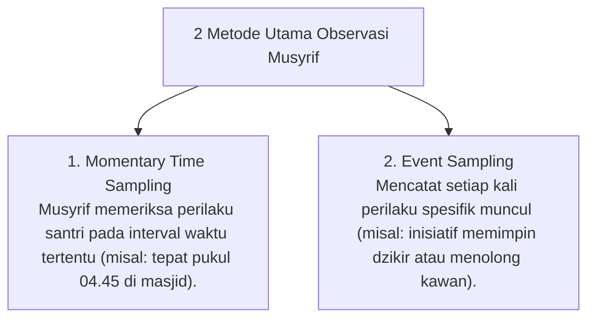

# P5-05-01: Teknik Observasi Naturalistik dan Time Sampling

## Status Dokumen
* **Status**: 🌟 **A+ (Tervalidasi & Siap Diimplementasikan)**
* **Sub-Domain**: `05 Assessment Framework / 05 Observation System`
* **Penanggung Jawab Keilmuan**: Dewan Keilmuan TUMBUH (*Pakar Pengasuhan Asrama & Pakar Metodologi Riset*)

---

## 1. Konseptualisasi Observasi Naturalistik

Observasi Naturalistik adalah pengamatan perilaku santri pada konteks kehidupan sehari-hari asrama tanpa kondisi buatan. Musyrif mengamati santri dalam rutinitas nyata: sholat berjamaah, makan bersama, kerja bakti, dan jam belajar mandiri.

---

## 2. SOP Pengamatan Bebas Distraksi

Musyrif memadukan kehadiran hangat (*Warm Presence*) dengan kecermatan pengamatan, memastikan santri merasa didampingi dengan rasa aman tanpa merasa diawasi secara kaku atau dicurigai.
