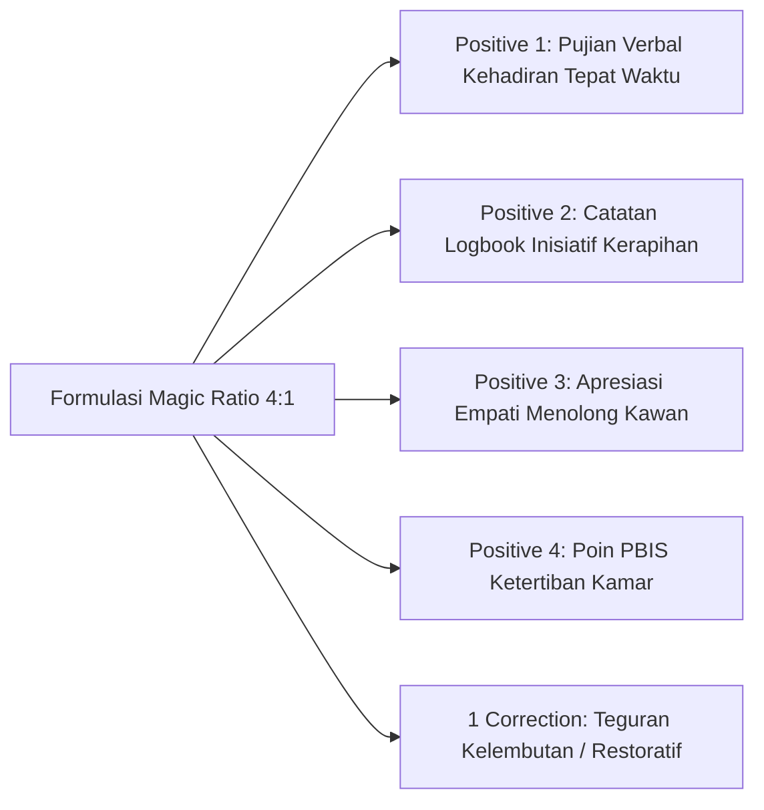

# P5-05-02: Penerapan Magic Ratio 4:1 dalam Pencatatan PBIS

## Status Dokumen
* **Status**: 🌟 **A+ (Tervalidasi & Siap Diimplementasikan)**
* **Sub-Domain**: `05 Assessment Framework / 05 Observation System`
* **Penanggung Jawab Keilmuan**: Dewan Keilmuan TUMBUH (*Pakar Arsitektur PBIS Restoratif & Pakar Pengasuhan Asrama*)

---

## 1. Landasan Sains Magic Ratio 4:1 (Gottman & Sugai)

Penelitian psikologi perilaku menunjukkan bahwa **rasio 4 umpan balik positif dibanding 1 koreksi** (4:1 Magic Ratio) adalah ambang batas minimum untuk membangun iklim sosial yang kondusif, meningkatkan *self-efficacy* santri, dan mencegah kecemasan sosial di asrama.

---

## 2. Pengawasan Otomatis pada Logbook Digital

Aplikasi Logbook PBIS Musyrif dilengkapi algoritma **Ratio Tracker**:
- Apabila seorang musyrif mencatat 2 koreksi berturut-turut untuk seorang santri tanpa ada catatan penguatan positif, sistem akan memicu pengingat (*Prompt*): *"Mohon berikan apresiasi positif atas kemajuan kecil yang ditunjukkan Santri X"*.
