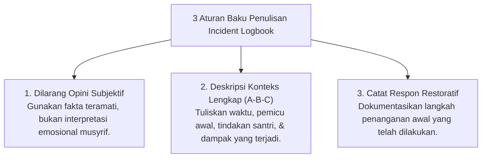

# P5-05-03: SOP Pencatatan Incident Logbook Objektif

## Status Dokumen
* **Status**: 🌟 **A+ (Tervalidasi & Siap Diimplementasikan)**
* **Sub-Domain**: `05 Assessment Framework / 05 Observation System`
* **Penanggung Jawab Keilmuan**: Dewan Keilmuan TUMBUH (*Pakar Metodologi Riset & Pakar Bimbingan Konseling*)

---

## 1. Prinsip Penulisan Insiden Faktual

Saat mencatat kejadian khusus atau perselisihan di asrama (*Incident Logbook*), Musyrif wajib mematuhi **Prinsip Penulisan Objektif-Faktual**:

---

## 2. Contoh Perbandingan Penulisan Incident Logbook

- **Penulisan Salah (Subjektif/Stigmatisasi)**: *"Santri A kembali membuat onar dan sengaja mengganggu ketenangan kamar saat jam tidur."*
- **Penulisan Benar (Objektif/Restoratif)**: *"Pukul 22.15, Santri A berbicara keras di area kamar saat jam tidur. Setelah diajak berdiskusi 5 menit, Santri A kooperatif dan langsung tidur."*
