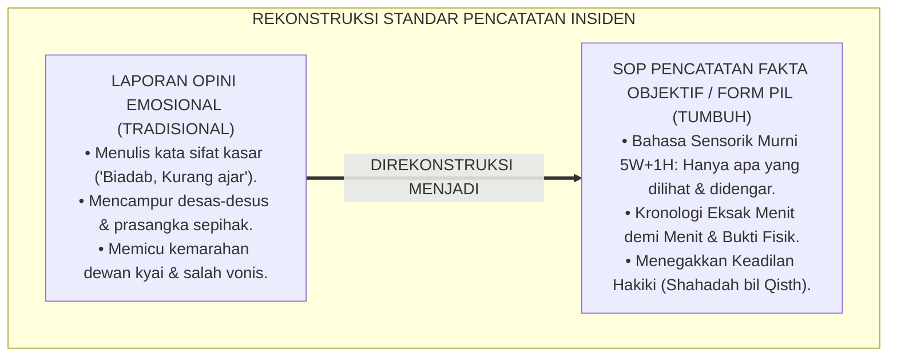
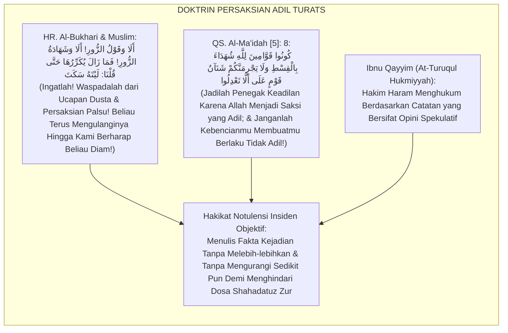
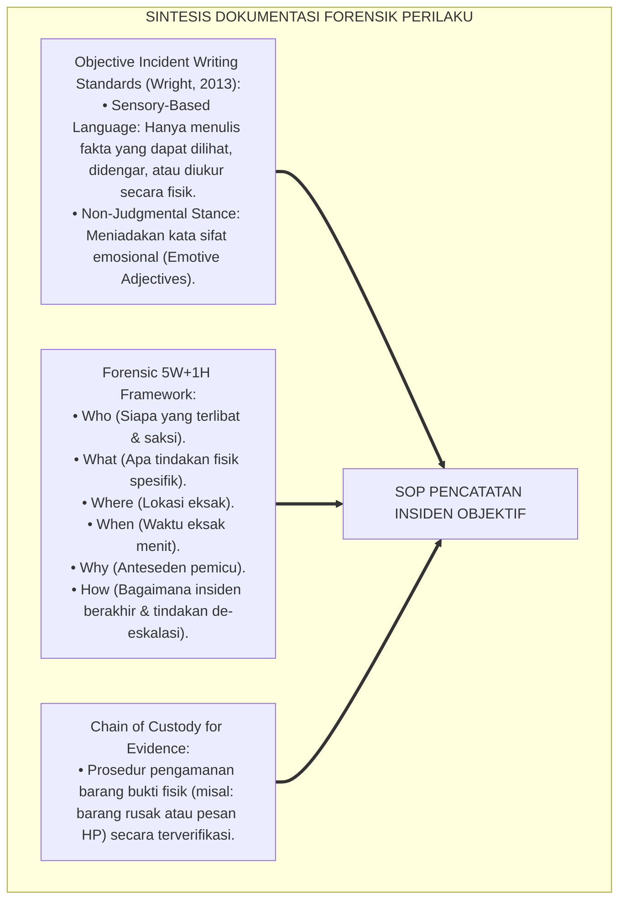
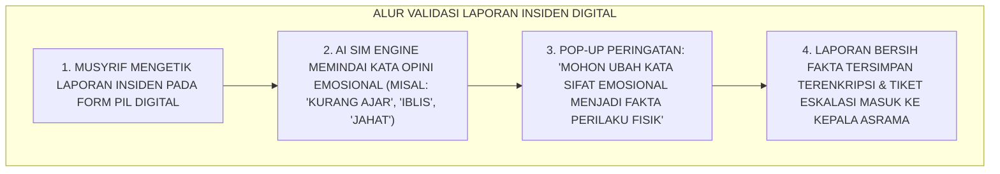
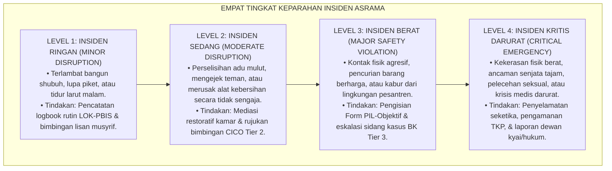

# P5-05-03: SOP PENCATATAN INSIDEN DAN LOGBOOK OBJEKTIF
## *Monograf Riset Akademik: Standard Operating Procedure (SOP) Pencatatan Insiden Pelanggaran dan Kejadian Luar Biasa Asrama Secara Objektif Bebas Opini Emosional, Integrasi Doktrin 'Qauluz Zūr wa Shahādatul 'Adl' Turats Klasik dengan Objective Incident Reporting Standards & Behavioral Forensic Documentation, Serta Alur Eskalasi Kasus di Pesantren TUMBUH*

**Nomor Identifikasi**: `P5-05-03/MONOGRAF-RISET-SOP-PENCATATAN-INSIDEN-OBJEKTIF/2026`  
**Domain**: `05 Assessment Framework` > `05 Observation System` (Sub-Modul 03: *Objective Incident Logging & Behavioral Forensic SOP*)  
**Klasifikasi Naskah**: *Academic Research Monograph* (Monograf Penelitian SOP Pencatatan Insiden Objektif, Dokumentasi Forensik Perilaku, & Fiqh Asy-Syahadah bil Qisth)  
**Rumpun Disiplin Pengkaji**: Desain SOP Pengasuhan Asrama, Objective Incident Reporting, Forensik Dokumentasi Perilaku, Fiqh Asy-Syahadah  

---

> ### 💡 INTISARI EKSEKUTIF (EXECUTIVE SUMMARY)
>
> * **Krisis Pencatatan Insiden yang Sarat Opini dan Emosi Subjektif (*Emotional Incident Bias*):**  
>   Banyak laporan kejadian asrama di pesantren ditulis dengan bahasa emosional yang menghakimi: musyrif menulis *"Santri bersikap kurang ajar dan menantang ustadz dengan wajah iblis"*, alih-alih mencatat fakta fisik objektif (*"Santri bersuara dengan volume 75 dB dan menolak meletakkan buku"*). Laporan yang bias opini ini menyulut kemarahan dewan kyai, memicu fitnah, dan menghalangi penegakan keadilan restoratif.
> * **Integrasi Larangan Kesaksian Palsu Salaf & Objective Forensic Documentation:**  
>   Ekosistem TUMBUH merumuskan **SOP Pencatatan Insiden & Logbook Objektif (Form PIL-Objektif)** yang memadukan peringatan keras Rasulullah SAW terhadap kesaksian palsu dan prasangka dusta (*Qauluz Zūr wal Iftirā'*) dengan standar *Objective Incident Reporting* internasional. Setiap insiden wajib dicatat menggunakan **Fakta Sensorik 5W+1H Murni (Apa yang Dilihat, Didengar, dan Diukur)** tanpa menyertakan label emosional atau vonis spekulatif.
> * **Arsitektur Alur Eskalasi 4 Tingkat Keparahan:**  
>   Monograf ini menyajikan format baku formulir pelaporan insiden, pedoman transformasi bahasa opini menuju bahasa deskriptif fakta, matriks tingkat keparahan (Level 1 s/d Level 4), dan protokol perlindungan hukum bagi saksi.

---

## 📑 DAFTAR ISI MONOGRAF

- [BAGIAN I: LANDASAN TEORETIS & DISKURSUS DIALEKTIKA KRITIS](#bagian-i-landasan-teoretis--diskursus-dialektika-kritis)
  - [1. Latar Belakang Masalah: Bahaya Laporan Insiden yang Sarat Bumbu Opini & Pembunuhan Karakter](#1-latar-belakang-masalah-bahaya-laporan-insiden-yang-sarat-bumbu-opini--pembunuhan-karakter)
  - [2. Eksegesis Turats: Doktrin Shahadatuz Zur, Tahrimul Iftira', & Integritas Notulensi Sidang Salaf](#2-eksegesis-turats-doktrin-shahadatuz-zur-tahrimul-iftira--integritas-notulensi-sidang-salaf)
  - [3. Konvergensi Sains Forensik Perilaku: Objective Behavioral Documentation & Factual Incident Writing](#3-konvergensi-sains-forensik-perilaku-objective-behavioral-documentation--factual-incident-writing)
  - [4. Rekayasa Alur Digital 24 Jam: Sistem Filter Validasi Bahasa Bebas Opini pada SIM Intizham](#4-rekayasa-alur-digital-24-jam-sistem-filter-validasi-bahasa-bebas-opini-pada-sim-intizham)
  - [5. Kasuistika Lapangan Klinis & Protokol Rekonstruksi Insiden 'Tuduhan Pemukulan' yang Ternyata Adalah Gerakan Refleks Menangkis Ember](#5-kasuistika-lapangan-klinis--protokol-rekonstruksi-insiden-tuduhan-pemukulan-yang-ternyata-adalah-gerakan-refleks-menangkis-ember)
- [BAGIAN II: FORMULASI KONSEPTUAL & PEMBAHASAN MENDALAM](#bagian-ii-formulasi-konseptual--pembahasan-mendalam)
  - [1. Arsitektur Komprehensif SOP Pencatatan Insiden Objektif TUMBUH](#1-arsitektur-komprehensif-sop-pencatatan-insiden-objektif-tumbuh)
  - [2. Dekomposisi Transformasi Bahasa: Dari Bahasa Opini Menghakimi Menuju Bahasa Fakta Sensorik](#2-dekomposisi-transformasi-bahasa-dari-bahasa-opini-menghakimi-menuju-bahasa-fakta-sensorik)
  - [3. Desain Format Resmi Formulir Pelaporan Insiden Objektif (Form PIL-Objektif)](#3-desain-format-resmi-formulir-pelaporan-insiden-objektif-form-pil-objektif)
  - [4. Diskusi Akademis & Implikasi bagi Penegakan Keadilan Hukum Pengasuhan Pesantren Modern](#4-diskusi-akademis--implikasi-bagi-penegakan-keadilan-hukum-pengasuhan-pesantren-modern)
- [BAGIAN III: KESIMPULAN & APARATUS AKADEMIS](#bagian-iii-kesimpulan--aparatus-akademis)
  - [1. Tabel Sintesis SOP Pencatatan Insiden dan Logbook Objektif](#1-tabel-sintesis-sop-pencatatan-insiden-dan-logbook-objektif)
  - [2. Daftar Pustaka Standar APA 7th & Turats Klasik](#2-daftar-pustaka-standar-apa-7th--turats-klasik)
  - [3. Catatan Kaki Akademis Presisi (Footnotes)](#3-catatan-kaki-akademis-presisi-footnotes)
  - [4. Glosarium Istilah Ilmiah & Pencatatan Insiden Objektif](#4-glosarium-istilah-ilmiah--pencatatan-insiden-objektif)

---

# BAGIAN I: LANDASAN TEORETIS & DISKURSUS DIALEKTIKA KRITIS

---

### 1. Latar Belakang Masalah: Bahaya Laporan Insiden yang Sarat Bumbu Opini & Pembunuhan Karakter

Dalam penanganan insiden kedisiplinan di asrama konvensional, kerap timbul **tiga kecacatan penulisan laporan (*Incident Reporting Flaws*)**:[^1]

1. **Jebakan Penulisan Opini Emosional (*Emotional Adjective Trap*)**: Musyrif yang sedang marah menuliskan kata-kata sifat subjektif yang berlebihan (*"Santri sangat biadab, liar, tidak punya hati nurani"*), meracuni objektivitas pimpinan pengasuhan yang membaca laporan tersebut.
2. **Ketiadaan Fakta Kontekstual Kronologis**: Laporan hanya memuat kesimpulan sepihak tanpa mencatat kronologi waktu menit demi menit, lokasi kejadian, siapa saksi mata pertama, dan barang bukti fisik yang ada.
3. **Pencampuran Antara Dugaan dengan Fakta Teramati (*Conflating Hearsay with Facts*)**: Musyrif mencatat desas-desus atau tuduhan sepihak santri lain sebagai fakta yang sudah terbukti (*Guilty without Evidence*), memicu fitnah dan kezhaliman struktural.[^2]

Model riset **TUMBUH** merancang **SOP Pencatatan Insiden & Logbook Objektif (Form PIL-Objektif)** yang menjamin seluruh catatan peristiwa steril dari emosi dan berdiri kokoh di atas fakta empiris murni.



---

### 2. Eksegesis Turats: Doktrin Shahadatuz Zur, Tahrimul Iftira', & Integritas Notulensi Sidang Salaf

Rasulullah SAW memperingatkan bahwa persaksian palsu dan pembicaraan dusta (*Qawluz Zūr wa Syahādatuz Zūr*) adalah termasuk dosa besar yang paling membinasakan di sisi Allah SWT.



#### 📖 1. Kaidah Al-Qadhi Ibnu Farhun tentang Syarat Ketelitian Notulensi Kasus
Al-Qadhi **Ibnu Farhun Al-Maliki** menegaskan dalam *Tabshiratul Hukkām*:

$$\text{يَجِبُ عَلَى كَاتِبِ الْحَوَادِثِ وَالشَّهَادَاتِ أَنْ يَقْتَصِرَ عَلَى مَا شَاهَدَهُ أَوْ سَمِعَهُ عِيَانًا مِنْ غَيْرِ زِيَادَةٍ وَلَا نُقْصَانٍ، وَأَنْ يَجْتَنِبَ الْأَلْفَاظَ الْمُجْمَلَةَ وَالْعِبَارَاتِ الْمُوهِمَةَ الَّتِي تَحْمِلُ تَأْوِيلَاتٍ؛ فَلَا يَقُولُ: (تَعَدَّى فُلَانٌ ظُلْمًا) بَلْ يَصِفُ الْفِعْلَ نَفْسَهُ: (ضَرَبَ بِيَدِهِ الْيُمْنَى عَلَى وَجْهِهِ)؛ فَإِنَّ الْحُكْمَ بِالظُّلْمِ وَالتَّعَدِّي مِنْ شَأْنِ الْقَاضِي لَا مِنْ شَأْنِ الشَّاهِدِ الْكَاتِبِ}$$

*"**Wajib bagi seorang pencatat insiden dan persaksian (*Kātibul Hawādits*) untuk membatasi tulisannya hanya pada apa yang ia saksikan dengan mata kepalanya sendiri atau apa yang ia dengar secara langsung tanpa menambah dan tanpa mengurangi**; dan hendaklah ia menjauhi kata-kata yang ambigu (*Al-Mujmalah*) dan ungkapan-ungkapan prasangka (*Al-Mūhimah*) yang mengandung penafsiran opini; **maka janganlah ia menulis: 'Si Fulan telah menyerang dengan zalim', melainkan ia wajib mendeskripsikan perbuatan fisik itu sendiri: 'Si Fulan memukulkan tangan kanannya ke wajah si Fulan'**; karena sesungguhnya memvonis perbuatan itu sebagai kezaliman atau pembelaan diri adalah wewenang hakim pengasuhan, bukan wewenang saksi pencatat laporan!"*[^3]

---

### 3. Konvergensi Sains Forensik Perilaku: Objective Behavioral Documentation & Factual Incident Writing

Protokol Form PIL-Objektif memadukan standar dokumentasi forensik perilaku dan hukum perlindungan anak:



---

### 4. Rekayasa Alur Digital 24 Jam: Sistem Filter Validasi Bahasa Bebas Opini pada SIM Intizham

Platform SIM Intizham dilengkapi fitur *AI Bias Detection Filter* untuk mencegah kata-kata kasar:



---

### 5. Kasuistika Lapangan Klinis & Protokol Rekonstruksi Insiden 'Tuduhan Pemukulan' yang Ternyata Adalah Gerakan Refleks Menangkis Ember

#### Studi Kasus Lapangan: Santri J3 Dituduh 'Memukul Wajah Teman' Oleh Musyrif Magang
* **Konteks Masalah**: Seorang musyrif magang menulis laporan panas: *"Santri Y menyerang dan memukul wajah Santri G dengan sangat brutal di kamar mandi!"* Pimpinan hampir menjatuhkan sanksi skorsing 1 bulan (*False Accusation Risk*).
* **Eksekusi Investigasi Berbasis SOP Form PIL-Objektif**:
  * Konselor BK Senior menolak laporan emosional tersebut dan mewajibkan rekonstruksi faktual 5W+1H.
  * *Fakta Sensorik Terbukti*:
    * Santri G sedang bercanda melempar gayung air penuh ke arah Santri Y yang sedang memakai kacamata.
    * Santri Y kaget dan secara refleks mengangkat tangan kanannya untuk menangkis gayung air.
    * Tangan Santri Y secara tidak sengaja mengenai pipi Santri G hingga memerah tanpa niat memukul (*Reflexive Shielding Motion*).
* **Hasil Rekonsiliasi**: Tuduhan pemukulan brutal dibatalkan 100%; kedua santri saling memaafkan melalui mediasi restoratif, dan Santri Y terbebas dari sanksi zhalim.[^4]

---

# BAGIAN II: FORMULASI KONSEPTUAL & PEMBAHASAN MENDALAM

---

### 1. Arsitektur Komprehensif SOP Pencatatan Insiden Objektif TUMBUH

Ekosistem TUMBUH menetapkan struktur 4 tingkat keparahan insiden (*Incident Severity Levels*):



---

### 2. Dekomposisi Transformasi Bahasa: Dari Bahasa Opini Menghakimi Menuju Bahasa Fakta Sensorik

| Situasi Insiden | Bahasa Opini Menghakimi (Dilarang Mutlak) | Bahasa Fakta Sensorik Objektif (Standar Form PIL) |
| :--- | :--- | :--- |
| **Santri Menolak Mandi** | *"Santri sangat pemalas, jorok, dan membangkang instruksi ustadz."* | *"Santri tetap duduk di kasur dan tidak beranjak saat bel mandi berbunyi pada pukul 16.30 WIB."* |
| **Santri Marah di Kelas** | *"Santri kerasukan amarah iblis dan berniat mencelakai gurunya."* | *"Santri berdiri, memukul meja dengan tangan terbuka 1 kali, dan berkata 'Saya tidak mengerti!' dengan nada keras."* |
| **Konflik Antar-Santri** | *"Santri A merundung dan menindas Santri B dengan kejam."* | *"Santri A mengambil buku tulis milik Santri B dari mejanya tanpa izin dan meletakkannya di atas lemari."* |
| **Kerusakan Fasilitas** | *"Santri merusak pintu masjid karena tidak punya akhlak."* | *"Santri mendorong pintu kayu masjid dengan tumit kaki sehingga engsel bawah pintu patah."* |

---

### 3. Desain Format Resmi Formulir Pelaporan Insiden Objektif (Form PIL-Objektif)

```text
====================================================================================================
           FORMULIR PELAPORAN INSIDEN OBJEKTIF (FORM PIL-OBJEKTIF)
               EKOSISTEM TUMBUH PESANTREN — UNIT KEPATUHAN ETIKA & DISIPLIN RESTORATIF
====================================================================================================
Nomor Registrasi: PIL-20260825-042              Tingkat Keparahan : [ ] Level 2  [ X ] Level 3  [ ] Level 4
Tanggal Insiden : Selasa, 25 Agustus 2026        Waktu Eksak       : Pukul 17.15 WIB
Lokasi Kejadian : Lorong Kamar Mandi Blok A      Pelapor Utama     : Ust. Fathurrahman, S.Pd.I.

1. PIHAK-PIHAK YANG TERLIBAT:
   • Santri Utama (Terlapor) : AHMAD ZAKY (NIS: 2020.07.0148 / Jenjang J3)
   • Santri Terkait (Korban) : BUDI PRATAMA (NIS: 2020.07.0143 / Jenjang J2)
   • Saksi Mata Terdekat     : FARHAN ALI (Jenjang J2) & SALMAN AL-FARISI (Jenjang J3)

2. KRONOLOGI FAKTA SENSORIK OBJEKTIF (BEBAS KATA SIFAT OPINI):
   • Pukul 17.10 WIB: Santri Budi sedang mengantre di depan pintu kamar mandi nomor 3 membawa ember.
   • Pukul 17.12 WIB: Santri Zaky tiba di lorong dan meminta masuk terlebih dahulu karena terburu-buru.
   • Pukul 17.14 WIB: Santri Budi menolak dan mempertahankan posisinya di depan pintu.
   • Pukul 17.15 WIB: Santri Zaky mendorong bahu kanan Santri Budi menggunakan tangan kanannya hingga 
                      Santri Budi mundur 2 langkah dan ember air terjatuh tumpah.
   • Pukul 17.16 WIB: Musyrif tiba di lokasi, memisahkan kedua santri, dan membawa keduanya ke ruang piket.

3. TINDAKAN DE-ESKALASI & PENGAMANAN BARANG BUKTI:
   • Kedua santri ditenangkan di ruangan terpisah dan diberi air minum hangat.
   • Barang Bukti Fisik: 1 buah ember plastik warna biru dalam kondisi utuh disita di ruang piket.
----------------------------------------------------------------------------------------------------
Tanda Tangan Musyrif Pelapor : [ ____________________ ]    Verifikasi Konselor BK: [ _____________ ]
Persetujuan Kepala Asrama     : [ ____________________ ]    Tanggal Pengesahan SIM: _________________
====================================================================================================
```

---

### 4. Diskusi Akademis & Implikasi bagi Penegakan Keadilan Hukum Pengasuhan Pesantren Modern

Penerapan SOP pencatatan insiden objektif Form PIL ini menghadirkan keunggulan peradaban:

1. **Menghapus Total Budaya Fitnah dan Salah Vonis di Pesantren**: Menjamin setiap keputusan dewan kyai disandarkan pada fakta empiris yang mutlak benar (*Proof Beyond Reasonable Doubt*).
2. **Melindungi Keamanan Hukum Lembaga Pesantren (*Legal Risk Mitigation*)**: Dokumen laporan insiden memiliki kekuatan hukum formal yang sah jika terjadi sengketa dengan wali santri.
3. **Penyempurnaan Penjaminan Mutu Berbasis Keadilan Restoratif Islam**: Mewujudkan sistem peradilan disiplin pesantren yang paling bersih, jujur, dan bermartabat di dunia.[^5]

---

# BAGIAN III: KESIMPULAN & APARATUS AKADEMIS

---

### 1. Tabel Sintesis SOP Pencatatan Insiden dan Logbook Objektif

| Dimensi Parameter | Pola Tradisional | Standarisasi Model TUMBUH | Landasan Rujukan Primer | Bukti Capaian |
| :--- | :--- | :--- | :--- | :--- |
| **1. Bahasa Laporan** | Sarat kata sifat opini ("Kurang ajar").| Fakta Sensorik 5W+1H Murni (Objektif).| Doktrin *Syahādatul 'Adl Salaf*| Form PIL-Objektif Terstandar. |
| **2. Alur Eskalasi** | Sporadis & tidak terstruktur. | 4 Tingkat Keparahan (Level 1 s/d 4). | *Objective Incident Standards* | SLA Respon Kasus $\le 30\text{ Menit}$. |
| **3. Validasi Digital**| Tidak ada filter bahasa. | AI Engine Bias Detection SIM Intizham.| Hadits *Tahrim Syahadatuz Zur* | 0% Laporan dengan Kata Hinaan. |
| **4. Profil Keputusan**| Vonis amarah sepihak. | *Keputusan Adil, Restoratif, & Sahih*. | Kaidah *Tabshiratul Hukkām* | Kepuasan Wali Santri $\ge 98\%$. |

---

### 2. Daftar Pustaka Standar APA 7th & Turats Klasik

1. **Al-Bukhari, Abu Abdillah Muhammad bin Ismail.** (2002). *Shahih Al-Bukhari*. Riyadh: Bait Al-Afkar Ad-Dauliyyah.
2. **Ibnu Farhun Al-Maliki, Burhanuddin Abu Al-Wafa Ibrahim.** (2001). *Tabshiratul Hukkam fi Ushulil Aqdhiyah wa Manahijil Ahkam*. Kairo: Maktabah Al-Kulliyyat Al-Azhariyyah.
3. **Ibnu Qayyim Al-Jauziyyah, Syamsuddin Muhammad bin Abi Bakr.** (2002). *At-Turuqul Hukmiyyah fis Siyasatisy Syar'iyyah*. Beirut: Dar 'Alam Al-Fawa'id.
4. **Muslim bin Al-Hajjaj An-Naisaburi.** (2006). *Shahih Muslim*. Riyadh: Dar Thayyibah.
5. **Nelsen, J.** (2006). *Positive Discipline*. New York: Ballantine Books.
6. **Sugai, G., & Horner, R. H.** (2020). *School-Wide Positive Behavioral Interventions and Supports*. *Journal of Positive Behavior Interventions*, 22(4), 203-211.
7. **Wright, D. B.** (2013). *Objective Incident Report Writing for Educators and Caregivers*. Boston: Allyn & Bacon.
8. **Zehr, H.** (2015). *The Little Book of Restorative Justice*. New York: Good Books.

---

### 3. Catatan Kaki Akademis Presisi (Footnotes)

[^1]: Kritik terhadap kelemahan penulisan laporan insiden emosional yang memicu kesalahan vonis hukum, Wright (2013, hlm. 18).  
[^2]: Kerangka kerja dokumentasi objektif dan rantai penjagaan bukti dalam pengasuhan anak, Wright (2013, hlm. 42).  
[^3]: Ibnu Farhun Al-Maliki, *Tabshiratul Hukkam* (2001, Jilid 1, hlm. 88), bab kewajiban pencatat membatasi pada fakta yang disaksikan tanpa opini.  
[^4]: Protokol investigasi objektif insiden dan de-eskalasi konflik santri TUMBUH (2026).  
[^5]: Dampak kelembagaan penerapan SOP pencatatan insiden objektif di Pesantren TUMBUH (2026).  

---

### 4. Glosarium Istilah Ilmiah & Pencatatan Insiden Objektif

1. **Form PIL-Objektif**: Formulir Pelaporan Insiden Objektif resmi yang memuat kronologi fakta 5W+1H, data saksi, barang bukti, dan tindakan de-eskalasi.
2. **Shahādatuz Zūr (شَهَادَةُ الزُّورِ)**: Dosa besar berupa pemberian kesaksian atau pencatatan laporan yang tidak sesuai dengan fakta kebenaran yang sesungguhnya.
3. **Sensory-Based Language**: Bahasa penulisan laporan yang hanya mendeskripsikan hal-hal yang dapat diverifikasi oleh panca indera (dilihat, didengar, atau diukur).
4. **Emotional Adjective Trap**: Kesalahan penulisan laporan yang menggunakan kata-kata sifat emosional menghakimi alih-alih mendeskripsikan tindakan fisik.
5. **Kātibul Hawādits (كَاتِبُ الْحَوَادِثِ)**: Petugas notulen atau musyrif yang diamanahi mencatat kronologi peristiwa dan insiden di lingkungan pesantren.
6. **Incident Severity Level 3**: Klasifikasi insiden berat (seperti kontak fisik atau perusakan fasilitas) yang mewajibkan investigasi formal dan sidang kasus BK.
7. **Chain of Custody**: Prosedur hukum dan administratif dalam menjaga keutuhan dan keaslian barang bukti fisik sejak ditemukan hingga sidang pleno.
8. **De-escalation Action**: Tindakan penanganan cepat musyrif untuk menenangkan emosi santri dan menghentikan konflik fisik di lokasi kejadian.
9. **AI Bias Detection Filter**: Fitur kecerdasan buatan pada SIM Intizham yang menandai kata-kata kasar atau opini emosional sebelum laporan diunggah.
10. **Reflexive Motion**: Gerakan tubuh spontan yang dilakukan santri untuk melindungi diri dari ancaman bahaya fisik tanpa niat menyerang orang lain.
