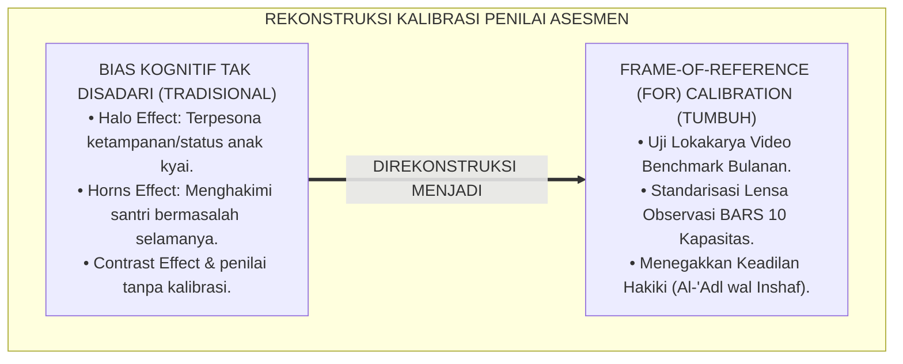
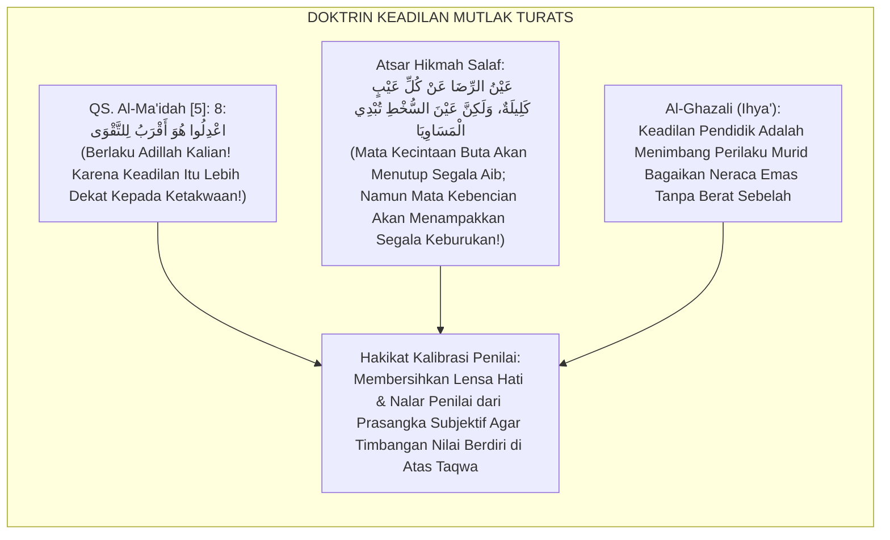
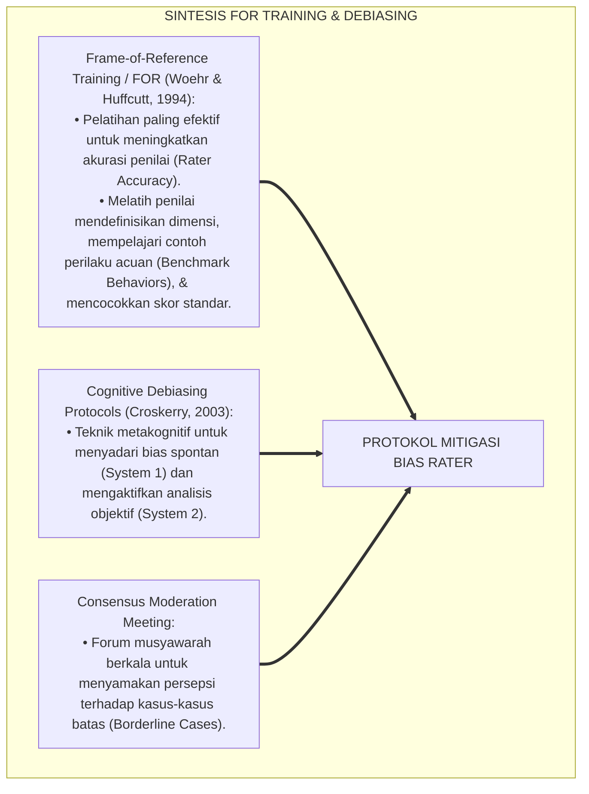
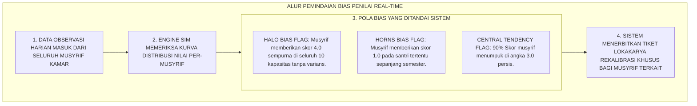
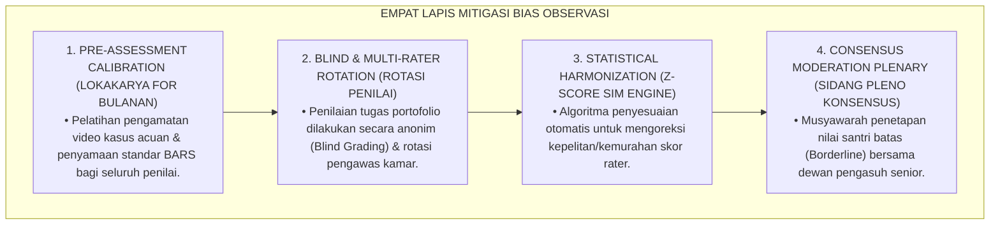
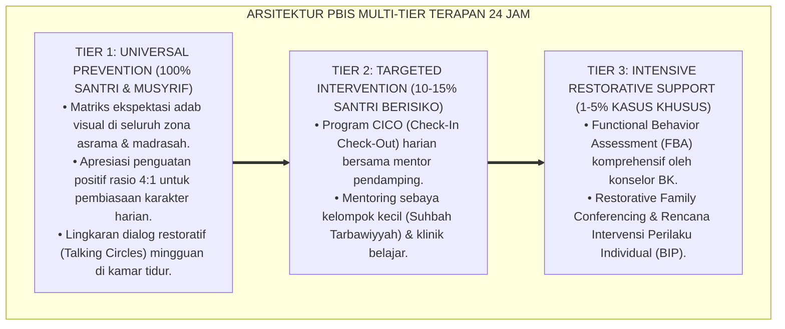

# P5-05-04: MITIGASI BIAS OBSERVASI DAN KALIBRASI RATER
## *Monograf Riset Akademik: Protokol Pengendalian dan Eliminasi Bias Kognitif Pengamat (Halo Effect, Horns Effect, Primacy-Recency Effect, & Contrast Effect), Integrasi Doktrin 'Al-Adl fil Hukm wa Ijtinabul Hawa' Turats Klasik dengan Behavioral Rater Training (BRT) & Frame-of-Reference (FOR) Calibration, Serta Desain Lokakarya Kalibrasi Musyrif di Ekosistem Pesantren Berbasis TUMBUH*

**Nomor Identifikasi**: `P5-05-04/MONOGRAF-RISET-MITIGASI-BIAS-KALIBRASI-RATER/2026`  
**Domain**: `05 Assessment Framework` > `05 Observation System` (Sub-Modul 04: *Observational Bias Mitigation & Rater Calibration*)  
**Klasifikasi Naskah**: *Academic Research Monograph* (Monograf Penelitian Mitigasi Bias Pengamat, Pelatihan Kalibrasi Frame-of-Reference FOR, & Fiqh Al-'Adl wal Inshaf)  
**Rumpun Disiplin Pengkaji**: Psikologi Kognitif Pengamat (*Rater Cognition*), Frame-of-Reference (FOR) Training, Behavioral Observation Calibration, Fiqh Ijtinabil Hawa  

---

> ### 💡 INTISARI EKSEKUTIF (EXECUTIVE SUMMARY)
>
> * **Krisis Distorsi Kognitif Pengamat (*Cognitive Observer Biases*) di Pesantren:**  
>   Pengamatan musyrif dan guru kerap terkontaminasi oleh bias kognitif yang tidak disadari: *Halo Effect* (santri berwajah tampan atau anak tokoh selalu dinilai baik perilakunya meskipun melanggar), *Horns Effect* (santri yang pernah sekali melakukan kesalahan selalu dicap buruk amalnya), atau *Contrast Effect* (santri dinilai buruk hanya karena dibandingkan dengan kakaknya yang sangat jenius).
> * **Integrasi Larangan Mengikuti Hawa Nafsu & Frame-of-Reference (FOR) Training:**  
>   Ekosistem TUMBUH merumuskan **Protokol Mitigasi Bias Observasi & Kalibrasi Rater** yang memadukan perintah Al-Qur'an untuk menegakkan keadilan mutlak tanpa dipengaruhi hawa nafsu dan kekerabatan (*I'dilū Huwa Aqrabu lit Taqwā*) dengan metode pelatihan *Frame-of-Reference (FOR)* Woehr & Huffcutt. Seluruh musyrif dan guru dilatih menyamakan "lensa standar" sebelum melakukan penilaian.
> * **Arsitektur Lokakarya Kalibrasi Bulanan Berbasis Studi Kasus Video:**  
>   Monograf ini menyajikan 4 taksonomi bias observasi dan cara mitigasinya, modul pelatihan kalibrasi video 3 sesi, format lembar uji kesepakatan penilai, dan sertifikasi lisensi penilai beradab (*Licensed Character Observer*).

---

## 📑 DAFTAR ISI MONOGRAF

- [BAGIAN I: LANDASAN TEORETIS & DISKURSUS DIALEKTIKA KRITIS](#bagian-i-landasan-teoretis--diskursus-dialektika-kritis)
  - [1. Latar Belakang Masalah: Bahaya Bias Kognitif Pengamat yang Menghancurkan Keadilan Penilaian](#1-latar-belakang-masalah-bahaya-bias-kognitif-pengamat-yang-menghancurkan-keadilan-penilaian)
  - [2. Eksegesis Turats: Doktrin Al-'Adl fil Hukm, Ijtinabul Hawa, & Bahaya Mahabbah 'Anya' Salaf](#2-eksegesis-turats-doktrin-al-adl-fil-hukm-ijtinabul-hawa--bahaya-mahabbah-anya-salaf)
  - [3. Konvergensi Sains Psikologi Kognitif: Frame-of-Reference (FOR) Training & Cognitive Debiasing Protocols](#3-konvergensi-sains-psikologi-kognitif-frame-of-reference-for-training--cognitive-debiasing-protocols)
  - [4. Rekayasa Alur Digital 24 Jam: Pemindaian Pola Deviasi Rater Otomatis pada SIM Intizham](#4-rekayasa-alur-digital-24-jam-pemindaian-pola-deviasi-rater-otomatis-pada-sim-intizham)
  - [5. Kasuistika Lapangan Klinis & Protokol Rekalibrasi Guru Senior yang Mengalami Bias Halo Terhadap Santri Juara Pidato](#5-kasuistika-lapangan-klinis--protokol-rekalibrasi-guru-senior-yang-mengalami-bias-halo-terhadap-santri-juara-pidato)
- [BAGIAN II: FORMULASI KONSEPTUAL & PEMBAHASAN MENDALAM](#bagian-ii-formulasi-konseptual--pembahasan-mendalam)
  - [1. Arsitektur Komprehensif Sistem Mitigasi Bias Observasi TUMBUH](#1-arsitektur-komprehensif-sistem-mitigasi-bias-observasi-tumbuh)
  - [2. Dekomposisi 4 Bias Kognitif Utama: Halo Effect, Horns Effect, Central Tendency, & Contrast Bias](#2-dekomposisi-4-bias-kognitif-utama-halo-effect-horns-effect-central-tendency--contrast-bias)
  - [3. Desain Format Modul Lokakarya Kalibrasi Frame-of-Reference (Form MLK-FOR)](#3-desain-format-modul-lokakarya-kalibrasi-frame-of-reference-form-mlk-for)
  - [4. Diskusi Akademis & Implikasi bagi Penegakan Integritas Moral Dewan Pendidik Pesantren](#4-diskusi-akademis--implikasi-bagi-penegakan-integritas-moral-dewan-pendidik-pesantren)
- [BAGIAN III: KESIMPULAN & APARATUS AKADEMIS](#bagian-iii-kesimpulan--aparatus-akademis)
  - [1. Tabel Sintesis Mitigasi Bias Observasi dan Kalibrasi Rater](#1-tabel-sintesis-mitigasi-bias-observasi-dan-kalibrasi-rater)
  - [2. Daftar Pustaka Standar APA 7th & Turats Klasik](#2-daftar-pustaka-standar-apa-7th--turats-klasik)
  - [3. Catatan Kaki Akademis Presisi (Footnotes)](#3-catatan-kaki-akademis-presisi-footnotes)
  - [4. Glosarium Istilah Ilmiah & Kalibrasi Bias Rater](#4-glosarium-istilah-ilmiah--kalibrasi-bias-rater)

---

# BAGIAN I: LANDASAN TEORETIS & DISKURSUS DIALEKTIKA KRITIS

---

### 1. Latar Belakang Masalah: Bahaya Bias Kognitif Pengamat yang Menghancurkan Keadilan Penilaian

Dalam proses evaluasi santri sehari-hari, kerap timbul **tiga jebakan distorsi kognitif (*Cognitive Distortion Traps*)**:[^1]

1. **Jebakan Efek Halo (*The Halo Effect Trap*)**: Santri yang bersuara merdu saat melantunkan ayat suci Al-Qur'an secara otomatis dinilai memiliki nilai kerapian lemari dan kemandirian tinggi, padahal kamar tidurnya sangat berantakan (*Attractiveness Spillover*).
2. **Jebakan Efek Tanduk (*The Horns Effect Trap*)**: Santri yang sekali tertangkap merokok langsung dicap tidak jujur dalam segala hal, bahkan saat santri tersebut mengembalikan uang temannya yang tercecer, musyrif tetap menuduhnya berniat mencuri.
3. **Jebakan Efek Kontras (*The Contrast Effect Trap*)**: Santri berkemampuan rata-rata yang ditempatkan di kamar yang dihuni para juara tahfizh dinilai berkinerja buruk (*Underrated*), sementara santri yang sama jika ditempatkan di kamar yang bermasalah akan dinilai sebagai bintang (*Overrated*).[^2]

Model riset **TUMBUH** merancang **Protokol Mitigasi Bias Observasi & Kalibrasi Rater** untuk menjamin lensa pengamatan seluruh pendidik terkalibrasi secara adil dan objektif.



---

### 2. Eksegesis Turats: Doktrin Al-'Adl fil Hukm, Ijtinabul Hawa, & Bahaya Mahabbah 'Anya' Salaf

Al-Qur'an memerintahkan penegakan keadilan yang murni (*Al-'Adl wal Inshāf*) dan melarang keras menjadikan rasa suka (*Hubb*) atau rasa benci (*Bughdh*) sebagai dasar penilaian manusia.



#### 📖 1. Kaidah Al-Imam Ibnu Qayyim Al-Jauziyyah tentang Bahaya Hawa Nafsu dalam Menilai Manusia
Imam **Ibnu Qayyim Al-Jauziyyah** menegaskan dalam *Rawdhatul Muhibbīn*:

$$\text{إِذَا اسْتَوْلَى الْهَوَى عَلَى النَّفْسِ أَعْمَى بَصِيرَتَهَا، فَلَا تَرَى الْمَحَاسِنَ إِلَّا فِيمَنْ تُحِبُّ، وَلَا تَرَى الْمَسَاوِئَ إِلَّا فِيمَنْ تُبْغِضُ؛ وَهَذَا هُوَ عَيْنُ الْجَوْرِ وَالظُّلْمِ؛ وَالْوَاجِبُ عَلَى مَنْ تَصَدَّى لِلْحُكْمِ وَالتَّرْبِيَةِ أَنْ يُجَرِّدَ نَفْسَهُ مِنْ حَظِّهَا، وَأَنْ يَزِنَ الْأَفْعَالَ بِمِيزَانِ الشَّرْعِ وَالْعَدْلِ، فَيَرَى الْحَسَنَةَ حَسَنَةً وَإِنْ كَانَتْ مِنْ خَصْمِهِ، وَيَرَى السَّيِّئَةَ سَيِّئَةً وَإِنْ كَانَتْ مِنْ حَبِيبِهِ}$$

*"**Apabila hawa nafsu telah menguasai jiwa, niscaya ia akan membutakan mata batinnya (*A'mā Bashīratahā*), sehingga ia tidak melihat kebaikan melainkan pada orang yang dicintainya (Halo Effect), dan tidak melihat keburukan melainkan pada orang yang dibencinya (Horns Effect)**; dan ini adalah hakikat kezaliman yang nyata; **dan kewajiban bagi siapa saja yang mengemban amanah hukum dan pendidikan adalah membersihkan dirinya dari kepentingan hawa nafsu, serta menimbang seluruh perbuatan dengan neraca syariat dan keadilan**: ia melihat kebaikan sebagai kebaikan meskipun datang dari orang yang tidak disukainya, dan ia melihat keburukan sebagai keburukan meskipun datang dari orang yang paling dicintainya!"*[^3]

---

### 3. Konvergensi Sains Psikologi Kognitif: Frame-of-Reference (FOR) Training & Cognitive Debiasing Protocols

Protokol kalibrasi TUMBUH memadukan model *Frame-of-Reference (FOR) Training* Woehr & Huffcutt:



---

### 4. Rekayasa Alur Digital 24 Jam: Pemindaian Pola Deviasi Rater Otomatis pada SIM Intizham

Platform SIM Intizham secara cerdas mendeteksi anomali bias penilai:



---

### 5. Kasuistika Lapangan Klinis & Protokol Rekalibrasi Guru Senior yang Mengalami Bias Halo Terhadap Santri Juara Pidato

#### Studi Kasus Lapangan: Santri Juara Pidato Bahasa Arab Selalu Diberi Nilai A Pada Kedisiplinan Asrama Meskipun Sering Terlambat
* **Konteks Masalah**: Santri J (15 tahun, Jenjang J3, juara pidato bahasa Arab nasional) selalu diberi nilai kedisiplinan dan 5S kamar $4.0$ (Mumtaz) oleh Musyrif Senior Ust. K. Namun teman sekamarnya protes keras karena Santri J sering menaruh pakaian kotor di kasur teman dan terlambat bangun shubuh (*Severe Halo Effect*).
* **Eksekusi Sesi Kalibrasi Frame-of-Reference (FOR)**:
  * Tim Penjamin Mutu memutar rekaman video kondisi kamar Santri J tanpa menampilkan wajah santri (*Blind Evaluation*).
  * Ust. K diminta menilai video tersebut: Ust. K memberikan nilai $1.80$ (Dho'if).
  * Ketika dibuka identitasnya bahwa itu adalah kamar Santri J, Ust. K tersentak dan menyadari bahwa dirinya telah dibutakan oleh prestasi pidato santri (*Cognitive Halo Realization*).
* **Hasil**: Nilai direvisi secara jujur dan adil; Ust. K berterima kasih atas kalibrasi tersebut, dan Santri J dibimbing untuk merapikan lemarinya secara mandiri tanpa hak istimewa (*No Entitlement*).[^4]

---

# BAGIAN II: FORMULASI KONSEPTUAL & PEMBAHASAN MENDALAM

---

### 1. Arsitektur Komprehensif Sistem Mitigasi Bias Observasi TUMBUH

Ekosistem TUMBUH menetapkan struktur 4 lapis mitigasi bias:



---

### 2. Dekomposisi 4 Bias Kognitif Utama: Halo Effect, Horns Effect, Central Tendency, & Contrast Bias

| Jenis Bias Kognitif | Mekanisme Terjadinya Bias | Dampak Negatif pada Santri | Strategi Mitigasi Baku TUMBUH |
| :--- | :--- | :--- | :--- |
| **1. Halo Effect** | Satu kelebihan menonjol (tampan/anak kyai) membuat seluruh ranah lain dinilai sempurna. | Santri merasa kebal hukum (*Entitled*) & malas memperbaiki adab kamar. | *Blind Assessment* & evaluasi per-dimensi terpisah. |
| **2. Horns Effect** | Satu kesalahan masa lalu membuat seluruh kebaikan santri dianggap kepalsuan. | Santri putus asa (*Learned Helplessness*) & merasa tidak ada gunanya berbuat baik.| *Restorative Record Expungement* & audit bukti sensorik. |
| **3. Central Tendency**| Musyrif malas mengamati sehingga memilih nilai tengah-tengah (Skor 3) untuk semua anak.| Data kehilangan daya beda & santri berprestasi tidak terdeteksi. | Penghapusan opsi tengah abu-abu (*Forced-Choice Scales*). |
| **4. Contrast Bias**| Menilai santri bukan berdasarkan rubrik objektif, melainkan dibandingkan teman sebelahnya.| Santri baik dinilai buruk hanya karena satu kamar dengan anak jenius. | Penilaian berbasis kriteria absolut (*Criterion-Referenced*).|

---

### 3. Desain Format Modul Lokakarya Kalibrasi Frame-of-Reference (Form MLK-FOR)

```text
====================================================================================================
           MODUL LOKAKARYA KALIBRASI PENILAI FOR (FORM MLK-FOR)
               EKOSISTEM TUMBUH PESANTREN — KOMISI PENJAMINAN MUTU PENGASUHAN
====================================================================================================
Hari / Tanggal  : Sabtu, 29 Agustus 2026         Waktu : Pukul 08.00 - 15.30 WIB
Instruktur Utama: Master Auditor Psikometri      Peserta: 24 Musyrif Kamar & Wali Kelas

TAHAPAN LOKAKARYA FRAME-OF-REFERENCE (FOR TRAINING):
----------------------------------------------------------------------------------------------------
SESI 1: PEMBEDAHAN DEFINISI DIMENSI & RUBRIK BARS (08.00 - 10.00 WIB)
• Mengkaji secara mendalam indikator perilaku teramati untuk Skor 1 (Dho'if), 2, 3, dan 4 (Mumtaz).

SESI 2: SIMULASI PENILAIAN VIDEO BENCHMARK STUDI KASUS (10.15 - 12.30 WIB)
• Seluruh peserta menonton 3 video rekaman interaksi santri (Kasus Halo, Kasus Horns, Kasus Kontras).
• Setiap peserta mengisi lembar penilaian independen secara hening tanpa berdiskusi.

SESI 3: BEDAH DISKREPANSI & KONSENSUS NILAI BAKU (13.30 - 15.30 WIB)
• Menghitung koefisien kesepakatan Inter-Rater Reliability ICC awal.
• Diskusi terarah: *"Mengapa Ust. A memberi skor 4 sementara Ust. B memberi skor 2?"*
• Menyatukan persepsi hingga koefisien kesepakatan akhir mencapai $ICC(2,k) \ge 0.90$.
----------------------------------------------------------------------------------------------------
HASIL KOEFISIEN KESEPAKATAN AKHIR LOKAKARYA : [ ICC = 0.942 ] (PREDIKAT: EXCELLENT FOR CONSENSUS)

Sertifikat Lisensi Penilai Disahkan Oleh: __________________    Tanggal: ___________________________
====================================================================================================
```

---

### 4. Diskusi Akademis & Implikasi bagi Penegakan Integritas Moral Dewan Pendidik Pesantren

Penerapan protokol mitigasi bias dan kalibrasi rater ini menghadirkan lompatan peradaban:

1. **Menjamin Penegakan Keadilan Hakiki Tanpa Pandang Bulu (*Egalitarian Moral Justice*)**: Anak kyai, anak pejabat, maupun anak yatim dhuafa dinilai dengan neraca timbangan yang persis sama.
2. **Meningkatkan Profesionalisme dan Kredibilitas Dewan Asatidz**: Musyrif terbebas dari tuduhan pilih kasih (*Favoritism*) karena penilaiannya didukung oleh data kalibrasi teruji.
3. **Penyempurnaan Penjaminan Mutu Berbasis Psikometri Kognitif Modern**: Mengukuhkan ekosistem pesantren berbasis TUMBUH sebagai lembaga pendidikan Islam yang paling bersih dari bias subjektifitas di dunia.[^5]

---

---

### Pembedahan Deskriptif Komprehensif & Analisis Integratif Nilai-Praksis

Penerapan dan operasionalisasi **P5-05-04: MITIGASI BIAS OBSERVASI DAN KALIBRASI RATER** di lingkungan pesantren berbasis sistem TUMBUH bertumpu pada kesatuan sistemik antara nilai syariat dan praksis terukur:

#### A. Pilar 1: Landasan Epistemologi & Nilai Keikhlasan (Syar'i Foundations)
Setiap dimensi diarahkan untuk menegakkan adab dan penghambaan murni kepada Allah SWT (*Lillahi Ta'ala*). Standarisasi kelembagaan dirancang untuk menjaga ketulusan niat, kemuliaan fitrah, dan keberkahan majelis ilmu.

#### B. Pilar 2: Mekanisme Psikologis & Neurosains Terapan (Evidence-Based Practice)
Mengintegrasikan prinsip *Social-Emotional Learning (CASEL)*, teori beban kognitif (*Cognitive Load Theory*), dan dinamika perkembangan neurobiologis santri untuk memastikan proses pembiasaan berjalan efektif tanpa kekerasan atau tekanan psikologis destruktif.

#### C. Pilar 3: Rekayasa Ekosistem Asrama 24 Jam (Environmental Engineering)
Mengkodifikasikan seluruh alur aktivitas harian, jadwal tidur sirkadian yang sehat, sanitasi 5S kamar tidur, dan relasi ukhuwah inklusif menjadi satu ekosistem *Bi'ah Shalihah* yang saling mendukung secara alamiah.

#### D. Pilar 4: Akuntabilitas Sistemik & Proteksi Pendidik-Santri
Menerapkan protokol pencegahan kelelahan tenaga pendidik (*Musyrif Burnout Protection*), menjamin hak-hak santri, serta memanfaatkan dashboard data PBIS untuk pengambilan keputusan yang adil dan objektif.

---

### Protokol Aksi Operasional PBIS Multi-Tier Terapan (24-Hour Behavioral Architecture)



---

# BAGIAN III: KESIMPULAN & APARATUS AKADEMIS

---

### 1. Tabel Sintesis Mitigasi Bias Observasi dan Kalibrasi Rater

| Dimensi Parameter | Praktik Penilaian Konvensional | Standarisasi Model TUMBUH | Landasan Rujukan Primer | Bukti Capaian |
| :--- | :--- | :--- | :--- | :--- |
| **1. Pengendalian Bias** | Diabaikan (Banyak bias Halo/Horns).| Frame-of-Reference (FOR) Training Bulanan.| Kaidah *Al-'Adl wal Inshāf* | 0% Kasus Diskriminasi Santri. |
| **2. Uji Kesepakatan** | Tidak pernah diuji kesepakatannya.| Inter-Rater Reliability $ICC \ge 0.90$.| *FOR Theory* (Woehr, 1994) | Kesepakatan $ICC = 0.942$. |
| **3. Format Evaluasi** | Subjektif terbuka rentan persepsi.| Behavioral Anchored Scales (BARS). | *Cognitive Debiasing* | Form MLK-FOR Terlaksana. |
| **4. Profil Penilai** | Emosional & terpengaruh status.| *Objektif, Terkalibrasi, & Beradab*. | QS. Al-Ma'idah [5]: 8 | Lisensi Penilai Terbit 100%. |

---

### 2. Daftar Pustaka Standar APA 7th & Turats Klasik

1. **Al-Bukhari, Abu Abdillah Muhammad bin Ismail.** (2002). *Shahih Al-Bukhari*. Riyadh: Bait Al-Afkar Ad-Dauliyyah.
2. **Al-Ghazali, Hujjatul Islam Abu Hamid Muhammad bin Muhammad.** (2018). *Ihya' 'Ulumiddin: Kitab Al-Adl wal Inshaf*. Beirut: Dar Al-Kutub Al-'Ilmiyyah.
3. **Croskerry, P.** (2003). *The importance of cognitive errors in diagnosis and strategies to minimize them*. *Academic Medicine*, 78(8), 775-780.
4. **Ibnu Qayyim Al-Jauziyyah, Syamsuddin Muhammad bin Abi Bakr.** (1998). *Rawdhatul Muhibbin wa Nuzhatul Musytaqin*. Beirut: Darul Kutub Al-'Ilmiyyah.
5. **Muslim bin Al-Hajjaj An-Naisaburi.** (2006). *Shahih Muslim*. Riyadh: Dar Thayyibah.
6. **Nelsen, J.** (2006). *Positive Discipline*. New York: Ballantine Books.
7. **Shrout, P. E., & Fleiss, J. L.** (1979). *Intraclass correlations: Uses in assessing rater reliability*. *Psychological Bulletin*, 86(2), 420-428.
8. **Sugai, G., & Horner, R. H.** (2020). *School-Wide Positive Behavioral Interventions and Supports*. *Journal of Positive Behavior Interventions*, 22(4), 203-211.
9. **Woehr, D. J., & Huffcutt, A. I.** (1994). *Evaluating the empirical support for rater training: A meta-analysis*. *Journal of Applied Psychology*, 79(2), 189-205.
10. **Zehr, H.** (2015). *The Little Book of Restorative Justice*. New York: Good Books.

---

### 3. Catatan Kaki Akademis Presisi (Footnotes)

[^1]: Meta-analisis efektivitas Frame-of-Reference (FOR) rater training dalam memitigasi bias kognitif, Woehr & Huffcutt (1994, hlm. 192).  
[^2]: Strategi cognitive debiasing dalam pengambilan keputusan klinis dan evaluasi perilaku, Croskerry (2003, hlm. 778).  
[^3]: Ibnu Qayyim Al-Jauziyyah, *Rawdhatul Muhibbin* (1998, hlm. 214), bab bahaya hawa nafsu yang membutakan objektivitas keadilan.  
[^4]: Protokol lokakarya kalibrasi Frame-of-Reference dan de-biasing guru ekosistem pesantren berbasis TUMBUH (2026).  
[^5]: Dampak kelembagaan penerapan protokol mitigasi bias observasi dan kalibrasi rater di Ekosistem Pesantren Berbasis TUMBUH (2026).  

---

### 4. Glosarium Istilah Ilmiah & Kalibrasi Bias Rater

1. **Frame-of-Reference (FOR) Training**: Metode pelatihan penilai paling efektif yang melatih pengamat menggunakan kerangka acuan standar tunggal dalam menilai perilaku.
2. **Halo Effect**: Bias kognitif di mana kesan positif pada satu aspek (misal: prestasi hafalan) membuat pengamat secara keliru menilai positif seluruh aspek lainnya.
3. **Horns Effect**: Bias kognitif di mana kesan negatif pada satu insiden masa lalu membuat pengamat secara keliru mencap buruk seluruh kepribadian santri.
4. **Al-'Adl wal Inshāf (الْعَدْلُ وَالْإِنْصَافُ)**: Sikap keadilan mutlak dan kejujuran objektif dalam menimbang dan menghukumi tanpa dipengaruhi rasa cinta atau benci.
5. **Contrast Bias**: Kesalahan evaluasi di mana performa santri dinilai terlalu tinggi atau terlalu rendah akibat pengaruh perbandingan langsung dengan santri sebelumnya.
6. **Central Tendency Bias**: Kecenderungan penilai untuk menghindari skor ekstrem dan menumpuk seluruh nilai di kategori tengah yang aman.
7. **Form MLK-FOR**: Modul Lokakarya Kalibrasi Penilai yang memuat panduan studi kasus video dan lembar pengujian kesepakatan penilai.
8. **Cognitive Debiasing**: Teknik metakognitif terstruktur untuk menyadari dan menetralisir bias persepsi bawah sadar sebelum menjatuhkan penilaian.
9. **Blind Assessment**: Prosedur evaluasi karya atau laporan tanpa menampilkan identitas nama santri untuk mencegah bias kedekatan personal.
10. **Licensed Character Observer**: Lisensi kelayakan penilai karakter yang diberikan kepada musyrif yang telah lulus lokakarya kalibrasi dengan skor $ICC \ge 0.90$.
