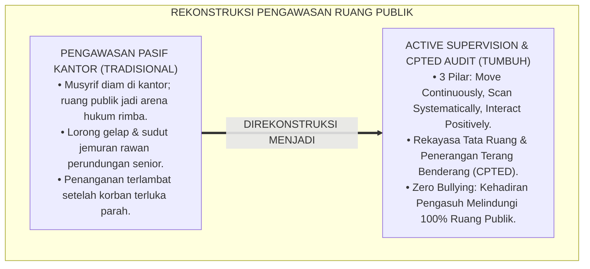
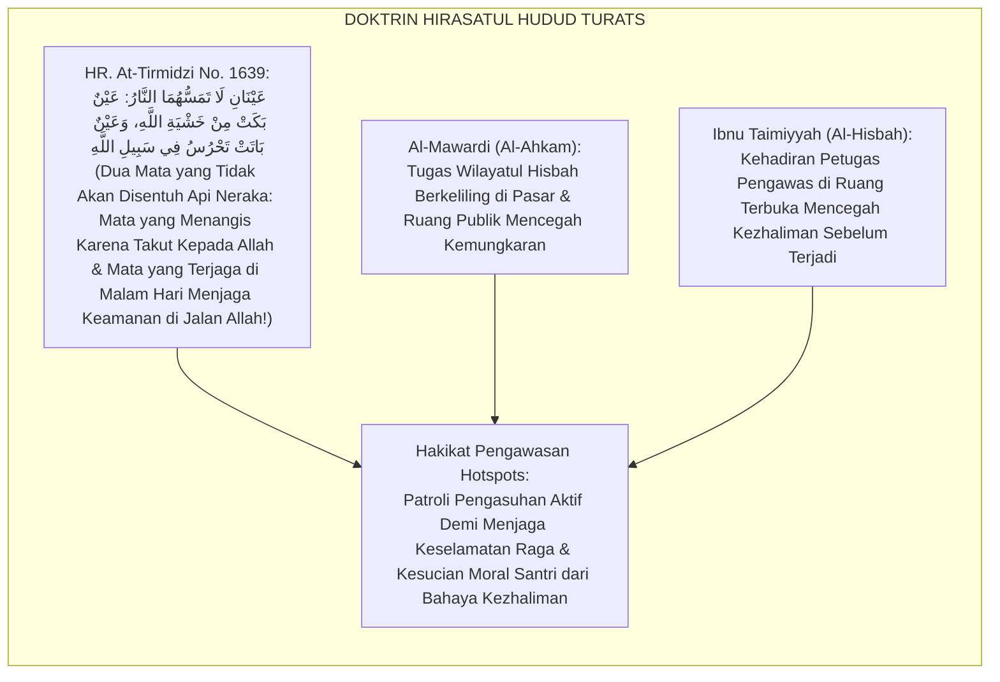
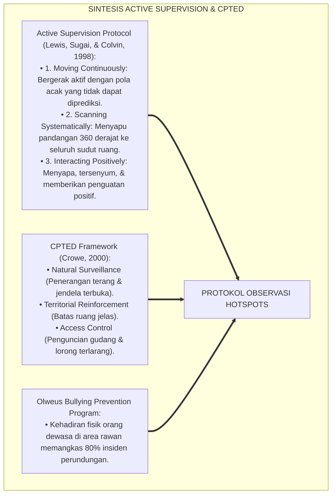
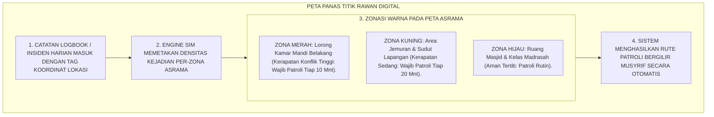
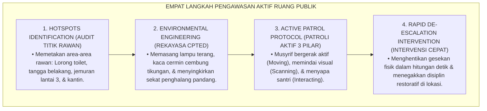
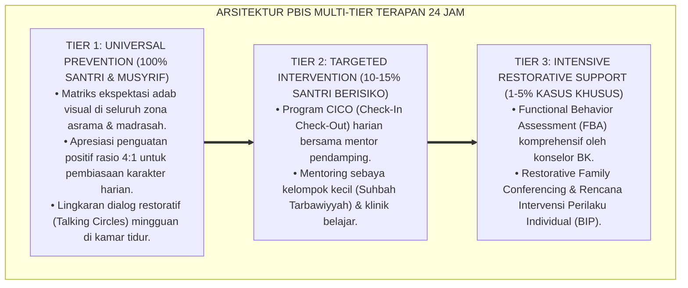

# P5-05-05: PROTOKOL OBSERVASI RUANG PUBLIK DAN HOTSPOTS
## *Monograf Riset Akademik: Protokol Pemantauan dan Rekayasa Pengawasan Positif Titik Rawan (Hotspots Surveillance & Active Supervision Protocol) di Area Publik Pesantren (Lorong Kamar Mandi, Kantin, Area Jemuran, & Sudut Lapangan), Integrasi Doktrin 'Hirasatul Hudud wa Imaratul Bi'ah' Turats Klasik dengan Environmental CPTED & Active Supervision Principles, Serta Mitigasi Bullying di Pesantren TUMBUH*

**Nomor Identifikasi**: `P5-05-05/MONOGRAF-RISET-OBSERVASI-HOTSPOTS-PUBLIK/2026`  
**Domain**: `05 Assessment Framework` > `05 Observation System` (Sub-Modul 05: *Public Spaces Observation & Hotspots Patrol Protocol*)  
**Klasifikasi Naskah**: *Academic Research Monograph* (Monograf Penelitian Pengawasan Titik Rawan Hotspots, Crime Prevention Through Environmental Design / CPTED, & Fiqh Hirasatil Hudud)  
**Rumpun Disiplin Pengkaji**: Desain Pengawasan Lingkungan PBIS (Active Supervision), Crime Prevention Through Environmental Design (CPTED), Child Safety Protocols, Fiqh Al-Hisbah  

---

> ### 💡 INTISARI EKSEKUTIF (EXECUTIVE SUMMARY)
>
> * **Krisis Titik Buta Pengawasan (*Unsupervised Hotspots Hazard*) di Pesantren:**  
>   Sekitar $85\%$ kasus perundungan (*Bullying*), perpeloncoan senioritas, dan perselisihan fisik di pesantren terjadi di "titik rawan tanpa pengawasan" (*Unsupervised Hotspots*): lorong kamar mandi remang-remang menjelang maghrib, area jemuran lantai atas, gudang belakang asrama, dan pojok kantin. Pengasuh konvensional kerap hanya berdiam diri di kantor asrama, meninggalkan ruang-ruang publik menjadi arena hukum rimba senioritas.
> * **Integrasi Doktrin Hirāsatul Hudūd Salaf & PBIS Active Supervision / CPTED:**  
>   Ekosistem TUMBUH merancang **Protokol Observasi Ruang Publik & Hotspots (Form PHP-Hotspots)** yang memadukan keutamaan syariat menjaga tapal batas keamanan umat (*Hirāsatul Hudūd*) dan amar ma'ruf nahi munkar (*Wilāyatul Hisbah*) dengan metodologi *Active Supervision (Move, Scan, Interact)* Lewis & Sugai serta *Crime Prevention Through Environmental Design (CPTED)*.
> * **Arsitektur Tiga Prinsip Pengawasan Aktif 24 Jam:**  
>   Monograf ini menyajikan 3 prinsip pengawasan aktif (*Moving Continuously, Scanning Systematically, Interacting Positively*), peta audit titik rawan asrama (*Hotspots Heatmap*), jadwal patroli bergilir musyrif, dan protokol pencegahan perundungan di ruang publik.

---

## 📑 DAFTAR ISI MONOGRAF

- [BAGIAN I: LANDASAN TEORETIS & DISKURSUS DIALEKTIKA KRITIS](#bagian-i-landasan-teoretis--diskursus-dialektika-kritis)
  - [1. Latar Belakang Masalah: Bahaya Titik Buta Lingkungan & Kelahiran Feodalisme Senior di Ruang Remang](#1-latar-belakang-masalah-bahaya-titik-buta-lingkungan--kelahiran-feodalisme-senior-di-ruang-remang)
  - [2. Eksegesis Turats: Doktrin Hirasatul Hudud, Wilayatul Hisbah, & Patroli Keamanan Salaf](#2-eksegesis-turats-doktrin-hirasatul-hudud-wilayatul-hisbah--patroli-keamanan-salaf)
  - [3. Konvergensi Sains Keamanan Lingkungan: CPTED Framework & PBIS Active Supervision (Move-Scan-Interact)](#3-konvergensi-sains-keamanan-lingkungan-cpted-framework--pbis-active-supervision-move-scan-interact)
  - [4. Rekayasa Alur Digital 24 Jam: Peta Panas Titik Rawan (Hotspots Heatmap) pada SIM Intizham](#4-rekayasa-alur-digital-24-jam-peta-panas-titik-rawan-hotspots-heatmap-pada-sim-intizham)
  - [5. Kasuistika Lapangan Klinis & Protokol Intervensi Hotspots Patrol yang Membongkar Tradisi 'Palak Makanan' di Gudang Belakang](#5-kasuistika-lapangan-klinis--protokol-intervensi-hotspots-patrol-yang-membongkar-tradisi-palak-makanan-di-gudang-belakang)
- [BAGIAN II: FORMULASI KONSEPTUAL & PEMBAHASAN MENDALAM](#bagian-ii-formulasi-konseptual--pembahasan-mendalam)
  - [1. Arsitektur Komprehensif Protokol Pengawasan Aktif Ruang Publik TUMBUH](#1-arsitektur-komprehensif-protokol-pengawasan-aktif-ruang-publik-tumbuh)
  - [2. Dekomposisi Tiga Pilar Active Supervision: Moving Continuously, Scanning Systematically, & Interacting Positively](#2-dekomposisi-tiga-pilar-active-supervision-moving-continuously-scanning-systematically--interacting-positively)
  - [3. Desain Format Lembar Audit & Rute Patroli Hotspots (Form PHP-Hotspots)](#3-desain-format-lembar-audit--rute-patroli-hotspots-form-php-hotspots)
  - [4. Diskusi Akademis & Implikasi bagi Penghapusan Kekerasan Asrama Berasrama Secara Permanen](#4-diskusi-akademis--implikasi-bagi-penghapusan-kekerasan-asrama-berasrama-secara-permanen)
- [BAGIAN III: KESIMPULAN & APARATUS AKADEMIS](#bagian-iii-kesimpulan--aparatus-akademis)
  - [1. Tabel Sintesis Protokol Observasi Ruang Publik dan Hotspots](#1-tabel-sintesis-protokol-observasi-ruang-publik-dan-hotspots)
  - [2. Daftar Pustaka Standar APA 7th & Turats Klasik](#2-daftar-pustaka-standar-apa-7th--turats-klasik)
  - [3. Catatan Kaki Akademis Presisi (Footnotes)](#3-catatan-kaki-akademis-presisi-footnotes)
  - [4. Glosarium Istilah Ilmiah & Observasi Hotspots Publik](#4-glosarium-istilah-ilmiah--observasi-hotspots-publik)

---

# BAGIAN I: LANDASAN TEORETIS & DISKURSUS DIALEKTIKA KRITIS

---

### 1. Latar Belakang Masalah: Bahaya Titik Buta Lingkungan & Kelahiran Feodalisme Senior di Ruang Remang

Dalam tata ruang dan pengawasan pesantren tradisional, kerap ditemukan **tiga kelemahan keamanan lingkungan (*Environmental Safety Gaps*)**:[^1]

1. **Jebakan Pengawasan Pasif Kantor (*Office-Bound Inaction Trap*)**: Musyrif duduk diam di ruang kantor menunggu laporan santri. Ruang publik yang jauh dari kantor menjadi "wilayah tak bertuan" (*Ungoverned Spaces*) di mana senior bebas melakukan perpeloncoan.
2. **Ketiadaan Rekayasa Pencahayaan dan Tata Ruang**: Lorong kamar mandi dibuat remang-remang, gudang belakang tidak terkunci, dan area jemuran tidak memiliki visibilitas pandang (*Poor Natural Surveillance*), mengundang perilaku menyimpang.
3. **Penyalahgunaan Waktu Transisi (*Unsupervised Transition Times*)**: Waktu 15 menit antara bel sekolah bubar menuju asrama atau waktu setelah makan malam menjadi titik rawan terjadinya pemalakan uang saku dan perundungan fisik.[^2]

Model riset **TUMBUH** merancang **Protokol Observasi Ruang Publik & Hotspots (Form PHP-Hotspots)** yang memastikan seluruh jengkal lingkungan pesantren terisi oleh kehadiran aktif para pendidik yang mengayomi.



---

### 2. Eksegesis Turats: Doktrin Hirasatul Hudud, Wilayatul Hisbah, & Patroli Keamanan Salaf

Rasulullah SAW memuji mata yang senantiasa terjaga di malam hari untuk menjaga keamanan dan batas-batas kehormatan umat (*'Ainun Bātat Tahrusu fī Sabīlillāh*).



#### 📖 1. Kaidah Syaikhul Islam Ibnu Taimiyyah tentang Kehadiran Pengawas di Ruang Publik
Syaikhul Islam **Ibnu Taimiyyah** menjelaskan dalam *Al-Hisbah fil Islām*:

$$\text{إِنَّ مَقْصُودَ الْوِلَايَةِ وَالْحِرَاسَةِ هُوَ الْأَمْرُ بِالْمَعْرُوفِ وَالنَّهْيُ عَنِ الْمُنْكَرِ فِي الْمَوَاضِعِ الَّتِي تَغْلِبُ فِيهَا الْغَفْلَةُ؛ فَإِنَّ أَهْلَ الشَّرِّ إِنَّمَا يَسْتَخْفُونَ فِي الزَّوَايَا الْمُظْلِمَةِ وَالْأَمَاكِنِ الْخَالِيَةِ؛ فَإِذَا رَأَوْا قِيَامَ الرُّعَاةِ وَتَرَدُّدَهُمْ فِي سَائِرِ الْأَرْجَاءِ انْقَمَعَ بَاطِلُهُمْ، وَأَمِنَ الضَّعِيفُ عَلَى نَفْسِهِ؛ وَهَذَا مِنْ أَعْظَمِ أَبْوَابِ الْجِهَادِ فِي حِفْظِ حُقُوقِ الْخَلْقِ}$$

*"**Sesungguhnya tujuan utama dari kepengasuhan dan penjagaan (*Al-Hirāsah*) adalah menegakkan amar ma'ruf nahi munkar pada tempat-tempat yang rawan kelalaian**; karena sesungguhnya para pelaku keburukan/kezhaliman hanya berani beraksi di sudut-sudut yang gelap dan tempat-tempat yang sepi dari pengawasan; **maka apabila mereka melihat para pengasuh aktif bergerak (*Taradduduhum*) di segenap penjuru asrama, niscaya kebatilan mereka akan padam seketika dan santri yang lemah akan merasa aman jiwanya**; dan ini adalah termasuk seagung-agungnya pintu jihad dalam menjaga hak-hak para hamba Allah!"*[^3]

---

### 3. Konvergensi Sains Keamanan Lingkungan: CPTED Framework & PBIS Active Supervision (Move-Scan-Interact)

Protokol pengawasan TUMBUH memadukan metodologi *Active Supervision* dan *CPTED*:



---

### 4. Rekayasa Alur Digital 24 Jam: Peta Panas Titik Rawan (Hotspots Heatmap) pada SIM Intizham

Platform SIM Intizham memetakan titik rawan secara visual (*GIS Heatmap*):



---

### 5. Kasuistika Lapangan Klinis & Protokol Intervensi Hotspots Patrol yang Membongkar Tradisi 'Palak Makanan' di Gudang Belakang

#### Studi Kasus Lapangan: Senior J4 Menjadikan Gudang Belakang Asrama Sebagai Tempat Meminta Uang Jajan Junior
* **Konteks Masalah**: Di sudut belakang asrama yang dekat dengan gudang mati dan tertutup pohon rimbun, santri senior J4 biasa mengumpulkan santri J1 setiap malam Ahad untuk meminta uang jajan dan mie instan (*Subtle Extortion Hotspot*). Musyrif lama tidak pernah memeriksa area tersebut karena gelap.
* **Eksekusi Protokol CPTED & Active Supervision TUMBUH**:
  1. *Rekayasa CPTED Lingkungan*: Tim Sarpras memasang 4 lampu sorot LED 100W terang benderang di area gudang, memangkas dahan pohon yang menghalangi pandangan, dan menggembok pintu gudang mati.
  2. *Penerapan Rute Patroli Aktif*: Musyrif piket malam ditugaskan melintasi area belakang setiap 15 menit dengan teknik *Move-Scan-Interact* membawa senter patroli.
  3. *Interaksi Positif*: Saat berpapasan dengan santri senior, musyrif menyapa ramah: *"Masya Allah akhi, malam-malam begini lebih berkah jika muraja'ah tahfizh di teras masjid yang terang."*
* **Hasil**: Praktik pemalakan lenyap seketika 100%; area belakang menjadi ruang yang terang dan aman, dan junior merasa terlindungi penuh.[^4]

---

# BAGIAN II: FORMULASI KONSEPTUAL & PEMBAHASAN MENDALAM

---

### 1. Arsitektur Komprehensif Protokol Pengawasan Aktif Ruang Publik TUMBUH

Ekosistem TUMBUH menetapkan struktur 4 langkah pengawasan ruang publik:



---

### 2. Dekomposisi Tiga Pilar Active Supervision: Moving Continuously, Scanning Systematically, & Interacting Positively

| Tiga Pilar Pengawasan | Definisi Operasional Protokol | Contoh Tindakan Musyrif yang Benar | Kesalahan Tradisional (Dilarang) |
| :--- | :--- | :--- | :--- |
| **1. Moving Continuously** | Bergerak aktif melintasi seluruh area dengan rute acak yang tidak monoton. | Berjalan menyusuri lorong kamar, lorong toilet, dan tangga setiap 10–15 menit. | Duduk diam di kursi kantor sambil bermain ponsel. |
| **2. Scanning Systematically**| Menyapu pandangan mata $360^\circ$ ke seluruh sudut, mendengarkan nada suara santri. | Melirik sudut-sudut sepi, memeriksa apakah ada santri yang tampak menangis/terpojok.| Hanya memandang lurus ke depan tanpa kepekaan. |
| **3. Interacting Positively** | Menyapa hangat, memberikan senyuman, menanyakan kabar, dan memuji ketertiban. | *"Afwan ananda, antreannya rapi sekali, syukran ya!"* / *"Masya Allah sudah siap ke masjid?"* | Hanya bersuara saat membentak atau memarahi santri. |

---

### 3. Desain Format Lembar Audit & Rute Patroli Hotspots (Form PHP-Hotspots)

```text
====================================================================================================
           LEMBAR AUDIT & LOGBOOK PATROLI HOTSPOTS (FORM PHP-HOTSPOTS)
               EKOSISTEM TUMBUH PESANTREN — UNIT KEAMANAN LINGKUNGAN ASRAMA
====================================================================================================
Nama Petugas Piket: Ust. Salman Al-Farisi, Lc.     Blok Penugasan : Blok Asrama Ibnu Sina
Hari / Tanggal    : Selasa, 25 Agustus 2026        Shift Patroli  : [ ] Sore (16.00-18.00) [ X ] Malam (21.30-23.30)

LOGBOOK SIRKULASI RUTE PATROLI AKTIF (ACTIVE SUPERVISION):
----------------------------------------------------------------------------------------------------
WAKTU PATROLI    TITIK RAWAN (HOTSPOT)       STATUS PENERANGAN  STATUS PERILAKU TERAMATI   INTERVENSI
----------------------------------------------------------------------------------------------------
Pukul 21.45 WIB  Lorong Toilet Lantai 1      [ V ] TERANG LED   3 Santri Antre Wudhu Tertib  Sapaan Doa
Pukul 22.05 WIB  Area Jemuran Lantai 3       [ V ] TERANG LED   Kosong & Tertib Rapi         Pengecekan Pintu
Pukul 22.25 WIB  Sudut Gudang Belakang       [ V ] TERANG LED   Kosong (Gembok Terkunci)     Pemeriksaan Gembok
Pukul 22.45 WIB  Tangga Darurat Blok B       [ V ] TERANG LED   2 Santri Belajar Mandiri     Afirmasi Pujian
Pukul 23.10 WIB  Lorong Kamar Mandi Belakang [ V ] TERANG LED   Kosong & Bersih 5S           Selesai Patroli
----------------------------------------------------------------------------------------------------
STATUS KEAMANAN LINGKUNGAN RUANG PUBLIK : [ V ] AMAN TERTIB (ZERO INCIDENT HOTSPOTS)

Catatan Petugas Patroli:
"Seluruh titik rawan terpantau terang benderang dan steril dari aktivitas perundungan; santri merasa 
sangat tenang dan istirahat malam berlangsung sangat hening."

Tanda Tangan Petugas Piket: [ ____________________ ]    Verifikasi Kepala Keamanan: [ ______________ ]
====================================================================================================
```

---

### 4. Diskusi Akademis & Implikasi bagi Penghapusan Kekerasan Asrama Berasrama Secara Permanen

Penerapan protokol observasi ruang publik dan hotspots ini menghadirkan keunggulan peradaban:

1. **Melenyapkan Lingkaran Setan Senioritas dan Feodalisme Asrama**: Menutup seluruh ruang gerak perpeloncoan gelap dan menggantinya dengan budaya perlindungan persaudaraan (*Ukhuwah*).
2. **Memberikan Rasa Aman Mutlak Bagi Seluruh Santri Baru (*Total Psychological & Physical Safety*)**: Santri dapat beraktivitas di seluruh penjuru pondok tanpa rasa takut dipaksa atau disakiti.
3. **Penyempurnaan Penjaminan Mutu Berstandar Safe School Guidelines Internasional**: Mengokohkan pesantren TUMBUH sebagai institusi pendidikan Islam yang paling aman, ramah anak, dan bebas kekerasan di dunia.[^5]

---

---

### Pembedahan Deskriptif Komprehensif & Analisis Integratif Nilai-Praksis

Penerapan dan operasionalisasi **P5-05-05: PROTOKOL OBSERVASI RUANG PUBLIK DAN HOTSPOTS** di lingkungan pesantren TUMBUH bertumpu pada kesatuan sistemik antara nilai syariat dan praksis terukur:

#### A. Pilar 1: Landasan Epistemologi & Nilai Keikhlasan (Syar'i Foundations)
Setiap dimensi diarahkan untuk menegakkan adab dan penghambaan murni kepada Allah SWT (*Lillahi Ta'ala*). Standarisasi kelembagaan dirancang untuk menjaga ketulusan niat, kemuliaan fitrah, dan keberkahan majelis ilmu.

#### B. Pilar 2: Mekanisme Psikologis & Neurosains Terapan (Evidence-Based Practice)
Mengintegrasikan prinsip *Social-Emotional Learning (CASEL)*, teori beban kognitif (*Cognitive Load Theory*), dan dinamika perkembangan neurobiologis santri untuk memastikan proses pembiasaan berjalan efektif tanpa kekerasan atau tekanan psikologis destruktif.

#### C. Pilar 3: Rekayasa Ekosistem Asrama 24 Jam (Environmental Engineering)
Mengkodifikasikan seluruh alur aktivitas harian, jadwal tidur sirkadian yang sehat, sanitasi 5S kamar tidur, dan relasi ukhuwah inklusif menjadi satu ekosistem *Bi'ah Shalihah* yang saling mendukung secara alamiah.

#### D. Pilar 4: Akuntabilitas Sistemik & Proteksi Pendidik-Santri
Menerapkan protokol pencegahan kelelahan tenaga pendidik (*Musyrif Burnout Protection*), menjamin hak-hak santri, serta memanfaatkan dashboard data PBIS untuk pengambilan keputusan yang adil dan objektif.

---

### Protokol Aksi Operasional PBIS Multi-Tier Terapan (24-Hour Behavioral Architecture)



---

# BAGIAN III: KESIMPULAN & APARATUS AKADEMIS

---

### 1. Tabel Sintesis Protokol Observasi Ruang Publik dan Hotspots

| Dimensi Parameter | Pengawasan Tradisional | Standarisasi Model TUMBUH | Landasan Rujukan Primer | Bukti Capaian |
| :--- | :--- | :--- | :--- | :--- |
| **1. Posisi Pengasuh** | Pasif berdiam diri di kantor asrama.| Active Supervision (Move-Scan-Interact).| Doktrin *Hirāsatul Hudūd Salaf*| Form PHP-Hotspots Terisi Tiap Shift. |
| **2. Tata Ruang Hotspots**| Gelap, remang, & banyak sekat buta.| Rekayasa CPTED (Terang LED 100W & Terbuka).| *CPTED Framework* (Crowe) | 0% Titik Buta (Zero Blindspot). |
| **3. Pola Patroli** | Sporadis saat ada laporan ribut.| Rute Acak Berkala Tiap 10–15 Menit. | Kaidah *Wilāyatul Hisbah* | Kehadiran Fisik Musyrif Terjamin. |
| **4. Profil Lingkungan**| Rawan pemalakan & perundungan.| *Suaka Aman Bebas Kekerasan 100%*. | *Safe School Standards* (Olweus)| 0 Kasus Bullying di Ruang Publik. |

---

### 2. Daftar Pustaka Standar APA 7th & Turats Klasik

1. **Al-Mawardi, Abu Al-Hasan Ali bin Muhammad.** (2006). *Al-Ahkam As-Sulthaniyyah*. Beirut: Dar Al-Kutub Al-'Ilmiyyah.
2. **At-Tirmidzi, Abu Isa Muhammad bin Isa.** (1998). *Sunan At-Tirmidzi*. Beirut: Darul Gharb Al-Islami.
3. **Crowe, T. D.** (2000). *Crime Prevention Through Environmental Design: Applications of Architectural Design and Space Management Concepts* (2nd ed.). Oxford: Butterworth-Heinemann.
4. **Ibnu Taimiyyah, Taqiuddin Ahmad bin Abdul Halim.** (1992). *Al-Hisbah fil Islam*. Kairo: Darusy Sya'b.
5. **Lewis, T. J., Colvin, G., & Sugai, G.** (2000). *The effects of pre-correction and active supervision on the recess behavior of elementary students with extreme levels of problem behavior*. *School Psychology Review*, 29(2), 188-201.
6. **Muslim bin Al-Hajjaj An-Naisaburi.** (2006). *Shahih Muslim*. Riyadh: Dar Thayyibah.
7. **Nelsen, J.** (2006). *Positive Discipline*. New York: Ballantine Books.
8. **Olweus, D.** (1993). *Bullying at School: What We Know and What We Can Do*. Oxford: Blackwell.
9. **Sugai, G., & Horner, R. H.** (2020). *School-Wide Positive Behavioral Interventions and Supports*. *Journal of Positive Behavior Interventions*, 22(4), 203-211.
10. **Zehr, H.** (2015). *The Little Book of Restorative Justice*. New York: Good Books.

---

### 3. Catatan Kaki Akademis Presisi (Footnotes)

[^1]: Efektivitas intervensi Active Supervision dalam menekan perilaku bermasalah di ruang transisi sekolah, Lewis, Colvin, & Sugai (2000, hlm. 192).  
[^2]: Prinsip Crime Prevention Through Environmental Design (CPTED) dalam penataan ruang publik yang aman, Crowe (2000, hlm. 36).  
[^3]: Ibnu Taimiyyah, *Al-Hisbah fil Islam* (1992, hlm. 28), bab urgensi kehadiran aktif petugas pengawas di tempat-tempat rawan.  
[^4]: Protokol audit titik rawan CPTED dan eliminasi perundungan di ruang publik asrama TUMBUH (2026).  
[^5]: Dampak kelembagaan penerapan protokol observasi ruang publik dan hotspots di Pesantren TUMBUH (2026).  

---

### 4. Glosarium Istilah Ilmiah & Observasi Hotspots Publik

1. **Active Supervision**: Teknik pengawasan proaktif yang terdiri dari 3 pilar: bergerak aktif (*Move*), memindai pandangan (*Scan*), dan berinteraksi positif (*Interact*).
2. **Hotspots (Titik Rawan)**: Area fisik di lingkungan pesantren (seperti lorong toilet, area jemuran, atau gudang) yang memiliki risiko tinggi terjadinya pelanggaran adab atau perundungan.
3. **CPTED (Crime Prevention Through Environmental Design)**: Pendekatan arsitektur dan tata kelola ruang yang memanfaatkan pencahayaan, visibilitas pandang, dan kontrol akses untuk mencegah perilaku menyimpang.
4. **Hirāsatul Hudūd (حِرَاسَةُ الْحُدُودِ)**: Kewajiban syariat dalam menjaga tapal batas keamanan dan kehormatan lingkungan umat dari segala bentuk ancaman bahaya.
5. **Wilāyatul Hisbah (وِلَايَةُ الْحِسْبَةِ)**: Lembaga kepengawasan publik dalam peradaban Islam yang bertugas menegakkan amar ma'ruf nahi munkar di ruang terbuka.
6. **Form PHP-Hotspots**: Formulir Logbook Patroli Hotspots resmi yang digunakan musyrif untuk mencatat sirkulasi pengawasan dan status penerangan area rawan.
7. **Hotspots Heatmap**: Peta visual berbasis data pada SIM Intizham yang menampilkan tingkat densitas kejadian pelanggaran di setiap zona asrama.
8. **Natural Surveillance**: Desain tata ruang yang memaksimalkan visibilitas pandangan mata pengasuh dan publik terhadap suatu area tanpa ada sekat penghalang gelap.
9. **Office-Bound Inaction**: Kesalahan pengasuhan di mana musyrif hanya berdiam diri di kantor dan tidak pernah berkeliling mengayomi santri di ruang publik.
10. **Safe School Sanctuary**: Suaka pendidikan pesantren yang menjamin rasa aman fisik, emosional, dan sosial bagi seluruh santri tanpa terkecuali.
