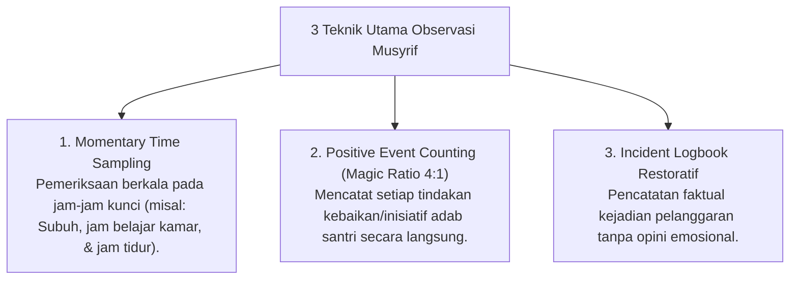

# P5-05: Sistem Observasi Perilaku Musyrif Asrama dan Incident Sampling

## Status Dokumen
* **Status**: 🌟 **A+ (Tervalidasi & Siap Diimplementasikan)**
* **Sub-Domain**: `05 Assessment Framework / 05 Observation System`
* **Penanggung Jawab Keilmuan**: Dewan Keilmuan TUMBUH (*Pakar Pengasuhan Asrama & Pakar Arsitektur PBIS Restoratif*)

---

## 1. Konseptualisasi Sistem Observasi Naturalistik

Observasi perilaku santri oleh Musyrif dilakukan secara **Naturalistik & Unobtrusive** (tanpa mengganggu aktivitas santri). Musyrif mengamati perilaku adab harian di kamar, masjid, ruang makan, dan lapangan.

---

## 2. Aturan Baku Magic Ratio 4:1 dalam Observasi

- Musyrif wajib mencatat **minimal 4 penguatan positif** (pujian spesifik, inisiatif kebersihan, ketertiban sholat) untuk setiap **1 catatan koreksi perilaku**.
- Sistem Logbook Digital PBIS akan memberikan pengingat otomatis jika Musyrif hanya mencatat pelanggaran santri tanpa seimbang dengan penguatan positif.

---

## 3. SOP Entry Logbook Digital Musyrif

1. **Prinsip Objektivitas Faktual**: Pencatatan perilaku wajib mendeskripsikan tindakan yang teramati (*Observable Behavior*), bukan asumsi emosional (Misal: tulis *"Santri terlambat 5 menit di masjid"*, bukan *"Santri malas sholat"*).
2. **Kategori Perilaku PBIS**:
   - **Perilaku Ekspektasi (Positive)**: Menolong teman, merapikan lemari mandiri, inisiatif memimpin sholawat.
   - **Perilaku Perlu Bimbingan (Corrective)**: Keterlambatan, kebersihan kamar kurang, percakapan kasar.
