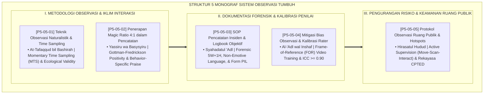

# P5-05: DOKUMEN INDUK SISTEM OBSERVASI PERILAKU ASRAMA 24 JAM
## *Arsitektur dan Rekayasa Metodologi Pengamatan Perilaku Santri Terpadu (Observasi Naturalistik & Momentary Time Sampling MTS, Protokol Magic Ratio 4:1, Standarisasi SOP Pencatatan Insiden Objektif Form PIL, Mitigasi Bias Penilai FOR Training, Serta Pengawasan Aktif Titik Rawan Hotspots CPTED) di Ekosistem TUMBUH Pesantren*

**Nomor Identifikasi**: `P5-05/DOKUMEN-INDUK-SISTEM-OBSERVASI-ASRAMA/2026`  
**Domain**: `05 Assessment Framework` > `05 Observation System` (Gugus Sub-Domain 05: *Comprehensive 24-Hour Behavioral Observation Systems*)  
**Klasifikasi Naskah**: *Master Architecture & Navigation Monograph* (Dokumen Induk Peta Jalan Riset & Navigasi 5 Monograf Ilmiah Sistem Observasi)  
**Rumpun Disiplin Pengkaji**: Desain Metodologi Observasi Asrama 24 Jam, Active Supervision PBIS, Frame-of-Reference (FOR) Calibration, CPTED & Safe Boarding Schools  

---

> ### 💡 INTISARI EKSEKUTIF (EXECUTIVE SUMMARY)
>
> * **Kedudukan Vital Gugus Sistem Observasi Perilaku Asrama:**  
>   Gugus *Observation System (Sistem Observasi Perilaku Musyrif Asrama 24 Jam)* merupakan mata dan telinga ilmiah (*Scientific Eyes and Ears*) dalam ekosistem TUMBUH. Gugus ini menjamin bahwa seluruh data perilaku santri yang masuk ke dalam sistem asesmen dikumpulkan melalui metodologi observasi yang bebas dari kepalsuan reaktif (*Hawthorne-Free*), bebas dari bias kognitif pengamat (*Unbiased*), serta menjamin keselamatan fisik dan mental santri di seluruh ruang publik asrama.
> * **Integrasi Holistik Turats & Konsensus Sains Observasi Ekologis:**  
>   Gugus riset ini memadukan khazanah agung Islam tentang patroli senyap penuh kasih sayang (*At-Tafaqqud bil Bashīrah / Al-'Asas fil Lail*), kabar gembira dan kemudahan (*Yassirū wa Basysyirū*), kesaksian yang adil tanpa dusta (*Syahādatul 'Adl*), keadilan menimbang tanpa hawa nafsu (*Al-'Adl wal Inshāf*), dan penjagaan tapal batas keamanan (*Hirāsatul Hudūd*) dengan konsensus sains psikologi observasi modern (*MTS Time Sampling, Gottman 4:1 Magic Ratio, Forensic Incident Documentation, FOR Training, dan CPTED Active Supervision*).
> * **Struktur Lengkap 5 Berkas Monograf Riset Ilmiah:**  
>   Dokumen induk ini memetakan dan menghubungkan 5 berkas monograf penelitian akademik komprehensif (~140 KB total riset) yang menyajikan lembar sampling interval MTS, format tally pemantauan rasio 4:1, SOP laporan insiden objektif 5W+1H, modul kalibrasi video benchmark penilai, dan peta rute patroli ruang publik.

---

## 📑 PETA NAVIGASI LIMA MONOGRAF RISET SISTEM OBSERVASI

Berikut adalah daftar lengkap 5 monograf riset akademik dalam gugus **`05 Observation System`**:

---

## 📚 DESKRIPSI RINGKAS 5 BERKAS MONOGRAF

1. **[P5-05-01: Teknik Observasi Naturalistik dan Time Sampling](file:///c:/xampp/htdocs/tumbuh/05%20Assessment%20Framework/05%20Observation%20System/P5-05-01-Teknik-Observasi-Naturalistik-dan-Time-Sampling.md)**  
   *Membahas metode pengamatan alami tanpa distorsi kepalsuan (Hawthorne-Free), teknik Momentary Time Sampling (MTS) 15 menit acak, tradisi patroli malam Sayyidina Umar RA, dan lembar kerja Form OIN-Musyrif.*
2. **[P5-05-02: Penerapan Magic Ratio 4:1 dalam Pencatatan](file:///c:/xampp/htdocs/tumbuh/05%20Assessment%20Framework/05%20Observation%20System/P5-05-02-Penerapan-Magic-Ratio-4-1-dalam-Pencatatan.md)**  
   *Membahas kewajiban memberikan minimal 4 penguatan positif sebelum 1 teguran bimbingan, doktrin Yassiru wa Basysyiru, teori Gottman & Fredrickson, rumus Behavior-Specific Praise (BSP), dan form pemantau Form PRA-4to1.*
3. **[P5-05-03: SOP Pencatatan Insiden dan Logbook Objektif](file:///c:/xampp/htdocs/tumbuh/05%20Assessment%20Framework/05%20Observation%20System/P5-05-03-SOP-Pencatatan-Incident-Logbook-Objektif.md)**  
   *Membahas standar penulisan insiden asrama bebas kata sifat opini menghakimi, bahasa sensorik 5W+1H murni, bahaya dosa persaksian palsu (Syahadatuz Zur), 4 level keparahan insiden, dan formulir Form PIL-Objektif.*
4. **[P5-05-04: Mitigasi Bias Observasi dan Kalibrasi Rater](file:///c:/xampp/htdocs/tumbuh/05%20Assessment%20Framework/05%20Observation%20System/P5-05-04-Mitigasi-Bias-Observasi-dan-Kalibrasi-Rater.md)**  
   *Membahas pengendalian bias Halo, Horns, Central Tendency, dan Kontras, perintah keadilan mutlak Al-Qur'an, pelatihan Frame-of-Reference (FOR) berbasis video benchmark, dan sertifikasi penilai dengan skor kesepakatan ICC >= 0.90.*
5. **[P5-05-05: Protokol Observasi Ruang Publik dan Hotspots](file:///c:/xampp/htdocs/tumbuh/05%20Assessment%20Framework/05%20Observation%20System/P5-05-05-Protokol-Observasi-Ruang-Publik-dan-Hotspots.md)**  
   *Membahas eliminasi perundungan di titik buta asrama (lorong toilet/jemuran/gudang), doktrin Hirasatul Hudud & Wilayatul Hisbah, 3 pilar Active Supervision (Move, Scan, Interact), rekayasa CPTED penerangan terang benderang, dan form logbook Form PHP-Hotspots.*

---

## 🎯 STANDAR PENJAMINAN MUTU SISTEM OBSERVASI

Penerapan gugus **Sistem Observasi Perilaku Musyrif Asrama 24 Jam (Observation System)** menjamin bahwa:
1. **Data Pengamatan Mencerminkan Karakter Asli Santri (*Ecological Authenticity*)**: Santri bertindak santun bukan karena takut diintai, melainkan karena kesadaran adab yang tertanam mendalam.
2. **Lingkungan Pesantren Menjadi Suaka Aman Bebas Perundungan (*Zero Bullying Safe Haven*)**: Tidak ada lagi sudut-sudut gelap atau waktu transisi yang membahayakan keselamatan santri.
3. **Pendidik Terlatih Memandang Santri dengan Kacamata Keadilan dan Kasih Sayang (*Trained Objective Raters*)**: Menghilangkan budaya fitnah, pilih kasih, dan omelan kasar di seluruh lini pengasuhan.
