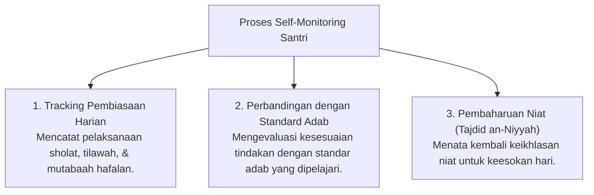

# P5-06-01: Metodologi Muhasabah dan Self-Monitoring Santri

## Status Dokumen
* **Status**: 🌟 **A+ (Tervalidasi & Siap Diimplementasikan)**
* **Sub-Domain**: `05 Assessment Framework / 06 Self Assessment`
* **Penanggung Jawab Keilmuan**: Dewan Keilmuan TUMBUH (*Pakar Epistemologi Turats & Pakar Psikologi Belajar*)

---

## 1. Konseptualisasi Muhasabah (Self-Monitoring)

Sesuai pesan Umar bin Khattab RA: *"Hasibu anfusakum qabla an tuhasabu"* (Evaluasilah diri kalian sebelum kalian dievaluasi kelak), instrumen Self-Assessment melatih santri memiliki kesadaran kritis atas amal dan adabnya sendiri.

---

## 2. Penghapusan Rasa Takut Mengaku Kesilapan

Sistem Self-Assessment dirancang agar santri merasa **aman untuk jujur**. Pencatatan kesalahan dalam jurnal pribadi tidak menghasilkan sanksi, melainkan dijadikan bahan diskusi bimbingan konseling yang mendukung.
