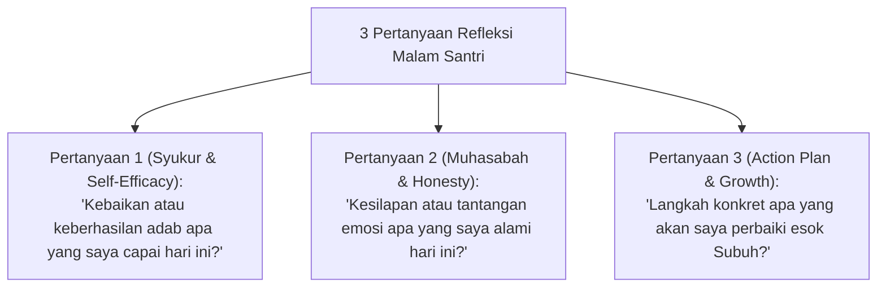

# P5-06-02: Panduan Jurnal Refleksi Malam 3-Pertanyaan

## Status Dokumen
* **Status**: 🌟 **A+ (Tervalidasi & Siap Diimplementasikan)**
* **Sub-Domain**: `05 Assessment Framework / 06 Self Assessment`
* **Penanggung Jawab Keilmuan**: Dewan Keilmuan TUMBUH (*Pakar Bimbingan Konseling & Pakar Pedagogi Master Guru*)

---

## 1. Operasionalisasi Jurnal Refleksi Malam

Jurnal Refleksi Malam dilakukan selama 10 menit sebelum tidur (pukul 21.40–21.50) dalam suasana tenang di kamar asrama.

---

## 2. Panduan Pendampingan Musyrif

- Musyrif memastikan suasana kamar tenang dan mendukung selama 10 menit waktu refleksi.
- Musyrif tidak memeriksa isi narasi refleksi santri tanpa izin santri, untuk menjaga kerahasiaan isi jurnal pribadi (*Privacy Space*).
