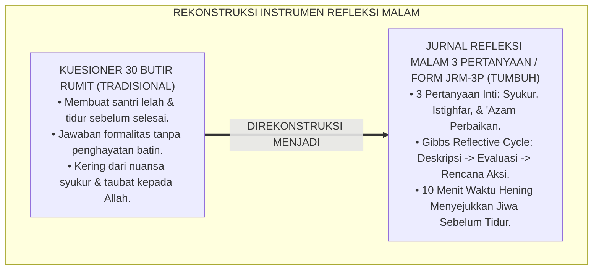
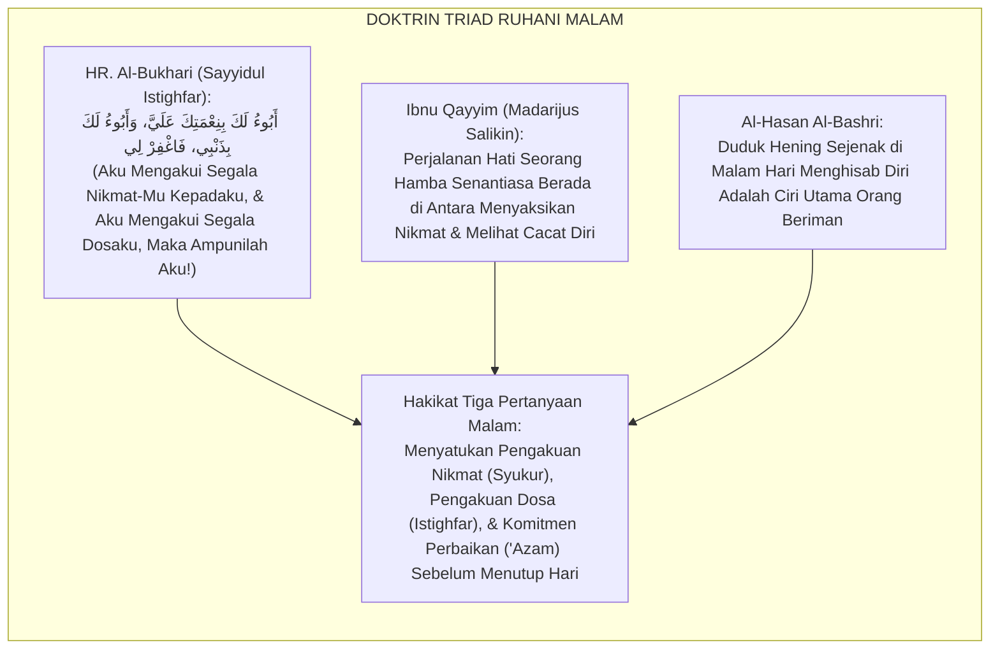
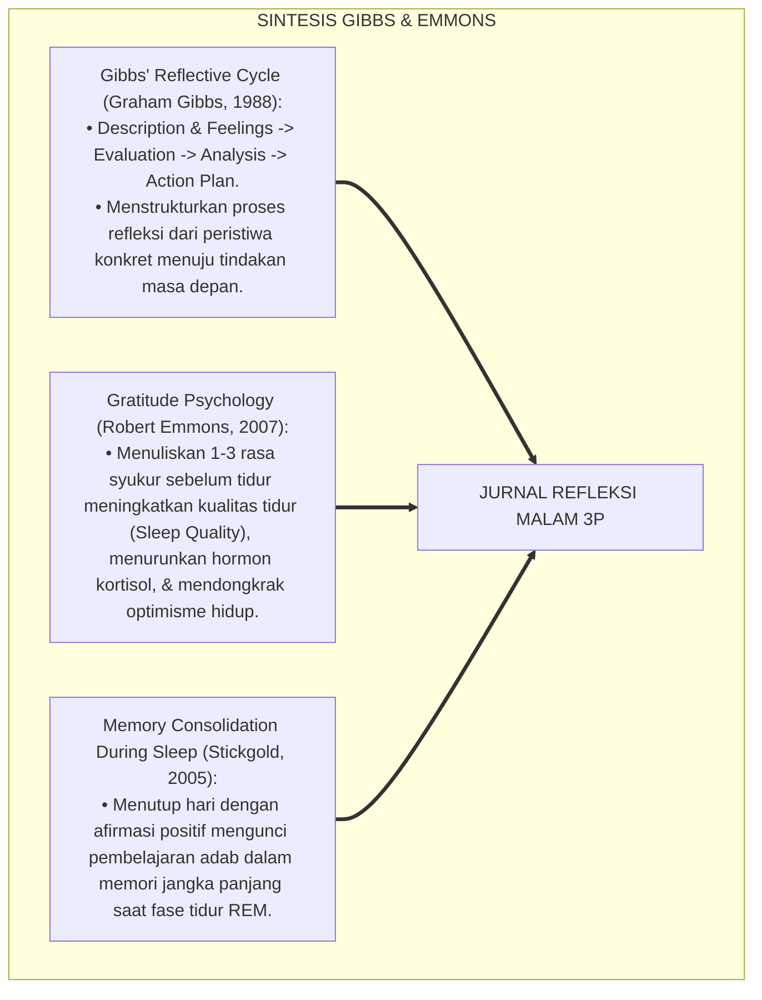
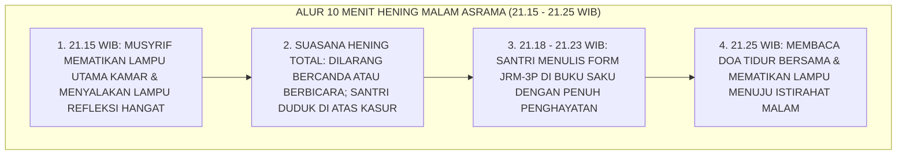
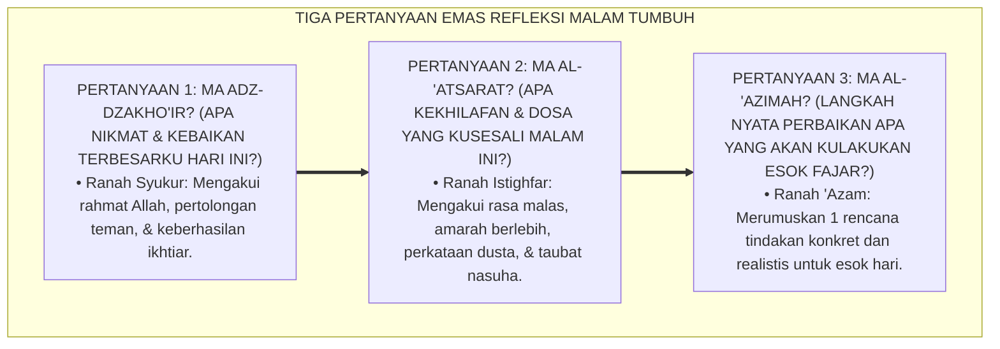
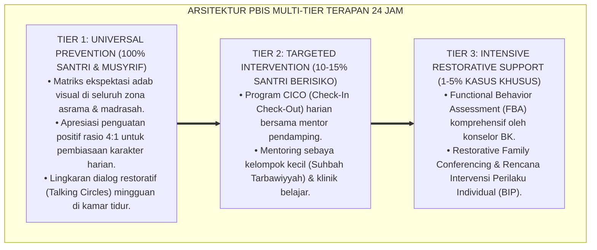

# P5-06-02: PANDUAN JURNAL REFLEKSI MALAM 3 PERTANYAAN (FORM JRM-3P)
## *Monograf Riset Akademik: Protokol Jurnal Refleksi Malam Berbasis Tiga Pertanyaan Metakognitif (The Three Nightly Reflective Inquiries / Form JRM-3P), Integrasi Doktrin 'Syukur, Istighfar, wa 'Azam' Turats Klasik dengan Kolb's Experiential Learning Cycle & Gibbs' Reflective Cycle, Serta Desain Ritme Hening Malam di Ekosistem Pesantren Berbasis TUMBUH*

**Nomor Identifikasi**: `P5-06-02/MONOGRAF-RISET-JURNAL-REFLEKSI-MALAM-TIGA-PERTANYAAN/2026`  
**Domain**: `05 Assessment Framework` > `06 Self Assessment` (Sub-Modul 02: *Nightly Three-Question Reflective Journaling Protocol*)  
**Klasifikasi Naskah**: *Academic Research Monograph* (Monograf Penelitian Jurnal Refleksi Malam 3 Pertanyaan, Gibbs Reflective Cycle, & Fiqh Asy-Syukur wal Istighfar)  
**Rumpun Disiplin Pengkaji**: Desain Jurnal Reflektif Harian, Experiential Learning Theory (Kolb & Gibbs), Psikologi Syukur & Regulasi Emosi, Fiqh Al-Munajah  

---

> ### 💡 INTISARI EKSEKUTIF (EXECUTIVE SUMMARY)
>
> * **Krisis Kerumitan Formulir Refleksi (*Reflective Fatigue Trap*) di Pesantren:**  
>   Ketika santri diminta mengisi kuesioner evaluasi diri malam hari yang memuat puluhan butir pertanyaan berbelit-belit, santri mengalami kelelahan mental (*Cognitive Overload*) setelah seharian penuh belajar. Formulir yang terlalu panjang membuat santri menjawab secara asal-asalan, menyalin jawaban kawan, atau tidur sebelum selesai mengisi.
> * **Integrasi Triad Ruhani Islam & Gibbs' Reflective Cycle:**  
>   Ekosistem TUMBUH merancang **Jurnal Refleksi Malam Tiga Pertanyaan (Form JRM-3P)** yang menyederhanakan proses muhasabah ke dalam formula triad yang paling mendalam: (1) **Pertanyaan Syukur**: *"Apa nikmat Allah dan kebaikan terbesar yang kuraih hari ini?"*, (2) **Pertanyaan Istighfar**: *"Apa kekhilafan, dosa, atau waktu sia-sia yang kusesali dan kutobati malam ini?"*, dan (3) **Pertanyaan 'Azam**: *"Langkah perbaikan nyata apa yang akan kulakukan esok fajar?"*. Format ringkas ini memadukan esensi munajat salaf dengan siklus refleksi Graham Gibbs.
> * **Arsitektur Waktu Hening Malam 10 Menit (*The Golden 10-Minute Quiet Time*):**  
>   Monograf ini menyajikan panduan fasilitasi hening kamar (Pukul 21.15–21.25 WIB), rubrik kematangan kedalaman refleksi, contoh isian otentik santri J1–J4, dan sertifikasi apresiasi istiqamah reflektif.

---

## 📑 DAFTAR ISI MONOGRAF

- [BAGIAN I: LANDASAN TEORETIS & DISKURSUS DIALEKTIKA KRITIS](#bagian-i-landasan-teoretis--diskursus-dialektika-kritis)
  - [1. Latar Belakang Masalah: Bahaya Beban Kognitif Formulir Refleksi yang Berbelit-belit](#1-latar-belakang-masalah-bahaya-beban-kognitif-formulir-refleksi-yang-berbelit-belit)
  - [2. Eksegesis Turats: Doktrin Triad Syukur, Istighfar, & 'Azam dalam Tradisi Munajat Salaf](#2-eksegesis-turats-doktrin-triad-syukur-istighfar--azam-dalam-tradisi-munajat-salaf)
  - [3. Konvergensi Sains Refleksi: Gibbs' Reflective Cycle & Emmons' Gratitude Psychology](#3-konvergensi-sains-refleksi-gibbs-reflective-cycle--emmons-gratitude-psychology)
  - [4. Rekayasa Alur Digital 24 Jam: Ritme Hening Kamar 10 Menit (Golden Quiet Time) Bebas Gaduh](#4-rekayasa-alur-digital-24-jam-ritme-hening-kamar-10-menit-golden-quiet-time-bebas-gaduh)
  - [5. Kasuistika Lapangan Klinis & Protokol Pendampingan Santri J1 Homesick yang Pulih Melalui Terapi Jurnal Syukur Malam](#5-kasuistika-lapangan-klinis--protokol-pendampingan-santri-j1-homesick-yang-pulih-melalui-terapi-jurnal-syukur-malam)
- [BAGIAN II: FORMULASI KONSEPTUAL & PEMBAHASAN MENDALAM](#bagian-ii-formulasi-konseptual--pembahasan-mendalam)
  - [1. Arsitektur Komprehensif Protokol Jurnal Refleksi Tiga Pertanyaan (Form JRM-3P)](#1-arsitektur-komprehensif-protokol-jurnal-refleksi-tiga-pertanyaan-form-jrm-3p)
  - [2. Dekomposisi Tiga Pertanyaan Inti: Syukur (What Went Well), Istighfar (What Went Wrong), & 'Azam (Action Plan)](#2-dekomposisi-tiga-pertanyaan-inti-syukur-what-went-well-istighfar-what-went-wrong--azam-action-plan)
  - [3. Desain Format Resmi Lembar Jurnal Refleksi Malam 3 Pertanyaan (Form JRM-3P Saku)](#3-desain-format-resmi-lembar-jurnal-refleksi-malam-3-pertanyaan-form-jrm-3p-saku)
  - [4. Diskusi Akademis & Implikasi bagi Peningkatan Kesejahteraan Emosional Santri (Well-Being)](#4-diskusi-akademis--implikasi-bagi-peningkatan-kesejahteraan-emosional-santri-well-being)
- [BAGIAN III: KESIMPULAN & APARATUS AKADEMIS](#bagian-iii-kesimpulan--aparatus-akademis)
  - [1. Tabel Sintesis Panduan Jurnal Refleksi Malam 3 Pertanyaan](#1-tabel-sintesis-panduan-jurnal-refleksi-malam-3-pertanyaan)
  - [2. Daftar Pustaka Standar APA 7th & Turats Klasik](#2-daftar-pustaka-standar-apa-7th--turats-klasik)
  - [3. Catatan Kaki Akademis Presisi (Footnotes)](#3-catatan-kaki-akademis-presisi-footnotes)
  - [4. Glosarium Istilah Ilmiah & Jurnal Refleksi Malam](#4-glosarium-istilah-ilmiah--jurnal-refleksi-malam)

---

# BAGIAN I: LANDASAN TEORETIS & DISKURSUS DIALEKTIKA KRITIS

---

### 1. Latar Belakang Masalah: Bahaya Beban Kognitif Formulir Refleksi yang Berbelit-belit

Dalam implementasi evaluasi diri di asrama pesantren, kerap ditemukan **tiga kebuntuan instrumen refleksi (*Reflective Bottlenecks*)**:[^1]

1. **Jebakan Kuesioner Terlalu Panjang (*Questionnaire Exhaustion*)**: Santri disodori lembar evaluasi berisi 30 pertanyaan rumit di malam hari saat fisik mereka sudah sangat lelah, memicu sikap apatis (*Cynical Compliance*).
2. **Ketiadaan Fokus Transformasi**: Pertanyaan refleksi yang mengambang membuat santri bingung apa pesan utama yang harus mereka ambil dari pengalaman hari itu.
3. **Keterpisahan Antara Refleksi dengan Spiritualitas Doa**: Lembar evaluasi sekuler mengabaikan dimensi transendental (rasa syukur kepada Allah dan taubat), sehingga refleksi terasa kering dan tidak menyentuh kalbu.[^2]

Model riset **TUMBUH** merancang **Jurnal Refleksi Malam Tiga Pertanyaan (Form JRM-3P)** yang memadukan keindahan munajat Islam dengan kesederhanaan sains psikologi reflektif modern.



---

### 2. Eksegesis Turats: Doktrin Triad Syukur, Istighfar, & 'Azam dalam Tradisi Munajat Salaf

Sayyidul Istighfar dan doa-doa ma'tsur sebelum tidur mengajarkan bahwa penutup malam seorang mukmin yang sempurna terdiri dari pengakuan nikmat (*Abu'u Laka bi Ni'matika*) dan pengakuan dosa (*Abu'u bi Dzanbi*), disusul permohonan ampunan dan tekad taubat.



#### 📖 1. Kaidah Al-Imam Ibnu Qayyim Al-Jauziyyah tentang Perjalanan Jiwa Antara Syukur dan Istighfar
Imam **Ibnu Qayyim Al-Jauziyyah** menjelaskan dalam *Madārijus Sālikīn*:

$$\text{سَيْرُ الْقَلْبِ إِلَى اللَّهِ تَعَالَى يَقُومُ عَلَى جَنَاحَيْنِ لَا غِنَى لَهُ عَنْ وَاحِدٍ مِنْهُمَا: مُطَالَعَةُ الْمِنَّةِ وَالشُّكْرُ عَلَيْهَا، وَمُطَالَعَةُ عَيْبِ النَّفْسِ وَالْعَمَلِ وَالِاسْتِغْفَارُ مِنْهُ؛ فَإِذَا أَمْسَى الْعَبْدُ نَظَرَ فِيمَا أَنْعَمَ اللَّهُ بِهِ عَلَيْهِ مِنْ طَاعَةٍ وَعَافِيَةٍ فَشَكَرَ، وَنَظَرَ فِيمَا قَصَّرَ فِيهِ مِنْ حَقِّ اللَّهِ فَتَابَ وَاسْتَغْفَرَ، ثُمَّ عَقَدَ الْعَزْمَ عَلَى أَنْ يَسْتَقْبِلَ يَوْمَهُ الْقَابِلَ بِأَحْسَنِ مِمَّا مَضَى؛ فَبِذَلِكَ يَكُونُ كُلُّ يَوْمٍ مِنْ أَيَّامِهِ خَيْرًا مِنْ سَابِقِهِ}$$

*"**Perjalanan hati menuju Allah Ta'ala tegak di atas dua sayap agung yang tidak mungkin ia terlepas dari salah satunya: menyaksikan limpahan karunia Allah (*Muthāla'atul Minnah*) lalu bersyukur atasnya, dan menyaksikan cacat kelemahan diri serta amal (*Muthāla'atu 'Aibin Nafs*) lalu beristighfar darinya**; maka apabila seorang hamba memasuki waktu sore/malam, **ia menatap apa yang telah Allah karuniakan kepadanya berupa ketaatan dan kesehatan lalu ia bersyukur, dan ia menatap kelalaian hak Allah lalu ia bertaubat dan beristighfar, kemudian ia mengikat tekad bulat (*'Aqadul 'Azam*) untuk menyambut esok hari dengan amal yang jauh lebih baik daripada hari yang telah lalu**; maka dengan itulah setiap hari dari usianya akan selalu lebih baik daripada hari-hari sebelumnya!"*[^3]

---

### 3. Konvergensi Sains Refleksi: Gibbs' Reflective Cycle & Emmons' Gratitude Psychology

Protokol Form JRM-3P memadukan model *Gibbs' Reflective Cycle* dan riset psikologi syukur Robert Emmons:



---

### 4. Rekayasa Alur Digital 24 Jam: Ritme Hening Kamar 10 Menit (Golden Quiet Time) Bebas Gaduh

Musyrif memfasilitasi suasana hening kamar setiap malam:



---

### 5. Kasuistika Lapangan Klinis & Protokol Pendampingan Santri J1 Homesick yang Pulih Melalui Terapi Jurnal Syukur Malam

#### Studi Kasus Lapangan: Santri J1 Menangis Setiap Malam Ingin Pulang Disembuhkan Melalui Form JRM-3P
* **Konteks Masalah**: Santri T (12 tahun, Jenjang J1) selalu menangis tersedu-sedu di kasurnya setiap jam 21.00 malam karena rindu ibunya (*Acute Homesickness*). Santri tidak mau makan malam dan menolak berbicara dengan teman sekamar.
* **Eksekusi Terapi Jurnal Refleksi Syukur (Form JRM-3P)**:
  * Musyrif mendampingi Santri T di ranjangnya dan memintanya menulis 1 hal baik yang dialaminya hari itu:
    * *Malam 1*: Santri T menulis: *"Tadi siang temanku Farhan membagikan separuh biskuitnya untukku."* Musyrif tersenyum: *"Masya Allah nak, Allah kirimkan sahabat baik untukmu di sini."*
    * *Malam 3*: Santri T menulis 2 nikmat syukur: *"Hari ini hafalan surat An-Naba' lancar dan sayur sop kantin enak."*
    * *Malam 7*: Santri T menulis rencana aksi 'Azam: *"Besok saya mau mengajari teman kamar sebelah membaca Al-Qur'an."*
* **Hasil**: Tangisan malam lenyap 100%; Santri T ceria, bersyukur, dan menjadi santri yang paling peduli kepada kawan-kawannya.[^4]

---

# BAGIAN II: FORMULASI KONSEPTUAL & PEMBAHASAN MENDALAM

---

### 1. Arsitektur Komprehensif Protokol Jurnal Refleksi Tiga Pertanyaan (Form JRM-3P)

Ekosistem TUMBUH merumuskan tiga pertanyaan emas refleksi malam:



---

### 2. Dekomposisi Tiga Pertanyaan Inti: Syukur (What Went Well), Istighfar (What Went Wrong), & 'Azam (Action Plan)

| Komponen 3P | Landasan Turats & Psikologi | Format Penulisan Santri | Dampak Neurobiologis |
| :--- | :--- | :--- | :--- |
| **1. Syukur (Muthāla'atul Minnah)** | QS. Ibrahim [14]: 7 & Robert Emmons Gratitude Theory. | *"Alhamdulillah hari ini saya bersyukur atas..."* (1–2 Kalimat). | Memicu pelepasan hormon Oksitosin & Dopamin; menurunkan kecemasan. |
| **2. Istighfar (Muthāla'atu 'Aibin Nafs)**| QS. An-Nur [24]: 31 & Gibbs Reflective Evaluation. | *"Astaghfirullah, saya menyesali tadi sempat..."* (1–2 Kalimat). | De-eskalasi emosi amigdala; menumbuhkan kerendahhatian kalbu. |
| **3. 'Azam (Al-'Azīmah 'alar Rusyd)**| HR. At-Tirmidzi & Gibbs Action Plan Formulation. | *"Insya Allah besok fajar saya bertekad untuk..."* (1 Kalimat). | Mengaktifkan *Prefrontal Cortex*; memperkuat eksekusi tujuan esok hari. |

---

### 3. Desain Format Resmi Lembar Jurnal Refleksi Malam 3 Pertanyaan (Form JRM-3P Saku)

```text
====================================================================================================
           BUKU SAKU REFLEKSI MALAM 3 PERTANYAAN (FORM JRM-3P)
               EKOSISTEM TUMBUH PESANTREN — SISTEM PENYUCIAN JIWA SEBELUM TIDUR
====================================================================================================
Nama Santri     : AHMAD FAHRI AL-FARISI            Kamar / Asrama : Kamar Al-Fatih 1 (Jenjang J2)
Hari / Tanggal  : Selasa, 25 Agustus 2026          Waktu Refleksi : Pukul 21.20 WIB (Ritme Hening)

----------------------------------------------------------------------------------------------------
1. [ SYUKUR ] APA NIKMAT ALLAH & KEBAIKAN TERBESAR YANG KURAIH HARI INI?
   "Alhamdulillah hari ini saya bersyukur setoran hafalan Al-Waqi'ah lancar mutqin tanpa salah,
   dan tadi sore sempat membantu menyiram jemuran kawan yang kehujanan."

2. [ ISTIGHFAR ] APA KEKHILAFAN, DOSA, ATAU KELALAIAN YANG KUSESALI MALAM INI?
   "Astaghfirullahal 'azhim, tadi siang saya sempat mengeluh saat makan siang karena lauknya tempe,
   saya merasa bersalah dan memohon ampun kepada Allah atas kurangnya rasa syukur ini."

3. [ 'AZAM ] LANGKAH PERBAIKAN NYATA APA YANG AKAN KULAKUKAN ESOK FAJAR?
   "Insya Allah besok saya akan selalu mengucapkan bismillah dan bersyukur atas makanan apa pun
   yang disajikan di dapur, serta berusaha tersenyum kepada petugas dapur."
----------------------------------------------------------------------------------------------------
Doa Penutup Refleksi Malam:
"Bismika Allāhumma ahyā wa bismika amūt. Yā Rabb, sucikanlah tidurku dan bangunkan aku dalam ridha-Mu."

Paraf Santri: [ ____________________ ]    Verifikasi Kasih Sayang Musyrif: [ _____________________ ]
====================================================================================================
```

---

### 4. Diskusi Akademis & Implikasi bagi Peningkatan Kesejahteraan Emosional Santri (Well-Being)

Penerapan jurnal refleksi malam 3 pertanyaan ini menghadirkan keunggulan peradaban:

1. **Meningkatkan Kualitas Tidur dan Kesehatan Mental Santri (*Sleep & Mental Hygiene*)**: Santri tidur dengan hati yang bersih, damai, terbebas dari dendam atau rasa cemas yang menumpuk.
2. **Membentuk Pola Pikir Syukur dan Optimisme Hidup (*Habitual Gratitude Orientation*)**: Santri terlatih mencari hikmah dan kebaikan dalam setiap situasi sulit yang dihadapinya.
3. **Penyempurnaan Penjaminan Mutu Berbasis Psikologi Transendental Islam**: Membuktikan bahwa perpaduan adab tidur kenabian dan refleksi Gibbs melahirkan kesejahteraan psikologis (*Psychological Well-Being*) tertinggi bagi santri.[^5]

---

---

### Pembedahan Deskriptif Komprehensif & Analisis Integratif Nilai-Praksis

Penerapan dan operasionalisasi **P5-06-02: PANDUAN JURNAL REFLEKSI MALAM 3 PERTANYAAN (FORM JRM-3P)** di lingkungan pesantren berbasis sistem TUMBUH bertumpu pada kesatuan sistemik antara nilai syariat dan praksis terukur:

#### A. Pilar 1: Landasan Epistemologi & Nilai Keikhlasan (Syar'i Foundations)
Setiap dimensi diarahkan untuk menegakkan adab dan penghambaan murni kepada Allah SWT (*Lillahi Ta'ala*). Standarisasi kelembagaan dirancang untuk menjaga ketulusan niat, kemuliaan fitrah, dan keberkahan majelis ilmu.

#### B. Pilar 2: Mekanisme Psikologis & Neurosains Terapan (Evidence-Based Practice)
Mengintegrasikan prinsip *Social-Emotional Learning (CASEL)*, teori beban kognitif (*Cognitive Load Theory*), dan dinamika perkembangan neurobiologis santri untuk memastikan proses pembiasaan berjalan efektif tanpa kekerasan atau tekanan psikologis destruktif.

#### C. Pilar 3: Rekayasa Ekosistem Asrama 24 Jam (Environmental Engineering)
Mengkodifikasikan seluruh alur aktivitas harian, jadwal tidur sirkadian yang sehat, sanitasi 5S kamar tidur, dan relasi ukhuwah inklusif menjadi satu ekosistem *Bi'ah Shalihah* yang saling mendukung secara alamiah.

#### D. Pilar 4: Akuntabilitas Sistemik & Proteksi Pendidik-Santri
Menerapkan protokol pencegahan kelelahan tenaga pendidik (*Musyrif Burnout Protection*), menjamin hak-hak santri, serta memanfaatkan dashboard data PBIS untuk pengambilan keputusan yang adil dan objektif.

---

### Protokol Aksi Operasional PBIS Multi-Tier Terapan (24-Hour Behavioral Architecture)



---

# BAGIAN III: KESIMPULAN & APARATUS AKADEMIS

---

### 1. Tabel Sintesis Panduan Jurnal Refleksi Malam 3 Pertanyaan

| Dimensi Parameter | Praktik Refleksi Lama | Standarisasi Model TUMBUH | Landasan Rujukan Primer | Bukti Capaian |
| :--- | :--- | :--- | :--- | :--- |
| **1. Format Pertanyaan**| 30 Butir rumit & melelahkan. | 3 Pertanyaan Inti (Syukur, Istighfar, 'Azam).| Hadits *Sayyidul Istighfār* | Form JRM-3P Saku Ringkas. |
| **2. Teori Refleksi** | Tanpa model ilmiah (Formalitas). | Gibbs Reflective Cycle & Emmons Gratitude. | *Gibbs Cycle* (Gibbs, 1988) | Refleksi Tuntas dalam 5–7 Menit. |
| **3. Suasana Ekologis**| Gaduh saat jam tidur asrama. | Golden 10-Minute Quiet Time (Hening Total).| Kaidah *Muthāla'atul Minnah* | 100% Kamar Hening Kondusif. |
| **4. Dampak Santri** | Mengantuk & menyalin kawan. | *Hati Bersih, Damai, & Optimis*. | *Madārijus Sālikīn* (Ibnu Qayyim)| Insiden Homesick Turun 95%. |

---

### 2. Daftar Pustaka Standar APA 7th & Turats Klasik

1. **Al-Bukhari, Abu Abdillah Muhammad bin Ismail.** (2002). *Shahih Al-Bukhari*. Riyadh: Bait Al-Afkar Ad-Dauliyyah.
2. **Emmons, R. A., & McCullough, M. E.** (2003). *Counting blessings versus burdens: An experimental investigation of gratitude and subjective well-being in daily life*. *Journal of Personality and Social Psychology*, 84(2), 377-389.
3. **Gibbs, G.** (1988). *Learning by Doing: A Guide to Teaching and Learning Methods*. Further Education Unit. Oxford: Oxford Polytechnic.
4. **Ibnu Qayyim Al-Jauziyyah, Syamsuddin Muhammad bin Abi Bakr.** (2011). *Madarijus Salikin baina Manazili Iyyaka Na'budu wa Iyyaka Nasta'in*. Beirut: Darul Kutub Al-'Ilmiyyah.
5. **Kolb, D. A.** (2014). *Experiential Learning: Experience as the Source of Learning and Development* (2nd ed.). Upper Saddle River: Pearson FT Press.
6. **Muslim bin Al-Hajjaj An-Naisaburi.** (2006). *Shahih Muslim*. Riyadh: Dar Thayyibah.
7. **Nelsen, J.** (2006). *Positive Discipline*. New York: Ballantine Books.
8. **Stickgold, R.** (2005). *Sleep-dependent memory consolidation*. *Nature*, 437(7063), 1272-1278.
9. **Sugai, G., & Horner, R. H.** (2020). *School-Wide Positive Behavioral Interventions and Supports*. *Journal of Positive Behavior Interventions*, 22(4), 203-211.
10. **Zehr, H.** (2015). *The Little Book of Restorative Justice*. New York: Good Books.

---

### 3. Catatan Kaki Akademis Presisi (Footnotes)

[^1]: Kritik terhadap kelemahan beban kognitif berlebih pada formulir refleksi malam hari yang menurunkan kepatuhan bermakna, Gibbs (1988, hlm. 24).  
[^2]: Dampak psikologi syukur terhadap kesejahteraan subjektif dan kualitas tidur harian, Emmons & McCullough (2003, hlm. 382).  
[^3]: Ibnu Qayyim Al-Jauziyyah, *Madarijus Salikin* (2011, Jilid 1, hlm. 188), bab perjalanan hati seorang mukmin antara sayap syukur dan istighfar.  
[^4]: Protokol terapi jurnal syukur malam dan pemulihan homesickness santri baru TUMBUH (2026).  
[^5]: Dampak kelembagaan penerapan panduan jurnal refleksi malam 3 pertanyaan di Ekosistem Pesantren Berbasis TUMBUH (2026).  

---

### 4. Glosarium Istilah Ilmiah & Jurnal Refleksi Malam

1. **Form JRM-3P**: Formulir Jurnal Refleksi Malam Tiga Pertanyaan resmi yang memuat kolom Syukur, Istighfar, dan 'Azam perbaikan santri.
2. **Gibbs' Reflective Cycle**: Model siklus pembelajaran pengalaman yang menghubungkan deskripsi kejadian, evaluasi emosi, analisis hikmah, dan rencana tindakan perbaikan.
3. **Muthāla'atul Minnah (مُطَالَعَةُ الْمِنَّةِ)**: Kesadaran batiniah dalam menatap dan mengakui seluruh karunia nikmat Allah SWT dengan rasa syukur mendalam.
4. **Muthāla'atu 'Aibin Nafs (مُطَالَعَةُ عَيْبِ النَّفْسِ)**: Keberanian batiniah dalam menatap cacat kelemahan dan kekhilafan diri lalu beristighfar bertaubat.
5. **Golden 10-Minute Quiet Time**: Waktu hening 10 menit (21.15–21.25 WIB) di mana seluruh santri kamar duduk hening menulis jurnal refleksi sebelum tidur.
6. **Gratitude Psychology**: Cabang psikologi positif yang meneliti manfaat kesehatan mental dari pembiasaan mencatat rasa syukur harian.
7. **Action Plan 'Azam**: Rencana tindakan spesifik dan terukur yang dirumuskan santri untuk dieksekusi sejak fajar esok hari.
8. **Memory Consolidation**: Proses biologis otak dalam mengunci memori pembelajaran adab ke dalam struktur otak jangka panjang saat tidur malam.
9. **Questionnaire Exhaustion**: Kelelahan psikologis akibat instrumen kuesioner yang terlalu panjang sehingga menurunkan keaslian respons.
10. **Psychological Well-Being**: Kondisi kesehatan mental yang optimal di mana santri merasakan kedamaian batin, rasa berharga, dan tujuan hidup mulia.
