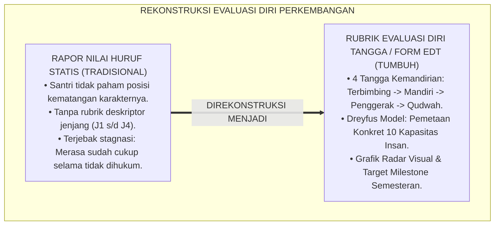
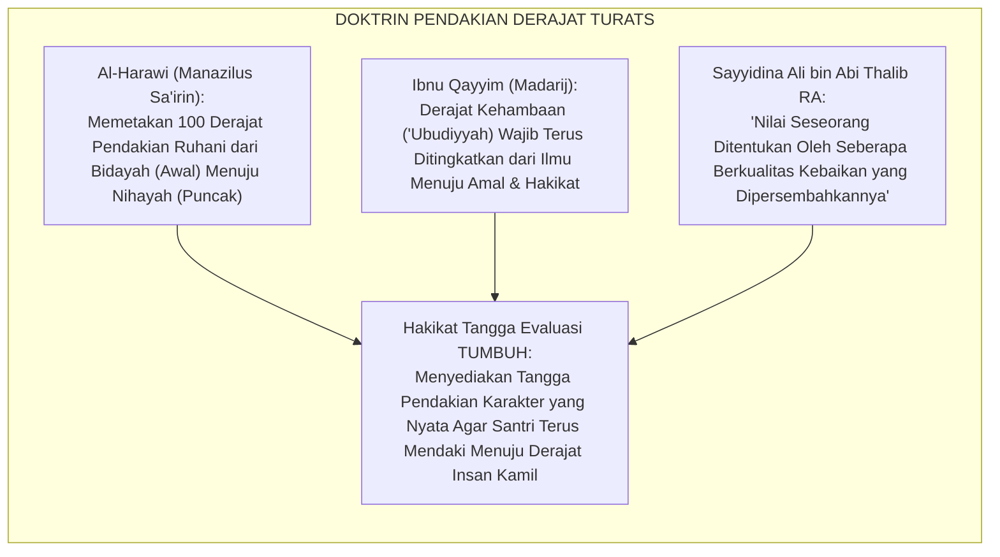
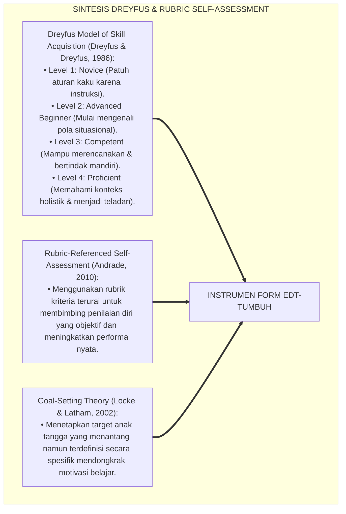
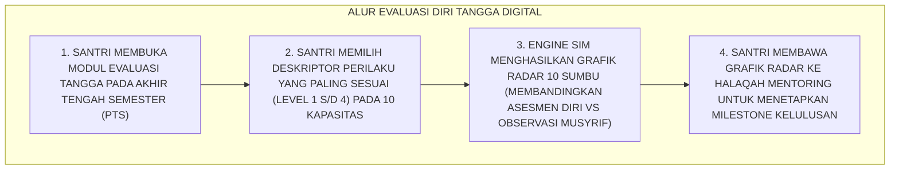
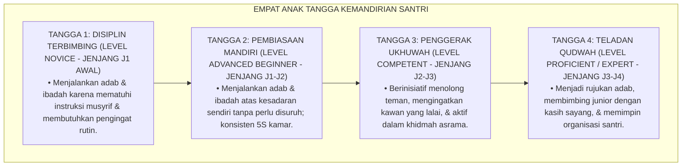

# P5-06-03: INSTRUMEN EVALUASI DIRI TANGGA TUMBUH (FORM EDT-TUMBUH)
## *Monograf Riset Akademik: Standardisasi Rubrik Penilaian Mandiri Berdasarkan Tangga Kemandirian Jenjang J1–J4 (TUMBUH Self-Evaluation Ladder Instrument / Form EDT-TUMBUH), Integrasi Doktrin 'Marātibul 'Ubūdiyyah wa Darajātul Kamāl' Turats Klasik dengan Dreyfus Model of Skill Acquisition & Rubric-Referenced Self-Assessment, Serta Desain Peta Radar Pertumbuhan Diri di Pesantren TUMBUH*

**Nomor Identifikasi**: `P5-06-03/MONOGRAF-RISET-INSTRUMEN-EVALUASI-DIRI-TANGGA/2026`  
**Domain**: `05 Assessment Framework` > `06 Self Assessment` (Sub-Modul 03: *TUMBUH Progression Ladder Self-Evaluation Instrument*)  
**Klasifikasi Naskah**: *Academic Research Monograph* (Monograf Penelitian Instrumen Evaluasi Diri Tangga Kemandirian, Dreyfus Model, & Fiqh Maratibil Ubudiyyah)  
**Rumpun Disiplin Pengkaji**: Desain Rubrik Evaluasi Diri Jenjang Kemandirian TUMBUH (J1–J4), Dreyfus Skill Acquisition Model, Rubric-Referenced Self-Assessment, Fiqh Al-Madarij  

---

> ### 💡 INTISARI EKSEKUTIF (EXECUTIVE SUMMARY)
>
> * **Krisis Ketiadaan Peta Jalan Pertumbuhan Pribadi (*Lack of Progression Map*):**  
>   Banyak santri tidak tahu di mana posisi kematangan dirinya saat ini: apakah ia masih di tahap pemula yang butuh diingatkan (*Novice*), atau sudah menjadi pembimbing kawan (*Mentor*). Ketiadaan rubrik evaluasi diri yang jelas membuat santri merasa jalan di tempat (*Stagnation*) dan tidak memiliki target capaian karakter yang terukur antar-semester.
> * **Integrasi Doktrin Marātibul 'Ubūdiyyah Salaf & Dreyfus Skill Acquisition Model:**  
>   Ekosistem TUMBUH merancang **Instrumen Evaluasi Diri Tangga TUMBUH (Form EDT-TUMBUH)** yang memadukan konsep tingkatan derajat hamba (*Marātibul 'Ubūdiyyah wa Darajātul Kamāl*) Ibnu Qayyim dengan *Dreyfus Model of Skill Acquisition* (Novice $\rightarrow$ Advanced Beginner $\rightarrow$ Competent $\rightarrow$ Proficient $\rightarrow$ Expert). Santri mengevaluasi dirinya secara berkala pada 10 ranah kapasitas untuk melihat posisi anak tangga perkembangannya dari Jenjang J1 hingga J4.
> * **Arsitektur Peta Radar Kemandirian Diri (Self-Growth Radar Chart):**  
>   Monograf ini menyajikan 10 deskriptor tangga kemandirian terurai, formula penentuan indeks kematangan diri, grafik radar visual 10 sumbu, dan protokol dialog pendampingan penetapan milestone semester bersama musyrif.

---

## 📑 DAFTAR ISI MONOGRAF

- [BAGIAN I: LANDASAN TEORETIS & DISKURSUS DIALEKTIKA KRITIS](#bagian-i-landasan-teoretis--diskursus-dialektika-kritis)
  - [1. Latar Belakang Masalah: Bahaya Santri Buta Posisi Perkembangan Karakter Sendiri](#1-latar-belakang-masalah-bahaya-santri-buta-posisi-perkembangan-karakter-sendiri)
  - [2. Eksegesis Turats: Doktrin Maratibul 'Ubudiyyah, Manazilus Sairin, & Progresi Tangga Salaf](#2-eksegesis-turats-doktrin-maratibul-ubudiyyah-manazilus-sairin--progresi-tangga-salaf)
  - [3. Konvergensi Sains Psikologi Perkembangan: Dreyfus Model of Skill Acquisition & Rubric-Referenced Self-Assessment](#3-konvergensi-sains-psikologi-perkembangan-dreyfus-model-of-skill-acquisition--rubric-referenced-self-assessment)
  - [4. Rekayasa Alur Digital 24 Jam: Visualisasi Grafik Radar 10 Sumbu Interaktif pada SIM Santri](#4-rekayasa-alur-digital-24-jam-visualisasi-grafik-radar-10-sumbu-interaktif-pada-sim-santri)
  - [5. Kasuistika Lapangan Klinis & Protokol Transformasi Santri J3 yang Menyadari Posisi Kemandiriannya dan Naik Kelas Menjadi Duta Khidmah](#5-kasuistika-lapangan-klinis--protokol-transformasi-santri-j3-yang-menyadari-posisi-kemandiriannya-dan-naik-kelas-menjadi-duta-khidmah)
- [BAGIAN II: FORMULASI KONSEPTUAL & PEMBAHASAN MENDALAM](#bagian-ii-formulasi-konseptual--pembahasan-mendalam)
  - [1. Arsitektur Komprehensif Instrumen Evaluasi Diri Tangga TUMBUH (Form EDT-TUMBUH)](#1-arsitektur-komprehensif-instrumen-evaluasi-diri-tangga-tumbuh-form-edt-tumbuh)
  - [2. Dekomposisi 4 Anak Tangga Kemandirian: Tangga 1 (Disiplin Terbimbing) s/d Tangga 4 (Teladan Qudwah)](#2-dekomposisi-4-anak-tangga-kemandirian-tangga-1-disiplin-terbimbing-sd-tangga-4-teladan-qudwah)
  - [3. Desain Format Resmi Instrumen Evaluasi Diri Tangga TUMBUH (Form EDT-TUMBUH)](#3-desain-format-resmi-instrumen-evaluasi-diri-tangga-tumbuh-form-edt-tumbuh)
  - [4. Diskusi Akademis & Implikasi bagi Penanaman Budaya Belajar Berkelanjutan (Continuous Self-Improvement)](#4-diskusi-akademis--implikasi-bagi-penanaman-budaya-belajar-berkelanjutan-continuous-self-improvement)
- [BAGIAN III: KESIMPULAN & APARATUS AKADEMIS](#bagian-iii-kesimpulan--aparatus-akademis)
  - [1. Tabel Sintesis Instrumen Evaluasi Diri Tangga TUMBUH](#1-tabel-sintesis-instrumen-evaluasi-diri-tangga-tumbuh)
  - [2. Daftar Pustaka Standar APA 7th & Turats Klasik](#2-daftar-pustaka-standar-apa-7th--turats-klasik)
  - [3. Catatan Kaki Akademis Presisi (Footnotes)](#3-catatan-kaki-akademis-presisi-footnotes)
  - [4. Glosarium Istilah Ilmiah & Evaluasi Diri Tangga TUMBUH](#4-glosarium-istilah-ilmiah--evaluasi-diri-tangga-tumbuh)

---

# BAGIAN I: LANDASAN TEORETIS & DISKURSUS DIALEKTIKA KRITIS

---

### 1. Latar Belakang Masalah: Bahaya Santri Buta Posisi Perkembangan Karakter Sendiri

Dalam pendidikan karakter konvensional, kerap timbul **tiga kelemahan orientasi perkembangan (*Progression Orientation Deficits*)**:[^1]

1. **Jebakan Ketidaktahuan Posisi Diri (*Self-Positioning Blindspot*)**: Santri hanya menerima nilai huruf (A/B/C) di rapor tanpa memahami secara konkret apa perbedaan antara perilaku santri kelas 7 (pemula) dengan santri kelas 12 (kader pemimpin).
2. **Ketiadaan Target Kenaikan Derajat Mandiri**: Santri merasa bahwa selama tidak melanggar aturan, dirinya sudah cukup baik, sehingga tidak ada dorongan untuk naik kelas menjadi santri penggerak yang membimbing juniornya.
3. **Penilaian Diri yang Bersifat Subjektif Tanpa Rubrik**: Santri menilai dirinya sendiri dengan perasaan mengira-ngira (*Gut Feeling*) tanpa ada rubrik deskriptor perilaku yang objektif.[^2]

Model riset **TUMBUH** merancang **Instrumen Evaluasi Diri Tangga TUMBUH (Form EDT-TUMBUH)** untuk memberikan peta navigasi pertumbuhan yang sangat jelas dan terukur bagi setiap santri.



---

### 2. Eksegesis Turats: Doktrin Maratibul 'Ubudiyyah, Manazilus Sairin, & Progresi Tangga Salaf

Para ulama salaf menyusun kitab-kitab *Manāzilus Sā'irīn* untuk memetakan seratus derajat tangga pendakian ruhani manusia menuju ma'rifatullah, di mana seorang hamba tidak boleh berhenti mendaki hingga mencapai puncak tertinggi.



#### 📖 1. Kaidah Syaikhul Islam Al-Harawi tentang Keniscayaan Mengetahui Derajat Pendakian Diri
Syaikhul Islam **Abu Ismail Al-Harawi** menegaskan dalam *Manāzilus Sā'irīn*:

$$\text{لَا يَصِحُّ لِلسَّالِكِ سَيْرٌ إِلَّا بِأَنْ يَعْرِفَ مَنْزِلَتَهُ الَّتِي هُوَ فِيهَا، وَالْمَنْزِلَةَ الَّتِي تَلِيهَا لِيَقْصِدَهَا، وَالْعِلَلَ الَّتِي تَقْطَعُهُ عَنِ التَّرَقِّي؛ فَمَنْ جَهِلَ مَنْزِلَتَهُ بَقِيَ وَاقِفًا حَائِرًا يَظُنُّ أَنَّهُ قَدْ بَلَغَ الْغَايَةَ وَهُوَ فِي أَوَائِلِ الطَّرِيقِ؛ وَالْمُؤْمِنُ لَا يَرْضَى بِالدُّونِ بَلْ يَسْتَفْزِزُ هِمَّتَهُ لِيَصْعَدَ دَرَجَاتِ الْكَمَالِ شَيْئًا بَعْدَ شَيْءٍ}$$

*"**Tidak sah perjalanan seorang penuntut ilmu/salik melainkan dengan mengenali secara pasti derajat kedudukan (*Manzilah*) tempat ia berpijak saat ini, derajat yang berada di atasnya agar ia tuju dengan ikhtiar, serta penyakit-penyakit yang menghalanginya dari pendakian derajat**; maka barangsiapa yang tidak mengetahui derajat dirinya, niscaya ia akan tetap berhenti dalam kebingungan (*Wāqifan Hā'iran*) seraya menyangka dirinya telah sampai ke puncak tujuan padahal ia masih berada di anak tangga permulaan; **dan seorang mukmin sejati tidak akan pernah ridha dengan derajat yang rendah, melainkan ia akan membakar tekad azamnya untuk terus mendaki derajat-derajat kesempurnaan (*Darajātul Kamāl*) tahap demi tahap!**"*[^3]

---

### 3. Konvergensi Sains Psikologi Perkembangan: Dreyfus Model of Skill Acquisition & Rubric-Referenced Self-Assessment

Instrumen Form EDT-TUMBUH memadukan model kemahiran *Dreyfus* dan asesmen diri berbasis rubrik Heidi Andrade:



---

### 4. Rekayasa Alur Digital 24 Jam: Visualisasi Grafik Radar 10 Sumbu Interaktif pada SIM Santri

Platform SIM Intizham menampilkan hasil evaluasi diri dalam grafik radar 10 sumbu:



---

### 5. Kasuistika Lapangan Klinis & Protokol Transformasi Santri J3 yang Menyadari Posisi Kemandiriannya dan Naik Kelas Menjadi Duta Khidmah

#### Studi Kasus Lapangan: Santri J3 yang Pasif Berubah Menjadi Ketua Tim Khidmah Asrama
* **Konteks Masalah**: Santri M (15 tahun, Jenjang J3) adalah santri yang tidak pernah melanggar aturan tetapi bersikap sangat pasif dan acuh tak acuh terhadap kebersihan lingkungan asrama (*Passive Bystander*).
* **Eksekusi Asesmen Diri Menggunakan Form EDT-TUMBUH**:
  * Santri M mengisi rubrik Form EDT: pada dimensi *Nāfi'un Lighairih (Khidmah)*, ia mendapati dirinya masih berada di **Tangga 1 (Disiplin Terbimbing)** karena hanya bekerja jika disuruh musyrif.
  * Menatap grafik radarnya yang timpang, Santri M berkata kepada musyrif: *"Ustadz, saya malu, usia saya sudah J3 tapi kapasitas khidmah saya masih selevel adik kelas J1."*
  * Santri M menetapkan target semester: *"Saya bertekad naik ke Tangga 3 (Mandiri Inisiatif) dan Tangga 4 (Qudwah)."*
* **Hasil**: Santri M secara sukarela menginisiasi program bank sampah asrama dan membimbing 8 adik kelas; kapasitas khidmahnya melonjak ke Tangga 4 (Mumtaz).[^4]

---

# BAGIAN II: FORMULASI KONSEPTUAL & PEMBAHASAN MENDALAM

---

### 1. Arsitektur Komprehensif Instrumen Evaluasi Diri Tangga TUMBUH (Form EDT-TUMBUH)

Ekosistem TUMBUH memetakan kematangan santri ke dalam 4 anak tangga perkembangan:



---

### 2. Dekomposisi 4 Anak Tangga Kemandirian: Tangga 1 (Disiplin Terbimbing) s/d Tangga 4 (Teladan Qudwah)

| Ranah Kapasitas Insan | Tangga 1 (Terbimbing) | Tangga 2 (Mandiri) | Tangga 3 (Penggerak) | Tangga 4 (Teladan Qudwah) |
| :--- | :--- | :--- | :--- | :--- |
| **1. Shahīhul 'Ibādah** | Shalat tepat waktu jika dibangunkan musyrif. | Bangun sendiri sebelum adzan & shalat di shaf depan. | Mengajak dan membangunkan kawan sekamar shalat malam. | Menjadi imam rawatib & memimpin halaqah zikir bakda shalat. |
| **2. Matīnul Khuluq** | Menjaga lisan santun saat diawasi guru. | Berkata santun (*Afwan/Syukran*) di mana pun berada. | Mendamaikan kawan yang berselisih faham di asrama. | Mampu meredam amarah saat dicela & membalas dengan doa. |
| **3. Munazhzham fī Syu'ūnih**| Ranjang rapi setelah ditegur saat inspeksi. | Kasur kencang 5S & lemari rapi atas inisiatif sendiri.| Membantu menata ruang belajar kamar agar asri. | Menjadi konsultan 5S yang mengajari junior menata kamar. |
| **4. Nāfi'un Lighairih** | Ikut piket kamar sesuai jadwal giliran. | Menggantikan giliran piket kawan yang sedang sakit. | Menginisiasi proyek khidmah sosial kebersihan blok. | Membimbing adik asuh junior hingga mandiri penuh di asrama.|

---

### 3. Desain Format Resmi Instrumen Evaluasi Diri Tangga TUMBUH (Form EDT-TUMBUH)

```text
====================================================================================================
           EVALUASI DIRI TANGGA KEMANDIRIAN (FORM EDT-TUMBUH)
               EKOSISTEM TUMBUH PESANTREN — SISTEM PEMETAAN DERAJAT PERTUMBUHAN
====================================================================================================
Nama Santri     : BUDI PRATAMA (NIS: 2020.07.0143)    Kamar / Asrama : Kamar Al-Fatih 1
Jenjang / Kelas : Jenjang J2 / Kelas 8 SMP            Periode Evaluasi: Akhir Semester Ganjil 2026

PETUNJUK: Lingkarilah angka Tangga (1, 2, 3, atau 4) yang paling jujur mencerminkan keadaan dirimu:
----------------------------------------------------------------------------------------------------
NO  DIMENSI 10 KAPASITAS INSAN          TANGGA 1 (TERBIMBING)  TANGGA 2 (MANDIRI)  TANGGA 3 (PENGGERAK)  TANGGA 4 (QUDWAH)
----------------------------------------------------------------------------------------------------
1   Salimul Aqidah (Keteguhan Iman)           [   ]                  [ X ]               [   ]                 [   ]
2   Shahihul Ibadah (Disiplin Shalat)         [   ]                  [   ]               [ X ]                 [   ]
3   Matinul Khuluq (Adab Santun)              [   ]                  [ X ]               [   ]                 [   ]
4   Qawiyyul Jism (Kebugaran Raga)            [   ]                  [ X ]               [   ]                 [   ]
5   Mutsaqqaful Fikr (Semangat Belajar)       [ X ]*                 [   ]               [   ]                 [   ]
6   Mujahadatun Nafs (Pengendalian Diri)      [   ]                  [ X ]               [   ]                 [   ]
7   Haritsun Ala Waqtih (Manajemen Waktu)     [   ]                  [ X ]               [   ]                 [   ]
8   Munazhzham fi Syuunih (Kerapian 5S)       [   ]                  [   ]               [ X ]                 [   ]
9   Qadirun Alal Kasb (Kemandirian Hidup)     [   ]                  [ X ]               [   ]                 [   ]
10  Nafi'un Lighairih (Jiwa Khidmah)          [   ]                  [   ]               [ X ]                 [   ]
----------------------------------------------------------------------------------------------------
INDEKS RERATA TANGGA KEMANDIRIAN SANTRI : [ 2.30 / 4.00 ] (PREDIKAT: PEMBIASAAN MANDIRI KUAT)

*FOKUS RESOLUSI SEMESTER DEPAN: "Meningkatkan Mutsaqqaful Fikr dari Tangga 1 ke Tangga 2 (Belajar Mandiri Tanpa Disuruh)."

Tanda Tangan Santri: [ ____________________ ]    Verifikasi Musyrif Mentor: [ _____________________ ]
====================================================================================================
```

---

### 4. Diskusi Akademis & Implikasi bagi Penanaman Budaya Belajar Berkelanjutan (Continuous Self-Improvement)

Penerapan instrumen evaluasi diri tangga TUMBUH ini menghadirkan keunggulan peradaban:

1. **Melahirkan Santri yang Memiliki Visi Pertumbuhan Pribadi Jelas (*Self-Growth Vision*)**: Santri memahami tangga pendakian karakternya dan termotivasi mencapai puncak keteladanan.
2. **Menghapus Rasa Cepat Puas dan Kesombongan Moral**: Santri menyadari bahwa di atas langit masih ada langit, sehingga selalu rendah hati dalam menuntut ilmu.
3. **Penyempurnaan Penjaminan Mutu Berbasis Taksonomi Kemandirian Islam**: Memadukan teori Dreyfus dengan doktrin tahapan madarij turats klasik secara harmonis.[^5]

---

# BAGIAN III: KESIMPULAN & APARATUS AKADEMIS

---

### 1. Tabel Sintesis Instrumen Evaluasi Diri Tangga TUMBUH

| Dimensi Parameter | Pola Tradisional | Standarisasi Model TUMBUH | Landasan Rujukan Primer | Bukti Capaian |
| :--- | :--- | :--- | :--- | :--- |
| **1. Format Evaluasi** | Nilai huruf statis di rapor (A/B/C).| Rubrik 4 Tangga Kemandirian (J1 s/d J4). | *Dreyfus Model* (Dreyfus, 1986)| Form EDT Terisi Semesteran. |
| **2. Peta Kemajuan** | Buta posisi kematangan diri. | Peta Radar 10 Kapasitas Insan Visual. | *Manāzilus Sā'irīn* (Al-Harawi)| Grafik Radar Tampil di SIM. |
| **3. Orientasi Santri**| Pasif menunggu instruksi musyrif.| *Aktif Merencanakan Target Milestone*. | *Rubric Assessment* (Andrade) | Indeks Kemandirian $\ge 2.50$. |
| **4. Profil Karakter** | Cepat puas & stagnan. | *Mendaki Derajat Menuju Qudwah*. | *Madārijus Sālikīn* (Ibnu Qayyim)| Kaderisasi Kepemimpinan 100%. |

---

### 2. Daftar Pustaka Standar APA 7th & Turats Klasik

1. **Al-Bukhari, Abu Abdillah Muhammad bin Ismail.** (2002). *Shahih Al-Bukhari*. Riyadh: Bait Al-Afkar Ad-Dauliyyah.
2. **Al-Harawi, Abu Ismail Abdullah bin Muhammad.** (1988). *Manazilus Sa'irin ila Al-Haqqil Mubin*. Beirut: Darul Kutub Al-'Ilmiyyah.
3. **Andrade, H. L.** (2010). *Students as the definitive source of formative assessment: Academic self-assessment and the self-regulation of learning*. In H. L. Andrade & G. J. Cizek (Eds.), *Handbook of Formative Assessment* (pp. 90-105). New York: Routledge.
4. **Dreyfus, H. L., & Dreyfus, S. E.** (1986). *Mind over Machine: The Power of Human Intuition and Expertise in the Era of the Computer*. New York: Free Press.
5. **Ibnu Qayyim Al-Jauziyyah, Syamsuddin Muhammad bin Abi Bakr.** (2011). *Madarijus Salikin baina Manazili Iyyaka Na'budu wa Iyyaka Nasta'in*. Beirut: Darul Kutub Al-'Ilmiyyah.
6. **Locke, E. A., & Latham, G. P.** (2002). *Building a practically useful theory of goal setting and task motivation: A 35-year odyssey*. *American Psychologist*, 57(9), 705-717.
7. **Muslim bin Al-Hajjaj An-Naisaburi.** (2006). *Shahih Muslim*. Riyadh: Dar Thayyibah.
8. **Nelsen, J.** (2006). *Positive Discipline*. New York: Ballantine Books.
9. **Sugai, G., & Horner, R. H.** (2020). *School-Wide Positive Behavioral Interventions and Supports*. *Journal of Positive Behavior Interventions*, 22(4), 203-211.
10. **Zehr, H.** (2015). *The Little Book of Restorative Justice*. New York: Good Books.

---

### 3. Catatan Kaki Akademis Presisi (Footnotes)

[^1]: Kritik terhadap kelemahan asesmen diri tanpa rubrik acuan kriteria yang menurunkan akurasi evaluasi diri, Andrade (2010, hlm. 94).  
[^2]: Model Dreyfus mengenai akuisisi kemahiran bertahap dari pemula menuju pakar, Dreyfus & Dreyfus (1986, hlm. 28).  
[^3]: Al-Harawi, *Manazilus Sa'irin* (1988, hlm. 14), mukaddimah tentang urgensi mengenali derajat kedudukan diri dalam pendakian ruhani.  
[^4]: Protokol evaluasi tangga kemandirian dan aktivasi kepemimpinan khidmah santri TUMBUH (2026).  
[^5]: Dampak kelembagaan penerapan instrumen evaluasi diri tangga TUMBUH di Pesantren TUMBUH (2026).  

---

### 4. Glosarium Istilah Ilmiah & Evaluasi Diri Tangga TUMBUH

1. **Form EDT-TUMBUH**: Formulir Evaluasi Diri Tangga Kemandirian resmi yang memuat rubrik 4 tingkatan kematangan untuk 10 kapasitas insan.
2. **Dreyfus Model of Skill Acquisition**: Teori psikologi perkembangan yang membagi penguasaan kemahiran menjadi 5 tahapan bertahap dari pemula kaku hingga ahli intuitif.
3. **Marātibul 'Ubūdiyyah (مَرَاتِبُ الْعُبُودِيَّةِ)**: Tingkatan-tingkatan derajat penghambaan seorang muslim dalam menapaki jalan keshalihan dan keikhlasan.
4. **Tangga 1 (Disiplin Terbimbing)**: Tingkatan awal santri yang menjalankan adab karena kepatuhan terhadap aturan dan instruksi pengasuh.
5. **Tangga 4 (Teladan Qudwah)**: Tingkatan puncak santri yang adabnya telah matang paripurna sehingga menjadi figur teladan dan pembimbing bagi santri lain.
6. **Rubric-Referenced Self-Assessment**: Metode evaluasi diri di mana pembelajar menilai kinerjanya sendiri dengan mencocokkan pada deskriptor rubrik kriteria yang jelas.
7. **Peta Radar 10 Sumbu**: Visualisasi grafis poligon yang menampilkan keseimbangan capaian santri pada 10 dimensi kapasitas insan secara simultan.
8. **Goal-Setting Milestone**: Penetapan target lonjakan anak tangga yang dirumuskan santri bersama musyrif mentor untuk dicapai dalam 1 semester.
9. **Manāzilus Sā'irīn (مَنَازِلُ السَّائِرِينَ)**: Khazanah karya klasik Islam yang memetakan stasiun-stasiun pendakian ruhani menuju kesempurnaan iman.
10. **Passive Bystander**: Kondisi santri yang tidak pernah melanggar aturan namun bersikap pasif dan tidak peduli terhadap lingkungan sekitarnya.
