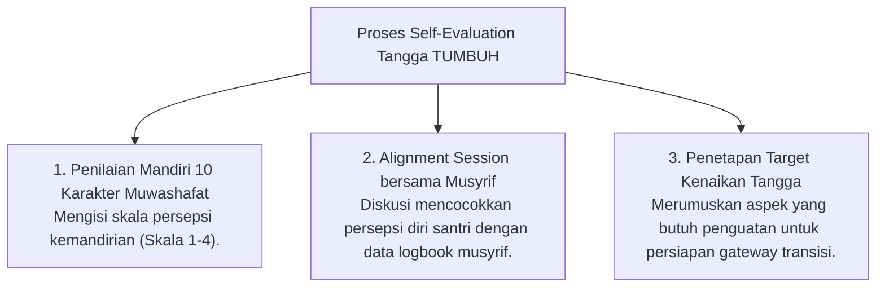

# P5-06-03: Instrumen Evaluasi Diri Tangga TUMBUH

## Status Dokumen
* **Status**: 🌟 **A+ (Tervalidasi & Siap Diimplementasikan)**
* **Sub-Domain**: `05 Assessment Framework / 06 Self Assessment`
* **Penanggung Jawab Keilmuan**: Dewan Keilmuan TUMBUH (*Pakar Desain Kurikulum Adab & Pakar Metodologi Riset*)

---

## 1. Konseptualisasi Self-Evaluation Tangga TUMBUH

Pada setiap akhir bulan, santri mengisi **Form Evaluasi Diri Tangga TUMBUH** untuk menilai persepsi tingkat kemandirian adabnya melintasi Tangga T1 (Adaptasi), T2 (Habituasi), T3 (Internalisasi), dan T4 (Qudwah).

---

## 2. Manfaat Alignment Session (Sesi Penyelarasan Persepsi)

Sesi penyelaras persepsi antara santri dan musyrif bertujuan melatih metakognisi santri agar persepsi kemampuan harinya semakin akurat dan objektif.
