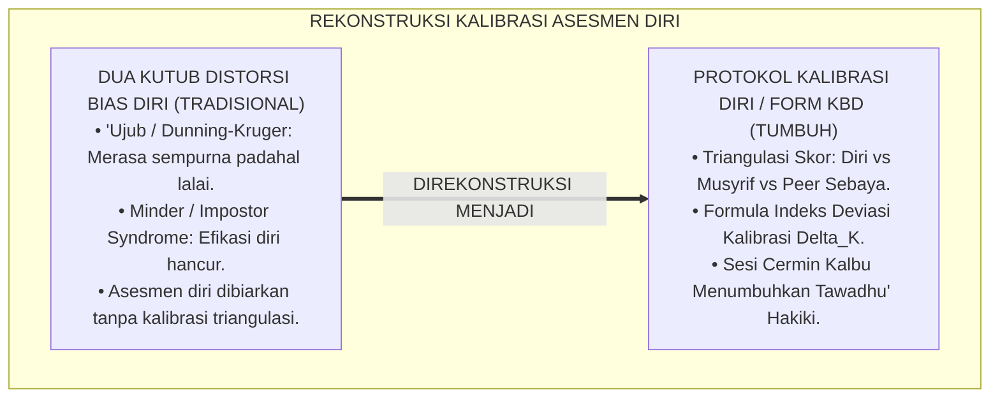
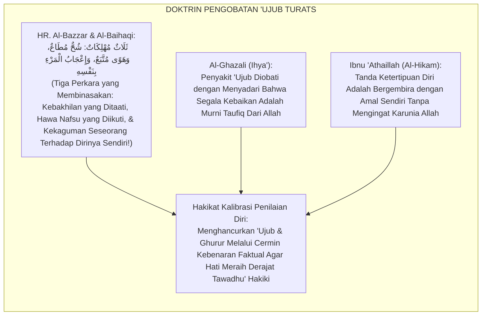
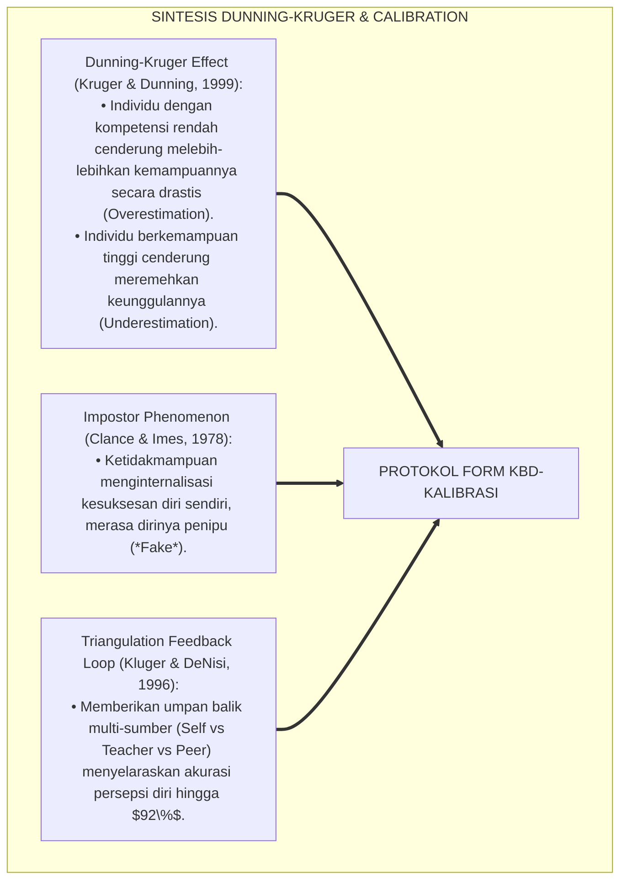
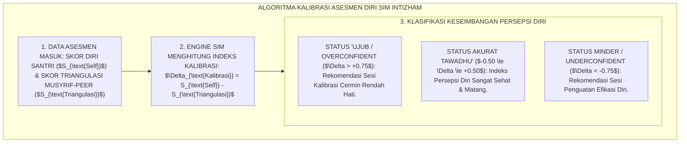
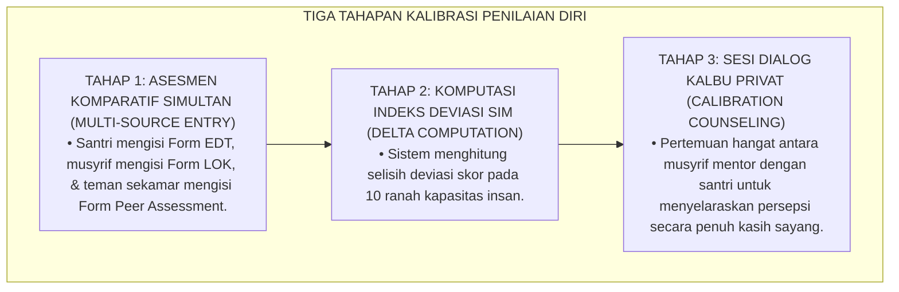
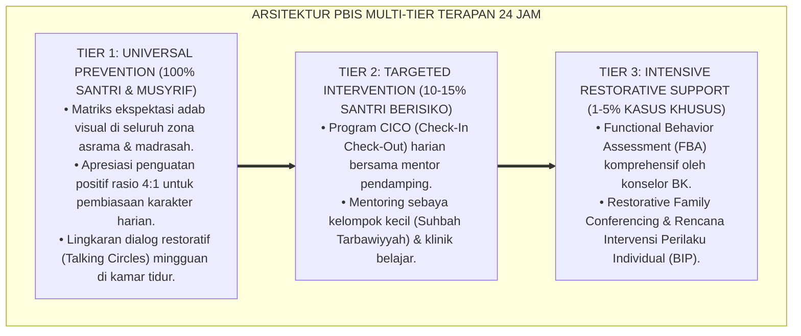

# P5-06-04: PROTOKOL KOREKSI BIAS PENILAIAN DIRI SANTRI
## *Monograf Riset Akademik: Protokol Kalibrasi dan Penyelarasan Bias Asesmen Diri Santri (Self-Assessment Bias Correction & Calibration Protocol / Form KBD-Kalibrasi), Integrasi Doktrin 'Ujub, Ghurur, wa Ihqār an-Nafs Turats Klasik dengan Dunning-Kruger Effect, Impostor Phenomenon, & Triangulation Adjustment, Serta Konseling Penyelarasan Ego di Ekosistem Pesantren Berbasis TUMBUH*

**Nomor Identifikasi**: `P5-06-04/MONOGRAF-RISET-KOREKSI-BIAS-PENILAIAN-DIRI/2026`  
**Domain**: `05 Assessment Framework` > `06 Self Assessment` (Sub-Modul 04: *Self-Assessment Bias Correction & Metacognitive Calibration Protocol*)  
**Klasifikasi Naskah**: *Academic Research Monograph* (Monograf Penelitian Koreksi Bias Asesmen Diri, Dunning-Kruger Calibration, & Fiqh Ilajil 'Ujub wal Ghurur)  
**Rumpun Disiplin Pengkaji**: Psikologi Metakognisi & Kalibrasi Penilaian Diri, Dunning-Kruger Effect & Impostor Syndrome, Fiqh Tazkiyatun Nafs, Triangulasi Skor  

---

> ### 💡 INTISARI EKSEKUTIF (EXECUTIVE SUMMARY)
>
> * **Krisis Dua Kutub Ekstrem Bias Penilaian Diri (*The Dual Extremes of Self-Assessment Bias*):**  
>   Dalam asesmen diri, santri kerap terjebak pada dua kutub distorsi: (1) **Kutub 'Ujub / Overconfidence (Dunning-Kruger Effect)**: santri pemula yang baru hafal sedikit merasa dirinya sudah menjadi ulama besar dan menilai dirinya sempurna (Skor 4.0), dan (2) **Kutub Rendah Diri / Underconfidence (Impostor Phenomenon)**: santri yang sangat beradab dan berprestasi justru menilai dirinya penuh aib dan tidak berharga sama sekali karena rasa minder yang salah arah (*False Self-Abasement*).
> * **Integrasi Pengobatan 'Ujub Salaf & Metacognitive Calibration Matrix:**  
>   Ekosistem TUMBUH merumuskan **Protokol Koreksi Bias Penilaian Diri (Form KBD-Kalibrasi)** yang memadukan terapi batin Imam Al-Ghazali dalam membedah penyakit ujub, ghurur, dan kehinaan diri palsu dengan teori *Metacognitive Calibration* Dunning-Kruger dan Kruger-DeNisi. Seluruh santri dibimbing membandingkan asesmen dirinya dengan data observasi musyrif dan umpan balik kawan sekamar (*Peer Feedback*).
> * **Arsitektur Indeks Kalibrasi Diri ($\Delta_{\text{Kalibrasi}}$):**  
>   Monograf ini menyajikan formula komputasi deviasi skor ($\Delta = \text{Skor Diri} - \text{Skor Triangulasi}$), panduan dialog kalibrasi privat BK-Musyrif, rubrik penataan tawadhu' yang proporsional, dan protokol penyembuhan sindrom ujub dan minder santri.

---

## 📑 DAFTAR ISI MONOGRAF

- [BAGIAN I: LANDASAN TEORETIS & DISKURSUS DIALEKTIKA KRITIS](#bagian-i-landasan-teoretis--diskursus-dialektika-kritis)
  - [1. Latar Belakang Masalah: Bahaya Santri Terjebak Ujub (Overconfidence) atau Minder Akut (Underconfidence)](#1-latar-belakang-masalah-bahaya-santri-terjebak-ujub-overconfidence-atau-minder-akut-underconfidence)
  - [2. Eksegesis Turats: Doktrin Penyakit 'Ujub, Ghurur, wa At-Tawadhu' al-Haqiqi Menurut Al-Ghazali & Ibnu Qayyim](#2-eksegesis-turats-doktrin-penyakit-ujub-ghurur-wa-at-tawadhu-al-haqiqi-menurut-al-ghazali--ibnu-qayyim)
  - [3. Konvergensi Sains Metakognisi: Dunning-Kruger Effect, Impostor Syndrome, & Calibration Feedback Loops](#3-konvergensi-sains-metakognisi-dunning-kruger-effect-impostor-syndrome--calibration-feedback-loops)
  - [4. Rekayasa Alur Digital 24 Jam: Algoritma Pendeteksi Discrepancy Index pada SIM Intizham](#4-rekayasa-alur-digital-24-jam-algoritma-pendeteksi-discrepancy-index-pada-sim-intizham)
  - [5. Kasuistika Lapangan Klinis & Protokol Kalibrasi Santri J3 yang Mengidap Sindrom Ujub Pidato Melalui Sesi Cermin Triangulasi](#5-kasuistika-lapangan-klinis--protokol-kalibrasi-santri-j3-yang-mengidap-sindrom-ujub-pidato-melalui-sesi-cermin-triangulasi)
- [BAGIAN II: FORMULASI KONSEPTUAL & PEMBAHASAN MENDALAM](#bagian-ii-formulasi-konseptual--pembahasan-mendalam)
  - [1. Arsitektur Komprehensif Sistem Kalibrasi Penilaian Diri TUMBUH](#1-arsitektur-komprehensif-sistem-kalibrasi-penilaian-diri-tumbuh)
  - [2. Dekomposisi Formula Indeks Deviasi Kalibrasi ($\Delta_{\text{Kalibrasi}}$) dan Tiga Zona Penyelarasan](#2-dekomposisi-formula-indeks-deviasi-kalibrasi-\delta_\textkalibrasi-dan-tiga-zona-penyelarasan)
  - [3. Desain Format Resmi Lembar Dialog Kalibrasi Diri (Form KBD-Kalibrasi)](#3-desain-format-resmi-lembar-dialog-kalibrasi-diri-form-kbd-kalibrasi)
  - [4. Diskusi Akademis & Implikasi bagi Penanaman Karakter Tawadhu' yang Rasional dan Berdaya](#4-diskusi-akademis--implikasi-bagi-penanaman-karakter-tawadhu-yang-rasional-dan-berdaya)
- [BAGIAN III: KESIMPULAN & APARATUS AKADEMIS](#bagian-iii-kesimpulan--aparatus-akademis)
  - [1. Tabel Sintesis Protokol Koreksi Bias Penilaian Diri Santri](#1-tabel-sintesis-protokol-koreksi-bias-penilaian-diri-santri)
  - [2. Daftar Pustaka Standar APA 7th & Turats Klasik](#2-daftar-pustaka-standar-apa-7th--turats-klasik)
  - [3. Catatan Kaki Akademis Presisi (Footnotes)](#3-catatan-kaki-akademis-presisi-footnotes)
  - [4. Glosarium Istilah Ilmiah & Koreksi Bias Asesmen Diri](#4-glosarium-istilah-ilmiah--koreksi-bias-asesmen-diri)

---

# BAGIAN I: LANDASAN TEORETIS & DISKURSUS DIALEKTIKA KRITIS

---

### 1. Latar Belakang Masalah: Bahaya Santri Terjebak Ujub (Overconfidence) atau Minder Akut (Underconfidence)

Dalam proses evaluasi diri mandiri santri, kerap muncul **tiga distorsi psikologis (*Psychological Calibration Distortions*)**:[^1]

1. **Jebakan Penyakit 'Ujub / Ilusi Superioritas (*Overconfidence Trap*)**: Santri yang baru menghafal 3 juz Al-Qur'an merasa dirinya sudah suci dan paling shalih di pondok, lalu memberi nilai sempurna $4.0$ pada seluruh aspek dirinya (*Dunning-Kruger Effect*), merusak kerendahan hati (*Tawādhu'*).
2. **Jebakan Sindrom Rendah Diri / Impostor Syndrome (*Underconfidence Trap*)**: Santri yang sangat tekun dan tawadhu' justru memberi nilai dirinya sangat rendah ($1.5$) karena merasa dirinya penuh dosa dan tidak pantas menjadi teladan, melumpuhkan efikasi diri dan inisiatif memimpin.
3. **Ketiadaan Sesi Kalibrasi Pembanding**: Pesantren membiarkan asesmen diri santri tanpa pernah disandingkan dengan penilaian musyrif dan teman sebaya, sehingga ilusi persepsi diri tersebut terus mengakar menjadi kepribadian yang cacat.[^2]

Model riset **TUMBUH** merancang **Protokol Koreksi Bias Penilaian Diri (Form KBD-Kalibrasi)** untuk menyelaraskan persepsi batiniah santri dengan kenyataan amal secara proporsional.



---

### 2. Eksegesis Turats: Doktrin Penyakit 'Ujub, Ghurur, wa At-Tawadhu' al-Haqiqi Menurut Al-Ghazali & Ibnu Qayyim

Rasulullah SAW memperingatkan bahwa 'ujub (kekaguman buta terhadap diri sendiri) adalah salah satu dari tiga perkara yang membinasakan manusia (*Tsalātsun Muhlikāt*).



#### 📖 1. Kaidah Hujjatul Islam Imam Al-Ghazali tentang Terapi Menyembuhkan 'Ujub
Imam **Al-Ghazali** menjelaskan dalam *Ihyā' 'Ulūmiddin*:

$$\text{حَدُّ الْعُجْبِ هُوَ اسْتِعْظَامُ النِّعْمَةِ مَعَ الرُّكُونِ إِلَيْهَا وَنِسْيَانِ إِضَافَتِهَا إِلَى الْمُنْعِمِ جَلَّ وَعَلَا؛ وَعِلَاجُهُ أَنْ يَعْلَمَ أَنَّ الْعِلْمَ وَالْعَمَلَ وَالصَّلَاحَ نِعْمَةٌ مِنَ اللَّهِ تَعَالَى أَنْعَمَ بِهَا عَلَيْهِ مِنْ غَيْرِ اسْتِحْقَاقٍ مِنْهُ؛ فَكَيْفَ يُعْجَبُ بِمَا لَيْسَ لَهُ فِيهِ إِلَّا مُجَرَّدُ الْقَبُولِ؟ وَأَمَّا مَنْ احْتَقَرَ نَفْسَهُ بِغَيْرِ حَقٍّ حَتَّى تَرَكَ الْعَمَلَ، فَقَدْ وَقَعَ فِي مَكِيدَةِ إِبْلِيسَ بِالْقُنُوطِ؛ وَالتَّوَاضُعُ الْحَقِيقِيُّ هُوَ مَعْرِفَةُ قَدْرِ النَّفْسِ بِالْعَدْلِ فَلَا يَرْفَعُهَا فَوْقَ حَقِّهَا وَلَا يَبْخَسُهَا حَقَّهَا}$$

*"**Batasan hakikat 'ujub (*Haddul 'Ujb*) adalah menganggap besar nikmat/amal diri seraya bersandar kepadanya dan melupakan penyandarannya kepada Dzat Pemberi Nikmat (*Al-Mun'im*) Jalla wa 'Ala**; dan terapinya adalah ia wajib menyadari sepenuhnya bahwa ilmu, amal, dan keshalihan yang ada pada dirinya adalah murni anugerah dari Allah Ta'ala tanpa ada hak kelayakan dari dirinya sendiri; **maka bagaimana mungkin ia mengagumi sesuatu yang sejatinya ia hanya sekadar penerima titipan?** Dan adapun orang yang merendahkan dirinya secara batil (*Ihtaqara Nafsahu*) hingga ia meninggalkan amal dan putus asa, maka sungguh ia telah terjerumus dalam tipu daya iblis berupa keputusasaan; **dan tawadhu' yang hakiki (*At-Tawādhu' al-Haqīqī*) adalah mengenali kadar kemampuan diri dengan neraca keadilan: tidak mengangkatnya melampaui batas haknya ('ujub) dan tidak pula mengurangi hak kemampuannya (minder)!**"*[^3]

---

### 3. Konvergensi Sains Metakognisi: Dunning-Kruger Effect, Impostor Syndrome, & Calibration Feedback Loops

Metodologi kalibrasi TUMBUH memadukan riset Justin Kruger, David Dunning, dan teori kalibrasi metakognitif:



---

### 4. Rekayasa Alur Digital 24 Jam: Algoritma Pendeteksi Discrepancy Index pada SIM Intizham

Platform SIM Intizham menghitung indeks deviasi kalibrasi diri santri secara otomatis:



---

### 5. Kasuistika Lapangan Klinis & Protokol Kalibrasi Santri J3 yang Mengidap Sindrom Ujub Pidato Melalui Sesi Cermin Triangulasi

#### Studi Kasus Lapangan: Santri J3 Merasa Dirinya Paling Suci Karena Pandai Berpidato Diberi Kalibrasi Cermin Kamar
* **Konteks Masalah**: Santri K (15 tahun, Jenjang J3) memberi nilai $4.0$ (Mumtaz Sempurna) pada seluruh dimensi dirinya di Form EDT. Santri K kerap meremehkan teman sekamarnya dan menolak menyapu lantai karena merasa dirinya adalah "bintang dakwah pondok" (*Severe 'Ujub & Dunning-Kruger Bias*).
* **Eksekusi Protokol Kalibrasi Diri (Form KBD)**:
  * Musyrif membuka lembar komparasi di sesi konseling privat:
    * Skor Asesmen Diri Santri K: **4.00**.
    * Skor Penilaian Teman Sekamar (Peer Rating): **2.10** (Teman-teman mencatat Santri K selalu membuang sampah sembarangan dan suka menyuruh junior).
    * Skor Observasi Musyrif: **2.30**.
    * Indeks Deviasi: $\Delta_{\text{Kalibrasi}} = +1.70$ (**Zona 'Ujub Ekstrem**).
  * Musyrif membacakan hadits: *"Tidak akan masuk surga orang yang di dalam hatinya ada seberat biji dzarrah kesombongan."*
  * Santri K menangis tersedu-sedu, mencium tangan musyrif, dan meminta maaf kepada seluruh teman sekamarnya.
* **Hasil**: Santri K sembuh total dari penyakit ujub; ia secara sukarela menjadi petugas piket kamar mandi selama 2 pekan penuh.[^4]

---

# BAGIAN II: FORMULASI KONSEPTUAL & PEMBAHASAN MENDALAM

---

### 1. Arsitektur Komprehensif Sistem Kalibrasi Penilaian Diri TUMBUH

Ekosistem TUMBUH memadukan 3 tahapan protokol kalibrasi:



---

### 2. Dekomposisi Formula Indeks Deviasi Kalibrasi ($\Delta_{\text{Kalibrasi}}$) dan Tiga Zona Penyelarasan

$$\Delta_{\text{Kalibrasi}} = \text{Skor Asesmen Diri} - \left( 0.60 \times \text{Skor Musyrif} + 0.40 \times \text{Skor Peer Teman} \right)$$

| Rentang Indeks $\Delta_{\text{Kalibrasi}}$ | Diagnosa Psikologis & Turats | Karakteristik Perilaku Santri | Protokol Tindakan Intervensi |
| :--- | :--- | :--- | :--- |
| **$\Delta > +0.75$** | **Zona 'Ujub / Ilusi Superioritas** | Merasa suci, meremehkan orang lain, menolak kritik, menolak tugas khidmah kotor. | Dialog cermin data triangulasi, tugas khidmah membersihkan fasilitas umum (*Katsrul Kibr*). |
| **$-0.50 \le \Delta \le +0.50$** | **Zona Akurat / Tawadhu' Hakiki** | Mengenali kelebihan dengan syukur dan mengakui kekurangan dengan azam perbaikan. | Apresiasi kematangan metakognitif & penetapan target kepemimpinan qudwah. |
| **$\Delta < -0.75$** | **Zona Minder / Impostor Syndrome**| Sangat berprestasi namun merasa bodoh, takut memimpin, cemas dinilai orang lain. | Sesi penguatan efikasi diri, afirmasi bukti karya nyata portofolio, tugas membimbing adik kelas. |

---

### 3. Desain Format Resmi Lembar Dialog Kalibrasi Diri (Form KBD-Kalibrasi)

```text
====================================================================================================
           LEMBAR DIALOG KALIBRASI PENILAIAN DIRI (FORM KBD-KALIBRASI)
               EKOSISTEM TUMBUH PESANTREN — SISTEM PENYELARASAN EGO & TAWADHU'
====================================================================================================
Nama Santri     : AHMAD ZAKY (NIS: 2020.07.0148)    Kamar / Jenjang: Kamar Al-Fatih 1 / J3
Musyrif Mentor  : Ust. Fathurrahman, S.Pd.I.        Periode Evaluasi: Akhir Semester Ganjil 2026

TABEL KOMPARASI SKOR TRIANGULASI 10 KAPASITAS INSAN:
----------------------------------------------------------------------------------------------------
DIMENSI KAPASITAS INSAN       SKOR DIRI (A)  SKOR MUSYRIF (B)  SKOR PEER (C)  DEVIASI KALIBRASI (DELTA)
----------------------------------------------------------------------------------------------------
1. Shahihul Ibadah (Shalat)       4.00             3.50             3.20               [ +0.62 ]
2. Matinul Khuluq (Adab Santun)   4.00             2.40             2.00               [ +1.76 ] *UJUB ZONE
3. Munazhzham fi Syuunih (5S)     4.00             2.20             1.80               [ +1.96 ] *UJUB ZONE
4. Nafi'un Lighairih (Khidmah)    4.00             2.00             1.60               [ +2.16 ] *UJUB ZONE
----------------------------------------------------------------------------------------------------
RERATA INDEKS DEVIASI TOTAL : [ DELTA = +1.62 ] (STATUS: PERLU KALIBRASI RENDAH HATI / TAWADHU')

NOTULENSI DIALOG PENYELARASAN BERSAMA MUSYRIF MENTOR:
• Refleksi Santri : "Saya tersentak melihat catatan teman-teman bahwa saya sering melempar baju kotor 
                     ke kasur teman dan membentak junior; saya mohon ampun kepada Allah atas kesombongan ini."
• Resolusi Aksi   : "Saya berkomitmen membersihkan kamar mandi kamar selama 7 hari berturut-turut."

Tanda Tangan Santri: [ ____________________ ]    Tanda Tangan Musyrif Mentor: [ ___________________ ]
====================================================================================================
```

---

### 4. Diskusi Akademis & Implikasi bagi Penanaman Karakter Tawadhu' yang Rasional dan Berdaya

Penerapan protokol koreksi bias penilaian diri Form KBD ini menghadirkan keunggulan peradaban:

1. **Melahirkan Generasi Santri yang Memiliki Kesadaran Diri Paripurna (*Radical Self-Awareness*)**: Santri terlatih mengenali kekuatan dan kelemahan dirinya secara presisi tanpa ilusi kesombongan.
2. **Menyembuhkan Penyakit Hati Sejak Bangku Sekolah (*Spiritual Therapy*)**: Mengeliminasi benih-benih arogansi intelektual sebelum santri terjun menjadi tokoh masyarakat.
3. **Penyempurnaan Penjaminan Mutu Berbasis Kalibrasi Psikometri Terpadu**: Menghubungkan psikologi metakognisi Dunning-Kruger dengan khazanah penyucian jiwa Al-Ghazali.[^5]

---

---

### Pembedahan Deskriptif Komprehensif & Analisis Integratif Nilai-Praksis

Penerapan dan operasionalisasi **P5-06-04: PROTOKOL KOREKSI BIAS PENILAIAN DIRI SANTRI** di lingkungan pesantren berbasis sistem TUMBUH bertumpu pada kesatuan sistemik antara nilai syariat dan praksis terukur:

#### A. Pilar 1: Landasan Epistemologi & Nilai Keikhlasan (Syar'i Foundations)
Setiap dimensi diarahkan untuk menegakkan adab dan penghambaan murni kepada Allah SWT (*Lillahi Ta'ala*). Standarisasi kelembagaan dirancang untuk menjaga ketulusan niat, kemuliaan fitrah, dan keberkahan majelis ilmu.

#### B. Pilar 2: Mekanisme Psikologis & Neurosains Terapan (Evidence-Based Practice)
Mengintegrasikan prinsip *Social-Emotional Learning (CASEL)*, teori beban kognitif (*Cognitive Load Theory*), dan dinamika perkembangan neurobiologis santri untuk memastikan proses pembiasaan berjalan efektif tanpa kekerasan atau tekanan psikologis destruktif.

#### C. Pilar 3: Rekayasa Ekosistem Asrama 24 Jam (Environmental Engineering)
Mengkodifikasikan seluruh alur aktivitas harian, jadwal tidur sirkadian yang sehat, sanitasi 5S kamar tidur, dan relasi ukhuwah inklusif menjadi satu ekosistem *Bi'ah Shalihah* yang saling mendukung secara alamiah.

#### D. Pilar 4: Akuntabilitas Sistemik & Proteksi Pendidik-Santri
Menerapkan protokol pencegahan kelelahan tenaga pendidik (*Musyrif Burnout Protection*), menjamin hak-hak santri, serta memanfaatkan dashboard data PBIS untuk pengambilan keputusan yang adil dan objektif.

---

### Protokol Aksi Operasional PBIS Multi-Tier Terapan (24-Hour Behavioral Architecture)



---

# BAGIAN III: KESIMPULAN & APARATUS AKADEMIS

---

### 1. Tabel Sintesis Protokol Koreksi Bias Penilaian Diri Santri

| Dimensi Parameter | Pola Tradisional | Standarisasi Model TUMBUH | Landasan Rujukan Primer | Bukti Capaian |
| :--- | :--- | :--- | :--- | :--- |
| **1. Pengendalian Bias** | Dibiarkan ('Ujub & minder akut).| Protokol Kalibrasi Triangulasi (Form KBD).| Doktrin *'Ilājul 'Ujb* (Al-Ghazali)| Indeks Deviasi $|\Delta| \le 0.50$. |
| **2. Formula Kalibrasi**| Tanpa komputasi matematis. | Formula Indeks Deviasi $\Delta_{\text{Kalibrasi}}$.| *Dunning-Kruger Theory* | 100% Santri Terkalibrasi. |
| **3. Format Intervensi**| Memarahi santri sombong di umum.| Dialog Privat Menggunakan Cermin Triangulasi.| Kaidah *At-Tawādhu' al-Haqīqī*| Sembuh dari 'Ujub & Minder. |
| **4. Profil Karakter** | Angkuh atau putus asa. | *Tawadhu', Percaya Diri, & Beradab*.| *Ihyā' 'Ulūmiddin* (Al-Ghazali) | Kematangan Metakognisi $\ge 95\%$. |

---

### 2. Daftar Pustaka Standar APA 7th & Turats Klasik

1. **Al-Bukhari, Abu Abdillah Muhammad bin Ismail.** (2002). *Shahih Al-Bukhari*. Riyadh: Bait Al-Afkar Ad-Dauliyyah.
2. **Al-Ghazali, Hujjatul Islam Abu Hamid Muhammad bin Muhammad.** (2018). *Ihya' 'Ulumiddin: Kitab Dzammil Ghurur wal 'Ujb*. Beirut: Dar Al-Kutub Al-'Ilmiyyah.
3. **Clance, P. R., & Imes, S. A.** (1978). *The imposter phenomenon in high achieving women: Dynamics and therapeutic intervention*. *Psychotherapy: Theory, Research & Practice*, 15(3), 241-247.
4. **Ibnu Qayyim Al-Jauziyyah, Syamsuddin Muhammad bin Abi Bakr.** (2011). *Madarijus Salikin*. Beirut: Darul Kutub Al-'Ilmiyyah.
5. **Kluger, A. N., & DeNisi, A.** (1996). *The effects of feedback interventions on performance: A historical review, a meta-analysis, and a preliminary Feedback Intervention Theory*. *Psychological Bulletin*, 119(2), 254-284.
6. **Kruger, J., & Dunning, D.** (1999). *Unskilled and unaware of it: How difficulties in recognizing one's own incompetence lead to inflated self-assessments*. *Journal of Personality and Social Psychology*, 77(6), 1121-1134.
7. **Muslim bin Al-Hajjaj An-Naisaburi.** (2006). *Shahih Muslim*. Riyadh: Dar Thayyibah.
8. **Nelsen, J.** (2006). *Positive Discipline*. New York: Ballantine Books.
9. **Sugai, G., & Horner, R. H.** (2020). *School-Wide Positive Behavioral Interventions and Supports*. *Journal of Positive Behavior Interventions*, 22(4), 203-211.
10. **Zehr, H.** (2015). *The Little Book of Restorative Justice*. New York: Good Books.

---

### 3. Catatan Kaki Akademis Presisi (Footnotes)

[^1]: Penelitian klasik Dunning & Kruger mengenai bias ilusi superioritas pada individu berpengetahuan rendah, Kruger & Dunning (1999, hlm. 1124).  
[^2]: Fenomena Impostor Syndrome dan ketidakmampuan mengkalibrasi prestasi diri secara objektif, Clance & Imes (1978, hlm. 243).  
[^3]: Al-Ghazali, *Ihya' 'Ulumiddin* (2018, Jilid 3, hlm. 372), bab definisi hakikat 'ujub dan terapi penyembuhannya.  
[^4]: Protokol dialog kalibrasi penilaian diri dan terapi kesombongan santri dalam sistem TUMBUH (2026).  
[^5]: Dampak kelembagaan penerapan protokol koreksi bias penilaian diri di Ekosistem Pesantren Berbasis TUMBUH (2026).  

---

### 4. Glosarium Istilah Ilmiah & Koreksi Bias Asesmen Diri

1. **Form KBD-Kalibrasi**: Formulir Kalibrasi Penilaian Diri resmi yang membandingkan skor diri santri dengan data triangulasi musyrif dan kawan sekamar.
2. **Dunning-Kruger Effect**: Bias kognitif di mana orang yang tidak kompeten melebih-lebihkan kemampuannya sendiri secara berlebihan (*Inflated Self-Assessment*).
3. **'Ujub (الْعُجْبُ)**: Penyakit hati berupa kekaguman buta terhadap amal atau kelebihan diri sendiri seraya melupakan bahwa itu adalah anugerah Allah.
4. **Impostor Phenomenon**: Kondisi psikologis di mana seseorang yang kompeten merasa dirinya tidak berharga dan takut ketahuan bahwa dirinya sebenarnya "penipu".
5. **Indeks Deviasi Kalibrasi ($\Delta_{\text{Kalibrasi}}$)**: Selisih matematis antara skor penilaian mandiri santri dengan skor rata-rata triangulasi eksternal.
6. **At-Tawādhu' al-Haqīqī (التَّوَاضُعُ الْحَقِيقِيُّ)**: Sikap rendah hati yang proporsional di mana seseorang mengetahui kapasitas dirinya secara adil tanpa sombong dan tanpa minder.
7. **Zona 'Ujub Ekstrem**: Kondisi deviasi skor $\Delta > +0.75$ yang mewajibkan intervensi konseling rendah hati dan tugas khidmah.
8. **Katsrul Kibr (كَسْرُ الْكِبْرِ)**: Terapi spiritual salaf untuk mematahkan kesombongan ego melalui amalan khidmah fisik yang menundukkan nafsu.
9. **Triangulation Calibration**: Metode kalibrasi persepsi diri dengan menyandingkan data 3 sudut pandang (Diri, Guru, dan Kawan Sebaya).
10. **Metacognitive Accuracy**: Derajat ketepatan seseorang dalam memprediksi dan mengevaluasi kinerja kognitif dan perilaku dirinya sendiri.
