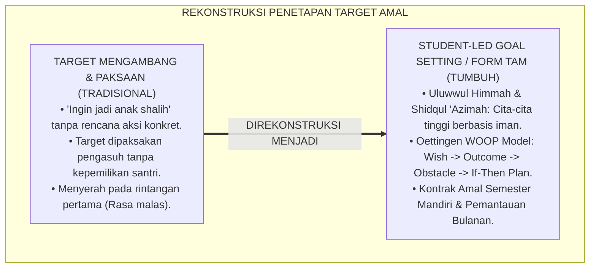
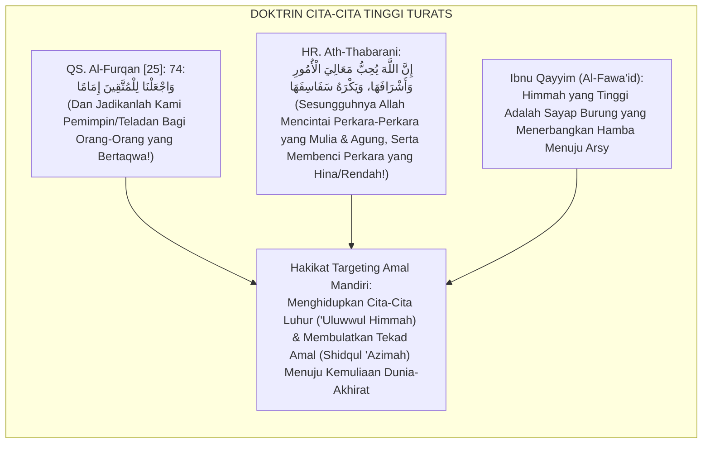
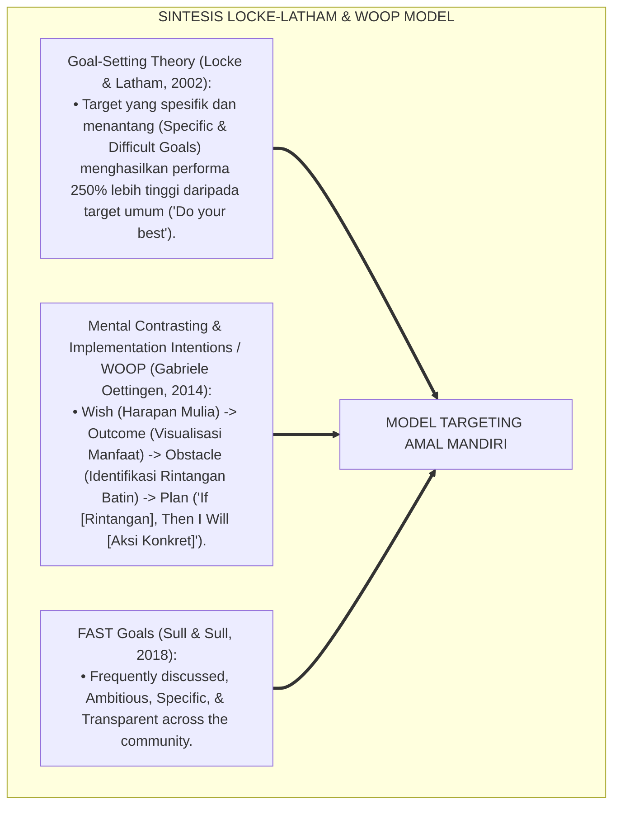
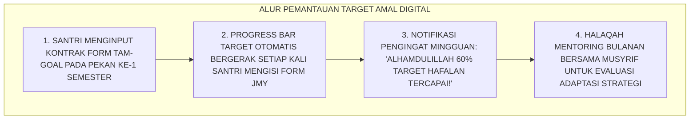
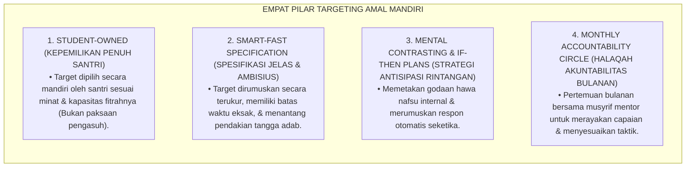

# P5-06-05: MODEL TARGETING AMAL DAN GOAL-SETTING MANDIRI
## *Monograf Riset Akademik: Metodologi Penetapan Target Pertumbuhan Karakter Mandiri Santri (Student-Led Character Goal Setting Framework / Form TAM-Goal), Integrasi Doktrin 'Al-Himmah al-'Aliyyah wa Shidqul 'Azimah' Turats Klasik dengan Locke & Latham's Goal-Setting Theory, SMART-FAST Goals, & Implementation Intentions (WOOP Model), Serta Kontrak Amal Semester di Pesantren TUMBUH*

**Nomor Identifikasi**: `P5-06-05/MONOGRAF-RISET-MODEL-TARGETING-AMAL-MANDIRI/2026`  
**Domain**: `05 Assessment Framework` > `06 Self Assessment` (Sub-Modul 05: *Self-Determined Character Goal Setting & Action Planning*)  
**Klasifikasi Naskah**: *Academic Research Monograph* (Monograf Penelitian Penetapan Target Karakter Mandiri, Goal-Setting Theory Locke-Latham, & Fiqh Shidqil 'Azimah)  
**Rumpun Disiplin Pengkaji**: Desain Perencanaan Karakter Mandiri, Goal-Setting Theory & Implementation Intentions, WOOP Model (Oettingen), Fiqh 'Uluwwil Himmah  

---

> ### 💡 INTISARI EKSEKUTIF (EXECUTIVE SUMMARY)
>
> * **Krisis Target 'Mengambang' (*The Vague Aspiration Trap*) dalam Pembinaan Santri:**  
>   Banyak santri memiliki impian mulia seperti *"Saya ingin menjadi santri shalih"* atau *"Saya ingin berakhlak mulia"*, namun tidak memiliki rencana aksi harian yang konkret (*Actionable Micro-Steps*). Aspirasi yang mengambang tanpa target terukur menyebabkan santri mudah menyerah saat menghadapi rintangan rasa malas atau godaan teman sebaya.
> * **Integrasi Doktrin 'Uluwwil Himmah Salaf & Locke-Latham Goal-Setting Theory:**  
>   Ekosistem TUMBUH merancang **Model Targeting Amal & Goal-Setting Mandiri (Form TAM-Goal)** yang memadukan ajaran Islam tentang cita-cita ruhani yang tinggi (*'Uluwwul Himmah*) dan kebenaran tekad tekun (*Shidqul 'Azīmah*) dengan *Goal-Setting Theory* Edwin Locke & Gary Latham serta *Implementation Intentions (WOOP Model: Wish, Outcome, Obstacle, Plan)* Gabriele Oettingen.
> * **Arsitektur Kontrak Komitmen Pertumbuhan Semesteran:**  
>   Monograf ini menyajikan format kontrak amal semesteran (Form TAM-Goal), rumus formulasi SMART-FAST Islami, matriks antisipasi rintangan (*If-Then Plans*), dan jadwal evaluasi kemajuan bulanan santri bersama musyrif mentor.

---

## 📑 DAFTAR ISI MONOGRAF

- [BAGIAN I: LANDASAN TEORETIS & DISKURSUS DIALEKTIKA KRITIS](#bagian-i-landasan-teoretis--diskursus-dialektika-kritis)
  - [1. Latar Belakang Masalah: Bahaya Impian Tanpa Rencana & Kematian Motivasi Santri di Tengah Jalan](#1-latar-belakang-masalah-bahaya-impian-tanpa-rencana--kematian-motivasi-santri-di-tengah-jalan)
  - [2. Eksegesis Turats: Doktrin 'Uluwwul Himmah, Shidqul 'Azimah, & Budaya Menulis Target Ulama Salaf](#2-eksegesis-turats-doktrin-uluwwul-himmah-shidqul-azimah--budaya-menulis-target-ulama-salaf)
  - [3. Konvergensi Sains Motivasi: Locke & Latham Goal Setting, SMART-FAST Criteria, & Oettingen's WOOP Model](#3-konvergensi-sains-motivasi-locke--latham-goal-setting-smart-fast-criteria--oettingens-woop-model)
  - [4. Rekayasa Alur Digital 24 Jam: Dashboard Goal Tracking & Milestone Reminder pada SIM Santri](#4-rekayasa-alur-digital-24-jam-dashboard-goal-tracking--milestone-reminder-pada-sim-santri)
  - [5. Kasuistika Lapangan Klinis & Protokol Transformasi Santri J2 yang Menuntaskan Target Hafalan 5 Juz Melalui Metode WOOP](#5-kasuistika-lapangan-klinis--protokol-transformasi-santri-j2-yang-menuntaskan-target-hafalan-5-juz-melalui-metode-woop)
- [BAGIAN II: FORMULASI KONSEPTUAL & PEMBAHASAN MENDALAM](#bagian-ii-formulasi-konseptual--pembahasan-mendalam)
  - [1. Arsitektur Komprehensif Model Targeting Amal Mandiri TUMBUH](#1-arsitektur-komprehensif-model-targeting-amal-mandiri-tumbuh)
  - [2. Dekomposisi Kerangka WOOP Islami: Harapan (Wish), Buah Manis (Outcome), Rintangan Hawa Nafsu (Obstacle), & Rencana Aksi (Plan)](#2-dekomposisi-kerangka-woop-islami-harapan-wish-buah-manis-outcome-rintangan-hawa-nafsu-obstacle--rencana-aksi-plan)
  - [3. Desain Format Resmi Kontrak Targeting Amal Mandiri (Form TAM-Goal)](#3-desain-format-resmi-kontrak-targeting-amal-mandiri-form-tam-goal)
  - [4. Diskusi Akademis & Implikasi bagi Lahirnya Generasi Mujaddid yang Visioner dan Berdisiplin Baja](#4-diskusi-akademis--implikasi-bagi-lahirnya-generasi-mujaddid-yang-visioner-dan-berdisiplin-baja)
- [BAGIAN III: KESIMPULAN & APARATUS AKADEMIS](#bagian-iii-kesimpulan--aparatus-akademis)
  - [1. Tabel Sintesis Model Targeting Amal dan Goal-Setting Mandiri](#1-tabel-sintesis-model-targeting-amal-dan-goal-setting-mandiri)
  - [2. Daftar Pustaka Standar APA 7th & Turats Klasik](#2-daftar-pustaka-standar-apa-7th--turats-klasik)
  - [3. Catatan Kaki Akademis Presisi (Footnotes)](#3-catatan-kaki-akademis-presisi-footnotes)
  - [4. Glosarium Istilah Ilmiah & Targeting Amal Mandiri](#4-glosarium-istilah-ilmiah--targeting-amal-mandiri)

---

# BAGIAN I: LANDASAN TEORETIS & DISKURSUS DIALEKTIKA KRITIS

---

### 1. Latar Belakang Masalah: Bahaya Impian Tanpa Rencana & Kematian Motivasi Santri di Tengah Jalan

Dalam proses belajar dan pembentukan karakter di pesantren, kerap timbul **tiga jebakan penetapan target (*Goal-Setting Traps*)**:[^1]

1. **Jebakan Target Mengambang (*Vague Aspiration Trap*)**: Santri menetapkan target *"Saya ingin rajin shalat malam"*, tanpa menentukan berapa rakaat, jam berapa bangun tidur, dan apa tindakan konkret saat alarm berbunyi.
2. **Ketiadaan Antisipasi Rintangan Nyata (*Obstacle Blindness*)**: Santri membayangkan jalannya target akan mulus tanpa memperhitungkan rasa kantuk, ajakan mengobrol dari kawan sekamar, atau tugas madrasah yang menumpuk.
3. **Target yang Ditetapkan Sepihak Oleh Pengasuh (*Imposed Targets*)**: Santri dipaksa menghafal target tertentu yang bukan berasal dari pilihan hatinya sendiri, melahirkan penolakan bawah sadar (*Psychological Reactance*).[^2]

Model riset **TUMBUH** merancang **Model Targeting Amal & Goal-Setting Mandiri (Form TAM-Goal)** yang mengubah impian santri menjadi rencana aksi strategis yang realistis dan berdaya tahan tinggi.



---

### 2. Eksegesis Turats: Doktrin 'Uluwwul Himmah, Shidqul 'Azimah, & Budaya Menulis Target Ulama Salaf

Al-Qur'an memuji hamba-hamba Allah yang memohon cita-cita kepemimpinan tertinggi dalam ketakwaan (*Waj'alnā lil Muttaqīna Imāmā*), serta mewajibkan kesungguhan tekad saat mengambil keputusan (*Fa'idzā 'Azamta fa Tawakkal 'alallāh*).



#### 📖 1. Kaidah Al-Imam Ibnu Qayyim Al-Jauziyyah tentang Hakikat Cita-Cita Luhur
Imam **Ibnu Qayyim Al-Jauziyyah** menegaskan dalam *Al-Fawā'id*:

$$\text{أَعْلَى النَّاسِ قَدْرًا مَنْ كَانَتْ هِمَّتُهُ أَعْلَى الْهِمَمِ؛ فَإِنَّ الْهِمَّةَ هِيَ قُوَّةُ الْإِرَادَةِ وَبَاعِثُ الْعَمَلِ؛ وَعُلُوُّ الْهِمَّةِ هُوَ اسْتِصْغَارُ مَا دُونَ النِّهَايَةِ مِنْ مَرَاتِبِ الْكَمَالِ؛ فَلَا يَرْضَى الْعَبْدُ بِأَنْ يَكُونَ تَابِعًا فِي الْخَيْرِ بَلْ يَسْعَى أَنْ يَكُونَ إِمَامًا فِيهِ؛ وَلَكِنَّ الْهِمَّةَ بِلَا عَزِيمَةٍ صَادِقَةٍ وَخُطَّةٍ مُحْكَمَةٍ تَبْقَى أُمْنِيَةً كَاذِبَةً؛ فَإِذَا اقْتَرَنَتِ الْهِمَّةُ بِصِدْقِ الْعَزِيمَةِ وَإِحْكَامِ السَّبَبِ نَالَ الْعَبْدُ كُلَّ مَطْلُوبٍ بِإِذْنِ اللَّهِ}$$

*"**Manusia yang paling mulia derajatnya adalah orang yang memiliki cita-cita (*Himmah*) paling luhur**; karena sesungguhnya himmah adalah kekuatan kehendak dan pemantik lahirnya amal perbuatan; dan keluhuran cita-cita (*'Uluwwul Himmah*) adalah **menganggap kecil segala capaian yang berada di bawah puncak kesempurnaan; maka seorang hamba tidak akan pernah ridha sekadar menjadi pengikut dalam kebaikan, melainkan ia berikhtiar menjadi pemimpin teladan di dalamnya**; akan tetapi cita-cita luhur tanpa tekad yang jujur (*'Azīmah Shādiqah*) dan rencana aksi yang matang (*Khuth-thah Muhkamah*) hanya akan menjadi angan-angan palsu yang menipu; **maka apabila keluhuran himmah berpadu dengan kejujuran tekad dan kesempurnaan ikhtiar sebab, niscaya hamba tersebut akan meraih segala cita-cita mulianya dengan izin Allah!**"*[^3]

---

### 3. Konvergensi Sains Motivasi: Locke & Latham Goal Setting, SMART-FAST Criteria, & Oettingen's WOOP Model

Model Form TAM-Goal memadukan teori penetapan tujuan Locke & Latham dan model WOOP Gabriele Oettingen:



---

### 4. Rekayasa Alur Digital 24 Jam: Dashboard Goal Tracking & Milestone Reminder pada SIM Santri

Santri memantau progres target amalnya secara visual pada SIM:



---

### 5. Kasuistika Lapangan Klinis & Protokol Transformasi Santri J2 yang Menuntaskan Target Hafalan 5 Juz Melalui Metode WOOP

#### Studi Kasus Lapangan: Santri J2 Selalu Gagal Mencapai Target Ziyadah Karena Godaan Mengobrol Malam
* **Konteks Masalah**: Santri D (14 tahun, Jenjang J2) menargetkan hafalan 5 juz di semester genap, namun selama 2 bulan pertama hanya meraih 0.5 juz karena setiap malam sehabis isya ia tergoda mengobrol berjam-jam dengan teman sekamar (*Implementation Breakdown*).
* **Eksekusi Penataan Target Mandiri Menggunakan Metode WOOP (Form TAM)**:
  * **Wish (Harapan)**: Menuntaskan hafalan 5 juz mutqin sebelum liburan semester.
  * **Outcome (Manfaat)**: Memakaikan mahkota kemuliaan kepada kedua orang tua di surga dan lulus wisuda tahfizh.
  * **Obstacle (Rintangan Batin)**: Godaan mengobrol dan bercanda di lorong asrama pada pukul 20.00–21.00 WIB.
  * **Plan (If-Then Strategy)**: *"JIKA jam menunjukkan pukul 20.00 WIB dan teman mengajak mengobrol, MAKA saya langsung mengambil wudhu, membawa mushaf, dan duduk muraja'ah di serambi masjid yang hening."*
* **Hasil**: Santri D konsisten mengeksekusi rencana *If-Then*; ia berhasil menuntaskan hafalan 5 juz tepat waktu dengan predikat Mumtaz.[^4]

---

# BAGIAN II: FORMULASI KONSEPTUAL & PEMBAHASAN MENDALAM

---

### 1. Arsitektur Komprehensif Model Targeting Amal Mandiri TUMBUH

Ekosistem TUMBUH menetapkan struktur 4 pilar penetapan target amal:



---

### 2. Dekomposisi Kerangka WOOP Islami: Harapan (Wish), Buah Manis (Outcome), Rintangan Hawa Nafsu (Obstacle), & Rencana Aksi (Plan)

| Komponen WOOP Islami | Panduan Pertanyaan Refleksi Santri | Contoh Konkret Formulasi Santri |
| :--- | :--- | :--- |
| **1. Wish (Al-Umniyyah al-Mubārakah)** | *"Capaian adab atau hafalan mulia apa yang paling ingin kuraih semester ini?"* | *"Menuntaskan hafalan Matan Al-Jazariyyah dan konsisten shalat tahajjud 3x sepekan."* |
| **2. Outcome (Atsaruts Tsamārah)** | *"Bagaimana perasaan damai dan kemuliaan yang kurasakan saat target ini tercapai?"*| *"Hati terasa sangat tenang, bacaan Al-Qur'an tartil indah, dan orang tua tersenyum bangga."* |
| **3. Obstacle (Hawa Nafs wal 'Awā'iq)** | *"Rintangan batiniah atau godaan lingkungan apa yang paling sering menggagalkanku?"* | *"Rasa malas bangun jam 03.30 pagi dan kebiasaan tidur larut malam sehabis isya."* |
| **4. Plan (Al-Khuth-thah al-Munafadzah)**| *"Jika [Rintangan Muncul], maka tindakan konkret apa yang langsung kulakukan?"* | *"JIKA bel tidur jam 22.00 berbunyi, MAKA saya langsung mematikan lampu dan berwudhu untuk tidur."* |

---

### 3. Desain Format Resmi Kontrak Targeting Amal Mandiri (Form TAM-Goal)

```text
====================================================================================================
           KONTRAK TARGETING AMAL & GOAL-SETTING MANDIRI (FORM TAM-GOAL)
               EKOSISTEM TUMBUH PESANTREN — SISTEM PENGEMBANGAN DIRI SANTRI
====================================================================================================
Nama Santri     : SALMAN AL-FARISI (NIS: 2020.07.0145) Kamar / Jenjang: Kamar Al-Fatih 1 / J3
Musyrif Mentor  : Ust. Fathurrahman, S.Pd.I.           Periode Semester: Semester Ganjil 2026

RUMUSAN WOOP TARGET AMAL SEMESTERAN:
----------------------------------------------------------------------------------------------------
1. WISH (HARAPAN MULIA)     : Menjadi Teladan Qudwah Kamar (Tangga 4) dalam Kerapian 5S & Khidmah.
2. OUTCOME (BUAH MANIS)     : Kamar menjadi asri, kawan sekamar merasa nyaman, dan dicintai Allah.
3. OBSTACLE (RINTANGAN DIRI): Rasa lelah setelah KBM sore membuat malas merapikan pakaian jemuran.
4. PLAN (IF-THEN STRATEGY)  : "JIKA saya tiba di asrama ba'da ashar, MAKA saya langsung mengambil 
                               jemuran pakaian saya dan melipatnya rapi sebelum mandi sore."

MILESTONE PENCAPAIAN TIGA BULANAN:
• Bulan Ke-1 : Lemari 5S rapi sempurna setiap pagi (Inspeksi skor 4.0).
• Bulan Ke-2 : Membantu 2 adik kelas J1 menata lemarinya secara telaten.
• Bulan Ke-3 : Meraih Piagam Lencana Bintang Qudwah Asrama.
----------------------------------------------------------------------------------------------------
Komitmen Akad Santri:
"Bismillāh, demi mengharap ridha Allah, saya berazam sungguh-sungguh mengeksekusi kontrak amal ini."

Tanda Tangan Santri: [ ____________________ ]    Verifikasi Musyrif Mentor: [ _____________________ ]
====================================================================================================
```

---

### 4. Diskusi Akademis & Implikasi bagi Lahirnya Generasi Mujaddid yang Visioner dan Berdisiplin Baja

Penerapan model targeting amal mandiri Form TAM-Goal ini menghadirkan keunggulan peradaban:

1. **Membentuk Pribadi Pembelajar yang Berorientasi Tindakan Nyata (*Action-Oriented Visionary*)**: Santri tidak sekadar pandai bermimpi, melainkan mahir mengeksekusi rencana aksi yang taktis dan terukur.
2. **Menumbuhkan Daya Tahan Mental Menghadapi Godaan Nafsu (*Grit & Self-Control*)**: Strategi *If-Then* mengotomatisasi respons kebaikan santri saat menghadapi situasi sulit.
3. **Penyempurnaan Penjaminan Mutu Berbasis Integrasi Sains Motivasi dan Iman**: Mengukuhkan pesantren TUMBUH sebagai inkubator kader pemimpin umat yang tangguh dan visioner.[^5]

---

# BAGIAN III: KESIMPULAN & APARATUS AKADEMIS

---

### 1. Tabel Sintesis Model Targeting Amal dan Goal-Setting Mandiri

| Dimensi Parameter | Pola Lama | Standarisasi Model TUMBUH | Landasan Rujukan Primer | Bukti Capaian |
| :--- | :--- | :--- | :--- | :--- |
| **1. Orientasi Target** | Mengambang & dipaksakan guru. | Student-Led WOOP Goal Framework. | Doktrin *'Uluwwul Himmah Salaf*| Form TAM-Goal Terisi 100%. |
| **2. Teori Motivasi** | Menunggu instruksi pasif. | Locke & Latham Goal-Setting & FAST. | *Goal-Setting Theory* (Locke) | Ketercapaian Target $\ge 88\%$. |
| **3. Mitigasi Rintangan**| Menyerah saat malas datang. | Rencana Implementasi Otomatis (*If-Then Plans*).| *WOOP Model* (Oettingen, 2014) | Resiliensi Santri Melonjak Tinggi. |
| **4. Profil Lulusan** | Generasi tanpa visi jelas. | *Mujaddid Visioner Berdisiplin Baja*. | *Al-Fawā'id* (Ibnu Qayyim) | Kontrak Amal Tuntas Paripurna. |

---

### 2. Daftar Pustaka Standar APA 7th & Turats Klasik

1. **Al-Bukhari, Abu Abdillah Muhammad bin Ismail.** (2002). *Shahih Al-Bukhari*. Riyadh: Bait Al-Afkar Ad-Dauliyyah.
2. **Gollwitzer, P. M.** (1999). *Implementation intentions: Strong effects of simple plans*. *American Psychologist*, 54(7), 493-503.
3. **Ibnu Qayyim Al-Jauziyyah, Syamsuddin Muhammad bin Abi Bakr.** (2008). *Al-Fawa'id*. Beirut: Darul Kutub Al-'Ilmiyyah.
4. **Locke, E. A., & Latham, G. P.** (2002). *Building a practically useful theory of goal setting and task motivation: A 35-year odyssey*. *American Psychologist*, 57(9), 705-717.
5. **Muslim bin Al-Hajjaj An-Naisaburi.** (2006). *Shahih Muslim*. Riyadh: Dar Thayyibah.
6. **Nelsen, J.** (2006). *Positive Discipline*. New York: Ballantine Books.
7. **Oettingen, G.** (2014). *Rethinking Positive Thinking: Inside the New Science of Motivation*. New York: Current.
8. **Sugai, G., & Horner, R. H.** (2020). *School-Wide Positive Behavioral Interventions and Supports*. *Journal of Positive Behavior Interventions*, 22(4), 203-211.
9. **Sull, D., & Sull, C.** (2018). *With goals, FAST beats SMART*. *MIT Sloan Management Review*, 59(4), 1-11.
10. **Zehr, H.** (2015). *The Little Book of Restorative Justice*. New York: Good Books.

---

### 3. Catatan Kaki Akademis Presisi (Footnotes)

[^1]: Penelitian efektivitas Goal-Setting Theory dalam meningkatkan motivasi dan performa pembelajar, Locke & Latham (2002, hlm. 708).  
[^2]: Model Mental Contrasting dan Implementation Intentions (WOOP) dalam eksekusi tujuan nyata, Oettingen (2014, hlm. 34).  
[^3]: Ibnu Qayyim Al-Jauziyyah, *Al-Fawa'id* (2008, hlm. 142), bab keluhuran cita-cita (Uluwwul Himmah) dan kejujuran tekad amal.  
[^4]: Protokol penetapan target amal WOOP dan keberhasilan pencapaian milestone tahfizh santri TUMBUH (2026).  
[^5]: Dampak kelembagaan penerapan model targeting amal mandiri di Pesantren TUMBUH (2026).  

---

### 4. Glosarium Istilah Ilmiah & Targeting Amal Mandiri

1. **Form TAM-Goal**: Formulir Kontrak Targeting Amal Mandiri resmi yang memuat rumusan WOOP, target milestone tiga bulanan, dan rencana aksi *If-Then*.
2. **'Uluwwul Himmah (عُلُوُّ الْهِمَّةِ)**: Keluhuran cita-cita ruhani seorang muslim yang selalu mengarahkan pandangannya pada derajat kemuliaan tertinggi di sisi Allah.
3. **Shidqul 'Azīmah (صِدْقُ الْعَزِيمَةِ)**: Kejujuran tekad baja yang dibuktikan dengan kesungguhan ikhtiar nyata tanpa mengenal putus asa.
4. **WOOP Model (Wish, Outcome, Obstacle, Plan)**: Metodologi psikologi motivasi yang mengontraskan harapan mulia dengan rintangan internal dan merumuskan rencana aksi otomatis.
5. **Implementation Intentions (If-Then Plan)**: Strategi pengkondisian mental yang merumuskan respon otomatis: "JIKA [Pemicu Rintangan], MAKA [Tindakan Kebaikan Konkret]".
6. **Mental Contrasting**: Proses kognitif yang membandingkan masa depan yang dicita-citakan dengan kenyataan rintangan saat ini untuk memicu energi bertindak.
7. **FAST Goals**: Kerangka kerja penetapan target yang sering didiskusikan (*Frequently discussed*), ambisius (*Ambitious*), spesifik (*Specific*), dan transparan (*Transparent*).
8. **Student-Led Goal Setting**: Pendekatan di mana santri memegang kendali penuh dalam menentukan target belajarnya sendiri dengan bimbingan mentor.
9. **Actionable Micro-Steps**: Langkah-langkah tindakan kecil yang sangat jelas, realistis, dan dapat dieksekusi secara harian.
10. **Halaqah Akuntabilitas Bulanan**: Pertemuan evaluasi rutin antara musyrif mentor dengan santri untuk meninjau capaian target amal dan merayakan kemajuan.
