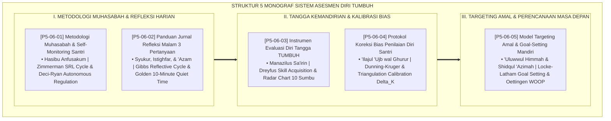

# P5-06: DOKUMEN INDUK SISTEM ASESMEN DIRI DAN JURNAL REFLEKSI SANTRI
## *Arsitektur Metodologi Muhasabah, Evaluasi Mandiri, dan Penetapan Target Karakter (Metodologi Muhasabah SRL Form MDS, Jurnal Refleksi Malam 3 Pertanyaan Form JRM-3P, Rubrik Evaluasi Diri Tangga Kemandirian Form EDT, Protokol Kalibrasi Bias Penilaian Diri Form KBD, Serta Model Targeting Amal WOOP Form TAM-Goal) di Ekosistem TUMBUH Pesantren*

**Nomor Identifikasi**: `P5-05/DOKUMEN-INDUK-SISTEM-ASESMEN-DIRI-REFLEKSI/2026`  
**Domain**: `05 Assessment Framework` > `06 Self Assessment` (Gugus Sub-Domain 06: *Comprehensive Student Self-Assessment & Reflective Journaling Systems*)  
**Klasifikasi Naskah**: *Master Architecture & Navigation Monograph* (Dokumen Induk Peta Jalan Riset & Navigasi 5 Monograf Ilmiah Sistem Asesmen Diri)  
**Rumpun Disiplin Pengkaji**: Desain Asesmen Diri Santri, Metakognisi & Self-Regulated Learning (SRL), Gibbs Reflective Cycle & WOOP Model, Fiqh Tazkiyatun Nafs  

---

> ### 💡 INTISARI EKSEKUTIF (EXECUTIVE SUMMARY)
>
> * **Kedudukan Luhur Gugus Sistem Asesmen Diri dan Jurnal Refleksi:**  
>   Gugus *Self Assessment (Sistem Asesmen Diri dan Jurnal Refleksi Santri)* merupakan mahkota pembinaan fitrah (*Crown of Fitrah Cultivation*) dalam ekosistem TUMBUH. Gugus ini mengubah santri dari objek penerima penilaian pasif menjadi subjek pembelajar mandiri yang memiliki integritas batiniah (*Self-Regulated & Autonomous Learner*), mampu menghisab amalnya sendiri secara jujur, dan bertekad mendaki tangga kematangan karakter sepanjang hayat.
> * **Integrasi Holistik Turats & Konsensus Sains Metakognisi:**  
>   Gugus riset ini memadukan khazanah agung Islam tentang hisab diri sebelum hisab akhirat (*Hāsibū Anfusakum*), jiwa kritis penyadar diri (*An-Nafs al-Lawwāmah*), perjalanan hati antara syukur dan istighfar (*Muthāla'atul Minnah wa 'Aibin Nafs*), derajat pendakian ruhani (*Manāzilus Sā'irīn*), terapi kesombongan nafsu (*'Ilājul 'Ujb*), dan cita-cita luhur (*'Uluwwul Himmah*) dengan konsensus sains psikologi internasional (*Zimmerman SRL Cycle, Deci-Ryan SDT, Gibbs Reflective Cycle, Dreyfus Model, Dunning-Kruger Calibration, dan Oettingen WOOP Goal Setting*).
> * **Struktur Lengkap 5 Berkas Monograf Riset Ilmiah:**  
>   Dokumen induk ini memetakan dan menghubungkan 5 berkas monograf penelitian akademik komprehensif (~140 KB total riset) yang menyajikan lembar muhasabah 3 fase, buku saku refleksi malam 3P, rubrik tangga kemandirian 10 kapasitas, lembar kalibrasi triangulasi cermin batin, dan kontrak target amal mandiri semesteran.

---

## 📑 PETA NAVIGASI LIMA MONOGRAF RISET SISTEM ASESMEN DIRI

Berikut adalah daftar lengkap 5 monograf riset akademik dalam gugus **`06 Self Assessment`**:

---

## 📚 DESKRIPSI RINGKAS 5 BERKAS MONOGRAF

1. **[P5-06-01: Metodologi Muhasabah dan Self-Monitoring Santri](file:///c:/xampp/htdocs/tumbuh/05%20Assessment%20Framework/06%20Self%20Assessment/P5-06-01-Metodologi-Muhasabah-dan-Self-Monitoring-Santri.md)**  
   *Membahas siklus 3 fase regulasi diri (Musyaradhah Pagi, Muraqabah Siang, Muhasabah Malam), wasiat Sayyidina Umar RA, teori Self-Regulated Learning (SRL) Zimmerman, dan formulir Form MDS-Muhasabah.*
2. **[P5-06-02: Panduan Jurnal Refleksi Malam 3 Pertanyaan](file:///c:/xampp/htdocs/tumbuh/05%20Assessment%20Framework/06%20Self%20Assessment/P5-06-02-Panduan-Jurnal-Refleksi-Malam-3-Pertanyaan.md)**  
   *Membahas triad pertanyaan emas saku Form JRM-3P (Syukur, Istighfar, 'Azam), doktrin Sayyidul Istighfar & Muthala'atul Minnah, siklus refleksi Graham Gibbs, dan tradisi Golden 10-Minute Quiet Time kamar asrama.*
3. **[P5-06-03: Instrumen Evaluasi Diri Tangga TUMBUH](file:///c:/xampp/htdocs/tumbuh/05%20Assessment%20Framework/06%20Self%20Assessment/P5-06-03-Instrumen-Evaluasi-Diri-Tangga-TUMBUH.md)**  
   *Membahas pemetaan posisi kematangan 4 anak tangga (Terbimbing $\rightarrow$ Mandiri $\rightarrow$ Penggerak $\rightarrow$ Qudwah), doktrin Manazilus Sa'irin Al-Harawi, model kemahiran Dreyfus, dan grafik radar visual 10 sumbu Form EDT-TUMBUH.*
4. **[P5-06-04: Protokol Koreksi Bias Penilaian Diri Santri](file:///c:/xampp/htdocs/tumbuh/05%20Assessment%20Framework/06%20Self%20Assessment/P5-06-04-Protokol-Koreksi-Bias-Penilaian-Diri-Santri.md)**  
   *Membahas mitigasi sindrom 'ujub (overconfidence) dan minder (impostor syndrome), terapi batin Al-Ghazali, kalibrasi Dunning-Kruger, formula indeks deviasi $\Delta_{\text{Kalibrasi}}$, dan dialog cermin Form KBD-Kalibrasi.*
5. **[P5-06-05: Model Targeting Amal dan Goal-Setting Mandiri](file:///c:/xampp/htdocs/tumbuh/05%20Assessment%20Framework/06%20Self%20Assessment/P5-06-05-Model-Targeting-Amal-dan-Goal-Setting-Mandiri.md)**  
   *Membahas perumusan target semesteran mandiri santri, doktrin 'Uluwwul Himmah & Shidqul 'Azimah Ibnu Qayyim, Goal-Setting Theory Locke-Latham, model WOOP (Wish, Outcome, Obstacle, Plan), dan kontrak amal Form TAM-Goal.*

---

## 🎯 STANDAR PENJAMINAN MUTU SISTEM ASESMEN DIRI

Penerapan gugus **Sistem Asesmen Diri dan Jurnal Refleksi Santri (Self Assessment)** menjamin bahwa:
1. **Lahirnya Santri Mukmin yang Memiliki Disiplin Diri Mandiri (*True Self-Regulated Believer*)**: Santri istiqamah menjaga ibadah dan adab atas dorongan cinta kepada Allah tanpa ketergantungan pengawasan fisik.
2. **Kesehatan Mental dan Kesejahteraan Emosional yang Prima (*Flourishing Emotional Well-Being*)**: Santri menikmati kedamaian tidur dan optimisme hidup melalui pembiasaan syukur dan taubat harian.
3. **Pemberdayaan Visi Kepemimpinan Santri Menuju Derajat Qudwah (*Visionary Moral Leaders*)**: Mengantarkan santri menjadi kader pembaharu umat yang berwawasan luas, rendah hati, dan berdisiplin baja.
