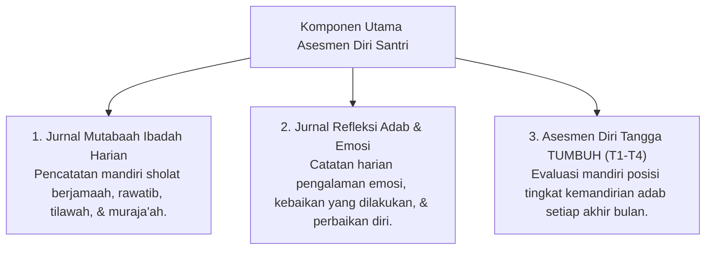

# P5-06: Sistem Asesmen Diri dan Jurnal Refleksi Santri

## Status Dokumen
* **Status**: 🌟 **A+ (Tervalidasi & Siap Diimplementasikan)**
* **Sub-Domain**: `05 Assessment Framework / 06 Self Assessment`
* **Penanggung Jawab Keilmuan**: Dewan Keilmuan TUMBUH (*Pakar Psikologi Belajar & Pakar Bimbingan Konseling*)

---

## 1. Konseptualisasi Self-Assessment & Muhasabah

Asesmen diri santri berlandaskan tradisi **Muhasabah an-Nafs** (introspeksi diri) dan teori psikologi **Self-Monitored Learning**. Santri diajarkan memantau, mencatat, dan mengevaluasi ibadah serta adabnya sendiri secara jujur.

---

## 2. Struktur Jurnal Refleksi Malam Santri (Daily Reflection Journal)

Sebelum tidur (selama 10 menit), santri mengisi 3 Pertanyaan Reflektif:
1. *"Kebaikan atau adab apa yang berhasil saya tunaikan dengan baik hari ini?"* (Menumbuhkan Syukur & Self-Efficacy).
2. *"Tantangan atau kesilapan emosi/adab apa yang saya alami hari ini?"* (Kesadaran Diri & Muhasabah).
3. *"Langkah konkret apa yang akan saya perbaiki esok hari?"* (Growth Mindset & Action Plan).

---

## 3. Integrasi Skor Self-Assessment dalam Triangulasi (15%)

- Data Self-Assessment menyumbang **15% dari total pembobotan triangulasi**.
- Apabila hasil Self-Assessment menunjukkan tingkat kejujuran dan refleksi diri yang dalam, santri mendapatkan apresiasi peningkatan kesadaran diri (*Self-Awareness Milestone*).
