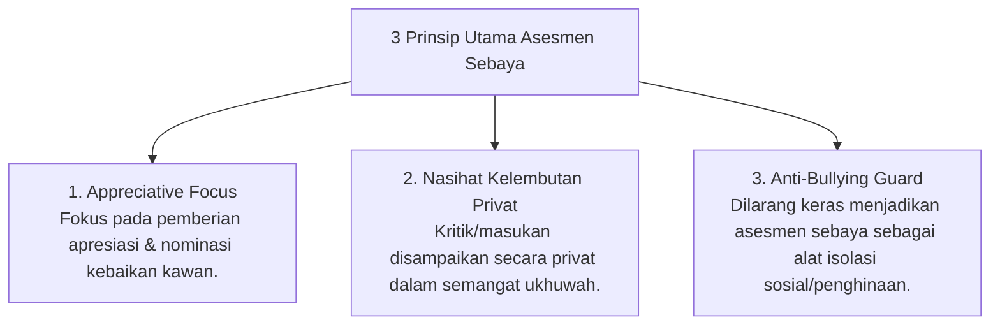

# P5-07-01: Asesmen Sebaya Berbasis Ukhuwah Islamiyah

## Status Dokumen
* **Status**: 🌟 **A+ (Tervalidasi & Siap Diimplementasikan)**
* **Sub-Domain**: `05 Assessment Framework / 07 Peer Assessment`
* **Penanggung Jawab Keilmuan**: Dewan Keilmuan TUMBUH (*Pakar Psikologi Sosial Santri & Pakar Filosofi TUMBUH*)

---

## 1. Konseptualisasi Peer Assessment Berbasis Ukhuwah

Asesmen Sebaya dalam ekosistem **TUMBUH** berlandaskan prinsip **Tawaashau bil Haq wa Tawaashau bis Sabr** (Saling menasihati dalam kebenaran dan kesabaran). Penilaian ini difokuskan pada pemberian **Umpan Balik Apresiatif (*Appreciative Feedback*)** dan saling mendukung perkembangan karakter.

---

## 2. Fitur Appreciative Peer Nominations

Santri dapat memberikan *Virtual Recognition Badge* (misal: "Kawan Ter-Empatis", "Kawan Ter-Rajin", "Kawan Pemersatu") kepada teman se-kamar atau se-angkatan melalui sistem digital PBIS.
