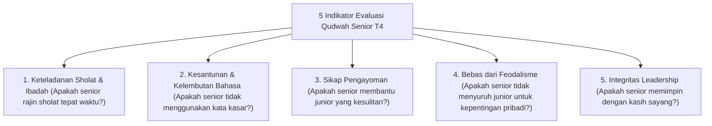

# P5-07-02: Survei Keteladanan Qudwah Senior T4

## Status Dokumen
* **Status**: 🌟 **A+ (Tervalidasi & Siap Diimplementasikan)**
* **Sub-Domain**: `05 Assessment Framework / 07 Peer Assessment`
* **Penanggung Jawab Keilmuan**: Dewan Keilmuan TUMBUH (*Pakar Tata Kelola Qudwah & Pakar Metodologi Riset*)

---

## 1. Konseptualisasi Survei Qudwah 360-Derajat

Survei Keteladanan Qudwah dilaksanakan setiap akhir semester, di mana santri junior (T1, T2, T3) memberikan umpan balik anonim atas gaya kepemimpinan dan keteladanan santri senior T4 yang menjadi pengurus/mentor.

---

## 2. Penggunaan Hasil Survei Qudwah

- **Rekomendasi Gateway Kelulusan T4**: Hasil survei qudwah menyumbang poin penting dalam menentukan kelayakan santri T4 menerima *Pin Keteladanan Qudwah TUMBUH*.
- **Evaluasi Pengurus Santri**: Apabila terdapat indikasi penyalahgunaan wewenang senioritas, Tim Pengasuhan segera melakukan tindakan pembinaan restoratif.
