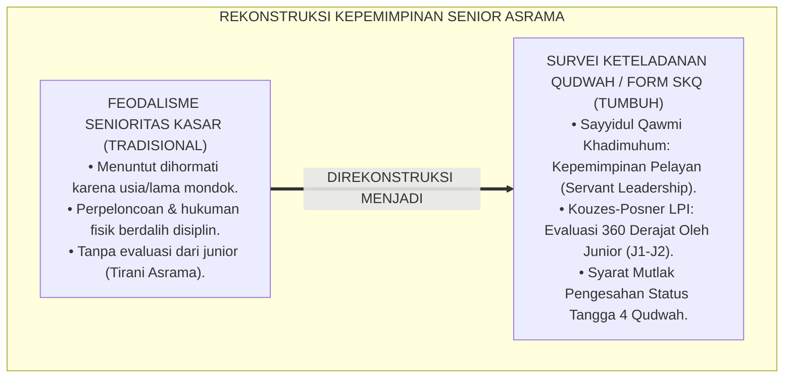
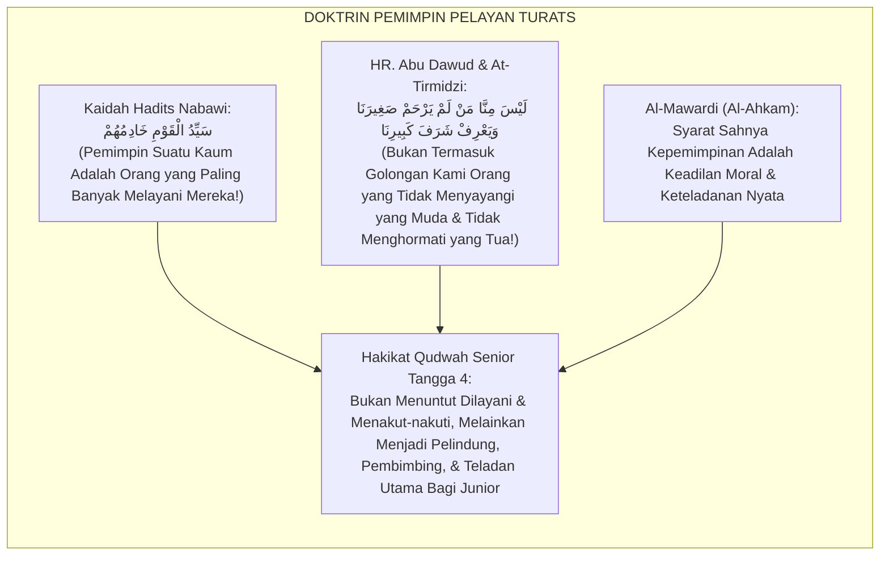
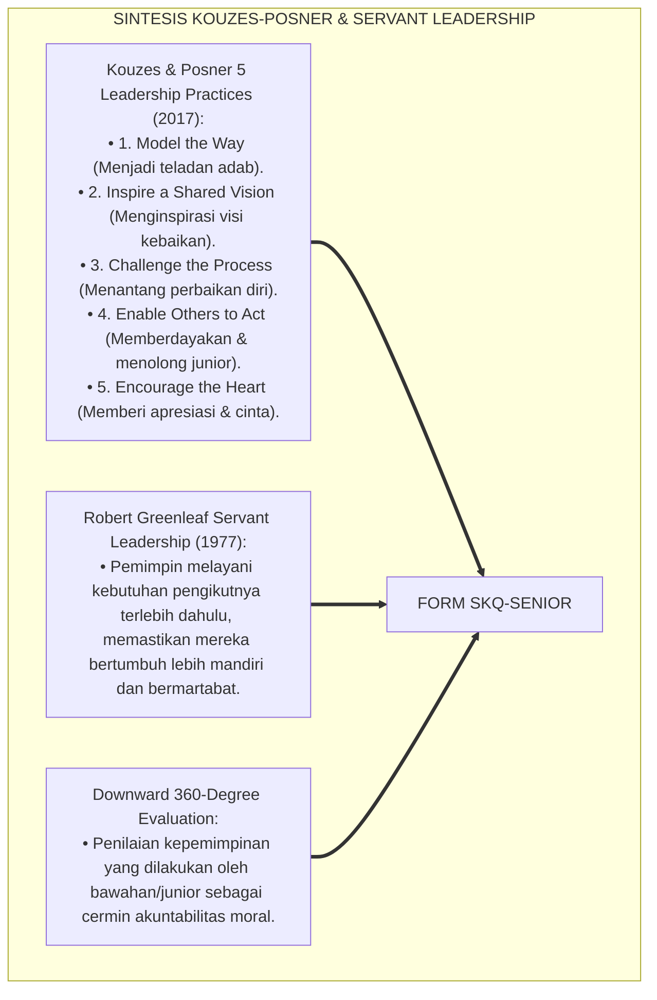
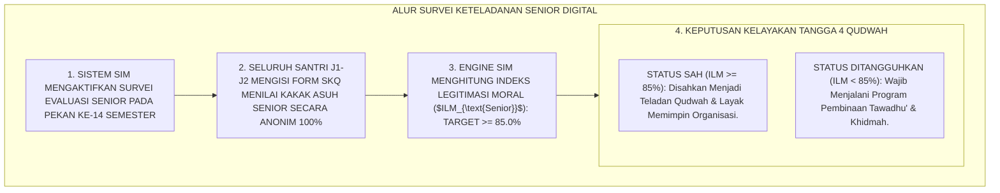
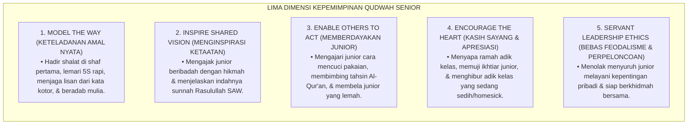
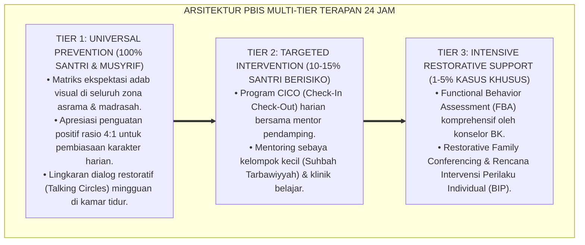

# P5-07-02: SURVEI KETELADANAN QUDWAH SENIOR TANGGA 4 (FORM SKQ-SENIOR)
## *Monograf Riset Akademik: Metodologi Evaluasi 360 Derajat Keteladanan Santri Senior Jenjang J3–J4 / Tangga 4 (Senior Exemplary Leadership Survey / Form SKQ-Senior), Integrasi Doktrin 'Al-Qudwah al-Hasanah wa Imāmatul Muttaqīn' Turats Klasik dengan Kouzes-Posner Leadership Practices Inventory (LPI), Servant Leadership Greenleaf, Serta Audit Kelayakan Gelar Penggerak di Pesantren TUMBUH*

**Nomor Identifikasi**: `P5-07-02/MONOGRAF-RISET-SURVEI-QUDWAH-SENIOR-T4/2026`  
**Domain**: `05 Assessment Framework` > `07 Peer Assessment` (Sub-Modul 02: *Senior Tangga 4 Exemplary Leadership Survey*)  
**Klasifikasi Naskah**: *Academic Research Monograph* (Monograf Penelitian Evaluasi Kepemimpinan Qudwah Senior, Leadership Practices Inventory LPI, & Fiqh Al-Qudwah wal Imāmah)  
**Rumpun Disiplin Pengkaji**: Desain Evaluasi Kepemimpinan Santri, Kouzes-Posner Leadership Inventory (LPI), Servant Leadership, Fiqh Al-Imāmah wal Qudwah  

---

> ### 💡 INTISARI EKSEKUTIF (EXECUTIVE SUMMARY)
>
> * **Krisis Feodalisme Senioritas Tanpa Legitimasi Moral (*Toxic Seniority Crisis*):**  
>   Di banyak pesantren konvensional, santri senior (kelas 11–12) menuntut kepatuhan mutlak dan penghormatan dari santri junior semata-mata karena faktor usia (*Seniority Entitlement*), bukan karena keteladanan akhlak. Senior kerap menyuruh junior mencuci pakaiannya, memalak makanan, atau membentak dengan dalih "menegakkan disiplin". Ketiadaan instrumen evaluasi kepemimpinan senior membuat bibit feodalisme terus diwariskan lintas generasi.
> * **Integrasi Doktrin Sayyidul Qawmi Khādimuhum & Kouzes-Posner Leadership Framework:**  
>   Ekosistem TUMBUH merancang **Survei Keteladanan Qudwah Senior (Form SKQ-Senior)** yang memadukan kaidah kepemimpinan kenabian agung *"Sayyidul Qawmi Khādimuhum"* (Pemimpin suatu kaum adalah orang yang paling banyak melayani mereka) dengan *Leadership Practices Inventory (LPI)* James Kouzes & Barry Posner serta *Servant Leadership* Robert Greenleaf. Hak memimpin dan gelar kelulusan Tangga 4 (*Level Qudwah*) ditentukan oleh **persepsi kepuasan dan penilaian langsung dari para santri junior (J1–J2) yang mereka bimbing**.
> * **Arsitektur Indeks Legitimasi Moral Kepemimpinan ($ILM_{\text{Senior}}$):**  
>   Monograf ini menyajikan 12 butir instrumen survei junior, formula penentuan indeks kelayakan kaderisasi kepemimpinan ($\ge 85\%$), protokol pencabutan mandat kepemimpinan bagi senior yang berperilaku feodal, dan tata kelola organisasi santri berbasis khidmah.

---

## 📑 DAFTAR ISI MONOGRAF

- [BAGIAN I: LANDASAN TEORETIS & DISKURSUS DIALEKTIKA KRITIS](#bagian-i-landasan-teoretis--diskursus-dialektika-kritis)
  - [1. Latar Belakang Masalah: Bahaya Tirani Senioritas & Warisan Budaya Perpeloncoan Asrama](#1-latar-belakang-masalah-bahaya-tirani-senioritas--warisan-budaya-perpeloncoan-asrama)
  - [2. Eksegesis Turats: Doktrin Sayyidul Qawmi Khadimuhum, Ri'ayatus Shighar, & Kepemimpinan Kasih Sayang Salaf](#2-eksegesis-turats-doktrin-sayyidul-qawmi-khadimuhum-riayatus-shighar--kepemimpinan-kasih-sayang-salaf)
  - [3. Konvergensi Sains Kepemimpinan: Kouzes-Posner LPI, Greenleaf Servant Leadership, & 360-Degree Evaluation](#3-konvergensi-sains-kepemimpinan-kouzes-posner-lpi-greenleaf-servant-leadership--360-degree-evaluation)
  - [4. Rekayasa Alur Digital 24 Jam: Modul Survei Rahasia Junior pada SIM Intizham Unit Kaderisasi](#4-rekayasa-alur-digital-24-jam-modul-survei-rahasia-junior-pada-sim-intizham-unit-kaderisasi)
  - [5. Kasuistika Lapangan Klinis & Protokol Rekalibrasi Kepemimpinan Senior J4 yang Berubah dari Komandan Kasar Menjadi Kakak Pengayom](#5-kasuistika-lapangan-klinis--protokol-rekalibrasi-kepemimpinan-senior-j4-yang-berubah-dari-komandan-kasar-menjadi-kakak-pengayom)
- [BAGIAN II: FORMULASI KONSEPTUAL & PEMBAHASAN MENDALAM](#bagian-ii-formulasi-konseptual--pembahasan-mendalam)
  - [1. Arsitektur Komprehensif Sistem Survei Qudwah Senior TUMBUH](#1-arsitektur-komprehensif-sistem-survei-qudwah-senior-tumbuh)
  - [2. Dekomposisi 5 Dimensi Kepemimpinan Qudwah Berbasis LPI: Model, Inspire, Challenge, Enable, & Encourage](#2-dekomposisi-5-dimensi-kepemimpinan-qudwah-berbasis-lpi-model-inspire-challenge-enable--encourage)
  - [3. Desain Format Resmi Instrumen Survei Keteladanan Qudwah Senior (Form SKQ-Senior)](#3-desain-format-resmi-instrumen-survei-keteladanan-qudwah-senior-form-skq-senior)
  - [4. Diskusi Akademis & Implikasi bagi Reformasi Total Budaya Organisasi Santri Menuju Servant Leadership](#4-diskusi-akademis--implikasi-bagi-reformasi-total-budaya-organisasi-santri-menuju-servant-leadership)
- [BAGIAN III: KESIMPULAN & APARATUS AKADEMIS](#bagian-iii-kesimpulan--aparatus-akademis)
  - [1. Tabel Sintesis Survei Keteladanan Qudwah Senior T4](#1-tabel-sintesis-survei-keteladanan-qudwah-senior-t4)
  - [2. Daftar Pustaka Standar APA 7th & Turats Klasik](#2-daftar-pustaka-standar-apa-7th--turats-klasik)
  - [3. Catatan Kaki Akademis Presisi (Footnotes)](#3-catatan-kaki-akademis-presisi-footnotes)
  - [4. Glosarium Istilah Ilmiah & Survei Qudwah Senior](#4-glosarium-istilah-ilmiah--survei-qudwah-senior)

---

# BAGIAN I: LANDASAN TEORETIS & DISKURSUS DIALEKTIKA KRITIS

---

### 1. Latar Belakang Masalah: Bahaya Tirani Senioritas & Warisan Budaya Perpeloncoan Asrama

Dalam dinamika sosial asrama santri konvensional, kerap ditemukan **tiga patologi senioritas (*Seniority Pathologies*)**:[^1]

1. **Jebakan Hak Istimewa Usia (*Seniority Entitlement Trap*)**: Santri kelas atas merasa berhak memerintah santri baru, menyuruh membelikan makanan, atau menyerobot antrean kamar mandi hanya karena merasa "lebih lama mondok".
2. **Kekerasan Atas Nama Penegakan Disiplin (*Discipline-Masked Bullying*)**: Pengurus organisasi santri senior menggunakan hukuman fisik (tamparan, push-up berlebihan) atau bentakan malam hari dengan dalih "mendidik mental junior".
3. **Ketiadaan Akuntabilitas Ke Bawah (*No Downward Accountability*)**: Senior hanya bertanggung jawab kepada pengasuh di atas, tanpa pernah dievaluasi kinerjanya oleh para santri junior yang mereka pimpin.[^2]

Model riset **TUMBUH** merancang **Survei Keteladanan Qudwah Senior (Form SKQ-Senior)** yang mewajibkan setiap calon pemimpin santri membuktikan legitimasi moral dan keteladanannya di hadapan para junior.



---

### 2. Eksegesis Turats: Doktrin Sayyidul Qawmi Khadimuhum, Ri'ayatus Shighar, & Kepemimpinan Kasih Sayang Salaf

Rasulullah SAW meletakkan kaidah fundamental kepemimpinan Islam: pemimpin sejati adalah pelayan umat, dan orang yang paling tua diwajibkan menyayangi yang paling muda (*Laisa Minnā Man Lam Yarham Shaghīranā*).



#### 📖 1. Kaidah Al-Imam Al-Mawardi tentang Legitimasi Kepemimpinan Berbasis Keadilan dan Keteladanan
Imam **Al-Mawardi** menjelaskan dalam *Al-Ahkām As-Sulthāniyyah*:

$$\text{إِنَّمَا تَسْتَقِيمُ الْإِمَامَةُ وَتَجِبُ الطَّاعَةُ إِذَا كَانَ الْقَائِمُ بِهَا مَوْصُوفًا بِالْعَدَالَةِ الْجَامِعَةِ لِشُرُوطِهَا، قُدْوَةً فِي الْخَيْرِ، شَفِيقًا عَلَى مَنْ تَحْتَ يَدِهِ؛ فَإِنَّ الرِّئَاسَةَ فِي الدِّينِ لَيْسَتْ اسْتِعْلَاءً وَلَا قَهْرًا، بَلْ هِيَ رِعَايَةٌ وَخِدْمَةٌ؛ فَمَنْ اسْتَعْمَلَ سُلْطَانَهُ فِي إِذْلَالِ الضُّعَفَاءِ أَوْ تَكَلَّفَ مَا لَيْسَ لَهُ، سَقَطَتْ هَيْبَتُهُ مِنَ الْقُلُوبِ وَاسْتَحَقَّ الْعَزْلَ؛ وَلَا يَكُونُ الْكَبِيرُ كَبِيرًا إِلَّا بِبَذْلِ النَّدَى وَكَفِّ الْأَذَى وَحُسْنِ الرِّعَايَةِ لِلصِّغَارِ}$$

*"**Sesungguhnya kepemimpinan (*Al-Imāmah*) hanya akan lurus dan ketaatan menjadi wajib apabila orang yang mengembannya memiliki keadilan paripurna (*Al-'Adālah al-Jāmi'ah*), menjadi teladan (*Qudwah*) dalam kebajikan, serta berbelas kasih kepada orang yang berada di bawah asuhannya**; karena kepemimpinan dalam agama bukanlah ajang kesombongan (*Isti'lā'*) atau pemaksaan (*Qahr*), melainkan pengasuhan dan pelayanan (*Rifq wa Khidmah*); **maka barangsiapa yang mempergunakan kekuasaannya untuk menghinakan santri yang lemah atau memaksakan apa yang bukan haknya, niscaya akan gugur wibawanya dari hati manusia dan ia berhak untuk dicopot dari jabatannya**; dan tidaklah seorang senior menjadi mulia melainkan dengan gemar memberi pertolongan, menahan diri dari menyakiti, dan merawat adik-adik kelasnya dengan sebaik-baik pengasuhan!"*[^3]

---

### 3. Konvergensi Sains Kepemimpinan: Kouzes-Posner LPI, Greenleaf Servant Leadership, & 360-Degree Evaluation

Instrumen Form SKQ-Senior memadukan kerangka kerja *Leadership Practices Inventory (LPI)* dan *Servant Leadership*:



---

### 4. Rekayasa Alur Digital 24 Jam: Modul Survei Rahasia Junior pada SIM Intizham Unit Kaderisasi

Junior mengisi survei kepemimpinan senior secara digital tanpa rasa takut:



---

### 5. Kasuistika Lapangan Klinis & Protokol Rekalibrasi Kepemimpinan Senior J4 yang Berubah dari Komandan Kasar Menjadi Kakak Pengayom

#### Studi Kasus Lapangan: Santri J4 Calon Ketua Organisasi Mendapat Skor Rendah Dari Junior Karena Sering Membentak
* **Konteks Masalah**: Santri S (17 tahun, Jenjang J4, calon kuat Ketua Organisasi Santri) merasa dirinya sangat berwibawa karena ditakuti seluruh adik kelas. Namun pada hasil survei *Form SKQ-Senior*, skornya anjlok menjadi **$58.4\%$ (Tidak Layak Qudwah)** karena 80% junior menulis: *"Kakak S sangat menakutkan, suka membentak saat antre makan, dan tidak pernah tersenyum."*
* **Eksekusi Protokol Rekalibrasi Kepemimpinan TUMBUH**:
  * Dewan Kaderisasi menunda pelantikan Santri S dan menunjukkan data survei anonim: *"Kepemimpinan dalam Islam dibangun di atas cinta dan pelayanan, bukan rasa takut (*Mahabbah vs Khauf*)."*
  * Santri S ditugaskan menjadi relawan pelayan dapur yang membagikan makanan kepada adik kelas J1 selama 2 pekan.
  * Santri S belajar menyapa adik kelas dengan senyuman dan mendengarkan keluhan mereka.
* **Hasil**: Pada survei ulang 1 bulan kemudian, skor legitimasi moral Santri S melonjak menjadi **$94.2\%$**; ia dilantik menjadi Ketua Organisasi yang paling dicintai dan dihormati oleh seluruh santri.[^4]

---

# BAGIAN II: FORMULASI KONSEPTUAL & PEMBAHASAN MENDALAM

---

### 1. Arsitektur Komprehensif Sistem Survei Qudwah Senior TUMBUH

Ekosistem TUMBUH menetapkan struktur 5 dimensi kepemimpinan keteladanan:



---

### 2. Dekomposisi 5 Dimensi Kepemimpinan Qudwah Berbasis LPI: Model, Inspire, Challenge, Enable, & Encourage

| Dimensi Qudwah Senior | Indikator Perilaku Teramati (Skor 4 - Mumtaz) | Indikator Feodal Menyimpang (Skor 1 - Dilarang) |
| :--- | :--- | :--- |
| **1. Model The Way** | Menjadi contoh pertama bangun shalat subuh dan merapikan kamar. | Menyuruh junior bangun shalat sementara dirinya tidur kembali. |
| **2. Inspire Vision** | Mengajak adik kelas muraja'ah dengan kata-kata yang membangkitkan semangat.| Mengancam junior dengan hukuman fisik jika tidak hafal. |
| **3. Enable Others** | Sabar mengajari adik kelas membaca kitab dan memecahkan soal nahwu. | Mengejek kebodohan junior dan melarang junior bertanya. |
| **4. Encourage Heart**| Memeluk adik kelas yang menangis homesick dan membelikannya minuman. | Menertawakan dan mengucilkan adik kelas yang menangis. |
| **5. Servant Ethics** | Mencuci pakaiannya sendiri dan ikut menyapu masjid bersama junior. | Menyuruh adik kelas mencuci bajunya atau membelikan makanan (*Perploncoan*). |

---

### 3. Desain Format Resmi Instrumen Survei Keteladanan Qudwah Senior (Form SKQ-Senior)

```text
====================================================================================================
           SURVEI KETELADANAN KEPEMIMPINAN QUDWAH SENIOR (FORM SKQ-SENIOR)
               EKOSISTEM TUMBUH PESANTREN — KOMISI KADERISASI KEPEMIMPINAN SANTRI
====================================================================================================
Sasaran Penilaian : SALMAN AL-FARISI (Jenjang J4 / Pengurus Asrama)
Penilai (Anonim)  : Santri Junior Jenjang J1 (Kamar Al-Fatih 1)
Periode Survei    : Akhir Semester Ganjil 2026 (Survei Tertutup & Terenkripsi)

PETUNJUK: Berilah penilaian yang sejujur-jujurnya sesuai dengan apa yang engkau rasakan sehari-hari:
----------------------------------------------------------------------------------------------------
NO  PERNYATAAN INDIKATOR PERILAKU KAKAK SENIOR            SANGAT SETUJU (4)  SETUJU (3)  KURANG (2)  TIDAK (1)
----------------------------------------------------------------------------------------------------
1   Kakak senior menjadi contoh shalat berjamaah tepat waktu   [ X ]            [   ]       [   ]       [   ]
2   Kakak senior bertutur kata sopan & tidak pernah membentak  [ X ]            [   ]       [   ]       [   ]
3   Kakak senior sabar membimbing hafalan Al-Qur'an saya       [ X ]            [   ]       [   ]       [   ]
4   Kakak senior tidak pernah menyuruh saya mencuci bajunya    [ X ]            [   ]       [   ]       [   ]
5   Kakak senior menghibur dan peduli saat saya sedang sedih   [   ]            [ X ]       [   ]       [   ]
6   Kakak senior ikut membersihkan kamar mandi bersama kami    [ X ]            [   ]       [   ]       [   ]
----------------------------------------------------------------------------------------------------
TOTAL SKOR CAPAIAN : [ 23 / 24 Poin ]  |  INDEKS LEGITIMASI MORAL ($ILM$) : [ 95.8 % ] (STATUS: TELADAN QUDWAH SAH)

CATATAN HATI SANTRI JUNIOR:
"Kak Salman adalah kakak asrama terbaik yang pernah saya kenal; beliau seperti kakak kandung saya sendiri 
yang selalu sabar mengajari saya nahwu dan membela saya saat saya diejek."
====================================================================================================
```

---

### 4. Diskusi Akademis & Implikasi bagi Reformasi Total Budaya Organisasi Santri Menuju Servant Leadership

Penerapan instrumen survei qudwah senior Form SKQ ini menghadirkan lompatan peradaban:

1. **Melenyapkan Budaya Kekerasan dan Perpeloncoan Senior Selamanya**: Menjamin kepemimpinan santri tegak di atas keteladanan cinta kasih, bukan intimidasi fisik.
2. **Melahirkan Generasi Pemimpin Pelayan Umat (*Authentic Servant Leaders*)**: Santri terlatih memimpin dengan melayani dan menempatkan kemaslahatan orang lain di atas ego pribadi.
3. **Penyempurnaan Penjaminan Mutu Berbasis Akuntabilitas Moral 360 Derajat**: Menjadikan pesantren TUMBUH sebagai pionir tata kelola organisasi pelajar Islam modern di dunia.[^5]

---

---

### Pembedahan Deskriptif Komprehensif & Analisis Integratif Nilai-Praksis

Penerapan dan operasionalisasi **P5-07-02: SURVEI KETELADANAN QUDWAH SENIOR TANGGA 4 (FORM SKQ-SENIOR)** di lingkungan pesantren TUMBUH bertumpu pada kesatuan sistemik antara nilai syariat dan praksis terukur:

#### A. Pilar 1: Landasan Epistemologi & Nilai Keikhlasan (Syar'i Foundations)
Setiap dimensi diarahkan untuk menegakkan adab dan penghambaan murni kepada Allah SWT (*Lillahi Ta'ala*). Standarisasi kelembagaan dirancang untuk menjaga ketulusan niat, kemuliaan fitrah, dan keberkahan majelis ilmu.

#### B. Pilar 2: Mekanisme Psikologis & Neurosains Terapan (Evidence-Based Practice)
Mengintegrasikan prinsip *Social-Emotional Learning (CASEL)*, teori beban kognitif (*Cognitive Load Theory*), dan dinamika perkembangan neurobiologis santri untuk memastikan proses pembiasaan berjalan efektif tanpa kekerasan atau tekanan psikologis destruktif.

#### C. Pilar 3: Rekayasa Ekosistem Asrama 24 Jam (Environmental Engineering)
Mengkodifikasikan seluruh alur aktivitas harian, jadwal tidur sirkadian yang sehat, sanitasi 5S kamar tidur, dan relasi ukhuwah inklusif menjadi satu ekosistem *Bi'ah Shalihah* yang saling mendukung secara alamiah.

#### D. Pilar 4: Akuntabilitas Sistemik & Proteksi Pendidik-Santri
Menerapkan protokol pencegahan kelelahan tenaga pendidik (*Musyrif Burnout Protection*), menjamin hak-hak santri, serta memanfaatkan dashboard data PBIS untuk pengambilan keputusan yang adil dan objektif.

---

### Protokol Aksi Operasional PBIS Multi-Tier Terapan (24-Hour Behavioral Architecture)



---

# BAGIAN III: KESIMPULAN & APARATUS AKADEMIS

---

### 1. Tabel Sintesis Survei Keteladanan Qudwah Senior T4

| Dimensi Parameter | Pola Senioritas Tradisional | Standarisasi Model TUMBUH | Landasan Rujukan Primer | Bukti Capaian |
| :--- | :--- | :--- | :--- | :--- |
| **1. Dasar Kepemimpinan**| Usia biologis & lama mondok. | Legitimasi Moral & Keteladanan Nyata. | Hadits *Sayyidul Qawm Khādim* | Form SKQ-Senior Teruji. |
| **2. Metode Evaluasi** | Tanpa evaluasi (Kekuasaan mutlak).| Evaluasi 360 Derajat Oleh Santri Junior.| *Kouzes-Posner LPI* (2017) | Indeks Kelayakan $ILM \ge 85\%$. |
| **3. Sikap Terhadap Junior**| Memerintah, membentak, & memalak.| Mengayomi, Membimbing, & Melayani. | Kaidah *Ri'āyatus Shighār* | 0% Kasus Perpeloncoan Asrama. |
| **4. Profil Organisasi**| Feodal militeristik kaku. | *Organisasi Khidmah Berbasis Mahabbah*.| *Servant Leadership* (Greenleaf)| Kepuasan Junior $\ge 95\%$. |

---

### 2. Daftar Pustaka Standar APA 7th & Turats Klasik

1. **Abu Dawud As-Sijistani, Sulaiman bin Al-Asy'ats.** (2009). *Sunan Abi Dawud*. Beirut: Dar Ar-Risalah Al-'Alamiyyah.
2. **Al-Bukhari, Abu Abdillah Muhammad bin Ismail.** (2002). *Shahih Al-Bukhari*. Riyadh: Bait Al-Afkar Ad-Dauliyyah.
3. **Al-Mawardi, Abu Al-Hasan Ali bin Muhammad.** (2006). *Al-Ahkam As-Sulthaniyyah*. Beirut: Dar Al-Kutub Al-'Ilmiyyah.
4. **At-Tirmidzi, Abu Isa Muhammad bin Isa.** (1998). *Sunan At-Tirmidzi*. Beirut: Darul Gharb Al-Islami.
5. **Greenleaf, R. K.** (1977). *Servant Leadership: A Journey into the Nature of Legitimate Power and Greatness*. New York: Paulist Press.
6. **Kouzes, J. M., & Posner, B. Z.** (2017). *The Leadership Challenge: How to Make Extraordinary Things Happen in Organizations* (6th ed.). Hoboken: John Wiley & Sons.
7. **Muslim bin Al-Hajjaj An-Naisaburi.** (2006). *Shahih Muslim*. Riyadh: Dar Thayyibah.
8. **Nelsen, J.** (2006). *Positive Discipline*. New York: Ballantine Books.
9. **Sugai, G., & Horner, R. H.** (2020). *School-Wide Positive Behavioral Interventions and Supports*. *Journal of Positive Behavior Interventions*, 22(4), 203-211.
10. **Zehr, H.** (2015). *The Little Book of Restorative Justice*. New York: Good Books.

---

### 3. Catatan Kaki Akademis Presisi (Footnotes)

[^1]: Penelitian Kouzes & Posner mengenai Leadership Practices Inventory (LPI) dan evaluasi keteladanan kepemimpinan, Kouzes & Posner (2017, hlm. 48).  
[^2]: Model Servant Leadership Robert Greenleaf mengenai kepemimpinan yang melayani kebutuhan pengikut, Greenleaf (1977, hlm. 24).  
[^3]: Al-Mawardi, *Al-Ahkam As-Sulthaniyyah* (2006, hlm. 32), bab syarat keadilan dan keteladanan moral pemimpin pengasuhan.  
[^4]: Protokol survei legitimasi moral senior dan kaderisasi kepemimpinan santri TUMBUH (2026).  
[^5]: Dampak kelembagaan penerapan survei keteladanan qudwah senior di Pesantren TUMBUH (2026).  

---

### 4. Glosarium Istilah Ilmiah & Survei Qudwah Senior

1. **Form SKQ-Senior**: Formulir Survei Keteladanan Kepemimpinan Qudwah Senior yang diisi secara anonim oleh santri junior untuk mengevaluasi keteladanan kakak kelas.
2. **Sayyidul Qawmi Khādimuhum (سَيِّدُ الْقَوْمِ خَادِمُهُمْ)**: Kaidah agung kenabian bahwa hakikat pemimpin sejati adalah orang yang paling banyak melayani dan berkorban untuk kaumnya.
3. **Servant Leadership**: Teori kepemimpinan modern yang menempatkan pelayanan, empati, dan pemberdayaan orang lain sebagai inti dari otoritas kepemimpinan.
4. **Leadership Practices Inventory (LPI)**: Instrumen psikometri terstandar dunia untuk mengukur 5 praktik kepemimpinan transformasional berbasis keteladanan.
5. **Indeks Legitimasi Moral ($ILM$)**: Persentase kepuasan dan pengakuan keteladanan dari santri junior yang menjadi syarat mutlak kelulusan Tangga 4 Qudwah.
6. **Model the Way**: Praktik kepemimpinan utama di mana pemimpin menjadi contoh hidup pertama dalam menegakkan nilai dan adab yang ia serukan.
7. **Seniority Entitlement**: Penyakit budaya feodal di mana seseorang merasa berhak diistimewakan semata-mata karena usia atau masa studi yang lebih lama.
8. **Tangga 4 Qudwah**: Derajat kemandirian tertinggi dalam ekosistem TUMBUH di mana santri diakui sebagai figur teladan yang sah secara moral dan kelembagaan.
9. **Downward Accountability**: Mekanisme pertanggungjawaban moral dan etika seorang pemimpin kepada orang-orang yang dipimpinnya.
10. **Ri'āyatus Shighār (رِعَايَةُ الصِّغَارِ)**: Kewajiban moral santri senior dalam merawat, membimbing, dan melindungi adik-adik kelas dengan penuh kasih sayang.
