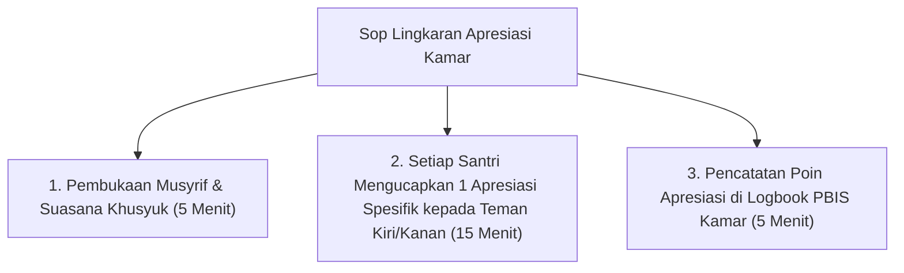

# P5-07-03: Lingkaran Apresiasi Kawan Se-Kamar

## Status Dokumen
* **Status**: 🌟 **A+ (Tervalidasi & Siap Diimplementasikan)**
* **Sub-Domain**: `05 Assessment Framework / 07 Peer Assessment`
* **Penanggung Jawab Keilmuan**: Dewan Keilmuan TUMBUH (*Pakar Pengasuhan Asrama & Pakar Psikologi Sosial Santri*)

---

## 1. Konseptualisasi Lingkaran Apresiasi (Circle of Gratitude)

Lingkaran Apresiasi adalah kegiatan mingguan (Jum'at malam) di mana seluruh penghuni kamar duduk melingkar bersama Musyrif untuk mengutarakan **rasa terima kasih dan apresiasi positif** atas kebaikan kawan se-kamar selama satu pekan terakhir.

---

## 2. Manfaat Sosio-Emosional Lingkaran Apresiasi

- Mempererat ikatan ukhuwah, mengurangi potensi gesekan antar teman kamar, dan membangun lingkungan kamar yang hangat (*Safe & Caring Environment*).
