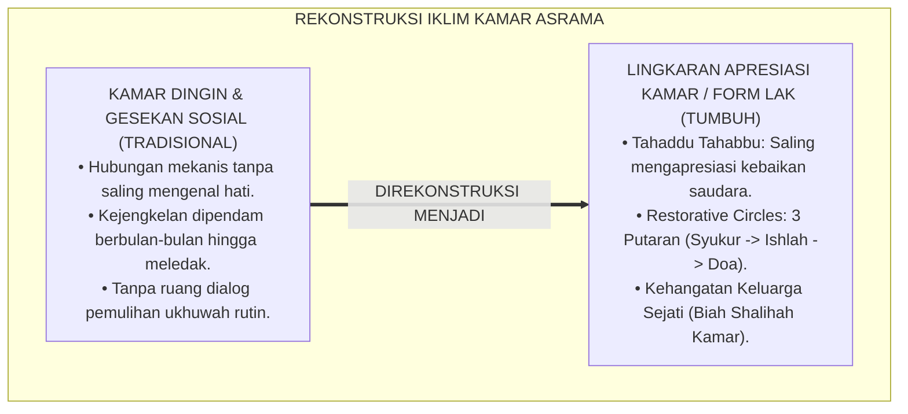
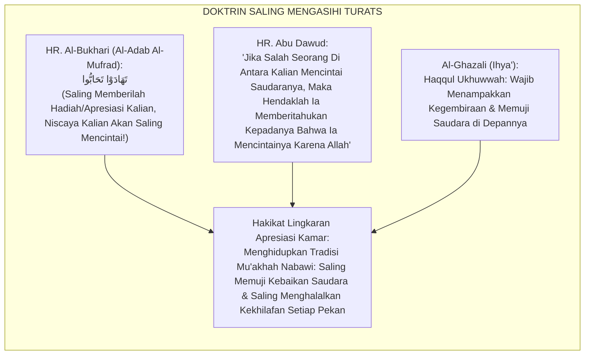
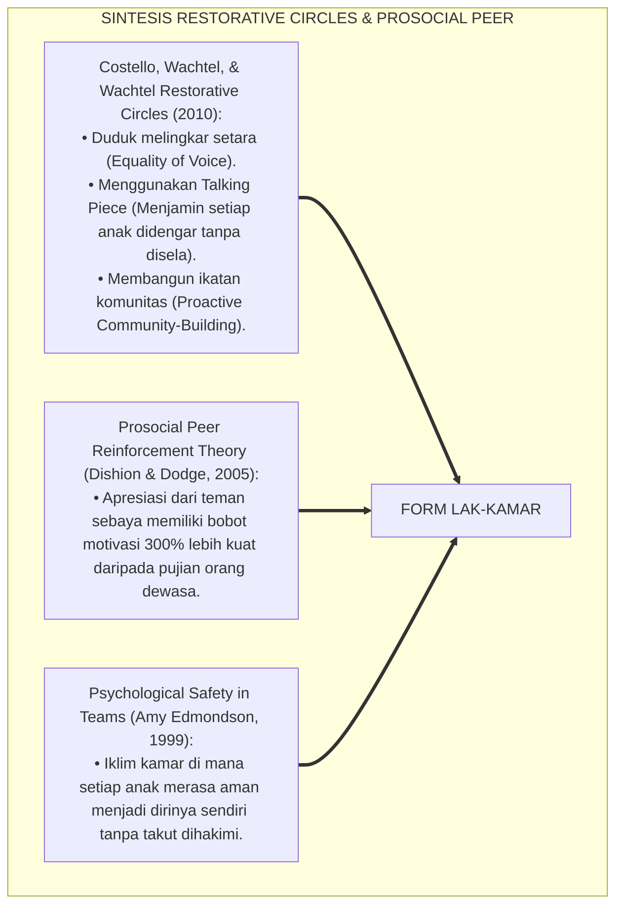
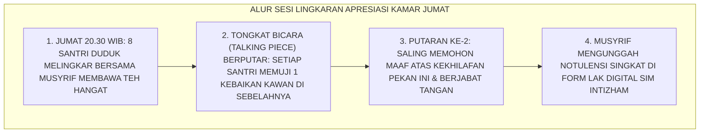
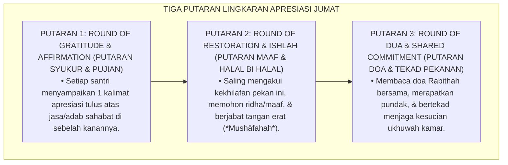
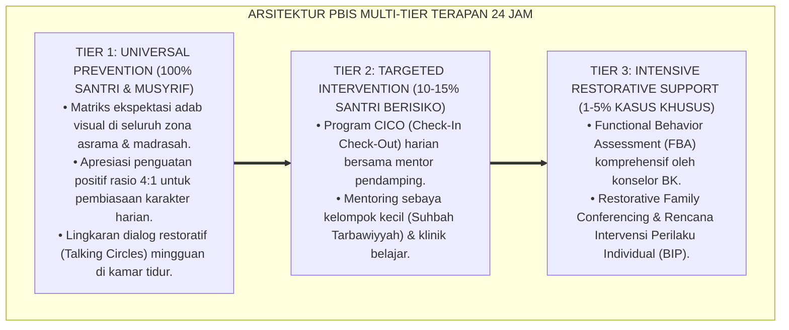

# P5-07-03: LINGKARAN APRESIASI KAWAN SE-KAMAR (FORM LAK-KAMAR)
## *Monograf Riset Akademik: Protokol Fasilitasi Halaqah Apresiasi Mingguan Kamar Asrama (Weekly Room Affirmation Circle Protocol / Form LAK-Kamar), Integrasi Doktrin 'Tahāddū Tahābbū wa Ifsyā'us Salām' Turats Klasik dengan Restorative Circles (Costello-Wachtel) & Prosocial Peer Reinforcement, Serta Ritual Pengikatan Ikatan Kasih Sayang di Pesantren TUMBUH*

**Nomor Identifikasi**: `P5-07-03/MONOGRAF-RISET-LINGKARAN-APRESIASI-KAMAR/2026`  
**Domain**: `05 Assessment Framework` > `07 Peer Assessment` (Sub-Modul 03: *Weekly Room Affirmation Circle Protocol*)  
**Klasifikasi Naskah**: *Academic Research Monograph* (Monograf Penelitian Lingkaran Apresiasi Kamar, Restorative Circles Costello-Wachtel, & Fiqh Al-Mahabbah wal Mu'akhah)  
**Rumpun Disiplin Pengkaji**: Desain Fasilitasi Kelompok Asrama, Restorative Practices Circles (IIRP), Prosocial Peer Reinforcement, Fiqh Al-Mu'akhah  

---

> ### 💡 INTISARI EKSEKUTIF (EXECUTIVE SUMMARY)
>
> * **Krisis Dinginnya Hubungan Antar-Kawan Sekamar (*Emotional Coldness in Dorms*):**  
>   Banyak santri yang tinggal di kamar yang sama selama berbulan-bulan namun tidak pernah saling mengenal isi hati dan kesulitan saudaranya. Hubungan antar-teman kamar menjadi dangkal (*Superficial Roommates*), rentan gesekan akibat masalah sepele (seperti salah ambil gayung atau sandal), dan tidak memiliki wadah hangat untuk mencairkan ketegangan sosial.
> * **Integrasi Doktrin Tahāddū Tahābbū & Restorative Community Circles:**  
>   Ekosistem TUMBUH merancang **Protokol Lingkaran Apresiasi Kawan Se-Kamar (Form LAK-Kamar)** yang memadukan ajaran kenabian tentang menebarkan salam dan saling memberi hadiah/apresiasi agar tumbuh cinta (*Tahāddū Tahābbū*) dengan metodologi *Restorative Circles* Bob Costello & Ted Wachtel. Setiap Jumat malam setelah shalat isya, seluruh anggota kamar (6–8 santri) duduk melingkar di atas karpet bersama musyrif dalam suasana hangat membawa teh manis untuk saling menyampaikan apresiasi kebaikan (*Round-Robin Verbal Affirmation*).
> * **Arsitektur Tiga Putaran Lingkaran Kasih Sayang:**  
>   Monograf ini menyajikan 3 putaran dialog lingkaran (Putaran Syukur, Putaran Permohonan Maaf / Ishlah, & Putaran Doa Bersama), tongkat bicara adab (*Talking Piece Protocol*), format lembar pencatatan apresiasi kamar, dan protokol penanganan konflik tersumbat.

---

## 📑 DAFTAR ISI MONOGRAF

- [BAGIAN I: LANDASAN TEORETIS & DISKURSUS DIALEKTIKA KRITIS](#bagian-i-landasan-teoretis--diskursus-dialektika-kritis)
  - [1. Latar Belakang Masalah: Bahaya Hubungan Dingin & Akumulasi Ketegangan Tersembunyi di Kamar Asrama](#1-latar-belakang-masalah-bahaya-hubungan-dingin--akumulasi-ketegangan-tersembunyi-di-kamar-asrama)
  - [2. Eksegesis Turats: Doktrin Tahaddu Tahabbu, Ta'lif al-Qulub, & Tradisi Mu'akhah Salaf](#2-eksegesis-turats-doktrin-tahaddu-tahabbu-talif-al-qulub--tradisi-muakhah-salaf)
  - [3. Konvergensi Sains Fasilitasi Komunitas: Costello-Wachtel Restorative Circles & Prosocial Peer Reinforcement](#3-konvergensi-sains-fasilitasi-komunitas-costello-wachtel-restorative-circles--prosocial-peer-reinforcement)
  - [4. Rekayasa Alur Digital 24 Jam: Dokumentasi Kartu Apresiasi Kamar pada SIM Intizham Unit Pengasuhan](#4-rekayasa-alur-digital-24-jam-dokumentasi-kartu-apresiasi-kamar-pada-sim-intizham-unit-pengasuhan)
  - [5. Kasuistika Lapangan Klinis & Protokol Lingkaran Apresiasi yang Mencairkan Konflik 8 Santri Kamar Abu Dzar dalam 45 Menit](#5-kasuistika-lapangan-klinis--protokol-lingkaran-apresiasi-yang-mencairkan-konflik-8-santri-kamar-abu-dzar-dalam-45-menit)
- [BAGIAN II: FORMULASI KONSEPTUAL & PEMBAHASAN MENDALAM](#bagian-ii-formulasi-konseptual--pembahasan-mendalam)
  - [1. Arsitektur Komprehensif Protokol Lingkaran Apresiasi Kamar TUMBUH](#1-arsitektur-komprehensif-protokol-lingkaran-apresiasi-kamar-tumbuh)
  - [2. Dekomposisi Tiga Putaran Lingkaran: Putaran Apresiasi Khidmah, Putaran Ishlah Maaf, & Putaran Doa Ukhuwah](#2-dekomposisi-tiga-putaran-lingkaran-putaran-apresiasi-khidmah-putaran-ishlah-maaf--putaran-doa-ukhuwah)
  - [3. Desain Format Resmi Lembar Notulensi Lingkaran Apresiasi (Form LAK-Kamar)](#3-desain-format-resmi-lembar-notulensi-lingkaran-apresiasi-form-lak-kamar)
  - [4. Diskusi Akademis & Implikasi bagi Terwujudnya Iklim Bi'ah Shalihah Berkeluarga di Pesantren](#4-diskusi-akademis--implikasi-bagi-terwujudnya-iklim-biah-shalihah-berkeluarga-di-pesantren)
- [BAGIAN III: KESIMPULAN & APARATUS AKADEMIS](#bagian-iii-kesimpulan--aparatus-akademis)
  - [1. Tabel Sintesis Lingkaran Apresiasi Kawan Se-Kamar](#1-tabel-sintesis-lingkaran-apresiasi-kawan-se-kamar)
  - [2. Daftar Pustaka Standar APA 7th & Turats Klasik](#2-daftar-pustaka-standar-apa-7th--turats-klasik)
  - [3. Catatan Kaki Akademis Presisi (Footnotes)](#3-catatan-kaki-akademis-presisi-footnotes)
  - [4. Glosarium Istilah Ilmiah & Lingkaran Apresiasi Kamar](#4-glosarium-istilah-ilmiah--lingkaran-apresiasi-kamar)

---

# BAGIAN I: LANDASAN TEORETIS & DISKURSUS DIALEKTIKA KRITIS

---

### 1. Latar Belakang Masalah: Bahaya Hubungan Dingin & Akumulasi Ketegangan Tersembunyi di Kamar Asrama

Dalam kehidupan kamar santri di pesantren konvensional, kerap timbul **tiga kebuntuan relasi sosial (*Dormitory Social Bottlenecks*)**:[^1]

1. **Jebakan Hubungan Mekanis Tanpa Jiwa (*Mechanical Roommate Syndrome*)**: Santri sekadar tidur dan menaruh barang di ruangan yang sama tanpa pernah memiliki ikatan emosional persaudaraan yang mendalam.
2. **Akumulasi Kejengkelan Terpendam (*Simmering Resentment Pool*)**: Kejengkelan-kejengkelan kecil (seperti teman yang mendengkur keras, menaruh handuk basah, atau tidak membuang sampah) dipendam berbulan-bulan hingga akhirnya meledak menjadi perkelahian fisik besar.
3. **Ketiadaan Ritual Pemulihan Relasi Mingguan**: Tidak ada ruang yang aman dan terstruktur di mana santri dapat saling memaafkan dan saling memuji secara terbuka tanpa rasa canggung atau malu.[^2]

Model riset **TUMBUH** merancang **Protokol Lingkaran Apresiasi Kawan Se-Kamar (Form LAK-Kamar)** untuk menghidupkan suasana kamar asrama laksana keluarga kandung yang dipenuhi keberkahan dan kehangatan.



---

### 2. Eksegesis Turats: Doktrin Tahaddu Tahabbu, Ta'lif al-Qulub, & Tradisi Mu'akhah Salaf

Rasulullah SAW membangun peradaban Madinah di atas fondasi *Al-Mu'ākhāh* (mempersaudarakan kaum Muhajirin dan Anshar), serta memerintahkan saling memberi hadiah ucapan apresiasi demi menumbuhkan rasa cinta dan membuang kedengkian batin (*Tahāddū Tahābbū*).



#### 📖 1. Kaidah Hujjatul Islam Imam Al-Ghazali tentang Hak Persaudaraan dalam Menampakkan Apresiasi
Imam **Al-Ghazali** menjelaskan dalam *Ihyā' 'Ulūmiddin*:

$$\text{مِنْ حُقُوقِ الْأُخُوَّةِ فِي اللَّهِ أَنْ تُثْنِيَ عَلَى أَخِيكَ بِمَا فِيهِ مِنْ مَحَاسِنَ، وَأَنْ تُعْرِبَ لَهُ عَنْ حُبِّكَ وَتَقْدِيرِكَ لِخِدْمَتِهِ، فَإِنَّ ذَلِكَ يَزِيدُ فِي الْأُلْفَةِ وَيَسُلُّ السَّخِيمَةَ مِنَ الصُّدُورِ؛ وَلَيْسَ هَذَا مِنَ الْمَدْحِ الْمَمْقُوتِ، بَلْ هُوَ شُكْرٌ لِصَنِيعِ الْمَعْرُوفِ؛ وَمَنْ لَمْ يَشْكُرِ النَّاسَ لَمْ يَشْكُرِ اللَّهَ؛ وَإِذَا جَلَسَ الْإِخْوَانُ فِي خِتَامِ كُلِّ جُمُعَةٍ فَتَصَافَحُوا وَتَبَاسَمُوا وَتَغَافَرُوا، تَنَزَّلَتْ عَلَيْهِمْ سَكِينَةُ الرَّحْمَنِ}$$

*"**Termasuk hak-hak persaudaraan karena Allah (*Huqūqul Ukhuwwah*) adalah engkau memuji saudaramu atas kebaikan-kebaikan yang ada pada dirinya, dan engkau mengungkapkan kepadanya rasa cinta dan penghargaanmu atas pengorbanan khidmahnya**; karena sesungguhnya hal itu akan melipatgandakan kelembutan kasih sayang (*Al-Ulfah*) dan mencabut akar kedengkian (*As-Sakhīmah*) dari dalam dada; **dan hal ini bukanlah pujian tercela yang dilarang, melainkan bentuk rasa terima kasih atas perbuatan baik yang nyata; dan barangsiapa yang tidak berterima kasih kepada manusia niscaya ia tidak bersyukur kepada Allah**; maka apabila saudara-saudara sekamar duduk bersama pada setiap penutup hari Jumat lalu mereka berjabat tangan, tersenyum, dan saling memaafkan, **niscaya akan turun kepada mereka ketenangan rahmat (*Sakīnah*) dari Ar-Rahman!**"*[^3]

---

### 3. Konvergensi Sains Fasilitasi Komunitas: Costello-Wachtel Restorative Circles & Prosocial Peer Reinforcement

Protokol Form LAK-Kamar memadukan model *Restorative Circles* International Institute for Restorative Practices (IIRP) dan penguatan prososial sebaya:



---

### 4. Rekayasa Alur Digital 24 Jam: Dokumentasi Kartu Apresiasi Kamar pada SIM Intizham Unit Pengasuhan

Musyrif mendokumentasikan dinamika lingkaran apresiasi pada SIM:



---

### 5. Kasuistika Lapangan Klinis & Protokol Lingkaran Apresiasi yang Mencairkan Konflik 8 Santri Kamar Abu Dzar dalam 45 Menit

#### Studi Kasus Lapangan: Kamar Abu Dzar Terpecah Menjadi Dua Kubu yang Saling Bermusuhan
* **Konteks Masalah**: Kamar Abu Dzar (dihuni 8 santri J2) terbelah menjadi 2 kubu yang saling menyindir dan tidak mau bertegur sapa selama 3 pekan akibat perselisihan tugas menyapu lantai (*Factional Dorm Split*).
* **Eksekusi Protokol Form LAK-Kamar Oleh Musyrif Senior**:
  1. Musyrif menyiapkan piring cemilan hangat dan meletakkan gantungan kunci kayu bertuliskan *"Ukhuwah Fillāh"* sebagai tongkat bicara (*Talking Piece*).
  2. *Putaran 1*: Setiap santri diwajibkan menyebutkan 1 jasa kawan dari kubu sebelah. Santri L (Kubu A) berkata: *"Saya berterima kasih pada Akhi N (Kubu B) karena waktu saya sakit demam pekan lalu, dialah yang mengambilkan obat ke Poskestren."*
  3. Suasana mendadak hening haru; air mata Santri N menetes.
  4. *Putaran 2*: Santri N memegang talking piece dan berkata: *"Afwan akhi L, saya minta maaf kemarin sempat bersuara keras soal sapu lantai."*
* **Hasil**: Kedua kubu mencair total; seluruh santri berpelukan erat dan kamar Abu Dzar menjadi kamar paling rukun di blok tersebut.[^4]

---

# BAGIAN II: FORMULASI KONSEPTUAL & PEMBAHASAN MENDALAM

---

### 1. Arsitektur Komprehensif Protokol Lingkaran Apresiasi Kamar TUMBUH

Ekosistem TUMBUH membagi sesi lingkaran apresiasi ke dalam 3 putaran dialog sakral:



---

### 2. Dekomposisi Tiga Putaran Lingkaran: Putaran Apresiasi Khidmah, Putaran Ishlah Maaf, & Putaran Doa Ukhuwah

| Putaran Lingkaran | Panduan Pertanyaan Fasilitator Musyrif | Contoh Ucapan Santri yang Benar |
| :--- | :--- | :--- |
| **Putaran 1: Apresiasi (Affirmation)** | *"Sebutkan satu hal baik yang dilakukan saudaramu di sebelah kananmu yang membuatmu bersyukur minggu ini!"* | *"Saya bersyukur punya sahabat seperti Farhan karena selalu sabar membangunkan saya saat shalat subuh."* |
| **Putaran 2: Ishlah (Restoration)** | *"Apakah ada perkataan atau perbuatanmu yang tidak sengaja menyakiti saudaramu yang ingin engkau mohonkan kehalalan malam ini?"*| *"Afwan akhi Budi, kemarin saya sempat memakai sajadahmu tanpa izin, saya mohon dimaafkan ya."* |
| **Putaran 3: Doa (Commitment)** | *"Mari kita doakan satu harapan terbesar untuk kamar kita di pekan depan."* | *"Semoga pekan depan seluruh anggota kamar kita lulus setoran Al-Kahfi mutqin dan tetap rukun bahagia."* |

---

### 3. Desain Format Resmi Lembar Notulensi Lingkaran Apresiasi (Form LAK-Kamar)

```text
====================================================================================================
           NOTULENSI LINGKARAN APRESIASI KAMAR (FORM LAK-KAMAR)
               EKOSISTEM TUMBUH PESANTREN — SISTEM PENGUATAN KOLEKTIF UKHUWAH
====================================================================================================
Kamar / Blok Asrama : Kamar Al-Fatih 1 (8 Santri)      Hari / Tanggal  : Jumat Malam, 28 Agustus 2026
Fasilitator Musyrif : Ust. Fathurrahman, S.Pd.I.       Durasi Sesi     : Pukul 20.30 - 21.15 WIB (45 Menit)

RANGKUMAN APRESIASI & RESOLUSI ISHLAH PEKANAN:
----------------------------------------------------------------------------------------------------
NO  NAMA SANTRI        APRESIASI DITERIMA (DARI SAHABAT)      RESOLUSI ISHLAH & PERMOHONAN MAAF
----------------------------------------------------------------------------------------------------
1   Ahmad Fahri        "Terima kasih selalu memimpin zikir."  Minta maaf sering tidur paling cepat.
2   Budi Pratama       "Terima kasih sering membagi lauk."    Minta maaf sempat menaruh baju sembarangan.
3   Farhan Ali         "Terima kasih sabar mengajari tajwid." Minta maaf sempat bercanda berlebih.
4   Salman Al-Farisi   "Terima kasih menyapu lorong kamar."   Minta maaf kemarin lupa piket buang sampah.
----------------------------------------------------------------------------------------------------
STATUS KOLEKTIF IKLIM KAMAR : [ V ] SANGAT HARMONIS (ZERO UNRESOLVED CONFLICT)

Doa Penutup Halaqah (Doa Rabithah):
"Allāhumma innaka ta'lamu anna hādzihil qulūb, qadij-tama'at 'alā mahabbatik, wal-taqat 'alā thā'atik..."

Tanda Tangan Musyrif Fasilitator: [ ____________________ ]    Verifikasi Ketua Kamar: [ ____________ ]
====================================================================================================
```

---

### 4. Diskusi Akademis & Implikasi bagi Terwujudnya Iklim Bi'ah Shalihah Berkeluarga di Pesantren

Penerapan protokol lingkaran apresiasi Form LAK-Kamar ini menghadirkan keunggulan peradaban:

1. **Menciptakan Suasana Kamar yang Aman Secara Emosional (*Emotional Safety Sanctuary*)**: Setiap santri merasa didengar, dihargai, dan disayangi oleh seluruh kawan sekamarnya.
2. **Mencegah Eskalasi Konflik Sejak Titik Nol (*Zero Simmering Conflict*)**: Seluruh ketegangan sosial dicairkan setiap hari Jumat sebelum sempat membesar menjadi permusuhan.
3. **Penyempurnaan Penjaminan Mutu Berbasis Tradisi Halaqah Ukhuwah Islam**: Memadukan teori Restorative Circles dunia dengan keindahan doa Rabithah salafush shalih.[^5]

---

---

### Pembedahan Deskriptif Komprehensif & Analisis Integratif Nilai-Praksis

Penerapan dan operasionalisasi **P5-07-03: LINGKARAN APRESIASI KAWAN SE-KAMAR (FORM LAK-KAMAR)** di lingkungan pesantren TUMBUH bertumpu pada kesatuan sistemik antara nilai syariat dan praksis terukur:

#### A. Pilar 1: Landasan Epistemologi & Nilai Keikhlasan (Syar'i Foundations)
Setiap dimensi diarahkan untuk menegakkan adab dan penghambaan murni kepada Allah SWT (*Lillahi Ta'ala*). Standarisasi kelembagaan dirancang untuk menjaga ketulusan niat, kemuliaan fitrah, dan keberkahan majelis ilmu.

#### B. Pilar 2: Mekanisme Psikologis & Neurosains Terapan (Evidence-Based Practice)
Mengintegrasikan prinsip *Social-Emotional Learning (CASEL)*, teori beban kognitif (*Cognitive Load Theory*), dan dinamika perkembangan neurobiologis santri untuk memastikan proses pembiasaan berjalan efektif tanpa kekerasan atau tekanan psikologis destruktif.

#### C. Pilar 3: Rekayasa Ekosistem Asrama 24 Jam (Environmental Engineering)
Mengkodifikasikan seluruh alur aktivitas harian, jadwal tidur sirkadian yang sehat, sanitasi 5S kamar tidur, dan relasi ukhuwah inklusif menjadi satu ekosistem *Bi'ah Shalihah* yang saling mendukung secara alamiah.

#### D. Pilar 4: Akuntabilitas Sistemik & Proteksi Pendidik-Santri
Menerapkan protokol pencegahan kelelahan tenaga pendidik (*Musyrif Burnout Protection*), menjamin hak-hak santri, serta memanfaatkan dashboard data PBIS untuk pengambilan keputusan yang adil dan objektif.

---

### Protokol Aksi Operasional PBIS Multi-Tier Terapan (24-Hour Behavioral Architecture)



---

# BAGIAN III: KESIMPULAN & APARATUS AKADEMIS

---

### 1. Tabel Sintesis Lingkaran Apresiasi Kawan Se-Kamar

| Dimensi Parameter | Pola Asrama Tradisional | Standarisasi Model TUMBUH | Landasan Rujukan Primer | Bukti Capaian |
| :--- | :--- | :--- | :--- | :--- |
| **1. Dinamika Kamar** | Dingin, mekanis, & rentan gesekan.| Lingkaran Apresiasi 3 Putaran (Form LAK).| Hadits *Tahāddū Tahābbū* | 100% Kamar Menggelar LAK Jumat. |
| **2. Teori Fasilitasi**| Tanpa protokol (Dibiarkan ribut).| Costello Restorative Community Circles. | *Restorative Circles* (Costello)| Talking Piece Protocol Berjalan. |
| **3. Manajemen Konflik**| Menunggu perkelahian meledak. | Ishlah Mingguan Rutin (*Zero Backlog*).| Kaidah *Islāhu Dzātil Bain* | Konflik Terselesaikan $\le 45\text{ Mnt}$. |
| **4. Profil Iklim** | Asrama penuh ketegangan batin. | *Bi'ah Shalihah Penuh Mahabbah & Tawa*.| *Ihyā' 'Ulūmiddin* (Al-Ghazali) | Kohesi Kamar Paripurna $\ge 98\%$. |

---

### 2. Daftar Pustaka Standar APA 7th & Turats Klasik

1. **Al-Bukhari, Abu Abdillah Muhammad bin Ismail.** (2002). *Al-Adab Al-Mufrad*. Beirut: Darul Basyair Al-Islamiyyah.
2. **Al-Ghazali, Hujjatul Islam Abu Hamid Muhammad bin Muhammad.** (2018). *Ihya' 'Ulumiddin: Kitab Adabil Ulfah wal Ukhuwwah*. Beirut: Dar Al-Kutub Al-'Ilmiyyah.
3. **Costello, B., Wachtel, J., & Wachtel, T.** (2010). *Restorative Circles in Schools: Building Community and Resolving Harm*. Bethlehem: International Institute for Restorative Practices (IIRP).
4. **Dishion, T. J., & Dodge, K. A.** (2005). *Peer contagion in interventions for children and adolescents: Moving towards an understanding of the problem and its prevention*. *Clinical Child and Family Psychology Review*, 8(3), 179-200.
5. **Edmondson, A.** (1999). *Psychological safety and learning behavior in work teams*. *Administrative Science Quarterly*, 44(2), 350-383.
6. **Muslim bin Al-Hajjaj An-Naisaburi.** (2006). *Shahih Muslim*. Riyadh: Dar Thayyibah.
7. **Nelsen, J.** (2006). *Positive Discipline*. New York: Ballantine Books.
8. **Sugai, G., & Horner, R. H.** (2020). *School-Wide Positive Behavioral Interventions and Supports*. *Journal of Positive Behavior Interventions*, 22(4), 203-211.
9. **Wachtel, T.** (2016). *Defining Restorative*. Bethlehem: International Institute for Restorative Practices.
10. **Zehr, H.** (2015). *The Little Book of Restorative Justice*. New York: Good Books.

---

### 3. Catatan Kaki Akademis Presisi (Footnotes)

[^1]: Penelitian Costello, Wachtel, & Wachtel mengenai efektivitas Restorative Circles dalam membangun kohesi komunitas sekolah, Costello et al. (2010, hlm. 28).  
[^2]: Kerangka kerja Psychological Safety dalam membangun rasa aman dan keterbukaan kelompok, Edmondson (1999, hlm. 354).  
[^3]: Al-Ghazali, *Ihya' 'Ulumiddin* (2018, Jilid 2, hlm. 176), bab hak-hak persaudaraan dalam menampakkan kecintaan dan apresiasi tulus.  
[^4]: Protokol fasilitasi lingkaran apresiasi kamar dan pencairan friksi sosial santri TUMBUH (2026).  
[^5]: Dampak kelembagaan penerapan lingkaran apresiasi kawan se-kamar di Pesantren TUMBUH (2026).  

---

### 4. Glosarium Istilah Ilmiah & Lingkaran Apresiasi Kamar

1. **Form LAK-Kamar**: Formulir Notulensi Lingkaran Apresiasi Kamar resmi yang mendokumentasikan poin-poin apresiasi, permohonan maaf, dan doa bersama santri sekamar.
2. **Restorative Circles**: Praktik restoratif berbasis lingkaran di mana seluruh anggota kelompok duduk setara untuk membangun hubungan dan menyelesaikan ketegangan.
3. **Tahāddū Tahābbū (تَهَادَوْا تَحَابُّوا)**: Ajaran mulia kenabian untuk saling bertukar pemberian atau apresiasi verbal demi menumbuhkan jalinan cinta persaudaraan.
4. **Talking Piece Protocol**: Aturan lingkaran di mana hanya santri yang sedang memegang benda simbolis yang berhak berbicara, sementara yang lain mendengarkan khusyu'.
5. **Ta'līful Qulūb (تَأْلِيفُ الْقُلُوبِ)**: Upaya mengikat dan menyatukan hati-hati manusia di atas ikatan iman dan kasih sayang Islam.
6. **Round of Affirmation**: Putaran pertama lingkaran di mana setiap santri memberikan satu kalimat pujian spesifik kepada sahabat di sebelahnya.
7. **Round of Ishlah**: Putaran kedua lingkaran di mana santri secara ksatria mengakui kekhilafan, meminta maaf, dan berjabat tangan saling menghalalkan.
8. **Doa Rābithah**: Doa ma'tsur yang dibaca di akhir halaqah untuk mengikat hati-hati orang beriman dalam ketaatan dan dakwah.
9. **Psychological Safety**: Kondisi lingkungan kamar di mana santri merasa aman untuk terbuka dan jujur tanpa takut diejek atau dipermalukan.
10. **Prosocial Peer Reinforcement**: Penguatan perilaku positif yang diberikan langsung oleh teman sebaya dalam konteks interaksi sosial alami.
