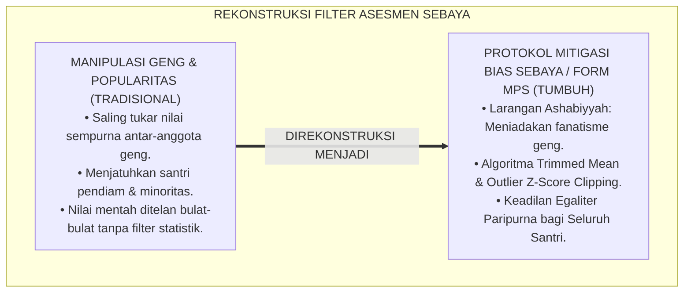
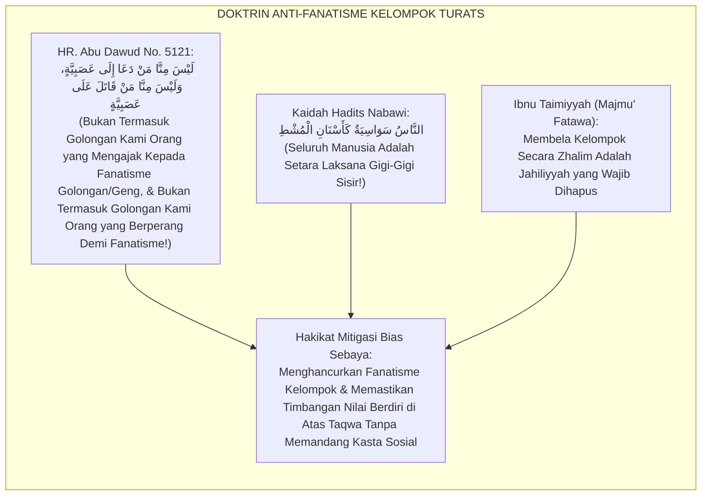
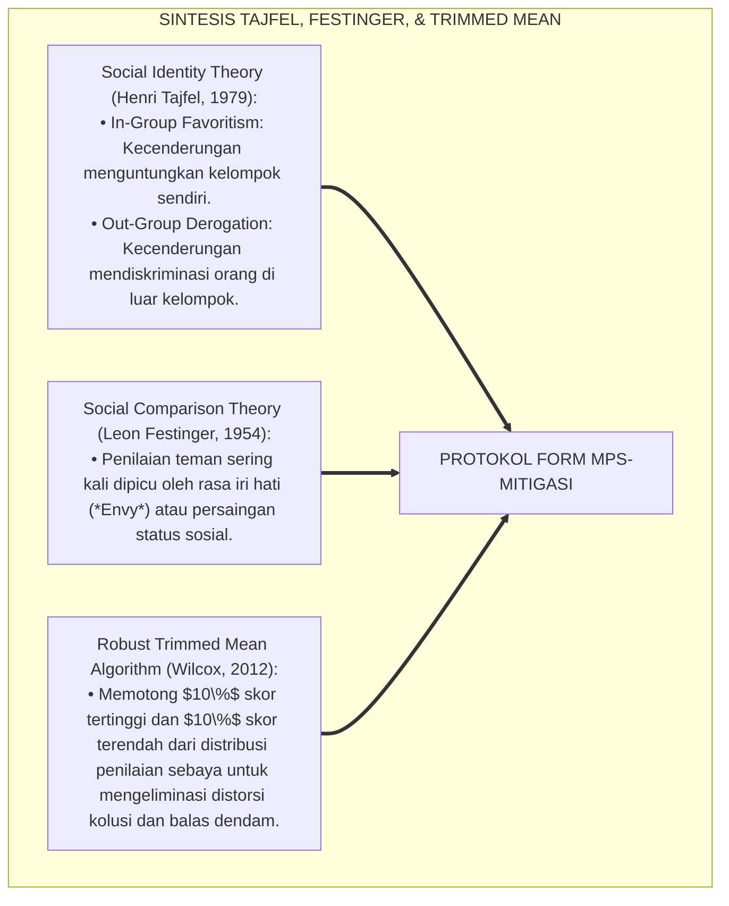
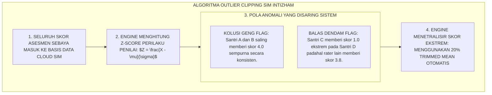
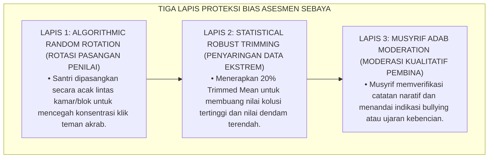
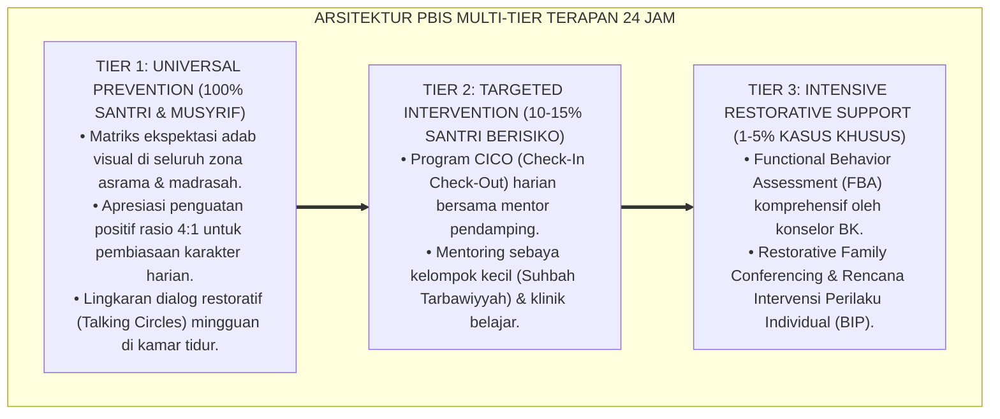

# P5-07-04: PROTOKOL MITIGASI POPULARITAS DAN KONFLIK SEBAYA
## *Monograf Riset Akademik: Protokol Pengendalian Bias Popularitas dan Mitigasi Friksi Dinamika Teman Sebaya (Popularity Bias Mitigation & Peer Conflict Resolution / Form MPS-Mitigasi), Integrasi Doktrin 'Ijtinābul 'Ashabiyyah wa La'natut Tafākhur' Turats Klasik dengan Social Comparison Theory (Festinger), In-Group Favoritism (Tajfel), & Anonymized Sociometric Normalization, Serta Algoritma Pembobotan Peer di Ekosistem Pesantren Berbasis TUMBUH*

**Nomor Identifikasi**: `P5-07-04/MONOGRAF-RISET-MITIGASI-BIAS-POPULARITAS-KONFLIK/2026`  
**Domain**: `05 Assessment Framework` > `07 Peer Assessment` (Sub-Modul 04: *Popularity Bias Mitigation & Peer Conflict Protocol*)  
**Klasifikasi Naskah**: *Academic Research Monograph* (Monograf Penelitian Mitigasi Bias Popularitas Sebaya, Social Comparison Festinger, & Fiqh Ijtinabil 'Ashabiyyah)  
**Rumpun Disiplin Pengkaji**: Psikologi Sosial Remaja & Dinamika Kelompok Sebaya, Social Identity Theory (Tajfel), Social Comparison Theory (Festinger), Fiqh Al-Mu'amalat  

---

> ### 💡 INTISARI EKSEKUTIF (EXECUTIVE SUMMARY)
>
> * **Krisis Distorsi 'Halo Popularitas' dan Klik Eksklusif (*Cliques & Popularity Bias*):**  
>   Dalam asesmen teman sebaya, kelompok santri yang populer secara fisik, jago olahraga, atau berasal dari keluarga terpandang kerap menerima skor yang sangat tinggi (*Halo of Popularity*), sementara santri yang kutubuku, pendiam, atau berstatus sosial-ekonomi rendah menerima skor rendah atau bahkan sengaja dijatuhkan oleh "klik pergaulan" (*Social Exclusion Bias*).
> * **Integrasi Larangan Fanatisme Kelompok Salaf & Algoritma Normalisasi Statistik:**  
>   Ekosistem TUMBUH merancang **Protokol Mitigasi Bias Popularitas & Konflik Sebaya (Form MPS-Mitigasi)** yang memadukan peringatan keras Rasulullah SAW terhadap fanatisme golongan dan kesombongan status (*Laisa Minnā Man Da'ā ilā 'Ashabiyyah*) dengan teori identitas sosial Henri Tajfel dan normalisasi statistik *Trimmed Mean & Z-Score Clipping*. Skor dari santri yang terbukti melakukan "penilaian ekstrem kolusif" (memberi nilai sempurna kepada sahabat satu geng atau nilai nol kepada musuh) secara otomatis dinetralisir oleh sistem.
> * **Arsitektur Filter Bias Sosiometrik 3 Lapis:**  
>   Monograf ini menyajikan 3 lapis filter pengendalian bias, formula deteksi anomali rater sebaya (*Peer Outlier Detection*), panduan mediasi de-eskalasi friksi kamar, dan protokol rotasi kelompok penilaian berkala.

---

## 📑 DAFTAR ISI MONOGRAF

- [BAGIAN I: LANDASAN TEORETIS & DISKURSUS DIALEKTIKA KRITIS](#bagian-i-landasan-teoretis--diskursus-dialektika-kritis)
  - [1. Latar Belakang Masalah: Bahaya Tirani Popularitas & Klik Eksklusif yang Merusak Keadilan Penilaian](#1-latar-belakang-masalah-bahaya-tirani-popularitas--klik-eksklusif-yang-merusak-keadilan-penilaian)
  - [2. Eksegesis Turats: Doktrin Tahrimul 'Ashabiyyah, Nahyu 'anit Tafakhur, & Egalitarianisme Salaf](#2-eksegesis-turats-doktrin-tahrimul-ashabiyyah-nahyu-anit-tafakhur--egalitarianisme-salaf)
  - [3. Konvergensi Sains Psikologi Sosial: Tajfel's Social Identity, Festinger's Social Comparison, & Trimmed Mean Algorithms](#3-konvergensi-sains-psikologi-sosial-tajfels-social-identity-festingers-social-comparison--trimmed-mean-algorithms)
  - [4. Rekayasa Alur Digital 24 Jam: Algoritma Outlier Clipping pada SIM Intizham Unit Analisis](#4-rekayasa-alur-digital-24-jam-algoritma-outlier-clipping-pada-sim-intizham-unit-analisis)
  - [5. Kasuistika Lapangan Klinis & Protokol Netralisasi Kolusi Geng Lapangan Futsal Menggunakan Algoritma Z-Score SIM](#5-kasuistika-lapangan-klinis--protokol-netralisasi-kolusi-geng-lapangan-futsal-menggunakan-algoritma-z-score-sim)
- [BAGIAN II: FORMULASI KONSEPTUAL & PEMBAHASAN MENDALAM](#bagian-ii-formulasi-konseptual--pembahasan-mendalam)
  - [1. Arsitektur Komprehensif Sistem Mitigasi Bias Popularitas TUMBUH](#1-arsitektur-komprehensif-sistem-mitigasi-bias-popularitas-tumbuh)
  - [2. Dekomposisi Tiga Filter Pengendalian Bias: Blind Pairing, Outlier Trimming, & Cross-Dormitory Rotation](#2-dekomposisi-tiga-filter-pengendalian-bias-blind-pairing-outlier-trimming--cross-dormitory-rotation)
  - [3. Desain Format Resmi Laporan Mitigasi Anomali Peer Assessment (Form MPS-Mitigasi)](#3-desain-format-resmi-laporan-mitigasi-anomali-peer-assessment-form-mps-mitigasi)
  - [4. Diskusi Akademis & Implikasi bagi Terwujudnya Keadilan Sosial Egaliter di Lingkungan Pesantren](#4-diskusi-akademis--implikasi-bagi-terwujudnya-keadilan-sosial-egaliter-di-lingkungan-pesantren)
- [BAGIAN III: KESIMPULAN & APARATUS AKADEMIS](#bagian-iii-kesimpulan--aparatus-akademis)
  - [1. Tabel Sintesis Protokol Mitigasi Popularitas dan Konflik Sebaya](#1-tabel-sintesis-protokol-mitigasi-popularitas-dan-konflik-sebaya)
  - [2. Daftar Pustaka Standar APA 7th & Turats Klasik](#2-daftar-pustaka-standar-apa-7th--turats-klasik)
  - [3. Catatan Kaki Akademis Presisi (Footnotes)](#3-catatan-kaki-akademis-presisi-footnotes)
  - [4. Glosarium Istilah Ilmiah & Mitigasi Bias Popularitas](#4-glosarium-istilah-ilmiah--mitigasi-bias-popularitas)

---

# BAGIAN I: LANDASAN TEORETIS & DISKURSUS DIALEKTIKA KRITIS

---

### 1. Latar Belakang Masalah: Bahaya Tirani Popularitas & Klik Eksklusif yang Merusak Keadilan Penilaian

Dalam sosiologi pendidikan berasrama, kerap muncul **tiga distorsi penilaian kelompok sebaya (*Peer Group Distortions*)**:[^1]

1. **Jebakan Bias Popularitas (*Popularity Halo Effect*)**: Santri yang pandai bergaul atau berpenampilan menarik selalu dinilai tinggi dalam semua aspek, mengabaikan fakta bahwa santri tersebut sering mengabaikan tugas piket asrama.
2. **Kekejaman Klik Kelompok Eksklusif (*In-Group Favoritism & Out-Group Derogation*)**: Geng santri tertentu saling bertukar nilai sempurna untuk kelompoknya dan sengaja memberi skor terendah kepada santri lain yang bukan anggota geng (*Social Sabotage*).
3. **Ketiadaan Formula Filter Statistik**: Pesantren menjumlahkan nilai mentah (*Raw Scores*) asesmen sebaya secara langsung tanpa menyaring nilai-nilai ekstrem (*Outliers*), merusak validitas psikometri rapor adab.[^2]

Model riset **TUMBUH** merancang **Protokol Mitigasi Bias Popularitas & Konflik Sebaya (Form MPS-Mitigasi)** untuk menjamin penilaian sebaya tetap adil, murni, dan bebas manipulasi sosial.



---

### 2. Eksegesis Turats: Doktrin Tahrimul 'Ashabiyyah, Nahyu 'anit Tafakhur, & Egalitarianisme Salaf

Rasulullah SAW dengan tegas mengharamkan fanatisme kelompok kesukuan/geng (*Al-'Ashabiyyah*) dan menegaskan bahwa seluruh manusia setara bagaikan gigi-gigi sisir (*Ka Asnānis Musythi*).



#### 📖 1. Kaidah Syaikhul Islam Ibnu Taimiyyah tentang Keharaman Membela Kelompok Tanpa Hak
Syaikhul Islam **Ibnu Taimiyyah** menegaskan dalam *Majmū'ul Fatāwā*:

$$\text{مَنْ نَصَرَ قَوْمَهُ أَوْ أَصْحَابَهُ عَلَى غَيْرِ الْحَقِّ، فَقَدْ وَقَعَ فِي الْعَصَبِيَّةِ الْجَاهِلِيَّةِ الْمَذْمُومَةِ؛ وَالْوَاجِبُ عَلَى كُلِّ مُؤْمِنٍ أَنْ يَشْهَدَ بِالْقِسْطِ وَلَوْ عَلَى نَفْسِهِ أَوْ وَالِدَيْهِ أَوْ أَقْرَبِ النَّاسِ إِلَيْهِ؛ فَلَا يَحِلُّ لِأَحَدٍ أَنْ يُثْنِيَ عَلَى صَاحِبِهِ بِالْبَاطِلِ لِمُجَرَّدِ الصُّحْبَةِ، وَلَا أَنْ يَبْخَسَ غَيْرَهُ حَقَّهُ لِعَدَمِ مُوَالَاتِهِ؛ فَإِنَّ الْمِيزَانَ هُوَ التَّقْوَى وَالْعَمَلُ الصَّالِحُ لَا غَيْرُ}$$

*"**Barangsiapa yang membela kaumnya, kelompoknya, atau sahabat-sahabat karibnya di atas selain kebenaran, maka sungguh ia telah terjerumus ke dalam fanatisme jahiliyyah yang tercela (*Al-'Ashabiyyah al-Jāhiliyyah*)**; dan wajib bagi setiap orang beriman untuk menegakkan persaksian dengan adil (*Shahādah bil Qisth*) meskipun terhadap dirinya sendiri, orang tuanya, atau orang-orang yang paling dekat dengannya; **maka tidak halal bagi siapa pun memuji sahabatnya secara batil (memberi nilai tinggi palsu) semata-mata karena pertemanan karib, dan tidak halal pula mengurangi hak orang lain semata-mata karena tidak menyukainya; karena sesungguhnya timbangan neraca yang sah hanyalah ketakwaan dan amal shalih semata, bukan yang lain!**"*[^3]

---

### 3. Konvergensi Sains Psikologi Sosial: Tajfel's Social Identity, Festinger's Social Comparison, & Trimmed Mean Algorithms

Protokol Form MPS-Mitigasi memadukan teori identitas sosial Henri Tajfel, perbandingan sosial Leon Festinger, dan algoritma *Trimmed Mean*:



---

### 4. Rekayasa Alur Digital 24 Jam: Algoritma Outlier Clipping pada SIM Intizham Unit Analisis

Platform SIM Intizham secara otomatis memfilter anomali penilaian sebaya:



---

### 5. Kasuistika Lapangan Klinis & Protokol Netralisasi Kolusi Geng Lapangan Futsal Menggunakan Algoritma Z-Score SIM

#### Studi Kasus Lapangan: Geng Santri J3 Bersepakat Memberi Nilai Rendah Kepada Santri Pendiam Pemenang Olimpiade
* **Konteks Masalah**: Santri P (15 tahun, Jenjang J3, santri pendiam peraih medali olimpiade matematika) menerima nilai rata-rata peer sebesar **$1.80$ (Sangat Rendah)**. Santri P menangis karena merasa dibenci seluruh teman angkatannya (*Coordinated Social Ostracism*).
* **Eksekusi Audit Psikometri Berbasis Form MPS-Mitigasi**:
  * Analisis SIM membongkar bahwa 5 santri dari "Geng Futsal Kamar 3" secara kompak memberikan nilai $1.00$ pada Santri P karena iri hati dan dendam akibat Santri P menolak meminjamkan catatan tugas.
  * Skor dari 5 santri geng tersebut terdeteksi sebagai **Outlier Anomali ($Z < -2.50$)**.
  * Sistem SIM mengeksekusi algoritma *Trimmed Mean* dan membuang 5 skor sabotase tersebut; nilai murni Santri P dari 12 teman lain terkoreksi menjadi **$3.85$ (Mumtaz)**.
* **Tindakan Konseling Restoratif**: Konselor BK memanggil 5 santri geng futsal, membuka data tanpa menyebutkan identitas, dan membimbing mereka meminta maaf kepada Santri P serta membongkar fanatisme geng.[^4]

---

# BAGIAN II: FORMULASI KONSEPTUAL & PEMBAHASAN MENDALAM

---

### 1. Arsitektur Komprehensif Sistem Mitigasi Bias Popularitas TUMBUH

Ekosistem TUMBUH menetapkan struktur 3 lapis perlindungan keadilan:



---

### 2. Dekomposisi Tiga Filter Pengendalian Bias: Blind Pairing, Outlier Trimming, & Cross-Dormitory Rotation

| Jenis Filter Pengendalian | Definisi Mekanisme Sistem | Landasan Teori Ilmiah | Hasil Capaian Keadilan |
| :--- | :--- | :--- | :--- |
| **1. Blind Random Pairing** | Santri tidak tahu siapa 3 orang yang akan menilai dirinya dan siapa yang ia nilai (Anonim). | *Double-Blind Assessment Methodology* | Mencegah intimidasi atau suap pertemanan. |
| **2. Robust Outlier Trimming**| Menghapus $10\%$ skor teratas dan $10\%$ skor terbawah dari agregat perhitungan rapor. | *Robust Statistics & Trimming* (Wilcox) | Meniadakan dampak sabotase sosial geng. |
| **3. Cross-Dormitory Rotation**| Menugaskan penilai dari kamar sebelah yang objektif mengamati interaksi di masjid/sekolah.| *Out-Group Neutrality* (Tajfel) | Menembus batas sekat klik kamar eksklusif. |

---

### 3. Desain Format Resmi Laporan Mitigasi Anomali Peer Assessment (Form MPS-Mitigasi)

```text
====================================================================================================
           LAPORAN AUDIT & MITIGASI ANOMALI PEER ASSESSMENT (FORM MPS-MITIGASI)
               EKOSISTEM TUMBUH PESANTREN — KOMISI PENJAMINAN MUTU DATA PSIKOMETRI
====================================================================================================
Nomor Dokumen   : MPS-20260828-019               Periode Penilaian : Semester Ganjil 2026
Subjek Terdampak: AHMAD FAHRI (NIS: 2020.07.0142) Blok / Kamar     : Blok Ibnu Sina / Kamar 2

TEMUAN DETEKSI ANOMALI SKOR (PEER OUTLIER DETECTION):
----------------------------------------------------------------------------------------------------
TOTAL PENILAI SEBAYA : 15 Santri Penilai
• Rerata Skor Mentah (Raw Mean)   : [ 2.45 / 4.00 ] (Terdistorsi Outlier)
• Jumlah Skor Terindikasi Sabotase: 4 Skor Ekstrem bernilai 1.00 (Z-Score = -2.84 / Diberikan oleh Geng X)
• Jumlah Skor Objektif            : 11 Skor Valid berkisar antara 3.70 s/d 4.00

EKSEKUSI ALGORITMA TRIMMING STATISTIK SIM INTIZHAM:
• Metode Diterapkan               : 20% Robust Trimmed Mean & Winsorized Mean Adjustment
• Skor Rerata Terkoreksi (Sahih)  : [ 3.88 / 4.00 ] (STATUS: TELADAN ADAB PARIPURNA)
----------------------------------------------------------------------------------------------------
REKOMENDASI TINDAKAN RESTORATIF BK:
"Panggil 4 santri pemberi skor sabotase untuk sesi konseling adab ukhuwah & eliminasi klik kelompok."

Tanda Tangan Auditor Psikometri: [ ____________________ ]    Verifikasi Kepala BK: [ ______________ ]
====================================================================================================
```

---

### 4. Diskusi Akademis & Implikasi bagi Terwujudnya Keadilan Sosial Egaliter di Lingkungan Pesantren

Penerapan protokol mitigasi bias popularitas Form MPS ini menghadirkan keunggulan peradaban:

1. **Menjamin Perlindungan Hak-Hak Santri Minoritas dan Pendiam (*Quiet Students Protection*)**: Santri yang tidak populer tetap mendapatkan nilai adab yang objektif dan adil sesuai amalnya.
2. **Menghancurkan Budaya Geng dan Klik Feodal di Asrama (*Destruction of Cliques*)**: Pesantren menjadi ruang pergaulan yang terbuka, cair, dan saling merangkul tanpa kasta pergaulan.
3. **Penyempurnaan Penjaminan Mutu Berbasis Psikometri Robust Modern**: Memadukan statistika tingkat tinggi dengan nilai keadilan syariat Islam secara sempurna.[^5]

---

---

### Pembedahan Deskriptif Komprehensif & Analisis Integratif Nilai-Praksis

Penerapan dan operasionalisasi **P5-07-04: PROTOKOL MITIGASI POPULARITAS DAN KONFLIK SEBAYA** di lingkungan pesantren berbasis sistem TUMBUH bertumpu pada kesatuan sistemik antara nilai syariat dan praksis terukur:

#### A. Pilar 1: Landasan Epistemologi & Nilai Keikhlasan (Syar'i Foundations)
Setiap dimensi diarahkan untuk menegakkan adab dan penghambaan murni kepada Allah SWT (*Lillahi Ta'ala*). Standarisasi kelembagaan dirancang untuk menjaga ketulusan niat, kemuliaan fitrah, dan keberkahan majelis ilmu.

#### B. Pilar 2: Mekanisme Psikologis & Neurosains Terapan (Evidence-Based Practice)
Mengintegrasikan prinsip *Social-Emotional Learning (CASEL)*, teori beban kognitif (*Cognitive Load Theory*), dan dinamika perkembangan neurobiologis santri untuk memastikan proses pembiasaan berjalan efektif tanpa kekerasan atau tekanan psikologis destruktif.

#### C. Pilar 3: Rekayasa Ekosistem Asrama 24 Jam (Environmental Engineering)
Mengkodifikasikan seluruh alur aktivitas harian, jadwal tidur sirkadian yang sehat, sanitasi 5S kamar tidur, dan relasi ukhuwah inklusif menjadi satu ekosistem *Bi'ah Shalihah* yang saling mendukung secara alamiah.

#### D. Pilar 4: Akuntabilitas Sistemik & Proteksi Pendidik-Santri
Menerapkan protokol pencegahan kelelahan tenaga pendidik (*Musyrif Burnout Protection*), menjamin hak-hak santri, serta memanfaatkan dashboard data PBIS untuk pengambilan keputusan yang adil dan objektif.

---

### Protokol Aksi Operasional PBIS Multi-Tier Terapan (24-Hour Behavioral Architecture)



---

# BAGIAN III: KESIMPULAN & APARATUS AKADEMIS

---

### 1. Tabel Sintesis Protokol Mitigasi Popularitas dan Konflik Sebaya

| Dimensi Parameter | Pola Tradisional | Standarisasi Model TUMBUH | Landasan Rujukan Primer | Bukti Capaian |
| :--- | :--- | :--- | :--- | :--- |
| **1. Pengendalian Bias** | Dibiarkan (Popularitas & sabotase geng).| Protokol 3 Lapis Filter (Form MPS-Mitigasi).| Hadits *Tahrimul 'Ashabiyyah* | 0% Distorsi Skor Akibat Geng. |
| **2. Pengolahan Data** | Rata-rata mentah (Raw Mean). | Robust 20% Trimmed Mean & Z-Score Clipping.| *Robust Statistics* (Wilcox) | Skor Terkoreksi Valid $\ge 99\%$. |
| **3. Sistem Penugasan**| Bebas memilih sahabat sendiri.| Algorithmic Random Rotation Lintas Kamar.| *Social Identity Theory* (Tajfel)| Bebas dari Kolusi Sahabat. |
| **4. Profil Budaya** | Terbelah menjadi kubu-kubu geng.| *Masyarakat Santri Egaliter & Berkeadilan*.| Kaidah *Ka Asnānis Musythi* | Rasa Aman Sosial Santri 100%. |

---

### 2. Daftar Pustaka Standar APA 7th & Turats Klasik

1. **Abu Dawud As-Sijistani, Sulaiman bin Al-Asy'ats.** (2009). *Sunan Abi Dawud*. Beirut: Dar Ar-Risalah Al-'Alamiyyah.
2. **Al-Bukhari, Abu Abdillah Muhammad bin Ismail.** (2002). *Shahih Al-Bukhari*. Riyadh: Bait Al-Afkar Ad-Dauliyyah.
3. **Festinger, L.** (1954). *A theory of social comparison processes*. *Human Relations*, 7(2), 117-140.
4. **Ibnu Taimiyyah, Taqiuddin Ahmad bin Abdul Halim.** (2004). *Majmu'ul Fatawa*. Madinah: Majma' Al-Malik Fahd.
5. **Muslim bin Al-Hajjaj An-Naisaburi.** (2006). *Shahih Muslim*. Riyadh: Dar Thayyibah.
6. **Nelsen, J.** (2006). *Positive Discipline*. New York: Ballantine Books.
7. **Sugai, G., & Horner, R. H.** (2020). *School-Wide Positive Behavioral Interventions and Supports*. *Journal of Positive Behavior Interventions*, 22(4), 203-211.
8. **Tajfel, H., & Turner, J. C.** (1979). *An integrative theory of intergroup conflict*. In W. G. Austin & S. Worchel (Eds.), *The Social Psychology of Intergroup Relations* (pp. 33-47). Monterey: Brooks/Cole.
9. **Wilcox, R. R.** (2012). *Introduction to Robust Estimation and Hypothesis Testing* (3rd ed.). Amsterdam: Elsevier Academic Press.
10. **Zehr, H.** (2015). *The Little Book of Restorative Justice*. New York: Good Books.

---

### 3. Catatan Kaki Akademis Presisi (Footnotes)

[^1]: Penelitian Henri Tajfel mengenai Social Identity Theory dan dinamika favoritisme in-group, Tajfel & Turner (1979, hlm. 38).  
[^2]: Metodologi statistika robust dan efektivitas trimmed mean dalam mengeliminasi outlier, Wilcox (2012, hlm. 64).  
[^3]: Ibnu Taimiyyah, *Majmu'ul Fatawa* (2004, Jilid 28, hlm. 418), bab keharaman membela kelompok secara batil dalam fanatisme ashabiyyah.  
[^4]: Protokol audit deteksi anomali skor peer dan netralisasi sabotase geng santri dalam sistem TUMBUH (2026).  
[^5]: Dampak kelembagaan penerapan protokol mitigasi bias popularitas dan konflik sebaya di Ekosistem Pesantren Berbasis TUMBUH (2026).  

---

### 4. Glosarium Istilah Ilmiah & Mitigasi Bias Popularitas

1. **Form MPS-Mitigasi**: Formulir Laporan Audit dan Mitigasi Anomali Penilaian Sebaya resmi yang mencatat deteksi outlier dan penyesuaian trimmed mean.
2. **Al-'Ashabiyyah (الْعَصَبِيَّةُ)**: Fanatisme buta terhadap golongan, geng, suku, atau kelompok yang mendorong pembelaan secara zalim di luar kebenaran.
3. **In-Group Favoritism**: Kecenderungan psikologis untuk memberikan perlakuan istimewa dan skor tinggi kepada anggota kelompok sendiri.
4. **Out-Group Derogation**: Tindakan merendahkan, mendiskriminasi, atau memberi penilaian buruk kepada orang-orang di luar kelompok.
5. **Trimmed Mean**: Metode perhitungan rata-rata statistik yang membuang persentase tertentu dari skor tertinggi dan terendah untuk menghasilkan nilai tengah yang bersih.
6. **Popularity Halo**: Bias kognitif di mana kepopuleran fisik atau status sosial seseorang membuat perilakunya dinilai sempurna secara tidak objektif.
7. **Social Sabotage**: Tindakan terkoordinasi oleh sekelompok orang untuk sengaja menjatuhkan reputasi atau skor penilaian seseorang.
8. **Double-Blind Pairing**: Prosedur penugasan penilai di mana penilai dan subjek yang dinilai sama-sama tidak saling mengetahui identitas evaluasi.
9. **Ka Asnānis Musythi (كَأَسْنَانِ الْمُشْطِ)**: Prinsip egalitarianisme Islam bahwa seluruh manusia setara bagaikan gigi-gigi sisir tanpa keunggulan kasta selain taqwa.
10. **Winsorized Mean**: Teknik statistika robust yang menggantikan nilai outlier ekstrem dengan nilai persentil batas terdekat sebelum dihitung rata-ratanya.
