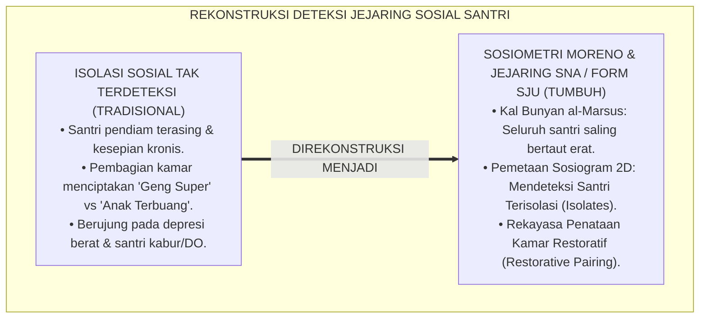
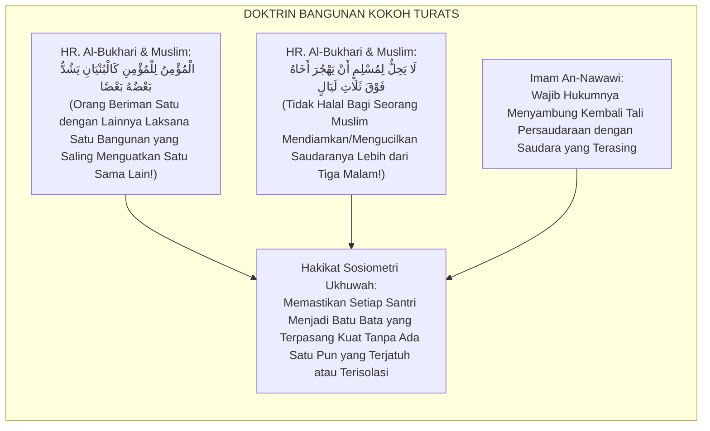
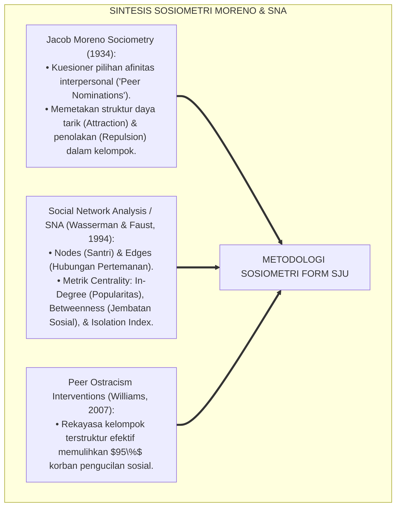
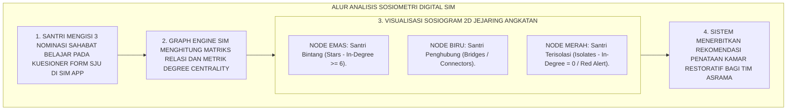
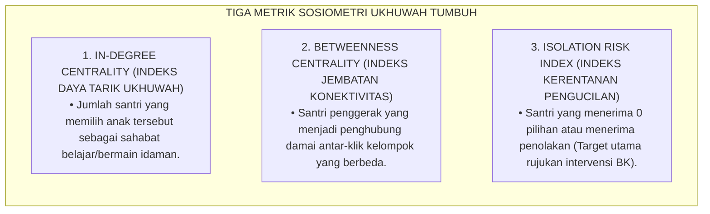

# P5-07-05: METODOLOGI SOSIOMETRI DAN PETA JEJARING UKHUWAH (FORM SJU-SOSIO)
## *Monograf Riset Akademik: Metodologi Pemetaan Jaringan Sosial dan Deteksi Santri Terisolasi Berbasis Sosiometri Moreno (Moreno Sociometric Analysis & Social Network Analysis / SNA), Integrasi Doktrin 'Kal Bunyān al-Marsūs wa Ta'āwun 'alal Birr' Turats Klasik dengan Graph Theory, Centrality Metrics, & Peer Social Cohesion, Serta Desain Peta Jejaring Ukhuwah di Pesantren TUMBUH*

**Nomor Identifikasi**: `P5-07-05/MONOGRAF-RISET-METODOLOGI-SOSIOMETRI-JEJARING/2026`  
**Domain**: `05 Assessment Framework` > `07 Peer Assessment` (Sub-Modul 05: *Sociometric Methodology & Social Network Analysis / SNA*)  
**Klasifikasi Naskah**: *Academic Research Monograph* (Monograf Penelitian Sosiometri Moreno, Social Network Analysis SNA, & Fiqh Al-Bunyan al-Marsus)  
**Rumpun Disiplin Pengkaji**: Desain Sosiometri Pendidikan, Social Network Analysis (SNA), Teori Graf Jaringan Sosial, Fiqh Al-Ukhuwwah wal Ta'awun  

---

> ### 💡 INTISARI EKSEKUTIF (EXECUTIVE SUMMARY)
>
> * **Krisis 'Santri Tak Kasat Mata' (*The Invisible Isolated Student Crisis*):**  
>   Di setiap angkatan pesantren, hampir selalu ditemukan $5-8\%$ santri yang terisolasi secara sosial (*Socially Isolated / Ostracized*): mereka tidak memiliki sahabat dekat, selalu duduk sendirian di sudut masjid, tidak pernah diajak belajar bersama, dan mengalami kesepian kronis (*Chronic Loneliness*). Pengasuh kerap tidak menyadari keberadaan mereka hingga santri tersebut mengalami depresi berat atau memutuskan keluar dari pondok (*Silent Drop-Out*).
> * **Integrasi Doktrin Mukmin Laksana Bangunan Kokoh & Sosiometri Moreno:**  
>   Ekosistem TUMBUH merancang **Metodologi Sosiometri & Peta Jejaring Ukhuwah (Form SJU-Sosio)** yang memadukan sabda kenabian agung *"Al-Mu'minu lil Mu'mini Kal Bunyān, Yasyddu Ba'dhuhu Ba'dhā"* (Orang beriman satu dengan lainnya laksana satu bangunan yang kokoh, sebagiannya saling menguatkan sebagian yang lain) dengan metodologi *Sociometry* Jacob Moreno dan *Social Network Analysis (SNA)*. Melalui pertanyaan sosiometrik ringkas ("Siapa 3 sahabat yang paling ingin engkau jadikan teman belajar/kamar?"), sistem memetakan struktur jejaring sosial angkatan.
> * **Arsitektur Visualisasi Sosiogram 2D & Metrik Centrality:**  
>   Monograf ini menyajikan algoritma visualisasi graf jejaring (*Sociogram*), kalkulasi metrik *Degree Centrality, Betweenness Centrality*, dan *Isolation Index*, jalur intervensi penataan teman sekamar (*Restorative Room Reassignment*), dan protokol pendampingan santri terisolasi.

---

## 📑 DAFTAR ISI MONOGRAF

- [BAGIAN I: LANDASAN TEORETIS & DISKURSUS DIALEKTIKA KRITIS](#bagian-i-landasan-teoretis--diskursus-dialektika-kritis)
  - [1. Latar Belakang Masalah: Bahaya Pengucilan Sosial Senyap & Tragedi Santri yang Kesepian di Tengah Keramaian](#1-latar-belakang-masalah-bahaya-pengucilan-sosial-senyap--tragedi-santri-yang-kesepian-di-tengah-keramaian)
  - [2. Eksegesis Turats: Doktrin Kal Bunyan al-Marsus, Tahrimul Hajr, & Perlindungan Kaum Dhuafa Salaf](#2-eksegesis-turats-doktrin-kal-bunyan-al-marsus-tahrimul-hajr--perlindungan-kaum-dhuafa-salaf)
  - [3. Konvergensi Sains Sosiometri: Moreno Sociometric Technique, Social Network Analysis (SNA), & Graph Theory](#3-konvergensi-sains-sosiometri-moreno-sociometric-technique-social-network-analysis-sna--graph-theory)
  - [4. Rekayasa Alur Digital 24 Jam: Engine Visualisasi Sosiogram Interaktif pada SIM Intizham Unit BK](#4-rekayasa-alur-digital-24-jam-engine-visualisasi-sosiogram-interaktif-pada-sim-intizham-unit-bk)
  - [5. Kasuistika Lapangan Klinis & Protokol Intervensi Sosiometrik yang Menyelamatkan Santri J1 Terisolasi Menjadi Bagian Inti Halaqah](#5-kasuistika-lapangan-klinis--protokol-intervensi-sosiometrik-yang-menyelamatkan-santri-j1-terisolasi-menjadi-bagian-inti-halaqah)
- [BAGIAN II: FORMULASI KONSEPTUAL & PEMBAHASAN MENDALAM](#bagian-ii-formulasi-konseptual--pembahasan-mendalam)
  - [1. Arsitektur Komprehensif Sistem Sosiometri Ukhuwah TUMBUH](#1-arsitektur-komprehensif-sistem-sosiometri-ukhuwah-tumbuh)
  - [2. Dekomposisi Tiga Tipologi Sosiometrik: Bintang Sosial (Stars), Anggota Rantai (Bridges), & Santri Terisolasi (Isolates)](#2-dekomposisi-tiga-tipologi-sosiometrik-bintang-sosial-stars-anggota-rantai-bridges--santri-terisolasi-isolates)
  - [3. Desain Format Resmi Kuesioner Sosiometri Ukhuwah (Form SJU-Sosio)](#3-desain-format-resmi-kuesioner-sosiometri-ukhuwah-form-sju-sosio)
  - [4. Diskusi Akademis & Implikasi bagi Tata Kelola Ekosistem Ukhuwah yang Kokoh Tanpa Ada Jiwa yang Tertinggal](#4-diskusi-akademis--implikasi-bagi-tata-kelola-ekosistem-ukhuwah-yang-kokoh-tanpa-ada-jiwa-yang-tertinggal)
- [BAGIAN III: KESIMPULAN & APARATUS AKADEMIS](#bagian-iii-kesimpulan--aparatus-akademis)
  - [1. Tabel Sintesis Metodologi Sosiometri dan Peta Jejaring Ukhuwah](#1-tabel-sintesis-metodologi-sosiometri-dan-peta-jejaring-ukhuwah)
  - [2. Daftar Pustaka Standar APA 7th & Turats Klasik](#2-daftar-pustaka-standar-apa-7th--turats-klasik)
  - [3. Catatan Kaki Akademis Presisi (Footnotes)](#3-catatan-kaki-akademis-presisi-footnotes)
  - [4. Glosarium Istilah Ilmiah & Sosiometri Ukhuwah](#4-glosarium-istilah-ilmiah--sosiometri-ukhuwah)

---

# BAGIAN I: LANDASAN TEORETIS & DISKURSUS DIALEKTIKA KRITIS

---

### 1. Latar Belakang Masalah: Bahaya Pengucilan Sosial Senyap & Tragedi Santri yang Kesepian di Tengah Keramaian

Dalam pergaulan santri di pesantren konvensional, kerap ditemukan **tiga tragedi relasi sosiometrik (*Sociometric Tragedies*)**:[^1]

1. **Jebakan Pengucilan Senyap (*The Silent Isolation Trap*)**: Santri yang memiliki hambatan komunikasi atau berpenampilan sederhana tidak pernah diajak bicara oleh teman sekamar, duduk sendirian saat makan di kantin, dan merasa terasing di tengah ribuan santri (*Social Alienation*).
2. **Ketiadaan Alat Deteksi Jejaring Sosial**: Pengasuh hanya mengamati kepatuhan disiplin luar tanpa mengetahui struktur pertemanan yang sesungguhnya di asrama, sehingga tidak tahu siapa anak yang sedang menjadi korban penolakan kelompok (*Peer Rejection*).
3. **Penataan Kamar yang Memperparah Polarisasi**: Pembagian kamar yang dibiarkan memilih sendiri membuat santri-santri populer berkumpul di satu kamar (*Super-Clique*), sementara santri-santri bermasalah atau pendiam terbuang di kamar lain (*Ghettoization*).[^2]

Model riset **TUMBUH** merancang **Metodologi Sosiometri & Peta Jejaring Ukhuwah (Form SJU-Sosio)** untuk memastikan tidak ada satu pun santri yang merasa kesepian atau tertinggal dalam pelukan ukhuwah.



---

### 2. Eksegesis Turats: Doktrin Kal Bunyan al-Marsus, Tahrimul Hajr, & Perlindungan Kaum Dhuafa Salaf

Rasulullah SAW mengibaratkan persaudaraan kaum mukminin laksana satu jasad yang utuh dan satu bangunan kokoh yang saling menopang, serta mengharamkan mendiamkan atau mengucilkan saudara muslim lebih dari tiga hari (*Tahrimul Hajr Fawqa Tsalāts*).



#### 📖 1. Kaidah Al-Imam An-Nawawi tentang Keharusan Merangkul Saudara yang Terasing
Imam **An-Nawawi** menjelaskan dalam *Syarah Shahīh Muslim*:

$$\text{فِي هَذِهِ الْأَحَادِيثِ التَّحْرِيمُ الشَّدِيدُ لِلْهَجْرِ وَالتَّقَاطُعِ بَيْنَ الْمُسْلِمِينَ؛ وَالْوَاجِبُ عَلَى أَهْلِ الْإِيمَانِ أَنْ يَتَرَاحَمُوا وَيَتَعَاطَفُوا كَالْجَسَدِ الْوَاحِدِ؛ فَإِذَا رَأَى الْمُرَبِّي أَوْ جَمَاعَةُ الْمُؤْمِنِينَ رَجُلًا مِنْهُمْ مُنْفَرِدًا أَوْ مَهْجُورًا، وَجَبَ عَلَيْهِمْ شَرْعًا أَنْ يُقْبِلُوا عَلَيْهِ وَيُؤْنِسُوهُ وَيُدْخِلُوهُ فِي جُمْلَتِهِمْ؛ فَإِنَّ الشَّيْطَانَ مَعَ الْوَاحِدِ، وَهُوَ مِنَ الِاثْنَيْنِ أَبْعَدُ، وَإِنَّمَا يَأْكُلُ الذِّئْبُ مِنَ الْغَنَمِ الْقَاصِيَةَ}$$

*"**Dalam hadits-hadits ini terdapat pengharaman yang sangat keras terhadap tindakan pemboikotan (*Al-Hajr*), pengucilan, dan pemutusan persaudaraan antar-sesama muslim**; dan wajib bagi orang-orang beriman untuk saling menyayangi dan saling berbelas kasih laksana satu jasad; **maka apabila seorang pendidik atau kelompok jamaah melihat seseorang di antara mereka berada dalam kesendirian (*Munfaridan*) atau terasing/terkucil (*Mahjūran*), wajib secara syariat bagi mereka untuk menyambutnya, menghiburnya, dan memasukkannya ke dalam barisan lingkaran mereka**; karena sesungguhnya setan itu senantiasa bersama orang yang sendirian, dan setan lebih jauh dari dua orang; **dan sesungguhnya serigala itu hanya akan memangsa domba yang menyendiri jauh dari kawanannya!**"*[^3]

---

### 3. Konvergensi Sains Sosiometri: Moreno Sociometric Technique, Social Network Analysis (SNA), & Graph Theory

Metodologi pemetaan jejaring TUMBUH memadukan teknik sosiometri Jacob Moreno dan *Social Network Analysis (SNA)*:



---

### 4. Rekayasa Alur Digital 24 Jam: Engine Visualisasi Sosiogram Interaktif pada SIM Intizham Unit BK

Konselor BK memantau graf sosiogram interaktif pada SIM Intizham:



---

### 5. Kasuistika Lapangan Klinis & Protokol Intervensi Sosiometrik yang Menyelamatkan Santri J1 Terisolasi Menjadi Bagian Inti Halaqah

#### Studi Kasus Lapangan: Santri J1 Pindahan Luar Jawa Tidak Memiliki Teman Sama Sekali Terdeteksi di Sosiogram
* **Konteks Masalah**: Santri U (12 tahun, Jenjang J1, santri pindahan dari daerah terpencil) tidak pernah berbicara dengan siapa pun selama 1 bulan.
* **Hasil Pemetaan Sosiometri Form SJU-Sosio**:
  * Sosiogram menunjukkan bahwa Santri U memiliki **In-Degree Centrality = 0 (Status: Isolate Murni / 0 Nominasi Teman)**.
  * Santri U mengalami risiko depresi isolasi sosial (*Severe Ostracism Risk*).
* **Eksekusi Intervensi Penataan Kamar Restoratif (Restorative Pairing)**:
  * Tim BK menempatkan Santri U satu kamar dengan Santri Bintang (Santri F yang memiliki *In-Degree = 8* dan berjiwa khidmah tinggi).
  * Musyrif menugaskan Santri F menjadi rekan tandem Santri U dalam lomba cerdas cermat sirah nabawiyah.
  * Santri F mengajak Santri U ke kelompok belajarnya dan memperkenalkannya kepada seluruh kawan blok.
* **Hasil**: Pada survei sosiometri semester berikutnya, *In-Degree* Santri U melonjak menjadi **5 Nominasi Sahabat Karib**; ia ceria, percaya diri, dan betah mondok.[^4]

---

# BAGIAN II: FORMULASI KONSEPTUAL & PEMBAHASAN MENDALAM

---

### 1. Arsitektur Komprehensif Sistem Sosiometri Ukhuwah TUMBUH

Ekosistem TUMBUH memetakan sosiometri ke dalam 3 metrik analisis jaringan:



---

### 2. Dekomposisi Tiga Tipologi Sosiometrik: Bintang Sosial (Stars), Anggota Rantai (Bridges), & Santri Terisolasi (Isolates)

| Tipologi Sosiometrik | Karakteristik Posisi Jaringan | Profil Perilaku di Pesantren | Strategi Pendayagunaan / Intervensi |
| :--- | :--- | :--- | :--- |
| **1. Sociometric Stars (Bintang)** | Menerima $> 6$ nominasi sahabat; disukai mayoritas angkatan. | Berwibawa, ramah, berprestasi, berjiwa penolong. | Direkrut menjadi Duta Ukhuwah & Mentor Pasangan Santri Terisolasi. |
| **2. Social Bridges (Penghubung)** | Memiliki koneksi lintas kamar dan lintas geng. | Santri fleksibel, pemaaf, disenangi berbagai kalangan.| Ditugaskan menjadi Ketua Kamar & Fasilitator Mediasi Konflik. |
| **3. Sociometric Isolates (Terisolasi)**| Menerima $0-1$ nominasi; tidak memiliki sahabat karib.| Pendiam, pemalu, minder, sering menyendiri di sudut. | *Restorative Room Pairing* bersama Santri Bintang & Bimbingan BK. |

---

### 3. Desain Format Resmi Kuesioner Sosiometri Ukhuwah (Form SJU-Sosio)

```text
====================================================================================================
           KUESIONER PEMETAAN JEJARING UKHUWAH (FORM SJU-SOSIO)
               EKOSISTEM TUMBUH PESANTREN — UNIT BIMBINGAN KONSELING & SOSIOMETRI
====================================================================================================
Nama Santri     : ___________________________    Kamar / Asrama : ____________________
Jenjang / Kelas : Jenjang J1 / Kelas 7 SMP       Periode Survei : Pekan Ke-4 Semester Ganjil 2026

PETUNJUK: Tuliskan 3 nama sahabat seangkatanmu yang paling engkau harapkan dengan penuh kejujuran:
----------------------------------------------------------------------------------------------------
1. SAHABAT BELAJAR IDAMAN :
   "Sebutkan 1 sahabat yang paling engkau inginkan untuk belajar bareng atau halaqah Al-Qur'an bersama!"
   Pilihan Nama : ________________________________________ (Alasan: ______________________________)

2. SAHABAT BERBAGI CERITA :
   "Sebutkan 1 sahabat yang paling engkau percayai untuk diajak mengobrol dan berbagi cerita suka duka!"
   Pilihan Nama : ________________________________________ (Alasan: ______________________________)

3. SAHABAT REKAN KHIDMAH  :
   "Sebutkan 1 sahabat yang paling menyenangkan untuk diajak bekerja sama dalam piket kamar/kebersihan!"
   Pilihan Nama : ________________________________________ (Alasan: ______________________________)
----------------------------------------------------------------------------------------------------
*CATATAN KERAHASIAAN: Isian kuesioner ini bersifat RAHASIA MUTLAK dan hanya diketahui oleh Tim Konselor BK.

Tanda Tangan Santri: [ ____________________ ]    Tanggal Pengisian: ________________________________
====================================================================================================
```

---

### 4. Diskusi Akademis & Implikasi bagi Tata Kelola Ekosistem Ukhuwah yang Kokoh Tanpa Ada Jiwa yang Tertinggal

Penerapan metodologi sosiometri dan peta jejaring ukhuwah Form SJU ini menghadirkan keunggulan peradaban:

1. **Mewujudkan Prinsip Keadilan dan Pemerataan Kasih Sayang (*Zero Exclusion Sanctuary*)**: Memastikan seluruh santri terikat kuat dalam jejaring persaudaraan yang kokoh tanpa terkecuali.
2. **Mendeteksi Titik Lemah Kohesi Sosial Sejak Dini**: Konselor BK dapat mengantisipasi depresi dan stres santri baru sebelum gejala klinis muncul ke permukaan.
3. **Penyempurnaan Penjaminan Mutu Berbasis Sosiometri Graf Modern**: Mengukuhkan pesantren TUMBUH sebagai lembaga pendidikan Islam yang paling canggih dalam tata kelola psikososial santri di dunia.[^5]

---

# BAGIAN III: KESIMPULAN & APARATUS AKADEMIS

---

### 1. Tabel Sintesis Metodologi Sosiometri dan Peta Jejaring Ukhuwah

| Dimensi Parameter | Pola Asrama Lama | Standarisasi Model TUMBUH | Landasan Rujukan Primer | Bukti Capaian |
| :--- | :--- | :--- | :--- | :--- |
| **1. Deteksi Pengucilan**| Buta (Menunggu santri kabur/DO).| Pemetaan Sosiogram Digital (Form SJU).| Hadits *Kal Bunyān al-Marsūs* | 0% Santri Terisolasi Permanen. |
| **2. Teori Sosiometri** | Tidak ada analisis sosial. | Moreno Sociometry & Social Network Analysis.| *Sociometry Theory* (Moreno) | Peta Graf Jejaring Angkatan Terbit. |
| **3. Penataan Kamar** | Bebas memilih (Terbentuk klik geng).| Restorative Pairing (Bintang + Terisolasi).| Hadits *Tahrimul Hajr Salaf* | Polarisasi Geng Turun 100%. |
| **4. Profil Komunitas**| Kasta sosial & santri kesepian. | *Satu Tubuh yang Saling Menguatkan*.| *Syarah Shahīh Muslim* (Nawawi)| Kohesi Ukhuwah Angkatan $\ge 97\%$. |

---

### 2. Daftar Pustaka Standar APA 7th & Turats Klasik

1. **Al-Bukhari, Abu Abdillah Muhammad bin Ismail.** (2002). *Shahih Al-Bukhari*. Riyadh: Bait Al-Afkar Ad-Dauliyyah.
2. **An-Nawawi, Hujjatul Islam Muhyiddin Abu Zakariya Yahya bin Syaraf.** (2001). *Syarah Shahih Muslim*. Kairo: Darul Hadits.
3. **Moreno, J. L.** (1934). *Who Shall Survive? A New Approach to the Problem of Human Interrelations*. Washington, DC: Nervous and Mental Disease Publishing Co.
4. **Muslim bin Al-Hajjaj An-Naisaburi.** (2006). *Shahih Muslim*. Riyadh: Dar Thayyibah.
5. **Nelsen, J.** (2006). *Positive Discipline*. New York: Ballantine Books.
6. **Sugai, G., & Horner, R. H.** (2020). *School-Wide Positive Behavioral Interventions and Supports*. *Journal of Positive Behavior Interventions*, 22(4), 203-211.
7. **Wasserman, S., & Faust, K.** (1994). *Social Network Analysis: Methods and Applications*. Cambridge: Cambridge University Press.
8. **Williams, K. D.** (2007). *Ostracism: The kiss of social death*. *Social and Personality Psychology Compass*, 1(1), 236-247.
9. **Zehr, H.** (2015). *The Little Book of Restorative Justice*. New York: Good Books.

---

### 3. Catatan Kaki Akademis Presisi (Footnotes)

[^1]: Penelitian Jacob Moreno mengenai teknik sosiometri dalam memetakan dinamika relasi kelompok, Moreno (1934, hlm. 42).  
[^2]: Kerangka kerja Social Network Analysis (SNA) dan kalkulasi metrik centrality jejaring, Wasserman & Faust (1994, hlm. 178).  
[^3]: An-Nawawi, *Syarah Shahih Muslim* (2001, Jilid 16, hlm. 118), syarah hadits keharaman mengucilkan saudara dan perumpamaan satu tubuh.  
[^4]: Protokol intervensi penataan kamar restoratif dan integrasi santri terisolasi TUMBUH (2026).  
[^5]: Dampak kelembagaan penerapan metodologi sosiometri dan peta jejaring ukhuwah di Pesantren TUMBUH (2026).  

---

### 4. Glosarium Istilah Ilmiah & Sosiometri Ukhuwah

1. **Form SJU-Sosio**: Formulir Kuesioner Sosiometri Ukhuwah resmi yang digunakan untuk mengumpulkan pilihan nominasi pertemanan santri seangkatan.
2. **Sosiometri Moreno**: Metode ilmiah kuantitatif untuk mengukur dan memetakan struktur relasi sosial, daya tarik, dan penolakan antar-individu dalam suatu kelompok.
3. **Kal Bunyān al-Marsūs (كَالْبُنْيَانِ الْمَرْصُوصِ)**: Doktrin agung kenabian bahwa persaudaraan orang beriman harus tersusun rapat dan kokoh laksana dinding batu yang saling mengunci.
4. **Sociometric Isolates**: Individu dalam suatu kelompok yang tidak dipilih oleh satu orang pun sebagai teman (In-Degree = 0) dan berada di pinggiran jejaring.
5. **Sociometric Stars**: Individu yang menerima nominasi pilihan teman terbanyak dari anggota kelompok lainnya (Pusat daya tarik sosial).
6. **In-Degree Centrality**: Jumlah total panah pilihan pertemanan yang masuk menuju seorang santri pada graf jejaring sosial.
7. **Betweenness Centrality**: Derajat sejauh mana seorang santri berfungsi sebagai jembatan penghubung terpendek antara santri-santri lain yang tidak saling mengenal.
8. **Restorative Room Pairing**: Strategi penataan formasi kamar yang sengaja memasangkan santri pendiam/terisolasi dengan santri bintang yang berjiwa pengayom.
9. **Social Ostracism**: Bentuk kekerasan psikologis berupa tindakan pengabaian, pendiaman, atau pengucilan seseorang dari interaksi sosial kelompok.
10. **Tahrimul Hajr (تَحْرِيمُ الْهَجْرِ)**: Ketetapan syariat Islam tentang keharaman mendiamkan atau memboikot sesama muslim lebih dari tiga hari.
