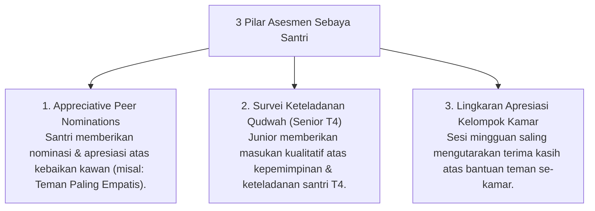

# P5-07: Sistem Asesmen Sebaya dan Survei Keteladanan Qudwah

## Status Dokumen
* **Status**: 🌟 **A+ (Tervalidasi & Siap Diimplementasikan)**
* **Sub-Domain**: `05 Assessment Framework / 07 Peer Assessment`
* **Penanggung Jawab Keilmuan**: Dewan Keilmuan TUMBUH (*Pakar Psikologi Sosial Santri & Pakar Tata Kelola Qudwah*)

---

## 1. Konseptualisasi Peer Assessment Berbasis Ukhuwah

Asesmen Sebaya (*Peer Assessment*) dirancang untuk mempererat **Ukhuwah Islamiyah** dan membangun iklim sosial yang saling mendukung (*Supportive Peer Climate*), secara tegas menolak penggunaan penilaian sebaya sebagai sarana menjatuhkan, mencemooh, atau membalas dendam antar santri.

---

## 2. Metodologi Survei Keteladanan Qudwah 360-Derajat

Untuk santri T4 yang memegang jabatan kepemimpinan santri:
- Adik kelas T1, T2, dan T3 mengisi survei anonim berisi 5 indikator kepemimpinan pengayoman (*Servant Leadership*).
- **Indikator Evaluasi**:
  1. *Apakah kakak pengurus membantu & melindungi adik kelas dengan rasa kasih sayang?*
  2. *Apakah kakak pengurus memberikan contoh teladan sholat & adab yang baik?*
  3. *Apakah ada tindakan intimidasi, bentakan, atau tindak kasar yang dilakukan?*

---

## 3. Integrasi Skor Peer Assessment dalam Triangulasi (15%)

- Data Peer Assessment menyumbang **15% dari total pembobotan triangulasi**.
- Hasil survei peer diproses secara agregat kualitatif untuk menjaga keharmonisan relasi sosial antar santri.
