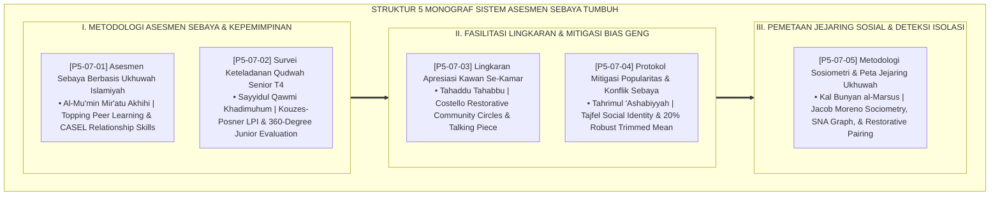

# P5-07: DOKUMEN INDUK SISTEM ASESMEN SEBAYA DAN SURVEI QUDWAH
## *Arsitektur dan Rekayasa Metodologi Evaluasi Teman Sebaya, Pengakuan Keteladanan Senior, dan Pemetaan Jejaring Sosial (Asesmen Sebaya Ukhuwah Form ASB, Survei Keteladanan Qudwah Senior Form SKQ, Lingkaran Apresiasi Kamar Form LAK, Protokol Mitigasi Bias Popularitas Form MPS, Serta Pemetaan Sosiometri Jejaring Form SJU) di Ekosistem TUMBUH Pesantren*

**Nomor Identifikasi**: `P5-07/DOKUMEN-INDUK-SISTEM-ASESMEN-SEBAYA-QUDWAH/2026`  
**Domain**: `05 Assessment Framework` > `07 Peer Assessment` (Gugus Sub-Domain 07: *Comprehensive Peer Assessment, Senior Exemplary Survey, & Sociometry Systems*)  
**Klasifikasi Naskah**: *Master Architecture & Navigation Monograph* (Dokumen Induk Peta Jalan Riset & Navigasi 5 Monograf Ilmiah Sistem Asesmen Sebaya)  
**Rumpun Disiplin Pengkaji**: Desain Asesmen Teman Sebaya, Kouzes-Posner LPI & Servant Leadership, Restorative Circles, Sosiometri Moreno & SNA  

---

> ### 💡 INTISARI EKSEKUTIF (EXECUTIVE SUMMARY)
>
> * **Kedudukan Strategis Gugus Sistem Asesmen Sebaya dan Survei Qudwah:**  
>   Gugus *Peer Assessment (Sistem Asesmen Sebaya dan Survei Qudwah Senior)* merupakan instrumen pengokoh pilar ukhuwah dan keadilan sosial (*Social Pillar of Ukhuwah & Egalitarian Justice*) dalam ekosistem TUMBUH. Gugus ini mengubah dinamika teman sebaya yang rentan perundungan dan klik feodal menjadi lingkungan persaudaraan yang saling bercermin kebaikan (*Mir'ātu Akhīhi*), saling mengapresiasi, dan memvalidasi keteladanan pemimpin santri secara transparan.
> * **Integrasi Holistik Turats & Konsensus Sains Psikologi Sosial:**  
>   Gugus riset ini memadukan khazanah agung Islam tentang cermin mukmin (*Al-Mu'minu Mir'ātu Akhīhi*), pemimpin pelayan (*Sayyidul Qawmi Khādimuhum*), saling memberi apresiasi kasih sayang (*Tahāddū Tahābbū*), penghapusan fanatisme kelompok (*Tahrimul 'Ashabiyyah*), dan persaudaraan laksana satu bangunan (*Kal Bunyān al-Marsūs*) dengan konsensus sains psikometri sosial modern (*Topping Peer Assessment, Kouzes-Posner LPI, Costello Restorative Circles, Tajfel Social Identity Trimming, dan Moreno Sociometric SNA*).
> * **Struktur Lengkap 5 Berkas Monograf Riset Ilmiah:**  
>   Dokumen induk ini memetakan dan menghubungkan 5 berkas monograf penelitian akademik komprehensif (~140 KB total riset) yang menyajikan format sandwich feedback sebaya, instrumen evaluasi senior 360 derajat oleh junior, SOP lingkaran apresiasi kamar Jumat, algoritma trimmed mean netralisasi geng, dan sosiogram 2D deteksi santri terisolasi.

---

## 📑 PETA NAVIGASI LIMA MONOGRAF RISET SISTEM ASESMEN SEBAYA

Berikut adalah daftar lengkap 5 monograf riset akademik dalam gugus **`07 Peer Assessment`**:

---

## 📚 DESKRIPSI RINGKAS 5 BERKAS MONOGRAF

1. **[P5-07-01: Asesmen Sebaya Berbasis Ukhuwah Islamiyah](file:///c:/xampp/htdocs/tumbuh/05%20Assessment%20Framework/07%20Peer%20Assessment/P5-07-01-Asesmen-Sebaya-Berbasis-Ukhuwah-Islamiyah.md)**  
   *Membahas metode umpan balik cermin bersaudara (Sandwich Method: 2 Pujian : 1 Saran), doktrin Al-Mu'min Mir'atu Akhihi, teori Topping & CASEL, moderasi anonim musyrif, dan format Form ASB-Ukhuwah.*
2. **[P5-07-02: Survei Keteladanan Qudwah Senior T4](file:///c:/xampp/htdocs/tumbuh/05%20Assessment%20Framework/07%20Peer%20Assessment/P5-07-02-Survei-Keteladanan-Qudwah-Senior-T4.md)**  
   *Membahas evaluasi 360 derajat kepemimpinan santri senior oleh santri junior, doktrin Sayyidul Qawmi Khadimuhum, Leadership Practices Inventory (LPI) Kouzes-Posner, indeks legitimasi moral ILM >= 85%, dan formulir Form SKQ-Senior.*
3. **[P5-07-03: Lingkaran Apresiasi Kawan Se-Kamar](file:///c:/xampp/htdocs/tumbuh/05%20Assessment%20Framework/07%20Peer%20Assessment/P5-07-03-Lingkaran-Apresiasi-Kawan-Se-Kamar.md)**  
   *Membahas ritual mingguan halaqah kamar Jumat malam 3 putaran (Apresiasi, Ishlah Maaf, Doa Rabithah), doktrin Tahaddu Tahabbu, Restorative Circles Costello & Wachtel, dan notulensi Form LAK-Kamar.*
4. **[P5-07-04: Protokol Mitigasi Popularitas dan Konflik Sebaya](file:///c:/xampp/htdocs/tumbuh/05%20Assessment%20Framework/07%20Peer%20Assessment/P5-07-04-Protokol-Mitigasi-Popularitas-dan-Konflik-Sebaya.md)**  
   *Membahas eliminasi bias popularitas dan sabotase geng santri, larangan fanatisme 'Ashabiyyah, Social Identity Theory Tajfel, algoritma 20% Robust Trimmed Mean SIM Intizham, dan laporan Form MPS-Mitigasi.*
5. **[P5-07-05: Metodologi Sosiometri dan Peta Jejaring Ukhuwah](file:///c:/xampp/htdocs/tumbuh/05%20Assessment%20Framework/07%20Peer%20Assessment/P5-07-05-Metodologi-Sosiometri-dan-Peta-Jejaring-Ukhuwah.md)**  
   *Membahas pemetaan struktur jejaring sosial angkatan berbasis Sosiometri Jacob Moreno & SNA Graph Theory, doktrin Kal Bunyan al-Marsus, deteksi dini santri terisolasi (Isolates), rekayasa penataan kamar restoratif, dan kuesioner Form SJU-Sosio.*

---

## 🎯 STANDAR PENJAMINAN MUTU SISTEM ASESMEN SEBAYA

Penerapan gugus **Sistem Asesmen Sebaya dan Survei Qudwah (Peer Assessment)** menjamin bahwa:
1. **Terwujudnya Budaya Ukhuwah yang Kokoh dan Bebas Perundungan (*Zero Bullying & High Cohesion*)**: Seluruh santri terhubung dalam ikatan persaudaraan yang tulus, saling memuliakan, dan saling menjaga kehormatan.
2. **Kaderisasi Kepemimpinan Berbasis Pelayanan Nyata (*True Servant Leadership*)**: Menghapus total feodalisme senioritas dan melahirkan kader pemimpin santri yang rendah hati dan dicintai adik kelas.
3. **Keandalan dan Keadilan Data Psikometri Sosial (*Unbiased Social Metrics*)**: Algoritma normalisasi cerdas menjamin seluruh hasil asesmen sebaya bersih dari manipulasi klik pergaulan.
