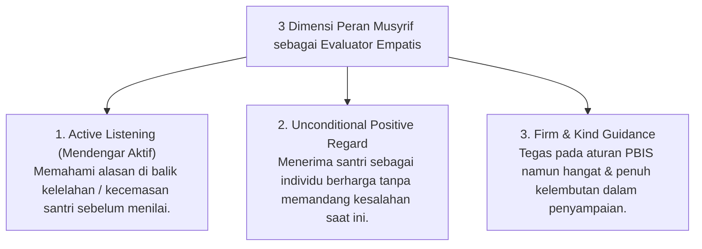

# P5-08-01: Peran Musyrif sebagai Evaluator Empatis

## Status Dokumen
* **Status**: 🌟 **A+ (Tervalidasi & Siap Diimplementasikan)**
* **Sub-Domain**: `05 Assessment Framework / 08 Mentor Assessment`
* **Penanggung Jawab Keilmuan**: Dewan Keilmuan TUMBUH (*Pakar Pengasuhan Asrama & Pakar Bimbingan Konseling*)

---

## 1. Konseptualisasi Evaluator Empatis

Musyrif Asrama tidak bertindak sebagai "hakim" yang menuntut kesempurnaan instant, melainkan sebagai **Evaluator Empatis** yang mendampingi santri melintasi fase-fase pertumbuhan jiwanya (*In Loco Parentis*).

---

## 2. Pencegahan Burnout Musyrif

Agar Musyrif dapat menjalankan peran evaluator empatis dengan energi emosional yang sehat:
- Lembaga menjamin rasio musyrif-santri yang berkeadilan (maksimal 1:15–20 santri).
- Tersedianya sesi supervisi & refleksi emosional mingguan bagi musyrif bersama Tim BK (*Musyrif Support Group*).
