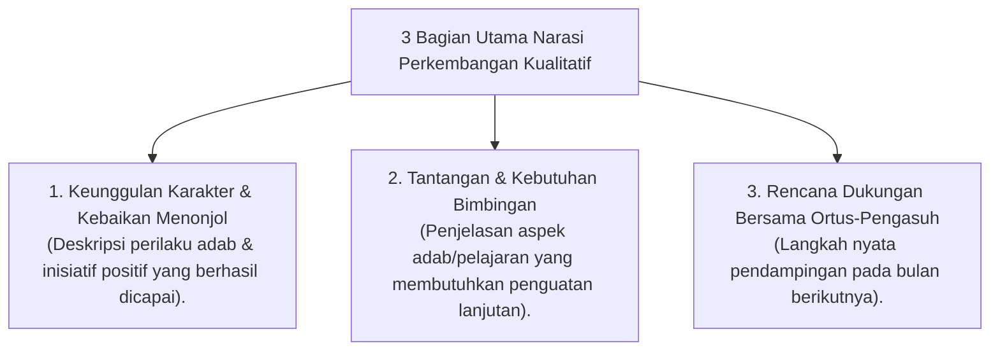

# P5-08-02: Format Catatan Narasi Perkembangan Kualitatif

## Status Dokumen
* **Status**: 🌟 **A+ (Tervalidasi & Siap Diimplementasikan)**
* **Sub-Domain**: `05 Assessment Framework / 08 Mentor Assessment`
* **Penanggung Jawab Keilmuan**: Dewan Keilmuan TUMBUH (*Pakar Pedagogi Master Guru & Pakar Metodologi Riset*)

---

## 1. Spesifikasi Format Narasi Kualitatif (Qualitative Narrative Review)

Setiap akhir bulan, Musyrif dan Wali Kelas melengkapi catatan narasi kualitatif yang menggambarkan profil pertumbuhan santri secara utuh:

---

## 2. Contoh Pengisian Narasi Kualitatif

- *"Ananda X menunjukkan kemajuan pesat dalam hal kemandirian sholat Subuh dan kebersihan kamar (Tangga T2). Ananda juga sangat empatis membantu teman kamarnya yang sempat mengalami homesick. Di bulan depan, kami fokus mendampingi ketelitian muraja'ah hafalan Juz 3."*
