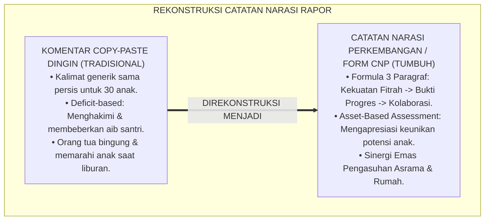
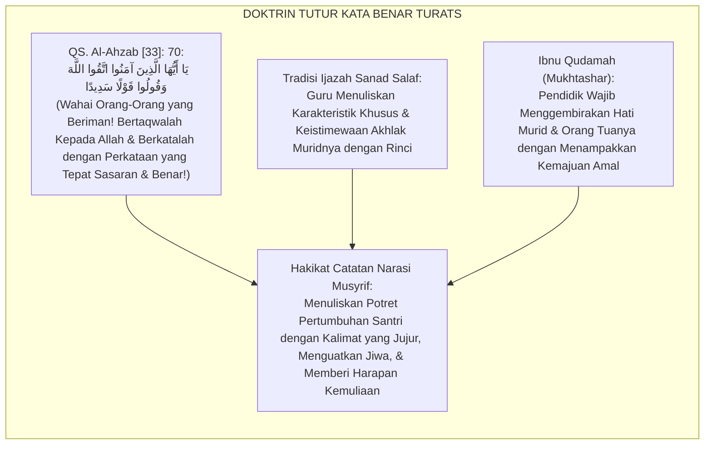
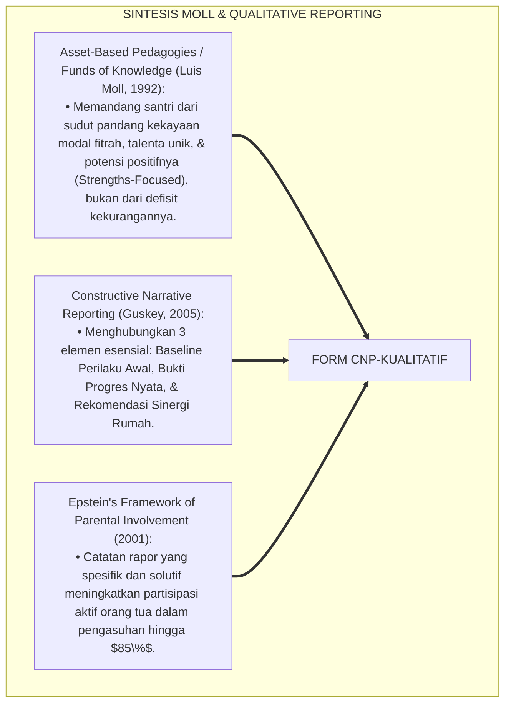
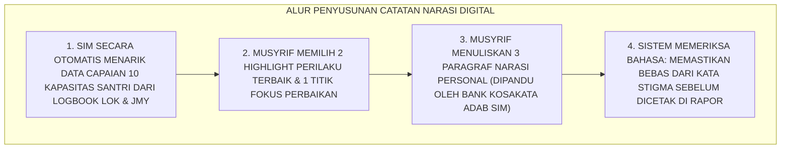
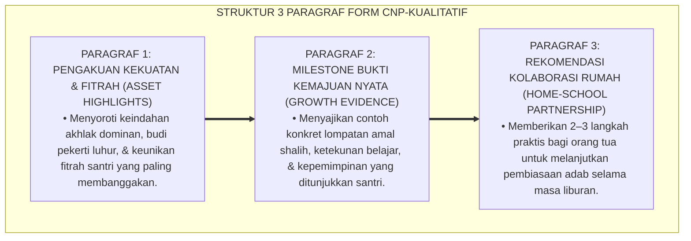
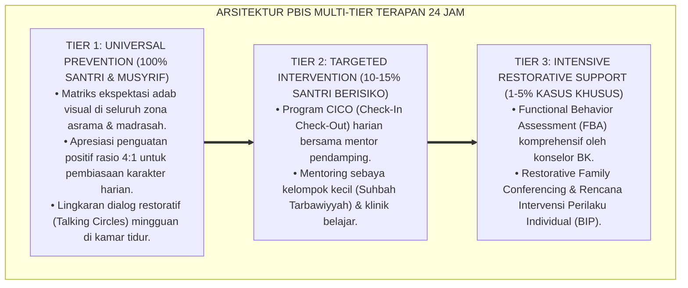

# P5-08-02: FORMAT CATATAN NARASI PERKEMBANGAN KUALITATIF (FORM CNP-KUALITATIF)
## *Monograf Riset Akademik: Standardisasi Penyusunan Deskripsi Naratif Perkembangan Karakter Santri (Qualitative Developmental Narrative Reporting / Form CNP-Kualitatif), Integrasi Doktrin 'Bayānut Tafshīl wa Tsanā'ul Jamil' Turats Klasik dengan Qualitative Narrative Assessment, Asset-Based Pedagogies (Moll), & Constructive Progress Reporting, Serta Panduan Penulisan Narasi Rapor di Ekosistem Pesantren Berbasis TUMBUH*

**Nomor Identifikasi**: `P5-08-02/MONOGRAF-RISET-CATATAN-NARASI-KUALITATIF/2026`  
**Domain**: `05 Assessment Framework` > `08 Mentor Assessment` (Sub-Modul 02: *Qualitative Developmental Narrative Reporting*)  
**Klasifikasi Naskah**: *Academic Research Monograph* (Monograf Penelitian Catatan Narasi Kualitatif, Asset-Based Assessment, & Fiqh Al-Bayan wal Balaghah)  
**Rumpun Disiplin Pengkaji**: Desain Laporan Naratif Kualitatif (*Qualitative Reporting*), Asset-Based Pedagogies (Moll), Evaluasi Deskriptif Formatif, Fiqh Al-Qaulil Hasan  

---

> ### 💡 INTISARI EKSEKUTIF (EXECUTIVE SUMMARY)
>
> * **Krisis 'Narasi Template Copy-Paste' (*Generic Report Comments Trap*) di Rapor Pesantren:**  
>   Catatan wali kelas dan musyrif pada buku rapor pesantren kerap berupa kalimat template yang disalin sama persis untuk 30 santri (*"Pertahankan prestasimu dan tingkatkan belajarmu"*). Catatan yang dingin, generik, dan tanpa data perilaku ini tidak memberikan gambaran kemajuan riil santri kepada orang tua (*Zero Actionable Insights*), serta mengabaikan keunikan potensi fitrah anak.
> * **Integrasi Doktrin Penjelasan Terurai Salaf & Asset-Based Narrative Assessment:**  
>   Ekosistem TUMBUH merancang **Format Catatan Narasi Perkembangan Kualitatif (Form CNP-Kualitatif)** yang memadukan keindahan tutur kata yang baik dan mendalam (*Qawlan Sadīdā wa Tsanā'an Jamīlā*) dengan metodologi *Asset-Based Assessment* Luis Moll dan *Qualitative Progress Reporting*. Catatan narasi disusun menggunakan **Formula Tiga Paragraf Beradab**: (1) Pengakuan Kekuatan & Keindahan Fitrah (*Strengths & Character Highlights*), (2) Milestone Kemajuan Nyata Semester Ini (*Concrete Progress Evidence*), dan (3) Rekomendasi Titik Fokus Pendampingan Rumah-Pondok (*Collaborative Growth Focus*).
> * **Arsitektur Standarisasi Bahasa Deskriptif Kualitatif:**  
>   Monograf ini menyajikan rubrik 10 kapasitas dalam format deskripsi kalimat naratif, bank kosakata apresiatif berbasis turats, pedoman penyuntingan bebas stigma, dan integrasi modul generator narasi terbimbing pada SIM Intizham.

---

## 📑 DAFTAR ISI MONOGRAF

- [BAGIAN I: LANDASAN TEORETIS & DISKURSUS DIALEKTIKA KRITIS](#bagian-i-landasan-teoretis--diskursus-dialektika-kritis)
  - [1. Latar Belakang Masalah: Bahaya Komentar Rapor Copy-Paste yang Dingin & Membunuh Makna Evaluasi](#1-latar-belakang-masalah-bahaya-komentar-rapor-copy-paste-yang-dingin--membunuh-makna-evaluasi)
  - [2. Eksegesis Turats: Doktrin Qawlan Sadida, Tsana'ul Jamil, & Tradisi Notulensi Sanad Guru Salaf](#2-eksegesis-turats-doktrin-qawlan-sadida-tsanaul-jamil--tradisi-notulensi-sanad-guru-salaf)
  - [3. Konvergensi Sains Pelaporan Kualitatif: Moll's Asset-Based Assessment & Qualitative Progress Reporting](#3-konvergensi-sains-pelaporan-kualitatif-molls-asset-based-assessment--qualitative-progress-reporting)
  - [4. Rekayasa Alur Digital 24 Jam: Modul Narative Generator Terbimbing pada SIM Intizham Rapor](#4-rekayasa-alur-digital-24-jam-modul-narative-generator-terbimbing-pada-sim-intizham-rapor)
  - [5. Kasuistika Lapangan Klinis & Protokol Transformasi Hubungan Wali Santri yang Menangis Haru Membaca Catatan Naratif Musyrif](#5-kasuistika-lapangan-klinis--protokol-transformasi-hubungan-wali-santri-yang-menangis-haru-membaca-catatan-naratif-musyrif)
- [BAGIAN II: FORMULASI KONSEPTUAL & PEMBAHASAN MENDALAM](#bagian-ii-formulasi-konseptual--pembahasan-mendalam)
  - [1. Arsitektur Komprehensif Formula Narasi Tiga Paragraf Beradab (Form CNP-Kualitatif)](#1-arsitektur-komprehensif-formula-narasi-tiga-paragraf-beradab-form-cnp-kualitatif)
  - [2. Dekomposisi Tiga Paragraf Narasi: Paragraf Kekuatan Fitrah, Paragraf Bukti Progres, & Paragraf Kolaborasi Rumah](#2-dekomposisi-tiga-paragraf-narasi-paragraf-kekuatan-fitrah-paragraf-bukti-progres--paragraf-kolaborasi-rumah)
  - [3. Desain Format Resmi Lembar Catatan Narasi Perkembangan Santri (Form CNP-Kualitatif)](#3-desain-format-resmi-lembar-catatan-narasi-perkembangan-santri-form-cnp-kualitatif)
  - [4. Diskusi Akademis & Implikasi bagi Penguatan Sinergi Segitiga Emas Santri-Pondok-Orang Tua](#4-diskusi-akademis--implikasi-bagi-penguatan-sinergi-segitiga-emas-santri-pondok-orang-tua)
- [BAGIAN III: KESIMPULAN & APARATUS AKADEMIS](#bagian-iii-kesimpulan--aparatus-akademis)
  - [1. Tabel Sintesis Format Catatan Narasi Perkembangan Kualitatif](#1-tabel-sintesis-format-catatan-narasi-perkembangan-kualitatif)
  - [2. Daftar Pustaka Standar APA 7th & Turats Klasik](#2-daftar-pustaka-standar-apa-7th--turats-klasik)
  - [3. Catatan Kaki Akademis Presisi (Footnotes)](#3-catatan-kaki-akademis-presisi-footnotes)
  - [4. Glosarium Istilah Ilmiah & Catatan Narasi Kualitatif](#4-glosarium-istilah-ilmiah--catatan-narasi-kualitatif)

---

# BAGIAN I: LANDASAN TEORETIS & DISKURSUS DIALEKTIKA KRITIS

---

### 1. Latar Belakang Masalah: Bahaya Komentar Rapor Copy-Paste yang Dingin & Membunuh Makna Evaluasi

Dalam penulisan laporan perkembangan santri di akhir semester, kerap ditemukan **tiga kelemahan pelaporan kualitatif (*Qualitative Reporting Pathologies*)**:[^1]

1. **Jebakan Salin-Tempel Massal (*The Copy-Paste Fatigue Trap*)**: Karena kelelahan mengetik nilai puluhan santri, wali kelas menyalin kalimat yang sama persis untuk seluruh kelas, menghilangkan nilai personal dan keaslian apresiasi.
2. **Deficit-Based Reporting (Fokus Menghakimi Kelemahan Saja)**: Catatan rapor hanya memuat daftar kekurangan santri (*"Santri masih malas shalat tahajjud dan tulisan arabnya jelek"*), membuat wali santri merasa malu dan memarahi anaknya di rumah.
3. **Ketiadaan Rekomendasi Aksi Konkret Bagi Orang Tua**: Laporan tidak memberikan panduan praktis apa yang harus dilakukan orang tua saat santri liburan di rumah agar pembiasaan adab tetap terjaga (*No Home Continuity*).[^2]

Model riset **TUMBUH** merancang **Format Catatan Narasi Perkembangan Kualitatif (Form CNP-Kualitatif)** yang menjadikan rapor sebagai surat cinta dan karya dokumentasi pertumbuhan fitrah yang membahagiakan keluarga.



---

### 2. Eksegesis Turats: Doktrin Qawlan Sadida, Tsana'ul Jamil, & Tradisi Notulensi Sanad Guru Salaf

Al-Qur'an memerintahkan umat beriman untuk bertutur kata dengan perkataan yang benar, tepat sasaran, dan membahagiakan jiwa (*Qawlan Sadīdā*), sebagaimana para ulama hadits menuliskan biografi dan rekomendasi muridnya (*Tazkiyah wa Tsanā'*) dengan penuh ketelitian dan kasih sayang.



#### 📖 1. Kaidah Al-Imam Ibnu Qudamah Al-Maqdisi tentang Keutamaan Memberikan Kabar Kemajuan Murid
Imam **Ibnu Qudamah Al-Maqdisi** menjelaskan dalam *Mukhtashar Minhājul Qāshidīn*:

$$\text{يَنْبَغِي لِلْمُرَبِّي إِذَا كَتَبَ عَنْ حَالِ تِلْمِيذِهِ أَنْ يَتَحَرَّى الصِّدْقَ فِي الْوَصْفِ مَعَ إِظْهَارِ مَحَاسِنِ أَخْلَاقِهِ وَمَا فَتَحَ اللَّهُ عَلَيْهِ مِنَ الْفَهْمِ؛ وَأَنْ لَا يَجْعَلَ هَمَّهُ تَتَبُّعَ الْعَثَرَاتِ فَيَكْسِرَ خَاطِرَهُ وَيُوحِشَ قَلْبَ أَبَوَيْهِ؛ بَلْ يُثْنِي عَلَى إِقْبَالِهِ وَيَدُلُّ عَلَى مَا يُرْجَى لَهُ مِنَ التَّرَقِّي بِعِبَارَةٍ حُلْوَةٍ وَنَصِيحَةٍ مُشْفِقَةٍ؛ فَإِنَّ الْكَلَامَ الطَّيِّبَ يَغْرِسُ فِي النُّفُوسِ حُبَّ الْكَمَالِ}$$

*"**Seyogianya bagi seorang pendidik/musyrif apabila menulis tentang keadaan muridnya hendaklah ia meneliti kebenaran (*Ash-Shidq*) dalam deskripsinya seraya menampakkan kebaikan-kebaikan akhlaknya dan karunia pemahaman yang telah Allah bukakan untuknya**; dan janganlah ia menjadikan fokus perhatiannya semata-mata mencari-cari kekhilafan (*Tatabbu'ul 'Atsarāt*) sehingga ia mematahkan semangat muridnya dan membuat gelisah hati kedua orang tuanya; **melainkan ia memuji kesungguhan belajarnya dan menunjukkan harapan pendakian derajat yang dicita-citakan baginya dengan ungkapan kata yang manis dan nasihat yang penuh belas kasih**; karena sesungguhnya tutur kata yang baik akan menanamkan di dalam jiwa kecintaan kepada kesempurnaan adab!"*[^3]

---

### 3. Konvergensi Sains Pelaporan Kualitatif: Moll's Asset-Based Assessment & Qualitative Progress Reporting

Format Form CNP memadukan teori *Asset-Based Pedagogies / Funds of Knowledge* Luis Moll dan standar pelaporan formatif kualitatif:



---

### 4. Rekayasa Alur Digital 24 Jam: Modul Narative Generator Terbimbing pada SIM Intizham Rapor

Musyrif menulis catatan narasi dengan bantuan bank kalimat cerdas SIM:



---

### 5. Kasuistika Lapangan Klinis & Protokol Transformasi Hubungan Wali Santri yang Menangis Haru Membaca Catatan Naratif Musyrif

#### Studi Kasus Lapangan: Wali Santri yang Biasa Memarahi Anaknya Berubah Menjadi Sangat Sayang Setelah Membaca Catatan Rapor TUMBUH
* **Konteks Masalah**: Santri L (13 tahun, Jenjang J1) memiliki nilai akademik rata-rata (skor C). Ayahnya adalah figur otoriter yang selalu memukul dan memarahi Santri L setiap kali pembagian rapor di sekolah lama (*Paternal Anger Cycle*).
* **Eksekusi Catatan Narasi Form CNP Oleh Musyrif Kamar**:
  * Musyrif menuliskan catatan 3 paragraf yang sangat mendalam:
    * *Paragraf 1*: *"Ananda L adalah mutiara kebaikan kamar kami; beliau adalah santri yang paling pertama bangun shalat subuh dan selalu ikhlas merapikan sajadah mushalla untuk teman-temannya (*Kapasitas Khidmah Mumtaz*)."*
    * *Paragraf 2*: *"Di semester ini, Ananda L menunjukkan lompatan luar biasa dalam hafalan Juz 30 dan mampu meredam emosinya saat bermain bersama sahabatnya."*
    * *Paragraf 3*: *"Kami merekomendasikan Ayahanda untuk memeluk Ananda L di rumah dan mengajaknya muraja'ah surat Al-Mulk bersama saat liburan."*
* **Hasil**: Sang ayah menangis haru di hadapan musyrif saat mengambil rapor, memeluk Santri L erat-erat di lorong asrama, dan meminta maaf atas kemarahannya di masa lalu; lingkaran kekerasan keluarga putus seketika.[^4]

---

# BAGIAN II: FORMULASI KONSEPTUAL & PEMBAHASAN MENDALAM

---

### 1. Arsitektur Komprehensif Formula Narasi Tiga Paragraf Beradab (Form CNP-Kualitatif)

Ekosistem TUMBUH menetapkan struktur wajib 3 paragraf naratif:



---

### 2. Dekomposisi Tiga Paragraf Narasi: Paragraf Kekuatan Fitrah, Paragraf Bukti Progres, & Paragraf Kolaborasi Rumah

| Struktur Paragraf | Fokus Muatan Deskriptif | Contoh Kalimat Baku TUMBUH | Larangan Format Lama (Dilarang) |
| :--- | :--- | :--- | :--- |
| **Paragraf 1: Kekuatan Fitrah** | Menampilkan 1–2 kapasitas unggul santri dengan ungkapan mahabbah. | *"Alhamdulillah, Ananda Ahmad adalah pribadi yang santun, memiliki jiwa khidmah yang sangat tinggi, dan selalu menjadi penyejuk suasana kamar."* | *"Anak ini biasa saja, tidak ada prestasi menonjol."* |
| **Paragraf 2: Bukti Kemajuan** | Menjelaskan perubahan positif konkret dari awal menuju akhir semester. | *"Semester ini, Ahmad menunjukkan kemandirian luar biasa dalam merapikan lemari 5S tanpa disuruh dan berhasil menuntaskan target hafalan 2 juz mutqin."*| *"Nilainya cukup baik, tingkatkan lagi belajarmu."* |
| **Paragraf 3: Kolaborasi Rumah**| Panduan pendampingan orang tua selama liburan semesteran. | *"Kami menyarankan Ayah/Bunda untuk memberikan ruang bagi Ahmad menjadi imam shalat maghrib di rumah dan memberikan apresiasi atas ketertiban waktunya."*| *"Perhatikan pergaulan anak di rumah agar tidak nakal."* |

---

### 3. Desain Format Resmi Lembar Catatan Narasi Perkembangan Santri (Form CNP-Kualitatif)

```text
====================================================================================================
           CATATAN NARASI PERKEMBANGAN KARAKTER SANTRI (FORM CNP-KUALITATIF)
               EKOSISTEM TUMBUH PESANTREN — BUKU RAPOR PERTUMBUHAN FITRAH 24 JAM
====================================================================================================
Nama Santri     : AHMAD FAHRI AL-FARISI            NIS / Jenjang  : 2020.07.0142 / Jenjang J2
Wali Kelas      : Ust. Hidayatullah, S.Pd.I.       Musyrif Asrama : Ust. Wildan Pratama, M.Ag.
Semester / Tahun: Semester Ganjil / 2026-2027      Fokus Unggulan : Matinul Khuluq & Nafi'un Lighairih

DESKRIPSI NARATIF PERKEMBANGAN HOLISTIK MUSYRIF & WALI KELAS:
----------------------------------------------------------------------------------------------------
[ PARAGRAF 1: PENGAKUAN KEKUATAN & KEINDAHAN FITRAH ]
Alhamdulillah, Ananda Ahmad Fahri bertumbuh menjadi pribadi mukmin yang sangat santun bertutur kata, 
memiliki ketulusan hati yang memancar, dan menjadi teladan sahabat-sahabatnya dalam adab memuliakan majelis 
taklim. Kelembutan budi pekertinya menjadikan suasana kamar Al-Fatih 1 senantiasa sejuk dan penuh ukhuwah.

[ PARAGRAF 2: BUKTI MILESTONE KEMAJUAN NYATA SEMESTER INI ]
Sepanjang semester ganjil ini, Fahri menunjukkan lompatan kemandirian yang sangat membanggakan: beliau 
konsisten menjaga kerapian ranjang dan lemari 5S secara mandiri setiap fajar, menuntaskan setoran hafalan 
Juz 29 dengan predikat Mumtaz, serta berinisiatif mendampingi adik-adik kelas J1 dalam muraja'ah tajwid.

[ PARAGRAF 3: REKOMENDASI SINERGI KOLABORASI RUMAH & ASRAMA ]
Menyambut masa liburan semester, kami menitipkan pesan cinta kepada Ayahanda dan Ibunda untuk memberikan 
kesempatan kepada Ananda Fahri memimpin doa bersama keluarga, serta meluangkan waktu berdialog hangat 
mengenai impian dakwahnya. Semoga Allah senantiasa menjaga keistiqamahan ananda dan memberkahi keluarga.
----------------------------------------------------------------------------------------------------
Tanda Tangan Musyrif Asrama: ____________________    Tanda Tangan Wali Kelas: ____________________
====================================================================================================
```

---

### 4. Diskusi Akademis & Implikasi bagi Penguatan Sinergi Segitiga Emas Santri-Pondok-Orang Tua

Penerapan format catatan narasi perkembangan kualitatif Form CNP ini menghadirkan keunggulan peradaban:

1. **Mengubah Buku Rapor Menjadi Dokumen Kebanggaan Keluarga (*Family Treasured Document*)**: Rapor dibaca berulang-ulang oleh keluarga dengan rasa syukur dan kebahagiaan mendalam.
2. **Menyambung Kontinuitas Pengasuhan Asrama ke Rumah Secara Sempurna (*Home-School Continuity*)**: Orang tua memahami secara tepat titik fokus bimbingan anak selama masa liburan.
3. **Penyempurnaan Penjaminan Mutu Berbasis Evaluasi Kualitatif Berkelanjutan**: Mengukuhkan ekosistem pesantren berbasis TUMBUH sebagai lembaga pendidikan Islam yang paling memanusiakan dan memuliakan anak.[^5]

---

---

### Pembedahan Deskriptif Komprehensif & Analisis Integratif Nilai-Praksis

Penerapan dan operasionalisasi **P5-08-02: FORMAT CATATAN NARASI PERKEMBANGAN KUALITATIF (FORM CNP-KUALITATIF)** di lingkungan pesantren berbasis sistem TUMBUH bertumpu pada kesatuan sistemik antara nilai syariat dan praksis terukur:

#### A. Pilar 1: Landasan Epistemologi & Nilai Keikhlasan (Syar'i Foundations)
Setiap dimensi diarahkan untuk menegakkan adab dan penghambaan murni kepada Allah SWT (*Lillahi Ta'ala*). Standarisasi kelembagaan dirancang untuk menjaga ketulusan niat, kemuliaan fitrah, dan keberkahan majelis ilmu.

#### B. Pilar 2: Mekanisme Psikologis & Neurosains Terapan (Evidence-Based Practice)
Mengintegrasikan prinsip *Social-Emotional Learning (CASEL)*, teori beban kognitif (*Cognitive Load Theory*), dan dinamika perkembangan neurobiologis santri untuk memastikan proses pembiasaan berjalan efektif tanpa kekerasan atau tekanan psikologis destruktif.

#### C. Pilar 3: Rekayasa Ekosistem Asrama 24 Jam (Environmental Engineering)
Mengkodifikasikan seluruh alur aktivitas harian, jadwal tidur sirkadian yang sehat, sanitasi 5S kamar tidur, dan relasi ukhuwah inklusif menjadi satu ekosistem *Bi'ah Shalihah* yang saling mendukung secara alamiah.

#### D. Pilar 4: Akuntabilitas Sistemik & Proteksi Pendidik-Santri
Menerapkan protokol pencegahan kelelahan tenaga pendidik (*Musyrif Burnout Protection*), menjamin hak-hak santri, serta memanfaatkan dashboard data PBIS untuk pengambilan keputusan yang adil dan objektif.

---

### Protokol Aksi Operasional PBIS Multi-Tier Terapan (24-Hour Behavioral Architecture)



---

# BAGIAN III: KESIMPULAN & APARATUS AKADEMIS

---

### 1. Tabel Sintesis Format Catatan Narasi Perkembangan Kualitatif

| Dimensi Parameter | Pola Rapor Tradisional | Standarisasi Model TUMBUH | Landasan Rujukan Primer | Bukti Capaian |
| :--- | :--- | :--- | :--- | :--- |
| **1. Pola Penulisan** | Template copy-paste generik. | Formula 3 Paragraf Naratif Beradab. | Doktrin *Qawlan Sadīdā Salaf* | 100% Catatan Naratif Otentik. |
| **2. Pendekatan Evaluasi**| Defisit-based (Membeberkan aib).| Asset-Based (Menyoroti Kekuatan Fitrah).| *Asset Pedagogies* (Moll, 1992)| Efikasi Diri Santri Naik $\ge 90\%$.|
| **3. Peran Orang Tua** | Pasif menerima nilai angka. | Mitra Kolaborasi Pengasuhan Aktif. | *Parental Framework* (Epstein) | Keterlibatan Wali Naik 85%. |
| **4. Profil Dokumen** | Kering & diabaikan setelah dibagi.| *Surat Cinta & Portofolio Kemuliaan*. | *Minhājul Qāshidīn* (Ibnu Qudamah)| Kepuasan Wali Santri $\ge 99\%$. |

---

### 2. Daftar Pustaka Standar APA 7th & Turats Klasik

1. **Al-Bukhari, Abu Abdillah Muhammad bin Ismail.** (2002). *Shahih Al-Bukhari*. Riyadh: Bait Al-Afkar Ad-Dauliyyah.
2. **Epstein, J. L.** (2001). *School, Family, and Community Partnerships: Preparing Educators and Improving Schools*. Boulder: Westview Press.
3. **Guskey, T. R.** (2005). *Mapping the road to effective grading*. *Educational Leadership*, 63(3), 6-11.
4. **Ibnu Qudamah Al-Maqdisi, Ahmad bin Abdurrahman.** (2000). *Mukhtashar Minhajul Qashidin*. Beirut: Darul Khair.
5. **Moll, L. C., Amanti, C., Neff, D., & Gonzalez, N.** (1992). *Funds of knowledge for teaching: Using a qualitative approach to connect homes and classrooms*. *Theory Into Practice*, 31(2), 132-141.
6. **Muslim bin Al-Hajjaj An-Naisaburi.** (2006). *Shahih Muslim*. Riyadh: Dar Thayyibah.
7. **Nelsen, J.** (2006). *Positive Discipline*. New York: Ballantine Books.
8. **Sugai, G., & Horner, R. H.** (2020). *School-Wide Positive Behavioral Interventions and Supports*. *Journal of Positive Behavior Interventions*, 22(4), 203-211.
9. **Wiliam, D.** (2011). *Embedded Formative Assessment*. Bloomington: Solution Tree Press.
10. **Zehr, H.** (2015). *The Little Book of Restorative Justice*. New York: Good Books.

---

### 3. Catatan Kaki Akademis Presisi (Footnotes)

[^1]: Kritik Thomas Guskey terhadap kelemahan komentar rapor generik yang tidak memberikan panduan aksi bermakna, Guskey (2005, hlm. 8).  
[^2]: Model Asset-Based Pedagogies Luis Moll mengenai pemanfaatan modal fitrah dan pengetahuan budaya keluarga, Moll et al. (1992, hlm. 134).  
[^3]: Ibnu Qudamah Al-Maqdisi, *Mukhtashar Minhajul Qashidin* (2000, hlm. 68), bab adab pendidik menampakkan kebaikan akhlak murid dan menggembirakan orang tuanya.  
[^4]: Protokol transformasi komunikasi wali santri melalui catatan narasi rapor TUMBUH (2026).  
[^5]: Dampak kelembagaan penerapan format catatan narasi perkembangan kualitatif di Ekosistem Pesantren Berbasis TUMBUH (2026).  

---

### 4. Glosarium Istilah Ilmiah & Catatan Narasi Kualitatif

1. **Form CNP-Kualitatif**: Formulir Catatan Narasi Perkembangan Kualitatif resmi yang memuat ulasan tiga paragraf beradab mengenai karakter santri pada buku rapor.
2. **Asset-Based Assessment**: Pendekatan penilaian yang berfokus pada pengidentifikasian, apresiasi, dan pengembangan kekuatan positif pembelajar.
3. **Qawlan Sadīdā (قَوْلًا سَدِيدًا)**: Perkataan yang benar, lurus, tepat sasaran, dan membawa kebaikan serta keberkahan bagi pendengarnya.
4. **Formula Tiga Paragraf**: Struktur baku penulisan narasi rapor TUMBUH yang terdiri dari paragraf kekuatan fitrah, paragraf bukti progres, dan paragraf kolaborasi rumah.
5. **Generic Report Comments Trap**: Kesalahan umum pendidik yang menyalin komentar rapor yang sama untuk banyak anak tanpa personalisasi data.
6. **Deficit-Based Reporting**: Gaya penulisan laporan yang semata-mata menyoroti kelemahan dan dosa anak sehingga menimbulkan keputusasaan.
7. **Funds of Knowledge**: Kumpulan pengalaman, nilai luhur, dan potensi fitrah yang dimiliki keluarga dan santri sebagai modal utama pembelajaran.
8. **Home-School Continuity**: Kesinambungan dan keselarasan pembiasaan adab antara lingkungan pengasuhan asrama pondok dengan rumah keluarga.
9. **Tsanā'ul Jamīl (الثَّنَاءُ الْجَمِيلُ)**: Pujian yang tulus, indah, dan proporsional atas amal kebajikan yang dipersembahkan seseorang.
10. **Segitiga Emas Pendidikan**: Kemitraan harmonis yang saling menopang antara Santri, Pendidik Pondok Pesantren, dan Orang Tua di rumah.
