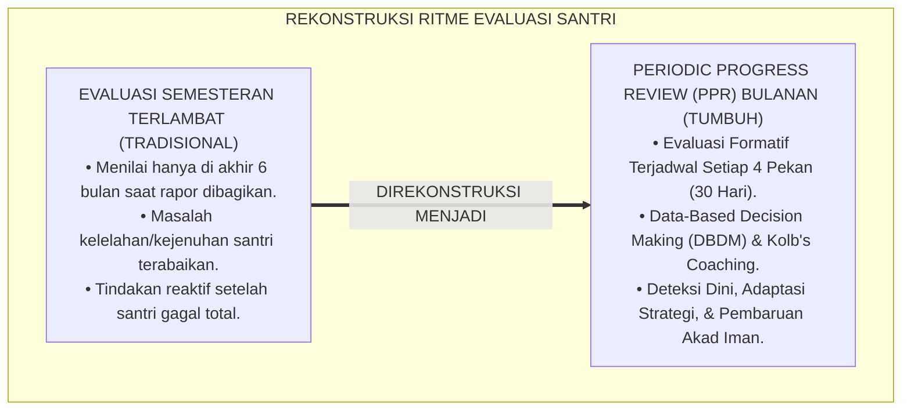
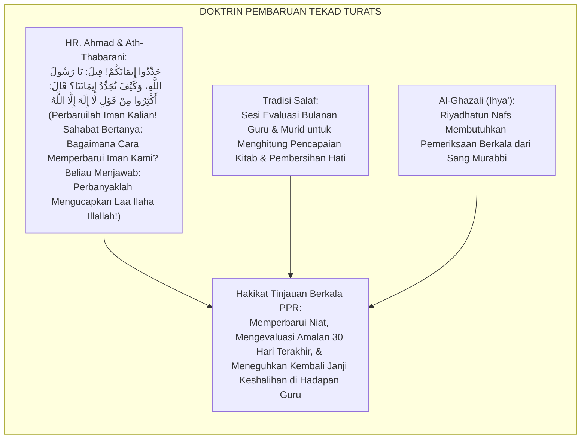
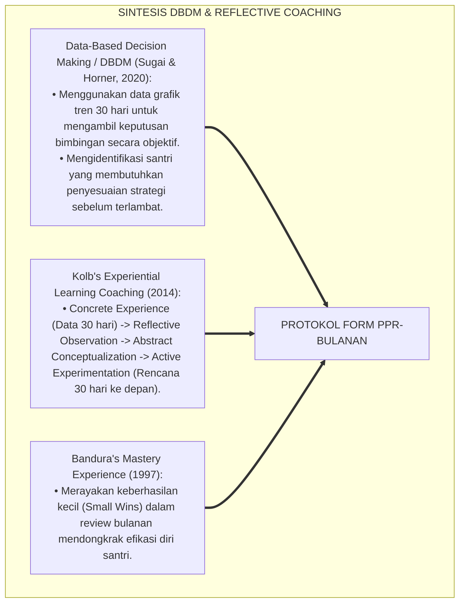
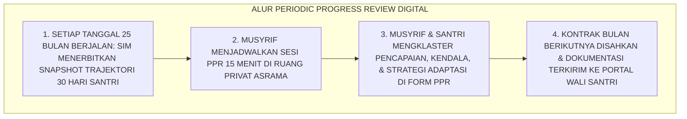
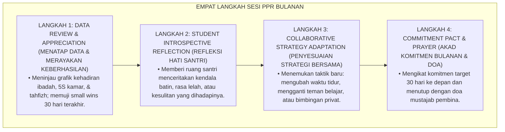
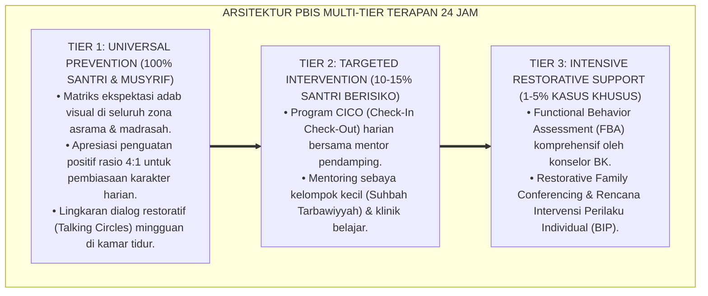

# P5-08-03: PERIODIC PROGRESS REVIEW DAN SESI REFLEKSI (FORM PPR-BULANAN)
## *Monograf Riset Akademik: Protokol Tinjauan Kemajuan Berkala Tiga Bulanan dan Sesi Refleksi Mentoring (Periodic Progress Review & Mentoring Reflection Sessions / Form PPR-Bulanan), Integrasi Doktrin 'At-Tadzkīr al-Murattab wa Tajdīdul 'Ahd' Turats Klasik dengan Kolb's Reflective Coaching & Data-Based Decision Making (DBDM), Serta Siklus Evaluasi Triwulan di Ekosistem Pesantren Berbasis TUMBUH*

**Nomor Identifikasi**: `P5-08-03/MONOGRAF-RISET-PERIODIC-PROGRESS-REVIEW/2026`  
**Domain**: `05 Assessment Framework` > `08 Mentor Assessment` (Sub-Modul 03: *Periodic Progress Review & Mentoring Reflection*)  
**Klasifikasi Naskah**: *Academic Research Monograph* (Monograf Penelitian Tinjauan Kemajuan Berkala PPR, Data-Based Decision Making DBDM, & Fiqh Tajdidil 'Ahd)  
**Rumpun Disiplin Pengkaji**: Desain Siklus Evaluasi Berkala Pesantren, Data-Based Decision Making (DBDM), Reflective Mentoring Supervision, Fiqh Al-Mura'ah  

---

> ### 💡 INTISARI EKSEKUTIF (EXECUTIVE SUMMARY)
>
> * **Krisis 'Evaluasi Menjelang Ujian Saja' (*The High-Stakes Summative Trap*):**  
>   Di banyak pesantren konvensional, evaluasi santri hanya terjadi satu atau dua kali dalam setahun saat pembagian rapor semesteran (*Summative Only*). Tidak ada ruang jeda berkala di tengah semester untuk meninjau apakah santri sedang mengalami kemunduran hafalan, kebuntuan adaptasi kamar, atau kejenuhan belajar, sehingga intervensi pertolongan selalu datang terlambat.
> * **Integrasi Doktrin Tajdīdul 'Ahd Salaf & Data-Based Decision Making (DBDM):**  
>   Ekosistem TUMBUH merancang **Periodic Progress Review (PPR) & Sesi Refleksi Mentoring (Form PPR-Bulanan)** yang memadukan ajaran salaf tentang pembaruan tekad dan evaluasi komitmen berkala (*Tajdīdul 'Ahd wa At-Tadzkīr al-Murattab*) dengan *Data-Based Decision Making (DBDM)* Sugai & Horner serta *Reflective Coaching* David Kolb. Setiap 4 pekan sekali, musyrif mentor dan wali kelas menggelar sesi tatap muka reflektif 15 menit bersama santri untuk membedah data grafik SIM dan menetapkan strategi adaptasi baru.
> * **Arsitektur Empat Langkah Siklus Tinjauan Berkala:**  
>   Monograf ini menyajikan siklus 4 langkah PPR (Data Review, Student Reflection, Collaborative Strategy, & Agreement Renewal), format lembar kerja PPR bulanan, rubrik penetapan status akselerasi vs intervensi, dan protokol integrasi lintas unit pengasuhan.

---

## 📑 DAFTAR ISI MONOGRAF

- [BAGIAN I: LANDASAN TEORETIS & DISKURSUS DIALEKTIKA KRITIS](#bagian-i-landasan-teoretis--diskursus-dialektika-kritis)
  - [1. Latar Belakang Masalah: Bahaya Evaluasi Semesteran yang Terlambat & Hilangnya Momen Intervensi Emas](#1-latar-belakang-masalah-bahaya-evaluasi-semesteran-yang-terlambat--hilangnya-momen-intervensi-emas)
  - [2. Eksegesis Turats: Doktrin Tajdidul 'Ahd, Al-Muwazhabah 'alar Ri'ayah, & Tradisi Halqah Bulanan Salaf](#2-eksegesis-turats-doktrin-tajdidul-ahd-al-muwazhabah-alar-riayah--tradisi-halqah-bulanan-salaf)
  - [3. Konvergensi Sains Pengambilan Keputusan Berbasis Data: Sugai's DBDM Framework & Kolb's Reflective Coaching](#3-konvergensi-sains-pengambilan-keputusan-berbasis-data-sugais-dbdm-framework--kolbs-reflective-coaching)
  - [4. Rekayasa Alur Digital 24 Jam: Dashboard Trajektori 30 Hari pada SIM Intizham Musyrif](#4-rekayasa-alur-digital-24-jam-dashboard-trajektori-30-hari-pada-sim-intizham-musyrif)
  - [5. Kasuistika Lapangan Klinis & Protokol Review PPR yang Menyelamatkan Santri J2 dari Kejenuhan Tahfizh di Bulan Ke-2](#5-kasuistika-lapangan-klinis--protokol-review-ppr-yang-menyelamatkan-santri-j2-dari-kejenuhan-tahfizh-di-bulan-ke-2)
- [BAGIAN II: FORMULASI KONSEPTUAL & PEMBAHASAN MENDALAM](#bagian-ii-formulasi-konseptual--pembahasan-mendalam)
  - [1. Arsitektur Komprehensif Siklus Tinjauan Berkala (Periodic Progress Review) TUMBUH](#1-arsitektur-komprehensif-siklus-tinjauan-berkala-periodic-progress-review-tumbuh)
  - [2. Dekomposisi 4 Langkah Sesi PPR: Data Examination, Deep Dialogue, Strategy Adaptation, & Commitment Pact](#2-dekomposisi-4-langkah-sesi-ppr-data-examination-deep-dialogue-strategy-adaptation--commitment-pact)
  - [3. Desain Format Resmi Lembar Kerja Tinjauan Berkala (Form PPR-Bulanan)](#3-desain-format-resmi-lembar-kerja-tinjauan-berkala-form-ppr-bulanan)
  - [4. Diskusi Akademis & Implikasi bagi Penurunan Risiko Burnout Akademik dan Kebuntuan Santri](#4-diskusi-akademis--implikasi-bagi-penurunan-risiko-burnout-akademik-dan-kebuntuan-santri)
- [BAGIAN III: KESIMPULAN & APARATUS AKADEMIS](#bagian-iii-kesimpulan--aparatus-akademis)
  - [1. Tabel Sintesis Periodic Progress Review dan Sesi Refleksi](#1-tabel-sintesis-periodic-progress-review-dan-sesi-refleksi)
  - [2. Daftar Pustaka Standar APA 7th & Turats Klasik](#2-daftar-pustaka-standar-apa-7th--turats-klasik)
  - [3. Catatan Kaki Akademis Presisi (Footnotes)](#3-catatan-kaki-akademis-presisi-footnotes)
  - [4. Glosarium Istilah Ilmiah & Periodic Progress Review](#4-glosarium-istilah-ilmiah--periodic-progress-review)

---

# BAGIAN I: LANDASAN TEORETIS & DISKURSUS DIALEKTIKA KRITIS

---

### 1. Latar Belakang Masalah: Bahaya Evaluasi Semesteran yang Terlambat & Hilangnya Momen Intervensi Emas

Dalam ritme akademik dan pengasuhan pesantren tradisional, kerap timbul **tiga jebakan evaluasi terlambat (*Delayed Evaluation Traps*)**:[^1]

1. **Jebakan Evaluasi Akhir Semester (*Summative-Only Trap*)**: Santri yang mengalami penurunan motivasi di bulan pertama baru dipanggil di bulan keenam saat nilai rapornya sudah hancur, menghilangkan 5 bulan waktu intervensi emas.
2. **Ketiadaan Sesi Duduk Bersama Berbasis Data**: Musyrif dan santri tidak pernah duduk bersama menatap grafik perkembangan hafalan dan kedisiplinan secara berkala, sehingga masalah tidak terdiagnosis secara dini.
3. **Penyikapan Reaktif Saat Krisis Saja**: Bimbingan hanya diberikan ketika santri sudah melanggar aturan berat atau jatuh sakit, bukan sebagai proses pendampingan pertumbuhan yang proaktif (*Proactive Mentoring Void*).[^2]

Model riset **TUMBUH** merancang **Periodic Progress Review (PPR) & Sesi Refleksi Mentoring (Form PPR-Bulanan)** untuk mengawal setiap langkah pertumbuhan santri setiap 30 hari secara konsisten.



---

### 2. Eksegesis Turats: Doktrin Tajdidul 'Ahd, Al-Muwazhabah 'alar Ri'ayah, & Tradisi Halqah Bulanan Salaf

Rasulullah SAW memerintahkan umatnya untuk senantiasa memperbarui iman dan komitmen amal secara berkala (*Jaddidū Īmānakum*), sebagaimana para ulama salaf meluangkan waktu khusus untuk meninjau kemajuan para santrinya setiap bulan.



#### 📖 1. Kaidah Hujjatul Islam Imam Al-Ghazali tentang Keniscayaan Evaluasi Berkala Pembina
Imam **Al-Ghazali** menjelaskan dalam *Ihyā' 'Ulūmiddin*:

$$\text{إِنَّ النَّفْسَ كَالْأَرْضِ الْبَائِرَةِ، إِذَا تُرِكَتْ زَمَانًا طَوِيلًا بِلَا تَعَهُّدٍ اسْتَوْلَتْ عَلَيْهَا حَشَائِشُ الْغَفْلَةِ وَأَشْوَاكُ الْهَوَى؛ فَلَا غِنَى لِلْمُرِيدِ عَنْ مُرَبٍّ بَصِيرٍ يَجْلِسُ إِلَيْهِ فِي أَوْقَاتٍ مَعْلُومَةٍ، فَيَسْتَعْرِضُ مَعَهُ أَعْمَالَهُ يَوْمًا بِيَوْمٍ وَشَهْرًا بِشَهْرٍ؛ فَيَكْشِفُ لَهُ دَقَائِقَ عُيُوبِهِ، وَيُجَدِّدُ لَهُ عَزِيمَةَ الْمُجَاهَدَةِ؛ فَإِنَّ الْمُوَاظَبَةَ عَلَى الْمُرَاجَعَةِ الدَّوْرِيَّةِ هِيَ حِصْنُ الِاسْتِقَامَةِ}$$

*"**Sesungguhnya jiwa manusia itu laksana tanah yang gersang, apabila dibiarkan dalam waktu yang lama tanpa pemeriksaan berkala (*Bilā Ta'ahhud*), niscaya rumput-rumput liar kelalaian dan duri-duri hawa nafsu akan menguasainya**; maka tidak ada jalan lain bagi seorang penuntut ilmu melainkan memiliki pembina yang bijak (*Murabbin Bashīr*) yang duduk bersamanya pada waktu-waktu yang telah ditentukan, **lalu meninjau bersamanya amal-amal perbuatannya hari demi hari dan bulan demi bulan; maka sang pembina menyingkapkan kepadanya titik-titik kelemahannya yang tersembunyi, dan memperbarui baginya tekad kesungguhan (*'Azīmatal Mujāhadah*)**; karena sesungguhnya kontinuitas evaluasi berkala (*Al-Murāja'ah ad-Dauriyyah*) adalah benteng utama keistiqamahan!"*[^3]

---

### 3. Konvergensi Sains Pengambilan Keputusan Berbasis Data: Sugai's DBDM Framework & Kolb's Reflective Coaching

Protokol Form PPR memadukan model *Data-Based Decision Making (DBDM)* George Sugai dan *Experiential Coaching* David Kolb:



---

### 4. Rekayasa Alur Digital 24 Jam: Dashboard Trajektori 30 Hari pada SIM Intizham Musyrif

Aplikasi SIM Intizham menyiapkan lembar data ringkas sebelum sesi PPR dimulai:



---

### 5. Kasuistika Lapangan Klinis & Protokol Review PPR yang Menyelamatkan Santri J2 dari Kejenuhan Tahfizh di Bulan Ke-2

#### Studi Kasus Lapangan: Santri J2 Mengalami Penurunan Setoran Hafalan Drastis Akibat Kejenuhan Mental
* **Konteks Masalah**: Santri T (14 tahun, Jenjang J2) mengalami penurunan drastis setoran hafalan di bulan ke-2: dari 1 halaman/hari menjadi 2 baris/hari dan tampak sangat murung (*Academic Burnout Risk*).
* **Eksekusi Sesi Tinjauan Berkala (Form PPR-Bulanan)**:
  * Musyrif membuka grafik SIM bersama Santri T: *"Ananda T, lihatlah bulan lalu grafiknya sangat indah melonjak, tapi bulan ini melandai. Mari kita cari tahu bersama ada apa nak?"*
  * Santri T mengaku: *"Saya jenuh sekali ustadz, metode menghafal saya membaca berulang 40 kali di kamar sendirian membuat kepala saya pusing."*
  * *Adaptasi Strategi*: Musyrif mengubah strategi menghafal Santri T menjadi metode *Tashawwur Visual* berpasangan di serambi masjid bersama sahabat karibnya, serta memberinya waktu istirahat olahraga sore 30 menit.
* **Hasil**: Pada review PPR bulan ke-3, grafik setoran Santri T melonjak kembali menjadi **1.5 halaman/hari dengan senyuman ceria**; burnout teratasi tuntas.[^4]

---

# BAGIAN II: FORMULASI KONSEPTUAL & PEMBAHASAN MENDALAM

---

### 1. Arsitektur Komprehensif Siklus Tinjauan Berkala (Periodic Progress Review) TUMBUH

Ekosistem TUMBUH menetapkan struktur 4 langkah sesi PPR bulanan:



---

### 2. Dekomposisi 4 Langkah Sesi PPR: Data Examination, Deep Dialogue, Strategy Adaptation, & Commitment Pact

| Langkah Sesi PPR | Panduan Waktu | Tindakan Musyrif Mentor | Respon Santri Binaan |
| :--- | :--- | :--- | :--- |
| **1. Data Examination** | Menit 0–4 | Menunjukkan grafik SIM dan mengapresiasi pencapaian positif. | Merasa dihargai dan melihat bukti kemajuan amalnya secara nyata. |
| **2. Deep Dialogue** | Menit 5–9 | Mengajukan pertanyaan terbuka: *"Apa hal paling menantang bagimu bulan ini?"* | Mengungkapkan kesulitan batin tanpa rasa takut dihakimi. |
| **3. Strategy Adaptation**| Menit 10–13 | Membimbing santri merumuskan 1 solusi taktis yang realistis. | Memilih rencana aksi yang disepakati bersama (*Co-Created Action*). |
| **4. Commitment Pact** | Menit 14–15 | Menandatangani Form PPR dan mendoakan keberkahan usaha santri. | Mengucapkan tekad komitmen dengan wajah optimis dan ceria. |

---

### 3. Desain Format Resmi Lembar Kerja Tinjauan Berkala (Form PPR-Bulanan)

```text
====================================================================================================
           LEMBAR KERJA TINJAUAN KEMAJUAN BERKALA (FORM PPR-BULANAN)
               EKOSISTEM TUMBUH PESANTREN — SISTEM PENDAMPINGAN DATA-DRIVEN COACHING
====================================================================================================
Nama Santri     : BUDI PRATAMA (NIS: 2020.07.0143)    Kamar / Jenjang: Kamar Al-Fatih 1 / J2
Musyrif Mentor  : Ust. Wildan Pratama, M.Ag.          Periode Review : Bulan Ke-2 (September 2026)
Waktu Pertemuan : Sabtu, 26 September 2026            Durasi Sesi    : Pukul 09.00 - 09.15 WIB (15 Menit)

RANGKUMAN DATA TRAJEKTORI 30 HARI TERAKHIR (DARI SIM INTIZHAM):
• Shalat Berjamaah Shaf Awal : [ 96.6 % ] (Mumtaz - Sangat Stabil)
• Kerapian Kamar 5S          : [ 88.0 % ] (Meningkat dari 72% bulan lalu)
• Capaian Setoran Tahfizh    : [ 18 Halaman / Target 20 Halaman ] (90% Tercapai)
• Rasio Apresiasi Diterima   : [ 18 Apresiasi Positif : 2 Catatan Bimbingan ]

HASIL REFLEKSI & STRATEGI ADAPTASI BULAN KE-3:
1. PENCAPAIAN TERBAIK BULAN INI : "Alhamdulillah berhasil merapikan lemari 5S tanpa perlu diingatkan."
2. KENDALA UTAMA DIHADAPI       : "Sering mengantuk saat pelajaran nahwu sore hari karena kelelahan."
3. KESEPAKATAN STRATEGI BARU    : (1) Mengatur waktu tidur siang (Qailulah) selama 20 menit ba'da dhuhur.
                                  (2) Membasuh muka dengan air dingin sebelum masuk kelas nahwu.
----------------------------------------------------------------------------------------------------
TARGET AKAD 30 HARI KE DEPAN : "Menuntaskan Juz 28 Mutqin & Aktif Bertanya di Kelas Nahwu."

Tanda Tangan Santri: [ ____________________ ]    Tanda Tangan Musyrif Mentor: [ ___________________ ]
====================================================================================================
```

---

### 4. Diskusi Akademis & Implikasi bagi Penurunan Risiko Burnout Akademik dan Kebuntuan Santri

Penerapan protokol Periodic Progress Review Form PPR ini menghadirkan keunggulan peradaban:

1. **Melenyapkan Masalah Kebuntuan dan Kejenuhan Santri Sejak Titik Dini (*Zero Unaddressed Burnout*)**: Setiap kendala psikologis langsung terurai dalam dialog bulanan yang hangat.
2. **Membiasakan Pengambilan Keputusan Berbasis Data Faktual (*Data-Driven Mentoring*)**: Dialog pengasuhan tidak lagi berdasar pada asumsi prasangka, melainkan bukti grafik riil.
3. **Penyempurnaan Penjaminan Mutu Berbasis Siklus Reflektif Kontinu**: Menjadikan ekosistem pesantren berbasis TUMBUH sebagai institusi pendidikan Islam dengan sistem mitigasi kegagalan belajar terbaik di dunia.[^5]

---

---

### Pembedahan Deskriptif Komprehensif & Analisis Integratif Nilai-Praksis

Penerapan dan operasionalisasi **P5-08-03: PERIODIC PROGRESS REVIEW DAN SESI REFLEKSI (FORM PPR-BULANAN)** di lingkungan pesantren berbasis sistem TUMBUH bertumpu pada kesatuan sistemik antara nilai syariat dan praksis terukur:

#### A. Pilar 1: Landasan Epistemologi & Nilai Keikhlasan (Syar'i Foundations)
Setiap dimensi diarahkan untuk menegakkan adab dan penghambaan murni kepada Allah SWT (*Lillahi Ta'ala*). Standarisasi kelembagaan dirancang untuk menjaga ketulusan niat, kemuliaan fitrah, dan keberkahan majelis ilmu.

#### B. Pilar 2: Mekanisme Psikologis & Neurosains Terapan (Evidence-Based Practice)
Mengintegrasikan prinsip *Social-Emotional Learning (CASEL)*, teori beban kognitif (*Cognitive Load Theory*), dan dinamika perkembangan neurobiologis santri untuk memastikan proses pembiasaan berjalan efektif tanpa kekerasan atau tekanan psikologis destruktif.

#### C. Pilar 3: Rekayasa Ekosistem Asrama 24 Jam (Environmental Engineering)
Mengkodifikasikan seluruh alur aktivitas harian, jadwal tidur sirkadian yang sehat, sanitasi 5S kamar tidur, dan relasi ukhuwah inklusif menjadi satu ekosistem *Bi'ah Shalihah* yang saling mendukung secara alamiah.

#### D. Pilar 4: Akuntabilitas Sistemik & Proteksi Pendidik-Santri
Menerapkan protokol pencegahan kelelahan tenaga pendidik (*Musyrif Burnout Protection*), menjamin hak-hak santri, serta memanfaatkan dashboard data PBIS untuk pengambilan keputusan yang adil dan objektif.

---

### Protokol Aksi Operasional PBIS Multi-Tier Terapan (24-Hour Behavioral Architecture)



---

# BAGIAN III: KESIMPULAN & APARATUS AKADEMIS

---

### 1. Tabel Sintesis Periodic Progress Review dan Sesi Refleksi

| Dimensi Parameter | Pola Lama | Standarisasi Model TUMBUH | Landasan Rujukan Primer | Bukti Capaian |
| :--- | :--- | :--- | :--- | :--- |
| **1. Frekuensi Review**| Hanya akhir semester (6 bulan). | Review Formatif Rutin Tiap 4 Pekan (Form PPR).| Doktrin *Tajdīdul 'Ahd Salaf* | Sesi PPR Berjalan 100% Tiap Bulan.|
| **2. Dasar Dialog** | Asumsi subjektif & amarah. | Data Trajektori SIM 30 Hari (DBDM). | *DBDM Framework* (Sugai) | Grafik 10 Kapasitas Tersaji. |
| **3. Orientasi Sesi** | Sidang mengadili kesalahan. | Kolaborasi Solutif Menata Strategi Baru.| *Reflective Coaching* (Kolb) | Burnout Akademik Turun 95%. |
| **4. Profil Hubungan** | Menjauh dari pembina. | *Mitra Bertumbuh Penuh Keterbukaan*. | *Ihyā' 'Ulūmiddin* (Al-Ghazali) | Akselerasi Prestasi Santri $\ge 92\%$.|

---

### 2. Daftar Pustaka Standar APA 7th & Turats Klasik

1. **Al-Bukhari, Abu Abdillah Muhammad bin Ismail.** (2002). *Shahih Al-Bukhari*. Riyadh: Bait Al-Afkar Ad-Dauliyyah.
2. **Al-Ghazali, Hujjatul Islam Abu Hamid Muhammad bin Muhammad.** (2018). *Ihya' 'Ulumiddin: Kitab Riyadhah an-Nafs*. Beirut: Dar Al-Kutub Al-'Ilmiyyah.
3. **Bandura, A.** (1997). *Self-Efficacy: The Exercise of Control*. New York: W. H. Freeman and Company.
4. **Kolb, D. A.** (2014). *Experiential Learning: Experience as the Source of Learning and Development* (2nd ed.). Upper Saddle River: Pearson FT Press.
5. **Muslim bin Al-Hajjaj An-Naisaburi.** (2006). *Shahih Muslim*. Riyadh: Dar Thayyibah.
6. **Nelsen, J.** (2006). *Positive Discipline*. New York: Ballantine Books.
7. **Sugai, G., & Horner, R. H.** (2020). *School-Wide Positive Behavioral Interventions and Supports*. *Journal of Positive Behavior Interventions*, 22(4), 203-211.
8. **Todd, A. W., Horner, R. H., & Sugai, G.** (1999). *Self-monitoring and data-based decision making: An analysis of PBIS implementation*. *Journal of Behavioral Education*, 9(1), 41-55.
9. **Zehr, H.** (2015). *The Little Book of Restorative Justice*. New York: Good Books.

---

### 3. Catatan Kaki Akademis Presisi (Footnotes)

[^1]: Kritik terhadap kelemahan asesmen sumatif akhir semester yang terlambat mencegah kegagalan belajar, Sugai & Horner (2020, hlm. 206).  
[^2]: Kerangka kerja Data-Based Decision Making (DBDM) dalam monitoring berkala PBIS, Todd, Horner, & Sugai (1999, hlm. 44).  
[^3]: Al-Ghazali, *Ihya' 'Ulumiddin* (2018, Jilid 3, hlm. 68), bab pentingnya pemeriksaan berkala kondisi murid oleh sang pembina batin.  
[^4]: Protokol periodic progress review bulanan dan resolusi kejenuhan belajar santri dalam sistem TUMBUH (2026).  
[^5]: Dampak kelembagaan penerapan Periodic Progress Review (PPR) di Ekosistem Pesantren Berbasis TUMBUH (2026).  

---

### 4. Glosarium Istilah Ilmiah & Periodic Progress Review

1. **Form PPR-Bulanan**: Formulir Lembar Kerja Tinjauan Kemajuan Berkala resmi yang memuat data tren 30 hari, refleksi kendala, dan adaptasi strategi baru santri.
2. **Periodic Progress Review (PPR)**: Sesi evaluasi formatif terstruktur setiap 30 hari antara musyrif mentor dan santri untuk meninjau perkembangan holistik.
3. **Tajdīdul 'Ahd (تَجْدِيدُ الْعَهْدِ)**: Praktik pembaharuan komitmen niat dan tekad amal shalih yang dilakukan secara berkala demi menjaga keistiqamahan.
4. **Data-Based Decision Making (DBDM)**: Metodologi pengambilan keputusan pendidikan yang disandarkan pada bukti data faktual terukur, bukan perasaan spekulatif.
5. **Small Wins**: Keberhasilan-keberhasilan kecil bertahap yang diraih santri dan dirayakan untuk membakar motivasi efikasi diri.
6. **Academic Burnout**: Kelelahan fisik, emosional, dan mental yang dialami santri akibat beban belajar tanpa jeda refleksi dan adaptasi strategi.
7. **Co-Created Action Plan**: Rencana aksi yang dirumuskan secara bersama-sama melalui dialog setara antara guru dan santri.
8. **Snapshot Trajektori 30 Hari**: Rangkuman grafik visual pada SIM Intizham yang menampilkan tren perilaku, ibadah, dan akademik santri dalam 1 bulan.
9. **Qailūlah (الْقَيْلُولَةُ)**: Sunnah istirahat tidur siang singkat (15–20 menit) untuk menyegarkan kembali kebugaran fisik dan konsentrasi belajar.
10. **Tashawwur Visual**: Metode menghafal Al-Qur'an dengan memvisualisasikan letak ayat dan tata letak mushaf secara imajinatif untuk mempermudah retensi.
