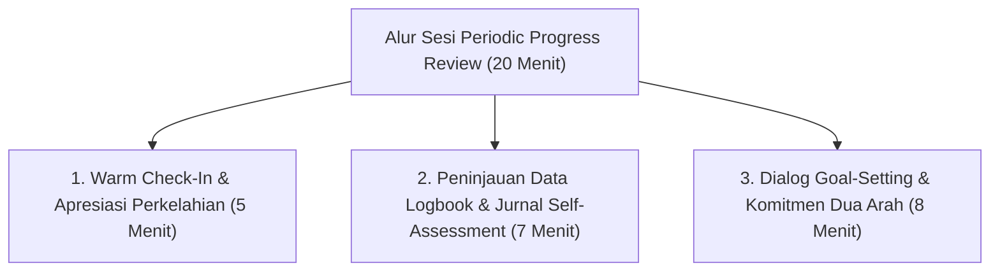

# P5-08-03: Periodic Progress Review dan Sesi Refleksi Mentoring

## Status Dokumen
* **Status**: 🌟 **A+ (Tervalidasi & Siap Diimplementasikan)**
* **Sub-Domain**: `05 Assessment Framework / 08 Mentor Assessment`
* **Penanggung Jawab Keilmuan**: Dewan Keilmuan TUMBUH (*Pakar Bimbingan Konseling & Pakar Pengasuhan Asrama*)

---

## 1. Operasionalisasi Periodic Progress Review (PPR)

Periodic Progress Review (PPR) adalah sesi wawancara bimbingan dua mingguan antara Musyrif/Wali Kelas dan Santri untuk meninjau rekam data logbook dan menetapkan langkah pertumbuhan diri.

---

## 2. Hasil Sesi Mentoring

Hasil sesi PPR dicatat dalam **Buku Pembinaan Santri Digital** sebagai bahan laporan berkala dalam Sidang Transisi Tangga TUMBUH.
