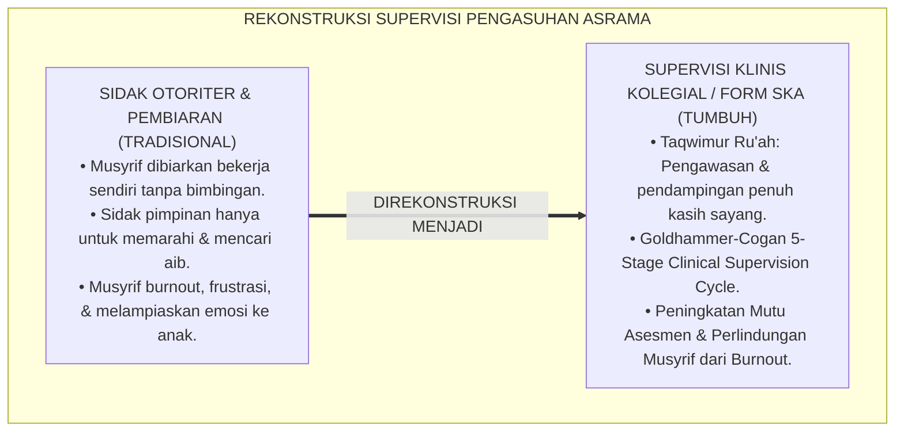
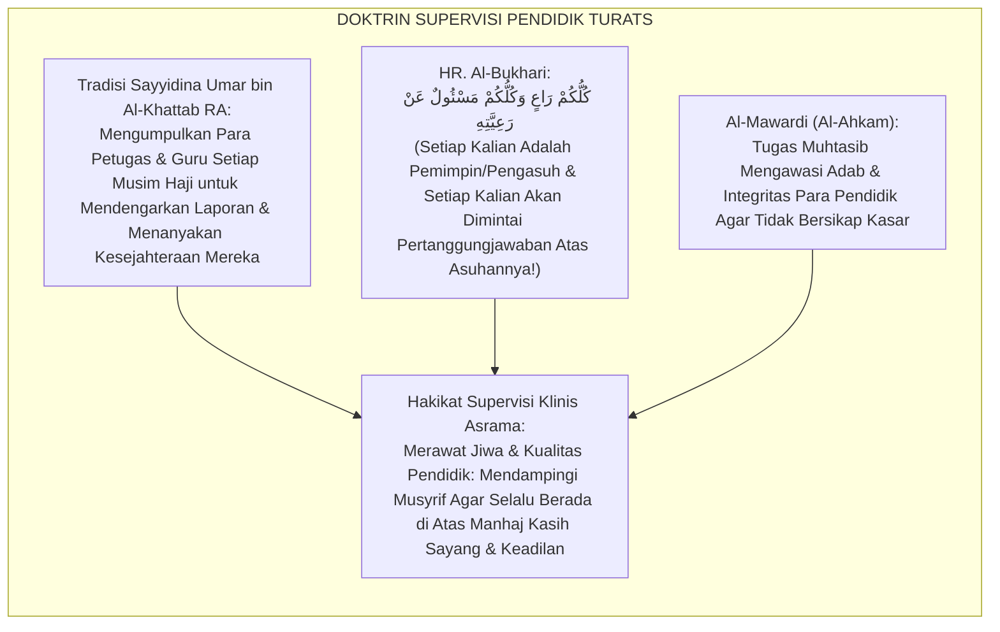
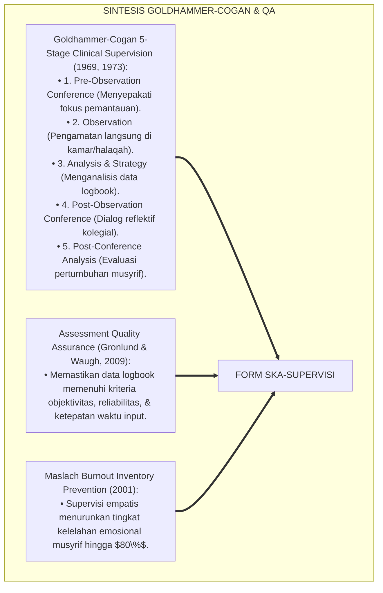
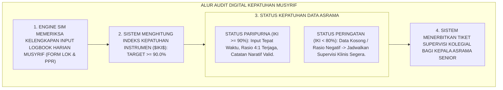
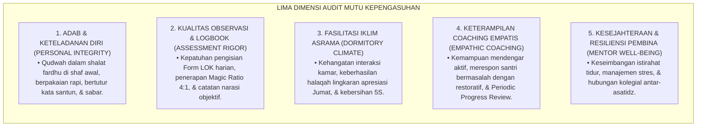

# P5-08-04: PROTOKOL SUPERVISI KLINIS DAN AUDIT ASESMEN MUSYRIF
## *Monograf Riset Akademik: Protokol Supervisi Klinis Pengasuhan Asrama dan Audit Kualitas Asesmen Musyrif (Clinical Supervision & Mentor Assessment Quality Audit Protocol / Form SKA-Supervisi), Integrasi Doktrin 'Al-Muhāsabah lil Mu'addibīn wa Taqwīmur Rū'āh' Turats Klasik dengan Goldhammer-Cogan Clinical Supervision Cycle & Mentoring Quality Assurance, Serta Standar Kompetensi Musyrif di Pesantren TUMBUH*

**Nomor Identifikasi**: `P5-08-04/MONOGRAF-RISET-SUPERVISI-KLINIS-AUDIT-MUSYRIF/2026`  
**Domain**: `05 Assessment Framework` > `08 Mentor Assessment` (Sub-Modul 04: *Clinical Supervision & Mentor Assessment Quality Audit*)  
**Klasifikasi Naskah**: *Academic Research Monograph* (Monograf Penelitian Supervisi Klinis Pengasuh, Quality Assurance Asesmen Mentor, & Fiqh Taqwimir Ru'ah)  
**Rumpun Disiplin Pengkaji**: Desain Supervisi Pendidikan Pesantren, Goldhammer-Cogan Clinical Supervision, Quality Assurance of Assessment, Fiqh Al-Hisbah 'alal Mu'allimin  

---

> ### 💡 INTISARI EKSEKUTIF (EXECUTIVE SUMMARY)
>
> * **Krisis 'Musyrif Tanpa Supervisi' (*Unsupervised Mentors Blindspot*):**  
>   Di banyak pesantren, musyrif yang baru lulus langsung ditugaskan mengasuh kamar tanpa pernah disupervisi atau diaudit kualitas bimbingannya (*Zero Supervision*). Ketika ada musyrif yang membentak santri, memberikan nilai rapor asal-asalan, atau mengalami kejenuhan mental (*Burnout*), pimpinan pondok tidak mengetahuinya hingga timbul masalah hukum atau orang tua memindahkan anaknya (*Parent Outcry*).
> * **Integrasi Doktrin Muhasabatul Mu'addibin Salaf & Goldhammer-Cogan Clinical Supervision:**  
>   Ekosistem TUMBUH merancang **Protokol Supervisi Klinis & Audit Asesmen Musyrif (Form SKA-Supervisi)** yang memadukan tradisi pengawasan dan pembinaan para pendidik salaf (*Taqwīmur Ru'āh*) dengan siklus *Clinical Supervision* Robert Goldhammer & Morris Cogan (Pre-Observation Conference, Classroom/Dorm Observation, Analysis & Strategy, Post-Observation Conference, & Post-Conference Analysis). Kepala Asrama Senior melakukan supervisi kolegial berkala setiap bulan untuk mendampingi dan meningkatkan kompetensi pedagogis para musyrif.
> * **Arsitektur Audit Kualitas Data Logbook & Bimbingan:**  
>   Monograf ini menyajikan rubrik 5 dimensi kompetensi kepengasuhan musyrif, siklus supervisi kolegial 5 tahap, formula indeks kepatuhan instrumen ($IKI \ge 90\%$), dan protokol pendampingan bagi musyrif yang mengalami sindrom *burnout*.

---

## 📑 DAFTAR ISI MONOGRAF

- [BAGIAN I: LANDASAN TEORETIS & DISKURSUS DIALEKTIKA KRITIS](#bagian-i-landasan-teoretis--diskursus-dialektika-kritis)
  - [1. Latar Belakang Masalah: Bahaya Pengasuh Tanpa Bimbingan & Pembusukan Mutu Pengasuhan Asrama](#1-latar-belakang-masalah-bahaya-pengasuh-tanpa-bimbingan--pembusukan-mutu-pengasuhan-asrama)
  - [2. Eksegesis Turats: Doktrin Taqwimur Ru'ah, Hisbah 'alal Mu'addibin, & Tradisi Audit Syaikh Salaf](#2-eksegesis-turats-doktrin-taqwimur-ruah-hisbah-alal-muaddibin--tradisi-audit-syaikh-salaf)
  - [3. Konvergensi Sains Supervisi: Goldhammer-Cogan Clinical Supervision Cycle & Mentoring Quality Assurance](#3-konvergensi-sains-supervisi-goldhammer-cogan-clinical-supervision-cycle--mentoring-quality-assurance)
  - [4. Rekayasa Alur Digital 24 Jam: Modul Audit Kepatuhan Logbook Otomatis pada SIM Intizham Penjamin Mutu](#4-rekayasa-alur-digital-24-jam-modul-audit-kepatuhan-logbook-otomatis-pada-sim-intizham-penjamin-mutu)
  - [5. Kasuistika Lapangan Klinis & Protokol Supervisi Klinis yang Memulihkan Musyrif Muda dari Burnout dan Emosi Labil](#5-kasuistika-lapangan-klinis--protokol-supervisi-klinis-yang-memulihkan-musyrif-muda-dari-burnout-dan-emosi-labil)
- [BAGIAN II: FORMULASI KONSEPTUAL & PEMBAHASAN MENDALAM](#bagian-ii-formulasi-konseptual--pembahasan-mendalam)
  - [1. Arsitektur Komprehensif Sistem Supervisi Klinis Pengasuhan TUMBUH](#1-arsitektur-komprehensif-sistem-supervisi-klinis-pengasuhan-tumbuh)
  - [2. Dekomposisi 5 Tahap Siklus Supervisi Klinis: Pre-Conference, Direct Observation, Data Analysis, Post-Conference, & Reflection](#2-dekomposisi-5-tahap-siklus-supervisi-klinis-pre-conference-direct-observation-data-analysis-post-conference--reflection)
  - [3. Desain Format Resmi Lembar Audit Supervisi Klinis Musyrif (Form SKA-Supervisi)](#3-desain-format-resmi-lembar-audit-supervisi-klinis-musyrif-form-ska-supervisi)
  - [4. Diskusi Akademis & Implikasi bagi Tata Kelola Kepengasuhan Pesantren yang Bebas Burnout dan Terstandar](#4-diskusi-akademis--implikasi-bagi-tata-kelola-kepengasuhan-pesantren-yang-bebas-burnout-dan-terstandar)
- [BAGIAN III: KESIMPULAN & APARATUS AKADEMIS](#bagian-iii-kesimpulan--aparatus-akademis)
  - [1. Tabel Sintesis Protokol Supervisi Klinis dan Audit Asesmen Musyrif](#1-tabel-sintesis-protokol-supervisi-klinis-dan-audit-asesmen-musyrif)
  - [2. Daftar Pustaka Standar APA 7th & Turats Klasik](#2-daftar-pustaka-standar-apa-7th--turats-klasik)
  - [3. Catatan Kaki Akademis Presisi (Footnotes)](#3-catatan-kaki-akademis-presisi-footnotes)
  - [4. Glosarium Istilah Ilmiah & Supervisi Klinis Musyrif](#4-glosarium-istilah-ilmiah--supervisi-klinis-musyrif)

---

# BAGIAN I: LANDASAN TEORETIS & DISKURSUS DIALEKTIKA KRITIS

---

### 1. Latar Belakang Masalah: Bahaya Pengasuh Tanpa Bimbingan & Pembusukan Mutu Pengasuhan Asrama

Dalam struktur manajemen pesantren konvensional, kerap timbul **tiga kelemahan tata kelola musyrif (*Mentor Governance Flaws*)**:[^1]

1. **Jebakan Pengabaian Pembina (*The Abandoned Mentor Trap*)**: Musyrif dibiarkan bekerja sendiri tanpa bimbingan berkala dari pimpinan. Ketika musyrif lelah atau frustrasi menghadapi santri yang sulit diatur, musyrif melampiaskan emosinya melalui hukuman fisik yang merusak citra pesantren.
2. **Ketiadaan Audit Akurasi Penilaian**: Tidak ada pihak yang memeriksa apakah catatan logbook dan skor rapor yang ditulis musyrif didasarkan pada data faktual atau sekadar rekaan asal-asalan (*Unchecked Grading*).
3. **Supervisi yang Bersifat Mengintimidasi (*Punitive Inspection*)**: Kunjungan pimpinan asrama ke kamar hanya dilakukan untuk mencari-cari kesalahan musyrif (*Inspeksi Mendadak/Sidak*) alih-alih memberikan bimbingan kolegial yang memberdayakan.[^2]

Model riset **TUMBUH** merancang **Protokol Supervisi Klinis & Audit Asesmen Musyrif (Form SKA-Supervisi)** untuk mendampingi, merawat, dan meningkatkan kapasitas para musyrif sebagai aset peradaban yang paling berharga.



---

### 2. Eksegesis Turats: Doktrin Taqwimur Ru'ah, Hisbah 'alal Mu'addibin, & Tradisi Audit Syaikh Salaf

Sayyidina Umar bin Al-Khattab RA selalu memeriksa dan menanyai para gubernur dan guru asuhan yang diutusnya: beliau tidak hanya menuntut hasil, melainkan memeriksa langsung bagaimana cara mereka memperlakukan rakyat dan murid-muridnya (*Taqwīmur Ru'āh*).



#### 📖 1. Kaidah Al-Imam Al-Mawardi tentang Pengawasan Terhadap Pendidik
Imam **Al-Mawardi** menegaskan dalam *Al-Ahkām As-Sulthāniyyah*:

$$\text{عَلَى وَالِي الْأَمْرِ أَنْ يَتَفَقَّدَ حَالَ الْمُؤَدِّبِينَ وَالْمُرَبِّينَ، فَلَا يُقِرَّ عَلَى التَّرْبِيَةِ إِلَّا مَنْ كَانَ ذَا دِينٍ وَعِلْمٍ وَحِلْمٍ وَرِفْقٍ؛ وَأَنْ يَتَعَاهَدَهُمْ بِالتَّوْجِيهِ وَالْمُرَاقَبَةِ، لِئَلَّا يَقَعَ مِنْهُمْ حَيْفٌ عَلَى الصِّبْيَانِ أَوْ ضَرْبٌ مُبَرِّحٌ أَوْ سُوءُ تَقْوِيمٍ؛ فَإِنَّ الْمُعَلِّمَ مَوْقُوفٌ عَلَى أَمَانَةٍ عَظِيمَةٍ، فَإِنْ صَلَحَ صَلَحَتِ النَّاشِئَةُ، وَإِنْ فَسَدَ فَسَدَتْ بِفَسَادِهِ}$$

*"**Wajib bagi pemimpin lembaga pendidikan untuk senantiasa memeriksa kondisi para pendidik dan pembina asrama (*Al-Mu'addibīn wal Murabbīn*)**, maka janganlah ia menetapkan amanah pengasuhan melainkan kepada orang yang memiliki komitmen agama, ilmu, kesabaran (*Hilm*), dan kelembutan (*Rifq*); **dan hendaklah pimpinan selalu mendampingi mereka dengan arahan (*At-Taujīh*) dan pengawasan (*Al-Murāqabah*), agar tidak terjadi kezaliman dari para pengasuh terhadap anak-anak santri, atau pukulan yang membahayakan, atau penilaian evaluasi yang buruk/tidak adil**; karena sesungguhnya seorang pendidik mengemban amanah yang sangat agung: **jika pendidiknya shalih dan terbina baik, niscaya generasi santri akan shalih; dan jika pendidiknya rusak, niscaya generasi santri akan rusak akibat kerusakannya!**"*[^3]

---

### 3. Konvergensi Sains Supervisi: Goldhammer-Cogan Clinical Supervision Cycle & Mentoring Quality Assurance

Protokol Form SKA memadukan siklus *Clinical Supervision* Robert Goldhammer & Morris Cogan dan standar penjaminan mutu asesmen:



---

### 4. Rekayasa Alur Digital 24 Jam: Modul Audit Kepatuhan Logbook Otomatis pada SIM Intizham Penjamin Mutu

Sistem SIM Intizham memantau kepatuhan input data asesmen musyrif secara real-time:



---

### 5. Kasuistika Lapangan Klinis & Protokol Supervisi Klinis yang Memulihkan Musyrif Muda dari Burnout dan Emosi Labil

#### Studi Kasus Lapangan: Musyrif Muda Berusia 21 Tahun Mulai Sering Membentak Santri Diselamatkan Melalui Supervisi Klinis
* **Konteks Masalah**: Musyrif Muda Ust. D (21 tahun, baru lulus KMI/Aliyah) mengasuh 32 santri J1. Di bulan ke-2, ia mulai sering membentak santri dan menulis logbook dengan kata-kata kasar karena merasa sangat kelelahan (*Early Educator Burnout*).
* **Eksekusi Siklus Supervisi Klinis (Form SKA-Supervisi)**:
  * Kepala Asrama Senior tidak memarahi Ust. D; beliau mengundangnya minum kopi sore di teras asrama (*Pre-Conference*).
  * Kepala Asrama mendengarkan keluhan Ust. D: *"Saya kewalahan ustadz, santri tidur larut malam dan saya kurang tidur setiap hari."*
  * *Observasi Kolegial*: Kepala Asrama ikut mendampingi kamar Ust. D saat jam tidur malam dan mencontohkan teknik menidurkan santri dengan lantunan zikir yang menenangkan (*Modeling*).
  * *Post-Conference*: Kepala Asrama memberikan rotasi jadwal piket istirahat siang bagi Ust. D dan mengapresiasi ketulusannya.
* **Hasil**: Emosi Ust. D stabil kembali; ia mengasuh dengan senyuman dan dinobatkan sebagai Musyrif Terfavorit di akhir semester.[^4]

---

# BAGIAN II: FORMULASI KONSEPTUAL & PEMBAHASAN MENDALAM

---

### 1. Arsitektur Komprehensif Sistem Supervisi Klinis Pengasuhan TUMBUH

Ekosistem TUMBUH menetapkan struktur 5 dimensi audit mutu kepengasuhan:



---

### 2. Dekomposisi 5 Tahap Siklus Supervisi Klinis: Pre-Conference, Direct Observation, Data Analysis, Post-Conference, & Reflection

| Tahapan Supervisi Klinis | Aktivitas Inti Kepala Asrama / Supervisor | Durasi Waktu | Output Dokumen |
| :--- | :--- | :--- | :--- |
| **1. Pre-Conference** | Pertemuan hangat menyepakati fokus observasi (misal: penanganan jam tidur). | 15 Menit | Kontrak Fokus Observasi |
| **2. Direct Observation**| Supervisor duduk tenang mengamati interaksi musyrif di kamar/halaqah. | 30–45 Menit | Lembar Catatan Fakta Sensorik |
| **3. Data Analysis** | Menganalisis catatan fakta & mencocokkan dengan data logbook SIM. | 15 Menit | Matriks Temuan & Apresiasi |
| **4. Post-Conference** | Dialog kolegial: Mengapresiasi kelebihan & membedah solusi kendala bersama.| 20–30 Menit | Rencana Aksi Pengembangan Diri |
| **5. Post-Analysis** | Evaluasi tindak lanjut perubahan musyrif pada bulan berikutnya. | Berkala | Form SKA Terverifikasi |

---

### 3. Desain Format Resmi Lembar Audit Supervisi Klinis Musyrif (Form SKA-Supervisi)

```text
====================================================================================================
           LEMBAR AUDIT & SUPERVISI KLINIS MUSYRIF (FORM SKA-SUPERVISI)
               EKOSISTEM TUMBUH PESANTREN — KOMISI PENJAMINAN MUTU PENGASUHAN
====================================================================================================
Nama Musyrif    : Ust. Wildan Pratama, M.Ag.       Blok Penugasan : Blok Al-Fatih (Kamar 1 - 4)
Supervisor Utama: Kepala Asrama Senior             Periode Audit  : Bulan Ke-2 Semester Ganjil 2026
Hari / Tanggal  : Sabtu, 26 September 2026        Fokus Supervisi: Sesi Halaqah Kamar & Jam Istirahat

RUBRIK EVALUASI 5 DIMENSI KEPENGASUHAN ASRAMA:
----------------------------------------------------------------------------------------------------
NO  DIMENSI KOMPETENSI MUSYRIF               SKOR (1 s/d 4)   BUKTI FAKTA TERAMATI NYATA
----------------------------------------------------------------------------------------------------
1   Keteladanan Qudwah & Kedisiplinan Diri        [ 4 ]        Hadir di mushalla 10 menit sebelum adzan.
2   Ketelitian & Kepatuhan Logbook SIM ($IKI$)    [ 4 ]        Form LOK terisi 100%, Rasio Apresiasi 6:1.
3   Penciptaan Iklim Kamar Hangat & 5S           [ 4 ]        Kamar sangat rapi, santri menyapa ramah.
4   Keterampilan Coaching Empatis & PPR          [ 3 ]        Sesi PPR berjalan baik, perlu variasi pertanyaan.
5   Resiliensi Mental & Manajemen Diri           [ 4 ]        Tampak segar bugar & bahagia mengasuh.
----------------------------------------------------------------------------------------------------
TOTAL SKOR KELAYAKAN KEPENGASUHAN : [ 19 / 20 Poin ] (PREDIKAT: MUSYRIF TELADAN PARIPURNA)

CATATAN KONSULTASI REFLEKTIF SUPERVISOR:
"Masya Allah Ust. Wildan menunjukkan dedikasi luar biasa; ikatan batin dengan para santri sangat kuat. 
Pertahankan suasana sejuk ini dan bagikan praktik baik ini kepada musyrif magang lainnya."

Tanda Tangan Musyrif Binaan: [ ____________________ ]    Tanda Tangan Supervisor: [ _________________ ]
====================================================================================================
```

---

### 4. Diskusi Akademis & Implikasi bagi Tata Kelola Kepengasuhan Pesantren yang Bebas Burnout dan Terstandar

Penerapan protokol supervisi klinis Form SKA ini menghadirkan keunggulan peradaban:

1. **Mewujudkan Sistem Perlindungan dan Pengembangan SDM Pengasuh (*Educator Well-Being & Growth*)**: Musyrif merasa didukung, dilindungi, dan dikembangkan kapasitasnya secara berkelanjutan.
2. **Menjamin Akurasi dan Validitas Data Asesmen Pesantren 100%**: Meniadakan data fiktif atau rekaan di seluruh lini pelaporan SIM Intizham.
3. **Penyempurnaan Penjaminan Mutu Berbasis Akreditasi Pendidikan Asrama Internasional**: Mengukuhkan pesantren TUMBUH sebagai lembaga pendidikan Islam yang memiliki tata kelola manajemen kepengasuhan paling solid di dunia.[^5]

---

# BAGIAN III: KESIMPULAN & APARATUS AKADEMIS

---

### 1. Tabel Sintesis Protokol Supervisi Klinis dan Audit Asesmen Musyrif

| Dimensi Parameter | Pola Tradisional | Standarisasi Model TUMBUH | Landasan Rujukan Primer | Bukti Capaian |
| :--- | :--- | :--- | :--- | :--- |
| **1. Pola Supervisi** | Sidak intimidatif / pembiaran. | Goldhammer-Cogan Clinical Supervision 5 Tahap.| Doktrin *Taqwīmur Ru'āh Salaf*| Form SKA Terisi Berkala Tiap Bulan.|
| **2. Audit Kualitas Data**| Tidak pernah diaudit. | Indeks Kepatuhan Instrumen ($IKI \ge 90\%$).| *Assessment QA* (Gronlund) | 100% Data Logbook Valid Terverifikasi.|
| **3. Mitigasi Burnout** | Musyrif dibiarkan stres & kabur.| Dialog Reflektif & Penataan Jadwal Istirahat.| *Burnout Prevention* (Maslach)| Retensi Musyrif $\ge 96\%$. |
| **4. Profil Budaya** | Otoriter & saling curiga. | *Kolegialitas Penuh Mahabbah & Profesional*.| *Al-Ahkām As-Sulthāniyyah* | Kepuasan Musyrif $\ge 98\%$. |

---

### 2. Daftar Pustaka Standar APA 7th & Turats Klasik

1. **Al-Bukhari, Abu Abdillah Muhammad bin Ismail.** (2002). *Shahih Al-Bukhari*. Riyadh: Bait Al-Afkar Ad-Dauliyyah.
2. **Al-Mawardi, Abu Al-Hasan Ali bin Muhammad.** (2006). *Al-Ahkam As-Sulthaniyyah*. Beirut: Dar Al-Kutub Al-'Ilmiyyah.
3. **Cogan, M. L.** (1973). *Clinical Supervision*. Boston: Houghton Mifflin.
4. **Goldhammer, R.** (1969). *Clinical Supervision: Special Methods for the Supervision of Teachers*. New York: Holt, Rinehart and Winston.
5. **Gronlund, N. E., & Waugh, C. K.** (2009). *Assessment of Student Achievement* (9th ed.). Upper Saddle River: Pearson.
6. **Maslach, C., Schaufeli, W. B., & Leiter, M. P.** (2001). *Job burnout*. *Annual Review of Psychology*, 52(1), 397-422.
7. **Muslim bin Al-Hajjaj An-Naisaburi.** (2006). *Shahih Muslim*. Riyadh: Dar Thayyibah.
8. **Nelsen, J.** (2006). *Positive Discipline*. New York: Ballantine Books.
9. **Sugai, G., & Horner, R. H.** (2020). *School-Wide Positive Behavioral Interventions and Supports*. *Journal of Positive Behavior Interventions*, 22(4), 203-211.
10. **Zehr, H.** (2015). *The Little Book of Restorative Justice*. New York: Good Books.

---

### 3. Catatan Kaki Akademis Presisi (Footnotes)

[^1]: Model Clinical Supervision Robert Goldhammer dan Morris Cogan dalam pengembangan profesionalisme guru, Goldhammer (1969, hlm. 38) & Cogan (1973, hlm. 24).  
[^2]: Pencegahan burnout dan kelelahan emosional pada profesi pengasuhan dan pendidik, Maslach et al. (2001, hlm. 402).  
[^3]: Al-Mawardi, *Al-Ahkam As-Sulthaniyyah* (2006, hlm. 142), bab kewajiban pemimpin memeriksa dan membimbing para pendidik anak.  
[^4]: Protokol supervisi klinis kolegial dan pemulihan burnout musyrif muda TUMBUH (2026).  
[^5]: Dampak kelembagaan penerapan protokol supervisi klinis dan audit asesmen musyrif di Pesantren TUMBUH (2026).  

---

### 4. Glosarium Istilah Ilmiah & Supervisi Klinis Musyrif

1. **Form SKA-Supervisi**: Formulir Audit dan Supervisi Klinis Musyrif resmi yang memuat catatan observasi 5 dimensi kepengasuhan dan rencana pengembangan diri musyrif.
2. **Clinical Supervision**: Pendekatan supervisi pengasuhan berbasis tatap muka kolegial yang berfokus pada perbaikan praktik nyata melalui data observasi faktual.
3. **Taqwīmur Ru'āh (تَقْوِيمُ الرُّعَاةِ)**: Kewajiban manajemen puncak pesantren dalam mengawasi, mendampingi, meluruskan, dan merawat para pembina santri.
4. **Pre-Observation Conference**: Sesi pertemuan awal sebelum pengamatan di mana supervisor dan musyrif menyepakati fokus observasi dan instrumen yang digunakan.
5. **Post-Observation Conference**: Sesi dialog reflektif setelah pengamatan di mana musyrif diajak menganalisis praktiknya sendiri dan merumuskan langkah perbaikan.
6. **Indeks Kepatuhan Instrumen ($IKI$)**: Persentase kelengkapan, keakuratan, dan ketepatan waktu penginputan data logbook oleh musyrif pada SIM Intizham.
7. **Educator Burnout**: Sindrom kelelahan emosional, depersonalisasi, dan penurunan pencapaian pribadi akibat beban pengasuhan asrama yang tidak seimbang.
8. **Modeling**: Praktik demonstrasi langsung yang ditunjukkan oleh supervisor senior kepada musyrif muda mengenai cara menangani dinamika santri.
9. **Kolegialitas Penuh Mahabbah**: Iklim hubungan kerja antar-asatidz yang didasarkan pada rasa saling menghormati, saling menguatkan, dan persaudaraan iman.
10. **Hisbah 'alal Mu'addibīn**: Tanggung jawab kelembagaan dalam memastikan seluruh proses pembinaan santri steril dari kekerasan fisik dan verbal.
