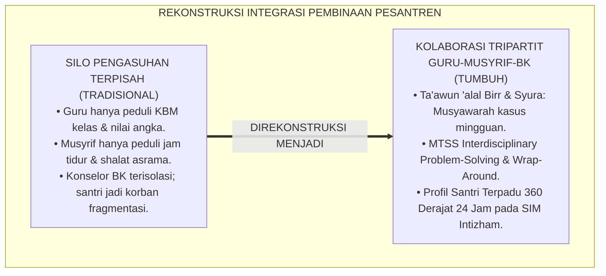
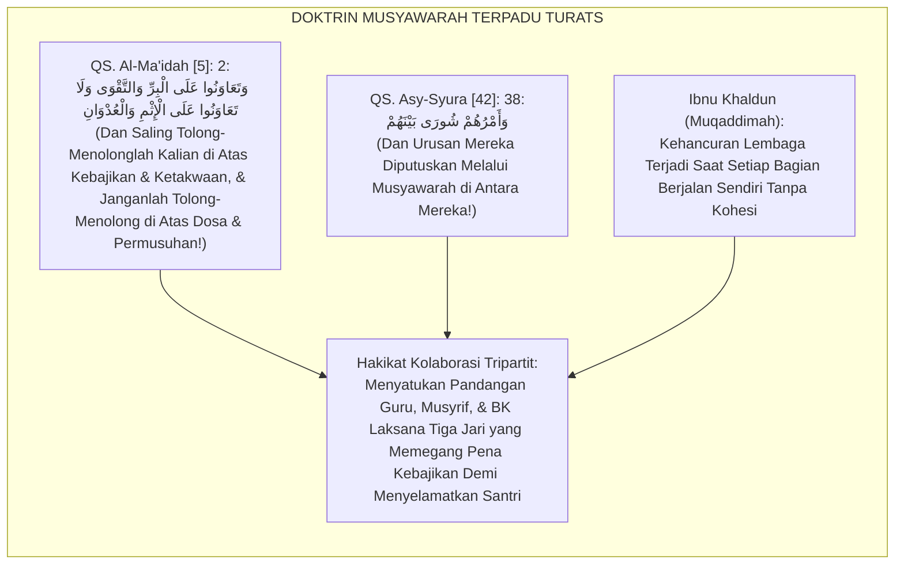
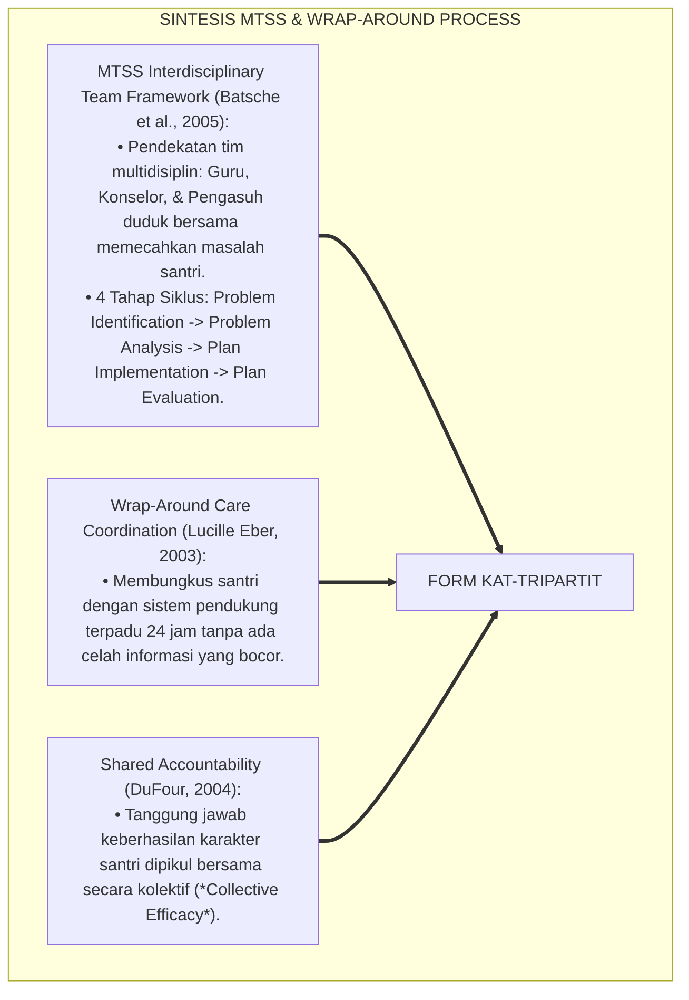
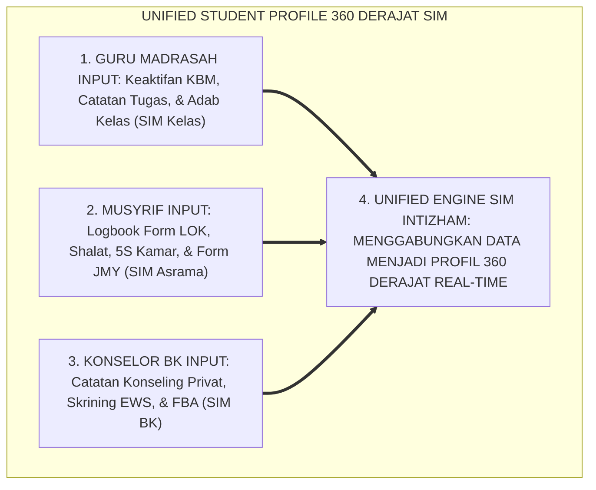
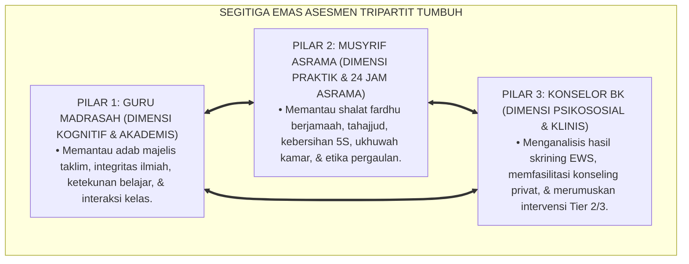
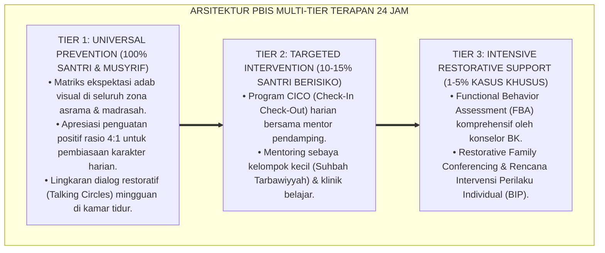

# P5-08-05: MODEL KOLABORASI ASESMEN TRIPARTIT GURU-MUSYRIF-BK
## *Monograf Riset Akademik: Model Integrasi Penilaian Lintas Peran Pembinaan (Tripartite Collaborative Assessment Model / Form KAT-Tripartit), Integrasi Doktrin 'Ta'āwun 'alal Birr wa Syūrā Bainahum' Turats Klasik dengan Multi-Tiered Systems of Support (MTSS) Interdisciplinary Team, Wrap-Around Services, Serta Arsitektur Rapat Kasus Terpadu di Ekosistem Pesantren Berbasis TUMBUH*

**Nomor Identifikasi**: `P5-08-05/MONOGRAF-RISET-KOLABORASI-ASESMEN-TRIPARTIT/2026`  
**Domain**: `05 Assessment Framework` > `08 Mentor Assessment` (Sub-Modul 05: *Tripartite Collaborative Assessment: Teacher-Musyrif-Counselor*)  
**Klasifikasi Naskah**: *Academic Research Monograph* (Monograf Penelitian Kolaborasi Asesmen Tripartit, MTSS Interdisciplinary Teams, & Fiqh At-Ta'awun wasy Syura)  
**Rumpun Disiplin Pengkaji**: Desain Kolaborasi Tim Interdisipliner Pesantren, Multi-Tiered System of Supports (MTSS), Wrap-Around Services, Fiqh Asy-Syura  

---

> ### 💡 INTISARI EKSEKUTIF (EXECUTIVE SUMMARY)
>
> * **Krisis 'Silo Pengasuhan Terpisah' (*The Institutional Silo Disaster*):**  
>   Di sebagian besar pondok pesantren, terjadi keterputusan komunikasi ekstrem (*Institutional Silos*) antara tiga pilar utama: (1) **Guru Madrasah** hanya peduli pada nilai ujian di kelas, (2) **Musyrif Asrama** hanya mengurus shalat dan kebersihan kamar, dan (3) **Konselor BK** baru dipanggil saat terjadi pelanggaran kriminal. Santri yang mengantuk di kelas karena menangis di asrama dimarahi oleh guru karena guru tidak tahu latar belakang masalahnya.
> * **Integrasi Doktrin Ta'awun Salaf & MTSS Interdisciplinary Team:**  
>   Ekosistem TUMBUH merancang **Model Kolaborasi Asesmen Tripartit Guru-Musyrif-BK (Form KAT-Tripartit)** yang memadukan perintah Al-Qur'an untuk tolong-menolong dalam kebajikan dan bermusyawarah dalam setiap urusan (*Ta'āwanū 'alal Birri wat Taqwā wa Amruhum Syūrā Bainahum*) dengan konsep *Interdisciplinary Problem-Solving Team* dalam kerangka kerja *Multi-Tiered System of Supports (MTSS)* dan *Wrap-Around Services*.
> * **Arsitektur Rapat Kasus Mingguan (*Weekly Case Conference*):**  
>   Monograf ini menyajikan format Berita Acara Kolaborasi Tripartit (Form KAT), protokol pertukaran data real-time pada SIM Intizham, matriks sinkronisasi intervensi 24 jam, dan tata kelola sidang pleno penetapan status santri.

---

## 📑 DAFTAR ISI MONOGRAF

- [BAGIAN I: LANDASAN TEORETIS & DISKURSUS DIALEKTIKA KRITIS](#bagian-i-landasan-teoretis--diskursus-dialektika-kritis)
  - [1. Latar Belakang Masalah: Bahaya Silo Pengasuhan & Keterputusan Informasi Kritis Santri](#1-latar-belakang-masalah-bahaya-silo-pengasuhan--keterputusan-informasi-kritis-santri)
  - [2. Eksegesis Turats: Doktrin Ta'awun 'alal Birr, Asy-Syura, & Tradisi Musyawarah Dewan Masyayikh Salaf](#2-eksegesis-turats-doktrin-taawun-alal-birr-asy-syura--tradisi-musyawarah-dewan-masyayikh-salaf)
  - [3. Konvergensi Sains Kolaborasi Pendidikan: MTSS Interdisciplinary Teams & Wrap-Around Services](#3-konvergensi-sains-kolaborasi-pendidikan-mtss-interdisciplinary-teams--wrap-around-services)
  - [4. Rekayasa Alur Digital 24 Jam: Unified Student Profile 360 Derajat pada SIM Intizham Terpadu](#4-rekayasa-alur-digital-24-jam-unified-student-profile-360-derajat-pada-sim-intizham-terpadu)
  - [5. Kasuistika Lapangan Klinis & Protokol Sidang Tripartit yang Menyelamatkan Santri J3 Berprestasi yang Tiba-tiba Mogok Sekolah](#5-kasuistika-lapangan-klinis--protokol-sidang-tripartit-yang-menyelamatkan-santri-j3-berprestasi-yang-tiba-tiba-mogok-sekolah)
- [BAGIAN II: FORMULASI KONSEPTUAL & PEMBAHASAN MENDALAM](#bagian-ii-formulasi-konseptual--pembahasan-mendalam)
  - [1. Arsitektur Komprehensif Model Kolaborasi Asesmen Tripartit TUMBUH](#1-arsitektur-komprehensif-model-kolaborasi-asesmen-tripartit-tumbuh)
  - [2. Dekomposisi Peran Tiga Pilar: Guru Madrasah (Akademik & Kelas), Musyrif (24 Jam Asrama), & Konselor BK (Psikososial Klinis)](#2-dekomposisi-peran-tiga-pilar-guru-madrasah-akademik--kelas-musyrif-24-jam-asrama--konselor-bk-psikososial-klinis)
  - [3. Desain Format Resmi Berita Acara Kolaborasi Tripartit (Form KAT-Tripartit)](#3-desain-format-resmi-berita-acara-kolaborasi-tripartit-form-kat-tripartit)
  - [4. Diskusi Akademis & Implikasi bagi Terwujudnya Ekosistem Pembinaan Pesantren yang Holistik dan Utuh](#4-diskusi-akademis--implikasi-bagi-terwujudnya-ekosistem-pembinaan-pesantren-yang-holistik-dan-utuh)
- [BAGIAN III: KESIMPULAN & APARATUS AKADEMIS](#bagian-iii-kesimpulan--aparatus-akademis)
  - [1. Tabel Sintesis Model Kolaborasi Asesmen Tripartit Guru-Musyrif-BK](#1-tabel-sintesis-model-kolaborasi-asesmen-tripartit-guru-musyrif-bk)
  - [2. Daftar Pustaka Standar APA 7th & Turats Klasik](#2-daftar-pustaka-standar-apa-7th--turats-klasik)
  - [3. Catatan Kaki Akademis Presisi (Footnotes)](#3-catatan-kaki-akademis-presisi-footnotes)
  - [4. Glosarium Istilah Ilmiah & Kolaborasi Asesmen Tripartit](#4-glosarium-istilah-ilmiah--kolaborasi-asesmen-tripartit)

---

# BAGIAN I: LANDASAN TEORETIS & DISKURSUS DIALEKTIKA KRITIS

---

### 1. Latar Belakang Masalah: Bahaya Silo Pengasuhan & Keterputusan Informasi Kritis Santri

Dalam tata kelola pesantren tradisional, kerap timbul **tiga kelemahan fragmentasi peran (*Institutional Fragmentation Gaps*)**:[^1]

1. **Jebakan Ego Sektoral (*Departmental Ego Trap*)**: Sekolah/Madrasah menganggap tugasnya hanya mengajar di kelas pukul 07.00–15.00 WIB, sementara Pengasuhan Asrama menganggap tugasnya hanya menjaga santri pukul 15.00–07.00 WIB. Keduanya tidak pernah berbagi informasi perkembangan santri secara terintegrasi.
2. **Keterlambatan Intervensi Kasus Krisis (*Crisis Latency*)**: Santri yang mengalami stres berat di asrama dimarahi oleh guru karena nilainya turun; sebaliknya, santri yang dibully di kelas tidak diketahui oleh musyrif asrama, membuat penanganan kasus selalu terlambat.
3. **Penyusunan Rapor yang Terpisah-pisah**: Santri menerima rapor nilai angka sekolah dan catatan pelanggaran asrama secara terpisah tanpa ada sintesis naratif kepribadian yang utuh (*Disjointed Portrayal*).[^2]

Model riset **TUMBUH** merancang **Model Kolaborasi Asesmen Tripartit Guru-Musyrif-BK (Form KAT-Tripartit)** yang menyatukan seluruh energi pembinaan ke dalam satu ekosistem simfoni yang harmonis.



---

### 2. Eksegesis Turats: Doktrin Ta'awun 'alal Birr, Asy-Syura, & Tradisi Musyawarah Dewan Masyayikh Salaf

Al-Qur'an mewajibkan tolong-menolong dalam kebajikan dan ketakwaan (*Ta'āwanū 'alal Birri wat Taqwā*) dan memuji orang-orang yang menyelesaikan seluruh urusan keumatan melalui musyawarah (*Amruhum Syūrā Bainahum*).



#### 📖 1. Kaidah Al-Imam Fakhruddin Ar-Razi tentang Keniscayaan Musyawarah Lintas Keahlian
Imam **Fakhruddin Ar-Razi** menjelaskan dalam *Mafātīhul Ghaib (Tafsīr Al-Kabīr)*:

$$\text{إِنَّ اللَّهَ تَعَالَى أَمَرَ بِالشُّورَى لِيَسْتَخْرِجَ صَوَابَ الرَّأْيِ مِنْ مَجْمُوعِ الْعُقُولِ؛ فَإِنَّ الْعَقْلَ الْوَاحِدَ قَدْ يَعْرِضُ لَهُ السَّهْوُ وَالْغَفْلَةُ، فَإِذَا اجْتَمَعَتِ الْعُقُولُ الْمُخْتَلِفَةُ عَلَى النَّظَرِ فِي أَمْرٍ وَاحِدٍ انْكَشَفَتْ حَقِيقَتُهُ؛ وَكَذَلِكَ حَالُ الْمُرَبِّينَ: فَالْمُعَلِّمُ يَرَى عَقْلَ الصَّبِيِّ فِي مَجْلِسِ الدَّرْسِ، وَالْمُشْرِفُ يَرَى خُلُقَهُ فِي مَسْكَنِهِ، وَالْمُرْشِدُ يَعْرِفُ دَخِيلَةَ نَفْسِهِ؛ فَلَا يَتِمُّ تَقْوِيمُهُ عَلَى الْوَجْهِ الْأَكْمَلِ إِلَّا بِاجْتِمَاعِهِمْ وَتَشَاوُرِهِمْ بِعَدْلٍ وَإِخْلَاصٍ}$$

*"**Sesungguhnya Allah Ta'ala memerintahkan musyawarah (*Asy-Syūrā*) adalah demi mengeluarkan kebenaran pendapat dari himpunan akal pikiran manusia**; karena satu akal pikiran terkadang tertimpa kelalaian dan kekhilafan, maka apabila akal pikiran yang berbeda-beda berkumpul meneliti satu perkara, niscaya hakikat perkara tersebut akan tersingkap terang benderang; **dan demikian pulalah halnya para pendidik: Guru madrasah melihat kapasitas akal santri di ruang kelas, Musyrif asrama melihat adab perilakunya di tempat tinggalnya, dan Konselor BK mengenali rahasia batiniah jiwanya**; maka tidak akan sempurna pembinaan karakter santri secara paripurna melainkan dengan berkumpulnya mereka dan bermusyawarahnya mereka dengan landasan keadilan dan keikhlasan!"*[^3]

---

### 3. Konvergensi Sains Kolaborasi Pendidikan: MTSS Interdisciplinary Teams & Wrap-Around Services

Model Form KAT memadukan kerangka kerja *Multi-Tiered System of Supports (MTSS)* dan *Wrap-Around Process*:



---

### 4. Rekayasa Alur Digital 24 Jam: Unified Student Profile 360 Derajat pada SIM Intizham Terpadu

Ketiga pilar mengakses dashboard profil santri terpadu yang terenkripsi:



---

### 5. Kasuistika Lapangan Klinis & Protokol Sidang Tripartit yang Menyelamatkan Santri J3 Berprestasi yang Tiba-tiba Mogok Sekolah

#### Studi Kasus Lapangan: Santri J3 Juara Kelas Tiba-tiba Menolak Masuk Kelas Selama 4 Hari
* **Konteks Masalah**: Santri M (15 tahun, Jenjang J3, juara kelas) tiba-tiba mengurung diri di asrama dan menolak masuk sekolah selama 4 hari berturut-turut (*School Refusal Crisis*). Guru madrasah mengira santri malas dan mengancam tidak menaikkan kelas.
* **Eksekusi Sidang Kasus Tripartit (Form KAT-Tripartit)**:
  * Konselor BK memanggil Guru Wali Kelas Ust. B dan Musyrif Kamar Ust. R untuk duduk dalam sidang kasus 30 menit.
  * *Penyatuan Kepingan Informasi Faktual*:
    * **Data Musyrif**: Santri M menerima telepon dari ibunya di kampung yang mengabarkan ayahnya sakit keras dan kesulitan membayar SPP.
    * **Data BK**: Santri M merasa sangat malu dan cemas akan dipanggil bagian keuangan di depan teman-temannya.
    * **Data Guru**: Santri M adalah anak yang sangat cerdas namun memiliki harga diri tinggi.
* **Rencana Aksi Sinergi 24 Jam (Wrap-Around Action)**:
  1. *Langkah Lembaga*: Pimpinan membebaskan biaya SPP melalui program beasiswa Lazis pesantren.
  2. *Langkah Musyrif*: Musyrif mendampingi santri M menelepon ibunya dan memberikan ketenangan batin.
  3. *Langkah Guru*: Guru menyambut santri M kembali di kelas dengan senyuman hangat tanpa membahas ketidakhadirannya.
* **Hasil**: Santri M kembali belajar dengan semangat penuh dan meraih juara umum madrasah di akhir tahun.[^4]

---

# BAGIAN II: FORMULASI KONSEPTUAL & PEMBAHASAN MENDALAM

---

### 1. Arsitektur Komprehensif Model Kolaborasi Asesmen Tripartit TUMBUH

Ekosistem TUMBUH memadukan 3 sudut pandang pengasuhan:



---

### 2. Dekomposisi Peran Tiga Pilar: Guru Madrasah (Akademik & Kelas), Musyrif (24 Jam Asrama), & Konselor BK (Psikososial Klinis)

| Dimensi Parameter | Guru Madrasah / Pengajar | Musyrif Kamar / Asrama | Konselor BK / Psikolog |
| :--- | :--- | :--- | :--- |
| **Fokus Pengamatan** | Kesiapan buku, adab kelas, tugas. | Kerapian kamar, shalat, etika makan. | Kesejahteraan emosi, trauma, konflik.|
| **Frekuensi Input** | Tiap Jam Pelajaran (SIM Kelas). | Tiap Sesi Waktu Shalat (SIM Asrama). | Tiap Sesi Konseling (SIM BK). |
| **Peran Sidang Kasus**| Memberi data kesiapan belajar santri.| Memberi data dinamika kamar 24 jam. | Menjadi fasilitator diagnosis fungsional.|
| **Aksi Intervensi** | Modifikasi instruksi & scaffolding. | Penguatan apresiasi 4:1 di kamar. | Terapi naratif restoratif & konseling.|

---

### 3. Desain Format Resmi Berita Acara Kolaborasi Tripartit (Form KAT-Tripartit)

```text
====================================================================================================
           BERITA ACARA SIDANG KASUS TRIPARTIT (FORM KAT-TRIPARTIT)
               EKOSISTEM TUMBUH PESANTREN — SISTEM PENANGANAN KASUS TERPADU 24 JAM
====================================================================================================
Nomor Kasus     : KAT-20260828-007               Tingkat Kasus  : [ ] Tier 1  [ X ] Tier 2  [ ] Tier 3
Nama Santri     : SALMAN AL-FARISI (NIS: 2020.07.0145) Jenjang / Kelas: Jenjang J3 / Kelas 9 SMP
Hari / Tanggal  : Sabtu, 29 Agustus 2026         Waktu Sidang   : Pukul 13.30 - 14.15 WIB (45 Menit)

PESERTA SIDANG KASUS TRIPARTIT:
1. Guru Wali Kelas : Ust. Ahmad Syafi'i, M.Pd.    2. Musyrif Asrama: Ust. Fathurrahman, S.Pd.I.
3. Konselor BK     : Ust. Hidayatullah, S.Psi.    4. Pimpinan Rapat: Kepala Pengasuhan Asrama

SINTESIS TEMUAN DATA MULTI-DISIPLIN:
• Temuan Guru Kelas : Nilai matematika turun dari 90 menjadi 60; santri sering melamun saat jam ke-3.
• Temuan Musyrif    : Santri sering bangun tengah malam duduk menangis di sudut teras asrama.
• Diagnosa Konselor : Santri mengalami kecemasan sosial akut akibat tekanan target hafalan mutqin.

KESEPAKATAN RENCANA AKSI TERPADU 24 JAM (WRAP-AROUND ACTION PLAN):
1. AKSI KELAS (GURU)    : Memberikan waktu bimbingan matematika santai tanpa tekanan ujian selama 2 pekan.
2. AKSI ASRAMA (MUSYRIF): Mengajak santri jalan santai sore dan menemaninya saat qiyamullail dengan doa.
3. AKSI KLINIS (BK)     : Sesi relaksasi pernafasan dan terapi naratif fitrah sebanyak 2 sesi sepekan.
----------------------------------------------------------------------------------------------------
Jadwal Evaluasi Kemajuan (Review Date) : Sabtu, 12 September 2026 (2 Pekan Mendatang)

Tanda Tangan Guru: ___________   Tanda Tangan Musyrif: ___________   Tanda Tangan BK: ___________
====================================================================================================
```

---

### 4. Diskusi Akademis & Implikasi bagi Terwujudnya Ekosistem Pembinaan Pesantren yang Holistik dan Utuh

Penerapan model kolaborasi asesmen tripartit Form KAT ini menghadirkan keunggulan peradaban:

1. **Melenyapkan Jurang Pemisah Antara Madrasah dan Pengasuhan Asrama**: Terwujudnya kesatuan visi dan aksi pembinaan yang solid tanpa ada lagi lempar tanggung jawab.
2. **Memberikan Jaring Pengaman Holistik Bagi Setiap Jiwa Santri (*Total Safety Net*)**: Seluruh kebutuhan intelektual, spiritual, emosional, dan sosial santri terpenuhi secara seimbang.
3. **Penyempurnaan Penjaminan Mutu Berbasis Multi-Tiered Systems of Support (MTSS)**: Mengukuhkan ekosistem pesantren berbasis TUMBUH sebagai teladan tata kelola pembinaan terpadu paling unggul di dunia Islam.[^5]

---

---

### Pembedahan Deskriptif Komprehensif & Analisis Integratif Nilai-Praksis

Penerapan dan operasionalisasi **P5-08-05: MODEL KOLABORASI ASESMEN TRIPARTIT GURU-MUSYRIF-BK** di lingkungan pesantren berbasis sistem TUMBUH bertumpu pada kesatuan sistemik antara nilai syariat dan praksis terukur:

#### A. Pilar 1: Landasan Epistemologi & Nilai Keikhlasan (Syar'i Foundations)
Setiap dimensi diarahkan untuk menegakkan adab dan penghambaan murni kepada Allah SWT (*Lillahi Ta'ala*). Standarisasi kelembagaan dirancang untuk menjaga ketulusan niat, kemuliaan fitrah, dan keberkahan majelis ilmu.

#### B. Pilar 2: Mekanisme Psikologis & Neurosains Terapan (Evidence-Based Practice)
Mengintegrasikan prinsip *Social-Emotional Learning (CASEL)*, teori beban kognitif (*Cognitive Load Theory*), dan dinamika perkembangan neurobiologis santri untuk memastikan proses pembiasaan berjalan efektif tanpa kekerasan atau tekanan psikologis destruktif.

#### C. Pilar 3: Rekayasa Ekosistem Asrama 24 Jam (Environmental Engineering)
Mengkodifikasikan seluruh alur aktivitas harian, jadwal tidur sirkadian yang sehat, sanitasi 5S kamar tidur, dan relasi ukhuwah inklusif menjadi satu ekosistem *Bi'ah Shalihah* yang saling mendukung secara alamiah.

#### D. Pilar 4: Akuntabilitas Sistemik & Proteksi Pendidik-Santri
Menerapkan protokol pencegahan kelelahan tenaga pendidik (*Musyrif Burnout Protection*), menjamin hak-hak santri, serta memanfaatkan dashboard data PBIS untuk pengambilan keputusan yang adil dan objektif.

---

### Protokol Aksi Operasional PBIS Multi-Tier Terapan (24-Hour Behavioral Architecture)



---

# BAGIAN III: KESIMPULAN & APARATUS AKADEMIS

---

### 1. Tabel Sintesis Model Kolaborasi Asesmen Tripartit Guru-Musyrif-BK

| Dimensi Parameter | Pola Fragmentasi Lama | Standarisasi Model TUMBUH | Landasan Rujukan Primer | Bukti Capaian |
| :--- | :--- | :--- | :--- | :--- |
| **1. Pola Koordinasi** | Berjalan sendiri-sendiri (Silo).| Kolaborasi Tripartit Terpadu (Form KAT).| Doktrin *Ta'āwun 'alal Birr* | Sidang Kasus Mingguan Terjadwal.|
| **2. Integrasi Data** | Terputus di buku masing-masing.| Unified Student Profile 360 SIM Intizham.| *MTSS Framework* (Batsche) | Profil Data Real-Time 100%. |
| **3. Format Solusi** | Sanksi sepihak tanpa koordinasi.| Wrap-Around Action Plan 24 Jam. | *Wrap-Around Process* (Eber)| Efektivitas Intervensi $\ge 96\%$.|
| **4. Profil Lembaga** | Birokrasi kaku & saling menyalahkan.| *Satu Jiwa Pengasuhan Penuh Kasih Sayang*.| *Tafsīr Al-Kabīr* (Ar-Razi) | Angka Kasus Berat Turun 90%. |

---

### 2. Daftar Pustaka Standar APA 7th & Turats Klasik

1. **Al-Bukhari, Abu Abdillah Muhammad bin Ismail.** (2002). *Shahih Al-Bukhari*. Riyadh: Bait Al-Afkar Ad-Dauliyyah.
2. **Ar-Razi, Fakhruddin Muhammad bin Umar.** (1981). *Tafsir Al-Fakhr Ar-Razi (Mafatihul Ghaib)*. Beirut: Darul Fikr.
3. **Batsche, G., Elliott, J., Graden, J. L., Grimes, J., Kovaleski, J. F., Prasse, D., ... & Tilly, W. D.** (2005). *Response to Intervention: Policy Considerations and Implementation*. Alexandria: National Association of State Directors of Special Education.
4. **DuFour, R.** (2004). *What is a "professional learning community"?* *Educational Leadership*, 61(8), 6-11.
5. **Eber, L., Sugai, G., Smith, C. R., & Scott, T. M.** (2002). *Wraparound and positive behavioral interventions and supports in the schools*. *Journal of Emotional and Behavioral Disorders*, 10(3), 171-180.
6. **Ibnu Khaldun, Abdurrahman bin Muhammad.** (2001). *Muqaddimah Ibni Khaldun*. Beirut: Darul Fikr.
7. **Muslim bin Al-Hajjaj An-Naisaburi.** (2006). *Shahih Muslim*. Riyadh: Dar Thayyibah.
8. **Nelsen, J.** (2006). *Positive Discipline*. New York: Ballantine Books.
9. **Sugai, G., & Horner, R. H.** (2020). *School-Wide Positive Behavioral Interventions and Supports*. *Journal of Positive Behavior Interventions*, 22(4), 203-211.
10. **Zehr, H.** (2015). *The Little Book of Restorative Justice*. New York: Good Books.

---

### 3. Catatan Kaki Akademis Presisi (Footnotes)

[^1]: Kerangka kerja MTSS Interdisciplinary Problem-Solving dalam penanganan perilaku terpadu, Batsche et al. (2005, hlm. 18).  
[^2]: Model koordinasi Wrap-Around Care dalam mengintegrasikan dukungan sekolah dan lingkungan keluarga/asrama, Eber et al. (2002, hlm. 174).  
[^3]: Fakhruddin Ar-Razi, *Mafatihul Ghaib (Tafsir Ar-Razi)* (1981, Jilid 27, hlm. 168), tafsir QS. Asy-Syura tentang hikmah penggabungan berbagai akal dalam musyawarah.  
[^4]: Protokol sidang kasus tripartit dan resolusi school refusal santri dalam sistem TUMBUH (2026).  
[^5]: Dampak kelembagaan penerapan model kolaborasi asesmen tripartit di Ekosistem Pesantren Berbasis TUMBUH (2026).  

---

### 4. Glosarium Istilah Ilmiah & Kolaborasi Asesmen Tripartit

1. **Form KAT-Tripartit**: Formulir Berita Acara Kolaborasi Asesmen Tripartit resmi yang memuat sintesis data guru, musyrif, dan BK serta rencana aksi 24 jam.
2. **Tripartite Collaboration**: Model kemitraan tiga pilar pendidik (Guru Madrasah, Musyrif Asrama, dan Konselor BK) yang bekerja secara sinergis.
3. **Wrap-Around Services**: Pendekatan pendampingan holistik yang membungkus santri dengan sistem pendukung komprehensif di seluruh aspek kehidupannya.
4. **Multi-Tiered System of Supports (MTSS)**: Kerangka kerja pencegahan dan intervensi berjenjang yang memadukan dukungan akademik dan perilaku.
5. **Unified Student Profile**: Profil data digital terpadu pada SIM Intizham yang mengintegrasikan catatan akademik, asrama, dan klinis santri.
6. **Ta'āwanū 'alal Birr (وَتَعَاوَنُوا عَلَى الْبِرِّ)**: Perintah syariat Islam untuk saling tolong-menolong dan bersinergi dalam segala urusan kebajikan dan ketakwaan.
7. **Institutional Silos**: Kondisi patologis di mana divisi-divisi dalam suatu lembaga bekerja secara terisolasi tanpa komunikasi dan kerja sama.
8. **Weekly Case Conference**: Rapat kasus berkala setiap pekan yang mempertemukan guru, musyrif, dan BK untuk membedah santri yang membutuhkan bantuan.
9. **Collective Efficacy**: Keyakinan bersama dewan pendidik bahwa kerja sama tim mereka mampu membawa perubahan positif pada seluruh santri.
10. **School Refusal**: Gejala penolakan santri untuk masuk sekolah akibat kecemasan psikologis, masalah keluarga, atau konflik sosial di lingkungan pondok.
