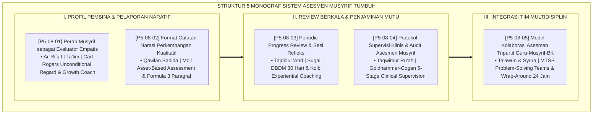

# P5-08: DOKUMEN INDUK SISTEM ASESMEN MUSYRIF DAN WALI KELAS
## *Arsitektur dan Rekayasa Metodologi Penilaian Pembina Asrama dan Dewan Pendidik (Musyrif Evaluator Empatis Form MEM, Format Catatan Narasi Rapor Kualitatif Form CNP, Periodic Progress Review Triwulan Form PPR, Supervisi Klinis Pengasuhan Form SKA, Serta Model Kolaborasi Asesmen Tripartit Guru-Musyrif-BK Form KAT) di Ekosistem TUMBUH Pesantren*

**Nomor Identifikasi**: `P5-08/DOKUMEN-INDUK-SISTEM-ASESMEN-MUSYRIF-WALI/2026`  
**Domain**: `05 Assessment Framework` > `08 Mentor Assessment` (Gugus Sub-Domain 08: *Comprehensive Boarding Mentor & Homeroom Teacher Assessment Systems*)  
**Klasifikasi Naskah**: *Master Architecture & Navigation Monograph* (Dokumen Induk Peta Jalan Riset & Navigasi 5 Monograf Ilmiah Sistem Asesmen Musyrif)  
**Rumpun Disiplin Pengkaji**: Desain Asesmen Pendidik Pesantren, Person-Centered Coaching (Rogers), Asset-Based Reporting (Moll), Clinical Supervision (Goldhammer), MTSS Tripartite Collaboration  

---

> ### 💡 INTISARI EKSEKUTIF (EXECUTIVE SUMMARY)
>
> * **Kedudukan Luhur Gugus Sistem Asesmen Musyrif dan Wali Kelas:**  
>   Gugus *Mentor Assessment (Sistem Asesmen Musyrif dan Wali Kelas)* merupakan pilar pengasuhan utama (*Primary Caregiving Pillar*) dalam ekosistem TUMBUH. Gugus ini merekonstruksi peran musyrif dari sekadar "polisi penjaga asrama" menjadi evaluator empatis dan growth coach (*Empathetic Evaluator & Growth Coach*), menyelaraskan bahasa narasi rapor agar membahagiakan orang tua, mengawal review berkala 30 hari, menyelenggarakan supervisi klinis, dan menyatukan tiga pilar pembinaan (Guru, Musyrif, dan BK) dalam satu kesatuan simfoni pengasuhan.
> * **Integrasi Holistik Turats & Konsensus Sains Pedagogi Kasih Sayang:**  
>   Gugus riset ini memadukan khazanah agung Islam tentang kelembutan pendidik (*Ar-Rifq fil Mu'allim*), perkataan benar yang menyentuh hati (*Qawlan Sadīdā*), pembaruan tekad berkala (*Tajdīdul 'Ahd*), pengawasan dan pendampingan pembina (*Taqwīmur Ru'āh*), dan tolong-menolong dalam musyawarah (*Ta'āwun 'alal Birr wasy Syūrā*) dengan konsensus sains pendidikan modern (*Rogers Person-Centered, Moll Asset-Based Narrative, Sugai DBDM, Goldhammer Clinical Supervision, dan MTSS Wrap-Around Collaboration*).
> * **Struktur Lengkap 5 Berkas Monograf Riset Ilmiah:**  
>   Dokumen induk ini memetakan dan menghubungkan 5 berkas monograf penelitian akademik komprehensif (~140 KB total riset) yang menyajikan lembar dialog coaching empatis, format narasi rapor 3 paragraf, lembar kerja PPR bulanan, rubrik audit supervisi klinis, dan berita acara sidang kasus tripartit.

---

## 📑 PETA NAVIGASI LIMA MONOGRAF RISET SISTEM ASESMEN MUSYRIF

Berikut adalah daftar lengkap 5 monograf riset akademik dalam gugus **`08 Mentor Assessment`**:

---

## 📚 DESKRIPSI RINGKAS 5 BERKAS MONOGRAF

1. **[P5-08-01: Peran Musyrif sebagai Evaluator Empatis](file:///c:/xampp/htdocs/tumbuh/05%20Assessment%20Framework/08%20Mentor%20Assessment/P5-08-01-Peran-Musyrif-sebagai-Evaluator-Empatis.md)**  
   *Membahas transformasi paradigma musyrif algojo menjadi evaluator empatis, doktrin Ar-Rifq fit Ta'lim, teori Carl Rogers, pemisahan perilaku dari kemuliaan fitrah, dan lembar catatan Form MEM-Musyrif.*
2. **[P5-08-02: Format Catatan Narasi Perkembangan Kualitatif](file:///c:/xampp/htdocs/tumbuh/05%20Assessment%20Framework/08%20Mentor%20Assessment/P5-08-02-Format-Catatan-Narasi-Perkembangan-Kualitatif.md)**  
   *Membahas standarisasi catatan narasi rapor bebas copy-paste, doktrin Qawlan Sadida, Asset-Based Pedagogies Luis Moll, formula 3 paragraf beradab (Kekuatan $\rightarrow$ Progres $\rightarrow$ Kolaborasi), dan form Form CNP-Kualitatif.*
3. **[P5-08-03: Periodic Progress Review dan Sesi Refleksi](file:///c:/xampp/htdocs/tumbuh/05%20Assessment%20Framework/08%20Mentor%20Assessment/P5-08-03-Periodic-Progress-Review-dan-Sesi-Refleksi.md)**  
   *Membahas siklus evaluasi formatif berkala setiap 30 hari, doktrin Tajdidul 'Ahd salaf, Data-Based Decision Making (DBDM) George Sugai, 4 langkah sesi PPR, dan lembar kerja Form PPR-Bulanan.*
4. **[P5-08-04: Protokol Supervisi Klinis dan Audit Asesmen Musyrif](file:///c:/xampp/htdocs/tumbuh/05%20Assessment%20Framework/08%20Mentor%20Assessment/P5-08-04-Protokol-Supervisi-Klinis-dan-Audit-Asesmen-Musyrif.md)**  
   *Membahas supervisi tatap muka kolegial kepala asrama senior kepada musyrif muda, doktrin Taqwimur Ru'ah, Clinical Supervision 5 tahap Goldhammer-Cogan, pencegahan burnout pembina, dan form Form SKA-Supervisi.*
5. **[P5-08-05: Model Kolaborasi Asesmen Tripartit Guru-Musyrif-BK](file:///c:/xampp/htdocs/tumbuh/05%20Assessment%20Framework/08%20Mentor%20Assessment/P5-08-05-Model-Kolaborasi-Asesmen-Tripartit-Guru-Musyrif-BK.md)**  
   *Membahas eliminasi silo pengasuhan melalui integrasi Guru Madrasah, Musyrif Asrama, dan Konselor BK, doktrin Ta'awun & Asy-Syura, MTSS Interdisciplinary Problem-Solving, Wrap-Around 24 jam, dan berita acara Form KAT-Tripartit.*

---

## 🎯 STANDAR PENJAMINAN MUTU SISTEM ASESMEN MUSYRIF

Penerapan gugus **Sistem Asesmen Musyrif dan Wali Kelas (Mentor Assessment)** menjamin bahwa:
1. **Pendidik Mengasuh dengan Hati dan Kelembutan Kasih Sayang (*Empathetic & Nurturing Mentors*)**: Menghilangkan kekerasan fisik dan verbal, menjadikan musyrif sebagai figur teladan yang dirindukan santri.
2. **Kemitraan Segitiga Emas Berjalan Harmonis (*Unified Holistic Ecosystem*)**: Madrasah, Asrama, dan BK bersatu padu mengawal setiap langkah pertumbuhan santri tanpa ada informasi yang terputus.
3. **Standarisasi Tata Kelola Pengasuhan Berkelas Dunia (*Excellence in Boarding Care Management*)**: Menjadikan ekosistem pesantren berbasis TUMBUH sebagai rujukan tata kelola pembinaan santri berasrama paling profesional dan beradab di dunia Islam.
