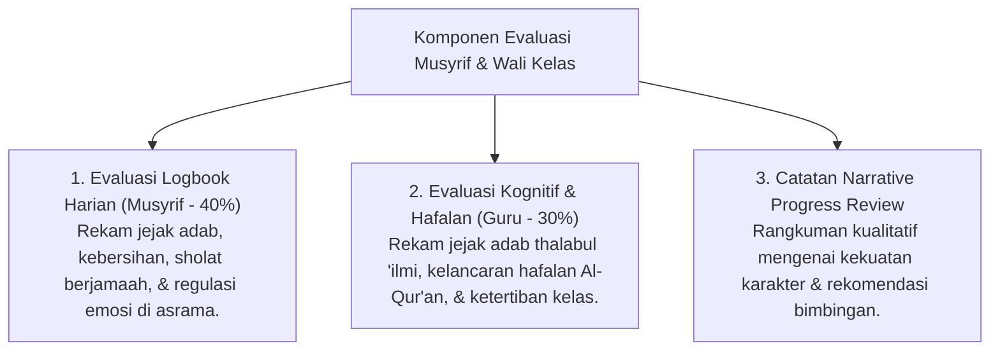

# P5-08: Sistem Asesmen Musyrif dan Wali Kelas (Mentor Evaluation)

## Status Dokumen
* **Status**: 🌟 **A+ (Tervalidasi & Siap Diimplementasikan)**
* **Sub-Domain**: `05 Assessment Framework / 08 Mentor Assessment`
* **Penanggung Jawab Keilmuan**: Dewan Keilmuan TUMBUH (*Pakar Pedagogi Master Guru & Pakar Bimbingan Konseling*)

---

## 1. Konseptualisasi Peran Mentor sebagai Evaluator Empatis

Musyrif Asrama dan Wali Kelas memegang peran sebagai **Evaluator Empatis & Pengasuh (In Loco Parentis)**. Penilaian mentor tidak hanya mencatat skor angka kuantitatif, tetapi wajib disertai **Catatan Perkembangan Kualitatif (Qualitative Progress Narrative)**.

---

## 2. Format Catatan Kualitatif Pembinaan (Qualitative Narrative Format)

Setiap akhir bulan, Musyrif dan Wali Kelas mengisi **3 Komponen Narasi Pembinaan**:
1. **Area Keunggulan Karakter (*Strengths & Virtues*)**: Mendeskripsikan karakter positif menonjol yang ditunjukkan santri.
2. **Area Tantangan & Kebutuhan Bimbingan (*Growth Opportunities*)**: Menjelaskan aspek adab/pelajaran yang butuh penguatan tanpa kalimat menghakimi.
3. **Rencana Dukungan Bersama (*Collaborative Action Plan*)**: Langkah konkret pendampingan musyrif dan orang tua pada bulan berikutnya.
