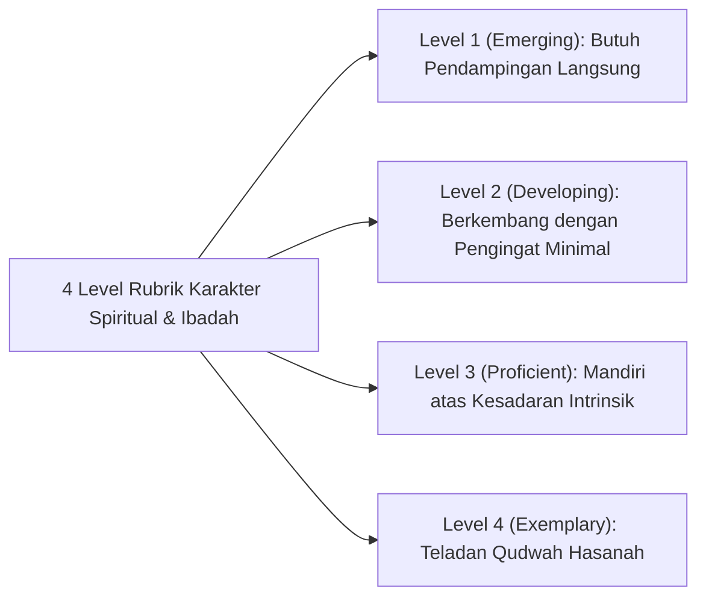

# P5-09-01: Rubrik Karakter Spiritual dan Ibadah (Salimul Aqidah, Shahihul Ibadah, Matinul Khuluq)

## Status Dokumen
* **Status**: 🌟 **A+ (Tervalidasi & Siap Diimplementasikan)**
* **Sub-Domain**: `05 Assessment Framework / 09 Rubrics`
* **Penanggung Jawab Keilmuan**: Dewan Keilmuan TUMBUH (*Pakar Epistemologi Turats & Pakar Desain Kurikulum Adab*)

---

## 1. Rubrik Perilaku 4-Level Karakter Spiritual & Ibadah

---

## 2. Matriks Rinci Indikator Teramati (Observable Behavioral Descriptors)

| Karakter | Level 1: Emerging | Level 2: Developing | Level 3: Proficient | Level 4: Exemplary (Qudwah) |
| :--- | :--- | :--- | :--- | :--- |
| **Salimul Aqidah** | Memerlukan penjelasan berulang tentang dasar akidah salimah; belum peka terhadap amalan syubhat. | Memahami pembatal iman; konsisten mengaitkan kejadian alam dengan kekuasaan Allah. | Menginternalisasi keyakinan tauhid dalam keputusan mandiri; tenang dalam cobaan. | Membentengi fikrah kawan dari paham menyimpang & teladan keteguhan akidah. |
| **Shahihul Ibadah** | Sholat berjamaah jika diawasi langsung; bacaan & gerakan dasar. | Sholat tepat waktu mandiri; gerakan & bacaan sholat sesuai sunnah. | Rutin ibadah sunnah (rawatib, duha, tahajjud) atas inisiatif pribadi. | Menjadi imam/muadzin & mengomandoi kekhusyukan jamaah masjid. |
| **Matinul Khuluq** | Menjauhi kata kasar jika ditegur; sopan pada ustadz saat diawasi. | Tertib beradab dalam pergaulan asrama tanpa dorongan eksternal. | Menerapkan empati sosial, sopan santun konsisten, & resolusi konflik damai. | Teladan adab mulia & penengah kedamaian restoratif bagi seluruh santri. |
