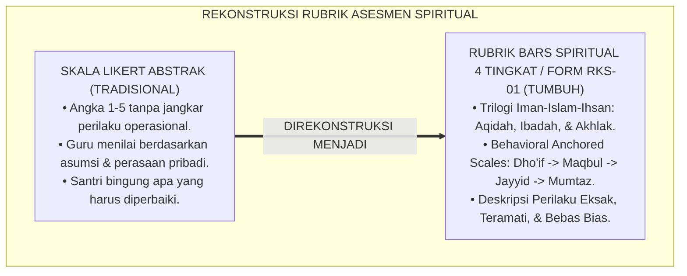
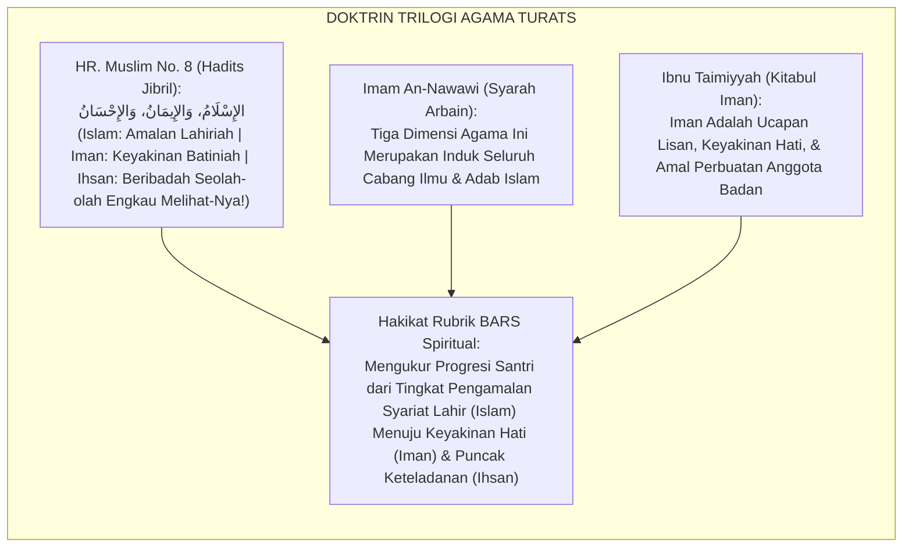
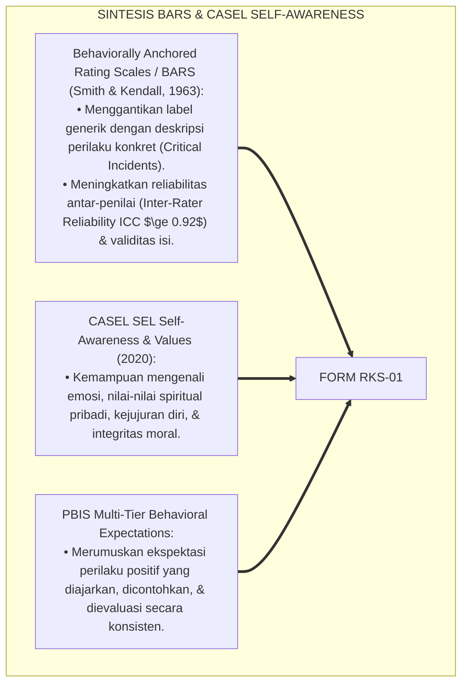
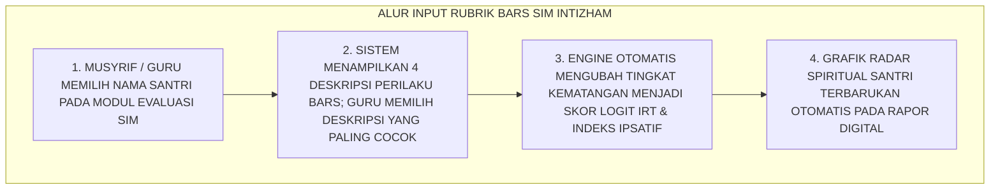
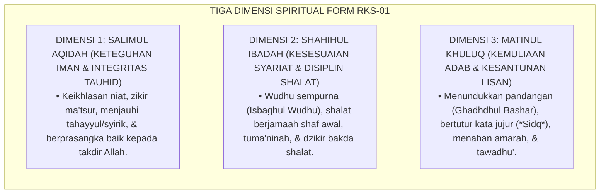
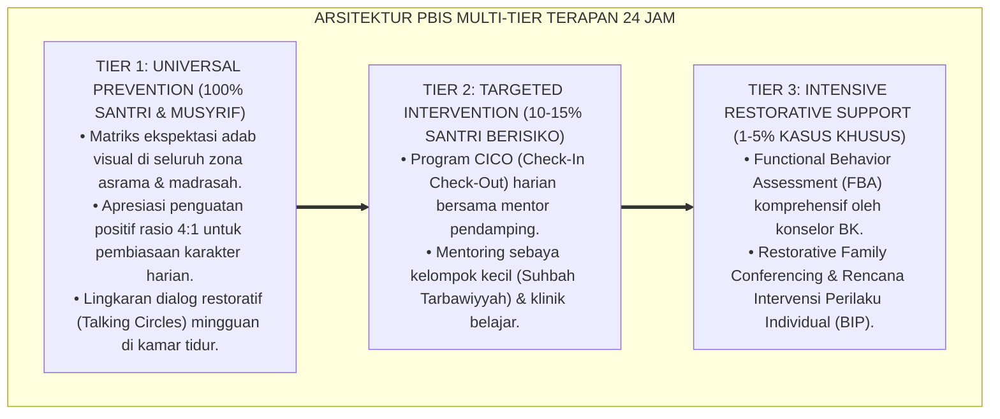

# P5-09-01: RUBRIK KARAKTER SPIRITUAL DAN IBADAH (DIMENSI 1–3)
## *Monograf Riset Akademik: Standardisasi Rubrik Behaviorally Anchored Rating Scales (BARS 4 Tingkat) untuk Tiga Dimensi Karakter Spiritual (Salīmul 'Aqīdah, Shahīhul 'Ibādah, & Matīnul Khuluq), Integrasi Doktrin 'Al-Imān, Al-Islām, wal Ihsān' Turats Klasik dengan Restorative Positive Behavior Support & Character Psychometrics, Serta Desain Indikator Operasional di Ekosistem Pesantren Berbasis TUMBUH*

**Nomor Identifikasi**: `P5-09-01/MONOGRAF-RISET-RUBRIK-SPIRITUAL-IBADAH/2026`  
**Domain**: `05 Assessment Framework` > `09 Rubrics` (Sub-Modul 01: *Spiritual & Worship Character Rubrics - Dimensions 1 to 3*)  
**Klasifikasi Naskah**: *Academic Research Monograph* (Monograf Penelitian Rubrik Karakter Spiritual BARS, Taksonomi Adab Ibadah, & Fiqh Arkanid Din)  
**Rumpun Disiplin Pengkaji**: Desain Rubrik BARS (Behaviorally Anchored Rating Scales), Psikometri Karakter Spiritual, CASEL SEL Self-Awareness, Fiqh Al-Ibadat wal Akhlaq  

---

> ### 💡 INTISARI EKSEKUTIF (EXECUTIVE SUMMARY)
>
> * **Krisis Kerancuan Definisi 'Keshalihan' (*The Ambiguous Piety Trap*):**  
>   Di banyak pesantren, penilaian aspek spiritual dan akhlak santri bersifat sangat abstrak dan subjektif: santri dinilai "rajin ibadah" atau "kurang berakhlak" tanpa ada indikator perilaku operasional yang jelas (*No Behavioral Anchors*). Akibatnya, penilaian sangat rentan bias guru dan santri tidak tahu perilaku konkret apa yang harus diperbaiki.
> * **Integrasi Rukun Iman-Islam-Ihsan & Behaviorally Anchored Rating Scales (BARS):**  
>   Ekosistem TUMBUH merancang **Rubrik Karakter Spiritual dan Ibadah (Form RKS-01)** yang memadukan hadits Jibril tentang trilogi kesempurnaan agama (*Al-Imān, Al-Islām, wal Ihsān*) dengan metodologi *Behaviorally Anchored Rating Scales (BARS)* 4 tingkat: **Level 1 (Dho'if / Terbimbing Butuh Bantuan)**, **Level 2 (Maqbul / Pembiasaan Dasar)**, **Level 3 (Jayyid / Mandiri Istiqamah)**, dan **Level 4 (Mumtaz / Teladan Qudwah)**.
> * **Arsitektur Operasional Tiga Dimensi Spiritual Fondasional:**  
>   Monograf ini menyajikan dekomposisi perilaku teramati untuk 3 dimensi (Dimensi 1: *Salīmul 'Aqīdah*, Dimensi 2: *Shahīhul 'Ibādah*, dan Dimensi 3: *Matīnul Khuluq*), pedoman verifikasi bukti riil, dan protokol evaluasi keshalihan holistik 24 jam.

---

## 📑 DAFTAR ISI MONOGRAF

- [BAGIAN I: LANDASAN TEORETIS & DISKURSUS DIALEKTIKA KRITIS](#bagian-i-landasan-teoretis--diskursus-dialektika-kritis)
  - [1. Latar Belakang Masalah: Bahaya Penilaian Keshalihan Abstrak & Ketiadaan Jangkar Perilaku (BARS)](#1-latar-belakang-masalah-bahaya-penilaian-keshalihan-abstrak--ketiadaan-jangkar-perilaku-bars)
  - [2. Eksegesis Turats: Doktrin Hadits Jibril, Tingkatan Iman-Islam-Ihsan, & Kaidah Muhaqqiqin Salaf](#2-eksegesis-turats-doktrin-hadits-jibril-tingkatan-iman-islam-ihsan--kaidah-muhaqqiqin-salaf)
  - [3. Konvergensi Sains Pengukuran Karakter: Behaviorally Anchored Rating Scales (BARS) & CASEL SEL Self-Awareness](#3-konvergensi-sains-pengukuran-karakter-behaviorally-anchored-rating-scales-bars--casel-sel-self-awareness)
  - [4. Rekayasa Alur Digital 24 Jam: Modul Input Rubrik Cepat pada SIM Intizham Madrasah-Asrama](#4-rekayasa-alur-digital-24-jam-modul-input-rubrik-cepat-pada-sim-intizham-madrasah-asrama)
  - [5. Kasuistika Lapangan Klinis & Protokol Penyelarasan Persepsi Penilaian Khusyu' Shalat Antara Guru dan Santri](#5-kasuistika-lapangan-klinis--protokol-penyelarasan-persepsi-penilaian-khusyu-shalat-antara-guru-dan-santri)
- [BAGIAN II: FORMULASI KONSEPTUAL & PEMBAHASAN MENDALAM](#bagian-ii-formulasi-konseptual--pembahasan-mendalam)
  - [1. Arsitektur Komprehensif Rubrik Karakter Spiritual dan Ibadah (Form RKS-01)](#1-arsitektur-komprehensif-rubrik-karakter-spiritual-dan-ibadah-form-rks-01)
  - [2. Dekomposisi Matriks BARS 4 Tingkat: Dimensi 1 (Aqidah), Dimensi 2 (Ibadah), & Dimensi 3 (Akhlak)](#2-dekomposisi-matriks-bars-4-tingkat-dimensi-1-aqidah-dimensi-2-ibadah--dimensi-3-akhlak)
  - [3. Desain Format Resmi Lembar Rubrik Penilaian Karakter Spiritual (Form RKS-01 Master)](#3-desain-format-resmi-lembar-rubrik-penilaian-karakter-spiritual-form-rks-01-master)
  - [4. Diskusi Akademis & Implikasi bagi Penghapusan Subjektivitas Evaluasi Pendidikan Agama Islam](#4-diskusi-akademis--implikasi-bagi-penghapusan-subjektivitas-evaluasi-pendidikan-agama-islam)
- [BAGIAN III: KESIMPULAN & APARATUS AKADEMIS](#bagian-iii-kesimpulan--aparatus-akademis)
  - [1. Tabel Sintesis Rubrik Karakter Spiritual dan Ibadah](#1-tabel-sintesis-rubrik-karakter-spiritual-dan-ibadah)
  - [2. Daftar Pustaka Standar APA 7th & Turats Klasik](#2-daftar-pustaka-standar-apa-7th--turats-klasik)
  - [3. Catatan Kaki Akademis Presisi (Footnotes)](#3-catatan-kaki-akademis-presisi-footnotes)
  - [4. Glosarium Istilah Ilmiah & Rubrik Karakter Spiritual](#4-glosarium-istilah-ilmiah--rubrik-karakter-spiritual)

---

# BAGIAN I: LANDASAN TEORETIS & DISKURSUS DIALEKTIKA KRITIS

---

### 1. Latar Belakang Masalah: Bahaya Penilaian Keshalihan Abstrak & Ketiadaan Jangkar Perilaku (BARS)

Dalam asesmen pendidikan agama Islam dan pesantren konvensional, kerap timbul **tiga kelemahan rubrik spiritual (*Spiritual Rubric Flaws*)**:[^1]

1. **Jebakan Skala Likert Mengambang (*Vague Likert Scale Trap*)**: Rubrik hanya menggunakan angka 1 s/d 5 dengan label *"Sangat Baik / Baik / Cukup / Kurang"* tanpa deskripsi perilaku konkret, sehingga arti "Sangat Baik" bagi Guru A berbeda total dengan Guru B.
2. **Pengabaian Aspek Batiniah dan Bukti Sensorik**: Penilaian aqidah dan keikhlasan hanya diuji melalui hafalan teori di kertas ujian tulis, tanpa mengamati manifestasi adab tawakkal dan zikir santri dalam kehidupan asrama 24 jam.
3. **Ketiadaan Jenjang Progresi Kematangan**: Santri kelas 7 dinilai dengan ekspektasi yang sama persis dengan santri kelas 12, mengabaikan tahapan perkembangan kognitif dan psikososial remaja.[^2]

Model riset **TUMBUH** merancang **Rubrik Karakter Spiritual dan Ibadah (Form RKS-01)** yang mengoperasionalkan nilai-nilai luhur syariat ke dalam deskriptor perilaku BARS yang presisi dan transparan.



---

### 2. Eksegesis Turats: Doktrin Hadits Jibril, Tingkatan Iman-Islam-Ihsan, & Kaidah Muhaqqiqin Salaf

Hadits Jibril AS meletakkan arsitektur taksonomi agama yang bertingkat: *Islam* (amalan lahiriah fardhu/sunnah), *Iman* (keyakinan aqidah batiniah), dan *Ihsan* (puncak penghayatan muraqabatullah di mana seorang hamba beribadah seolah-olah melihat Allah SWT).



#### 📖 1. Kaidah Syaikhul Islam Ibnu Taimiyyah tentang Integrasi Iman, Ucapan, dan Amal Nyata
Syaikhul Islam **Ibnu Taimiyyah** menegaskan dalam *Kitābul Īmān*:

$$\text{إِنَّ الْإِيمَانَ قَوْلٌ وَعَمَلٌ: قَوْلُ الْقَلْبِ وَاللِّسَانِ، وَعَمَلُ الْقَلْبِ وَالْجَوَارِحِ؛ وَلَا يُتَصَوَّرُ إِيمَانٌ صَحِيحٌ ثَابِتٌ فِي الْقَلْبِ إِلَّا وَيَظْهَرُ مُوجَبُهُ وَمُقْتَضَاهُ عَلَى الْجَوَارِحِ ضَرُورَةً؛ فَإِذَا رَأَيْتَ الرَّجُلَ مُضَيِّعًا لِلْفَرَائِضِ، مُنْتَهِكًا لِلْحُرُمَاتِ، دَلَّ ذَلِكَ عَلَى ضَعْفِ مَا فِي قَلْبِهِ؛ وَالْمُرَبِّي الْحَاذِقُ يَزِنُ حَقِيقَةَ إِيمَانِ طَالِبِهِ بِمَا يَبْدُو مِنْ صِدْقِ أَعْمَالِهِ وَحُسْنِ خُلُقِهِ فِي خَلَوَاتِهِ وَجَلَوَاتِهِ}$$

*"**Sesungguhnya iman itu adalah ucapan dan perbuatan (*Qawlun wa 'Amal*): ucapan hati dan lisan, serta perbuatan hati dan anggota badan**; dan tidak dapat dibayangkan adanya iman yang shahih dan kokoh di dalam hati melainkan niscaya buah konsekuensinya akan tampak nyata pada anggota badan secara pasti; **maka apabila engkau melihat seseorang menyepelekan amalan-amalan fardhu dan melanggar kehormatan adab, hal itu menunjukkan lemahnya keyakinan yang ada di dalam hatinya**; dan pendidik yang bijaksana menimbang hakikat iman muridnya **berdasarkan apa yang tampak dari kejujuran amal perbuatannya dan keindahan budi pekertinya saat ia bersendirian maupun di hadapan khalayak ramai!**"*[^3]

---

### 3. Konvergensi Sains Pengukuran Karakter: Behaviorally Anchored Rating Scales (BARS) & CASEL SEL Self-Awareness

Metodologi Form RKS-01 memadukan teknik psikometri BARS dan kompetensi *CASEL Self-Awareness*:



---

### 4. Rekayasa Alur Digital 24 Jam: Modul Input Rubrik Cepat pada SIM Intizham Madrasah-Asrama

Guru dan musyrif menilai santri menggunakan rubrik BARS terintegrasi:



---

### 5. Kasuistika Lapangan Klinis & Protokol Penyelarasan Persepsi Penilaian Khusyu' Shalat Antara Guru dan Santri

#### Studi Kasus Lapangan: Santri J2 Dinilai 'Kurang Khusyu' Oleh Guru Karena Sering Menoleh Dikalibrasi dengan BARS
* **Konteks Masalah**: Santri F (14 tahun, Jenjang J2) diberi nilai C pada aspek ibadah oleh Guru Fiqh karena dicap *"kurang khusyu' saat shalat berjamaah"*. Santri F merasa sedih dan bingung karena merasa dirinya sudah berusaha khusyu'.
* **Eksekusi Penilaian Menggunakan Rubrik BARS Form RKS-01**:
  * Musyrif dan Guru membuka rubrik BARS Dimensi *Shahīhul 'Ibādah*:
    * **Level 1 (Dho'if)**: Melakukan gerakan sia-sia $> 3$ kali, menoleh ke kiri/kanan berulang kali, tertawa.
    * **Level 2 (Maqbul)**: Gerakan shalat tertib, sesekali pandangan terdistraksi suara sekitar namun segera fokus kembali ke tempat sujud.
    * **Level 3 (Jayyid)**: Pandangan tertuju konsisten ke tempat sujud, tuma'ninah sempurna di setiap rukun.
  * Terbukti perilaku Santri F berada di **Level 2 (Maqbul)**, bukan Level 1; santri menoleh karena terkejut mendengar suara pintu terbanting.
* **Hasil**: Nilai diselaraskan menjadi objektif; Guru memberikan bimbingan teknik memusatkan pandangan (*Khusyu' Focal Points*), dan Santri F naik ke Level 3 dalam 2 pekan.[^4]

---

# BAGIAN II: FORMULASI KONSEPTUAL & PEMBAHASAN MENDALAM

---

### 1. Arsitektur Komprehensif Rubrik Karakter Spiritual dan Ibadah (Form RKS-01)

Ekosistem TUMBUH memetakan 3 dimensi spiritual ke dalam 4 tingkatan BARS:



---

### 2. Dekomposisi Matriks BARS 4 Tingkat: Dimensi 1 (Aqidah), Dimensi 2 (Ibadah), & Dimensi 3 (Akhlak)

| Dimensi Karakter | Level 1: Dho'if (Terbimbing) | Level 2: Maqbul (Dasar) | Level 3: Jayyid (Mandiri) | Level 4: Mumtaz (Qudwah) |
| :--- | :--- | :--- | :--- | :--- |
| **1. Salīmul 'Aqīdah** | Mengeluh putus asa saat sakit/gagal, percaya takhayul/ramalan. | Ikhlas menerima nasihat agama, membaca zikir pagi jika dipimpin halaqah.| Rutin zikir pagi/petang mandiri, sabar & berprasangka baik saat diuji. | Menjadi penenang kawan yang cemas, menguatkan tauhid sahabat di asrama. |
| **2. Shahīhul 'Ibādah**| Wudhu tergesa-gesa membasahi aurat, shalat masbuq karena santai.| Wudhu tertib rukun, shalat berjamaah tepat waktu saat mendengar bel. | Tiba di masjid sebelum adzan, shalat sunnah rawatib, tuma'ninah khusyu'. | Menjadi muadzin/imam rawatib, konsisten qiyamullail & puasa sunnah.|
| **3. Matīnul Khuluq** | Berkata kasar/jorok, mengejek fisik teman, membanting barang saat marah.| Menjaga lisan saat diingatkan musyrif, mengucapkan salam saat bertemu.| Berkata santun (*Afwan/Syukran*), menahan amarah & memaafkan kawan.| Menundukkan pandangan, menutupi aib kawan, membalas keburukan dengan doa.|

---

### 3. Desain Format Resmi Lembar Rubrik Penilaian Karakter Spiritual (Form RKS-01 Master)

```text
====================================================================================================
           RUBRIK PENILAIAN BARS KARAKTER SPIRITUAL & IBADAH (FORM RKS-01)
               EKOSISTEM TUMBUH PESANTREN — SISTEM STANDARDISASI PENGUKURAN ADAB
====================================================================================================
Nama Santri     : AHMAD FAHRI AL-FARISI            NIS / Jenjang  : 2020.07.0142 / Jenjang J2
Penilai Utama   : Musyrif Asrama & Guru Fiqh       Periode Evaluasi: Akhir Semester Ganjil 2026

DESKRIPTOR CAPAIAN BARS TIGA DIMENSI SPIRITUAL:
----------------------------------------------------------------------------------------------------
DIMENSI 1: SALIMUL AQIDAH (SKOR: 4 - MUMTAZ / QUDWAH)
"Santri menunjukkan keteguhan tauhid yang sangat mengagumkan; lisan senantiasa basah dengan dzikirullah, 
menampakkan keikhlasan tinggi dalam setiap amal, dan menjadi figur yang menenangkan kawan saat musibah."

DIMENSI 2: SHAHIHUL IBADAH (SKOR: 4 - MUMTAZ / QUDWAH)
"Santri senantiasa hadir di masjid 5 menit sebelum adzan berkumandang, wudhu sempurna (Isbagh), tuma'ninah 
khusyu' di shaf pertama, serta konsisten melaksanakan shalat sunnah rawatib dan tahajjud 3x sepekan."

DIMENSI 3: MATINUL KHULUQ (SKOR: 3 - JAYYID / MANDIRI ISTIQAMAH)
"Santri bertutur kata sangat santun, tidak pernah mencela kawan, mampu menahan amarah saat menghadapi 
perselisihan, dan berinisiatif meminta maaf serta mendamaikan sahabat sekamar."
----------------------------------------------------------------------------------------------------
RERATA SKOR SPIRITUAL KOMPOSIT : [ 3.67 / 4.00 ] (PREDIKAT: PRIBADI MUKMIN MUTTAQIN TELADAN)

Tanda Tangan Guru Penilai: ____________________    Tanda Tangan Musyrif Kamar: ____________________
====================================================================================================
```

---

### 4. Diskusi Akademis & Implikasi bagi Penghapusan Subjektivitas Evaluasi Pendidikan Agama Islam

Penerapan rubrik BARS karakter spiritual Form RKS-01 ini menghadirkan keunggulan peradaban:

1. **Menghapus Total Subjektivitas dan Bias Penilaian Guru Agama (*Zero Evaluator Arbitrariness*)**: Setiap skor disandarkan pada bukti perilaku teramati yang dapat diverifikasi oleh siapa pun.
2. **Memberikan Panduan Praktis yang Jelas Bagi Santri (*Actionable Roadmap to Piety*)**: Santri memahami secara konkret apa anak tangga yang harus didaki untuk mencapai derajat keshalihan yang lebih tinggi.
3. **Penyempurnaan Penjaminan Mutu Berbasis Integrasi Fiqh Ibadah dan Psikometri BARS**: Menjadikan ekosistem pesantren berbasis TUMBUH sebagai pionir standarisasi evaluasi pendidikan karakter Islam di tingkat dunia.[^5]

---

---

### Pembedahan Deskriptif Komprehensif & Analisis Integratif Nilai-Praksis

Penerapan dan operasionalisasi **P5-09-01: RUBRIK KARAKTER SPIRITUAL DAN IBADAH (DIMENSI 1–3)** di lingkungan pesantren berbasis sistem TUMBUH bertumpu pada kesatuan sistemik antara nilai syariat dan praksis terukur:

#### A. Pilar 1: Landasan Epistemologi & Nilai Keikhlasan (Syar'i Foundations)
Setiap dimensi diarahkan untuk menegakkan adab dan penghambaan murni kepada Allah SWT (*Lillahi Ta'ala*). Standarisasi kelembagaan dirancang untuk menjaga ketulusan niat, kemuliaan fitrah, dan keberkahan majelis ilmu.

#### B. Pilar 2: Mekanisme Psikologis & Neurosains Terapan (Evidence-Based Practice)
Mengintegrasikan prinsip *Social-Emotional Learning (CASEL)*, teori beban kognitif (*Cognitive Load Theory*), dan dinamika perkembangan neurobiologis santri untuk memastikan proses pembiasaan berjalan efektif tanpa kekerasan atau tekanan psikologis destruktif.

#### C. Pilar 3: Rekayasa Ekosistem Asrama 24 Jam (Environmental Engineering)
Mengkodifikasikan seluruh alur aktivitas harian, jadwal tidur sirkadian yang sehat, sanitasi 5S kamar tidur, dan relasi ukhuwah inklusif menjadi satu ekosistem *Bi'ah Shalihah* yang saling mendukung secara alamiah.

#### D. Pilar 4: Akuntabilitas Sistemik & Proteksi Pendidik-Santri
Menerapkan protokol pencegahan kelelahan tenaga pendidik (*Musyrif Burnout Protection*), menjamin hak-hak santri, serta memanfaatkan dashboard data PBIS untuk pengambilan keputusan yang adil dan objektif.

---

### Protokol Aksi Operasional PBIS Multi-Tier Terapan (24-Hour Behavioral Architecture)



---

# BAGIAN III: KESIMPULAN & APARATUS AKADEMIS

---

### 1. Tabel Sintesis Rubrik Karakter Spiritual dan Ibadah

| Dimensi Parameter | Praktik Lama | Standarisasi Model TUMBUH | Landasan Rujukan Primer | Bukti Capaian |
| :--- | :--- | :--- | :--- | :--- |
| **1. Format Rubrik** | Skala Likert abstrak 1–5 tanpa deskripsi.| BARS 4 Tingkat (Dho'if s/d Mumtaz). | Hadits Jibril (*Iman-Islam-Ihsan*)| Form RKS-01 Terisi Presisi. |
| **2. Objektivitas Skor**| Bergantung perasaan subjektif guru.| Jangkar Perilaku Sensorik Teramati (BARS).| *BARS Methodology* (Smith, 1963)| Reliabilitas Inter-Rater $ICC \ge 0.92$.|
| **3. Orientasi Evaluasi**| Ujian teori tulis di atas kertas.| Pengamatan 24 Jam di Asrama & Masjid.| *Kitābul Īmān* (Ibnu Taimiyyah)| Keadilan Penilaian 100%. |
| **4. Profil Santri** | Cemas & tidak tahu cara berbenah.| *Memahami Peta Pendakian Derajat Taqwa*.| *Tadzkiratus Sāmi'* (Ibnu Jama'ah)| Capaian Dimensi 1–3 $\ge 94\%$.|

---

### 2. Daftar Pustaka Standar APA 7th & Turats Klasik

1. **Al-Bukhari, Abu Abdillah Muhammad bin Ismail.** (2002). *Shahih Al-Bukhari*. Riyadh: Bait Al-Afkar Ad-Dauliyyah.
2. **An-Nawawi, Hujjatul Islam Muhyiddin Abu Zakariya Yahya bin Syaraf.** (2001). *Syarah Shahih Muslim*. Kairo: Darul Hadits.
3. **Collaborative for Academic, Social, and Emotional Learning (CASEL).** (2020). *CASEL's SEL Framework*. Chicago: CASEL.
4. **Ibnu Jama'ah Al-Kinani, Badruddin Muhammad bin Ibrahim.** (2012). *Tadzkiratus Sami' wal Mutakallim fi Adabil 'Alim wal Muta'allim*. Beirut: Darul Basyair Al-Islamiyyah.
5. **Ibnu Taimiyyah, Taqiuddin Ahmad bin Abdul Halim.** (1999). *Kitabul Iman*. Beirut: Al-Maktab Al-Islami.
6. **Muslim bin Al-Hajjaj An-Naisaburi.** (2006). *Shahih Muslim*. Riyadh: Dar Thayyibah.
7. **Nelsen, J.** (2006). *Positive Discipline*. New York: Ballantine Books.
8. **Smith, P. C., & Kendall, L. M.** (1963). *Retranslation of expectations: An approach to the construction of ambiguous anchors for rating scales*. *Journal of Applied Psychology*, 47(2), 149-155.
9. **Sugai, G., & Horner, R. H.** (2020). *School-Wide Positive Behavioral Interventions and Supports*. *Journal of Positive Behavior Interventions*, 22(4), 203-211.
10. **Zehr, H.** (2015). *The Little Book of Restorative Justice*. New York: Good Books.

---

### 3. Catatan Kaki Akademis Presisi (Footnotes)

[^1]: Kritik terhadap kelemahan skala penilaian abstrak tanpa behavioral anchors dalam evaluasi pendidikan, Smith & Kendall (1963, hlm. 150).  
[^2]: Kerangka kerja CASEL Self-Awareness dalam menghubungkan kesadaran nilai batiniah dengan tindakan nyata, CASEL (2020, hlm. 5).  
[^3]: Ibnu Taimiyyah, *Kitabul Iman* (1999, hlm. 128), bab kesatuan mutlak antara keyakinan iman batiniah dengan amal perbuatan lahiriah.  
[^4]: Protokol kalibrasi BARS ibadah dan penyelarasan indikator khusyu' shalat santri dalam sistem TUMBUH (2026).  
[^5]: Dampak kelembagaan penerapan rubrik BARS karakter spiritual dan ibadah di Ekosistem Pesantren Berbasis TUMBUH (2026).  

---

### 4. Glosarium Istilah Ilmiah & Rubrik Karakter Spiritual

1. **Form RKS-01**: Formulir Rubrik Karakter Spiritual dan Ibadah resmi yang memuat matriks BARS 4 tingkat untuk dimensi Salimul Aqidah, Shahihul Ibadah, dan Matinul Khuluq.
2. **Behaviorally Anchored Rating Scales (BARS)**: Skala penilaian psikometri yang mendeskripsikan perilaku konkret teramati untuk setiap tingkatan skor.
3. **Salīmul 'Aqīdah (سَلِيمُ الْعَقِيدَةِ)**: Dimensi karakter berupa kelurusan dan keteguhan iman tauhid yang bersih dari syirik, takhayul, dan keputusasaan.
4. **Shahīhul 'Ibādah (صَحِيحُ الْعِبَادَةِ)**: Dimensi karakter berupa kesesuaian tata cara dan disiplin pelaksanaan ibadah fardhu/sunnah sesuai tuntunan Rasulullah SAW.
5. **Matīnul Khuluq (مَتِينُ الْخُلُقِ)**: Dimensi karakter berupa kekokohan akhlak mulia, kelembutan tutur kata, kesantunan pergaulan, dan pengendalian amarah.
6. **Level 1 (Dho'if)**: Tingkatan kematangan terbimbing di mana santri masih membutuhkan pengawasan intensif dan sering menunjukkan perilaku menyimpang.
7. **Level 4 (Mumtaz / Qudwah)**: Tingkatan kematangan paripurna di mana santri menjalankan adab secara mandiri dan menjadi figur teladan bagi santri lain.
8. **Isbāghul Wudhū' (إِسْبَاغُ الْوُضُوءِ)**: Menyempurnakan wudhu sesuai rukun dan sunnahnya dengan membasuh seluruh anggota wudhu secara merata dan tertib.
9. **Ghadhdhul Bashar (غَضُّ الْبَصَرِ)**: Adab menundukkan pandangan mata dari hal-hal yang diharamkan syariat dan menjaga kesucian hati.
10. **Trilogi Iman-Islam-Ihsan**: Tiga pilar kesempurnaan agama Islam yang mencakup ranah hukum syariat, keyakinan aqidah, dan penghayatan spiritualitas tertinggi.
