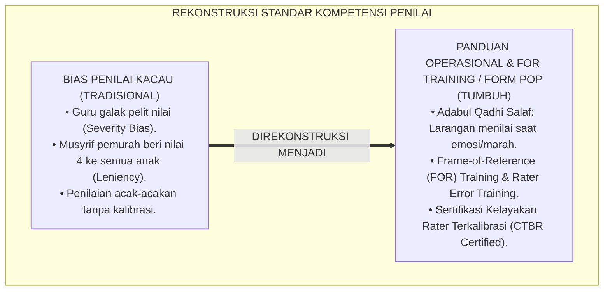
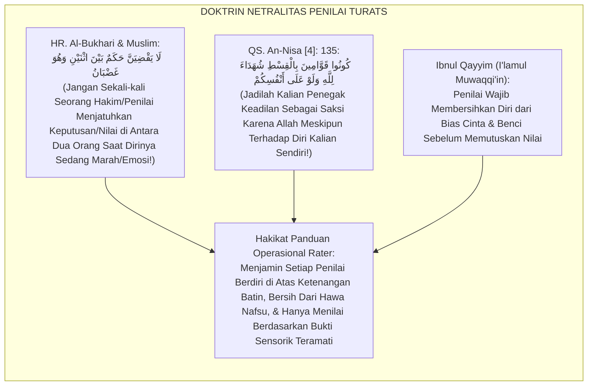
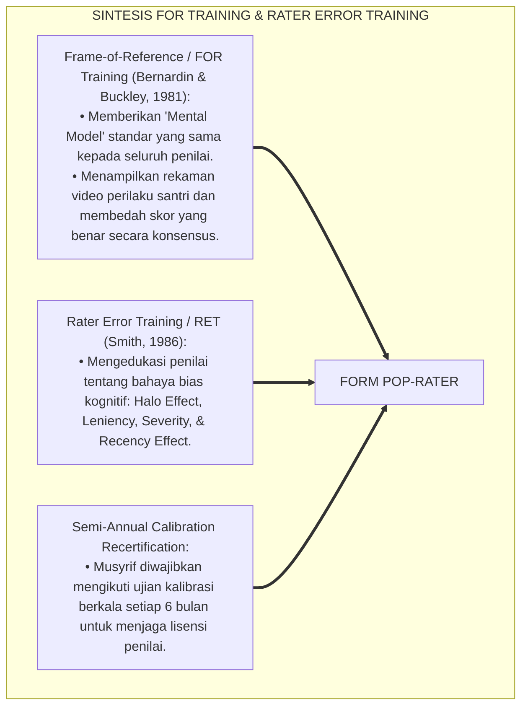
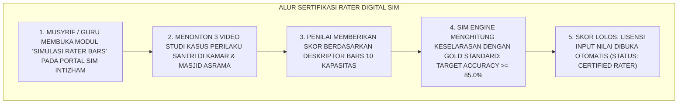
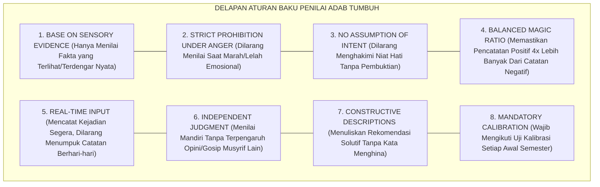
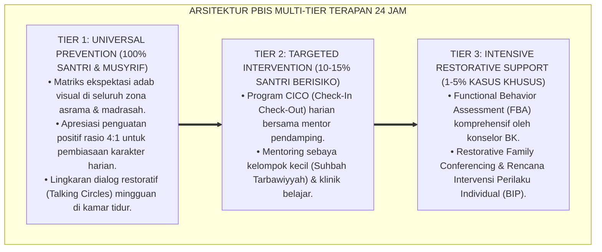

# P5-09-06: PANDUAN OPERASIONAL PENILAI RUBRIK ASRAMA (USER MANUAL RATER)
## *Monograf Riset Akademik: Pedoman Teknis Operasional Penilai Rubrik Pembina Asrama dan Dewan Asatidz (Operational Guide & Frame-of-Reference Training for Raters / Form POP-Rater), Integrasi Doktrin 'Adābul Mu'allim fil Qadhā' wal Hikmah' Turats Klasik dengan Frame-of-Reference (FOR) Training, Rater Error Training (RET), & Mitigasi Bias Evaluator, Serta Standar Sertifikasi Rater di Pesantren TUMBUH*

**Nomor Identifikasi**: `P5-09-06/MONOGRAF-RISET-PANDUAN-OPERASIONAL-PENILAI-RUBRIK/2026`  
**Domain**: `05 Assessment Framework` > `09 Rubrics` (Sub-Modul 06: *Operational Guide & Frame-of-Reference Manual for Raters*)  
**Klasifikasi Naskah**: *Academic Research Monograph* (Monograf Penelitian Panduan Operasional Penilai Rubrik, Frame-of-Reference Training FOR, & Fiqh Adabil Mu'allim fil Qadha')  
**Rumpun Disiplin Pengkaji**: Desain Pelatihan Penilai (Rater Training), Frame-of-Reference (FOR) Methodology, Mitigasi Bias Penilaian, Fiqh Al-Qadha' wal Hisbah  

---

> ### 💡 INTISARI EKSEKUTIF (EXECUTIVE SUMMARY)
>
> * **Krisis 'Pemberian Skor Tanpa Standar Pemahaman' (*The Unaligned Rater Crisis*):**  
>   Meskipun rubrik BARS sudah dirancang sangat bagus, jika guru dan musyrif yang memakainya tidak dibekali panduan operasional (*User Manual*) dan pelatihan penyelarasan persepsi (*Calibration Training*), hasil penilaian tetap akan berantakan. Guru yang murah hati (*Leniency Bias*) akan memberikan skor 4 kepada semua anak, sedangkan guru yang perfeksionis galak (*Severity Bias*) akan memberikan skor 1 kepada hampir semua santri.
> * **Integrasi Adab Penilai Salaf & Frame-of-Reference (FOR) Training:**  
>   Ekosistem TUMBUH merancang **Panduan Operasional Penilai Rubrik Asrama (Form POP-Rater)** yang memadukan adab para hakim dan pendidik salaf dalam menimbang perkara secara adil (*Lā Yaqdhiya Qādhin wahuwa Ghadhbān*) dengan metodologi *Frame-of-Reference (FOR) Training* Bernardin & Buckley serta *Rater Error Training (RET)*. Seluruh guru dan musyrif wajib mengikuti pelatihan FOR 6 jam dan lulus simulasi penilaian video sebelum diizinkan menginput skor rapor.
> * **Arsitektur Standarisasi Sertifikasi Rater BARS:**  
>   Monograf ini menyajikan 8 aturan baku penilai adab, panduan navigasi tombol rubrik pada aplikasi mobile SIM Intizham, protokol kalibrasi skor per semester, dan standar sertifikasi *Certified TUMBUH Behavioral Rater (CTBR)*.

---

## 📑 DAFTAR ISI MONOGRAF

- [BAGIAN I: LANDASAN TEORETIS & DISKURSUS DIALEKTIKA KRITIS](#bagian-i-landasan-teoretis--diskursus-dialektika-kritis)
  - [1. Latar Belakang Masalah: Bahaya Efek Kemurahan Hati (Leniency) & Kekejaman (Severity) Penilai](#1-latar-belakang-masalah-bahaya-efek-kemurahan-hati-leniency--kekejaman-severity-penilai)
  - [2. Eksegesis Turats: Doktrin Adabul Qadhi, Tahrimul Hawa, & Keharusan Netralitas Penilai Salaf](#2-eksegesis-turats-doktrin-adabul-qadhi-tahrimul-hawa--keharusan-netralitas-penilai-salaf)
  - [3. Konvergensi Sains Pelatihan Penilai: Frame-of-Reference (FOR) Training & Rater Error Training (RET)](#3-konvergensi-sains-pelatihan-penilai-frame-of-reference-for-training--rater-error-training-ret)
  - [4. Rekayasa Alur Digital 24 Jam: Modul Uji Simulasi Mandiri Rater pada SIM Intizham Portal Guru](#4-rekayasa-alur-digital-24-jam-modul-uji-simulasi-mandiri-rater-pada-sim-intizham-portal-guru)
  - [5. Kasuistika Lapangan Klinis & Protokol Penyelarasan Musyrif Baru yang Terlalu Galak Menjadi Penilai Objektif](#5-kasuistika-lapangan-klinis--protokol-penyelarasan-musyrif-baru-yang-terlalu-galak-menjadi-penilai-objektif)
- [BAGIAN II: FORMULASI KONSEPTUAL & PEMBAHASAN MENDALAM](#bagian-ii-formulasi-konseptual--pembahasan-mendalam)
  - [1. Arsitektur Komprehensif Panduan Operasional Penilai Rubrik TUMBUH](#1-arsitektur-komprehensif-panduan-operasional-penilai-rubrik-tumbuh)
  - [2. Dekomposisi 8 Aturan Baku Penilai Adab: Objektivitas Bukti, Bebas Emosi, Larangan Menilai Saat Marah, hingga Audit Berkala](#2-dekomposisi-8-aturan-baku-penilai-adab-objektivitas-bukti-bebas-emosi-larangan-menilai-saat-marah-hingga-audit-berkala)
  - [3. Desain Format Resmi Lembar Sertifikasi Kelayakan Penilai (Form POP-Rater)](#3-desain-format-resmi-lembar-sertifikasi-kelayakan-penilai-form-pop-rater)
  - [4. Diskusi Akademis & Implikasi bagi Terwujudnya Sistem Evaluasi Karakter yang Terpercaya dan Berwibawa](#4-diskusi-akademis--implikasi-bagi-terwujudnya-sistem-evaluasi-karakter-yang-terpercaya-dan-berwibawa)
- [BAGIAN III: KESIMPULAN & APARATUS AKADEMIS](#bagian-iii-kesimpulan--aparatus-akademis)
  - [1. Tabel Sintesis Panduan Operasional Penilai Rubrik Asrama](#1-tabel-sintesis-panduan-operasional-penilai-rubrik-asrama)
  - [2. Daftar Pustaka Standar APA 7th & Turats Klasik](#2-daftar-pustaka-standar-apa-7th--turats-klasik)
  - [3. Catatan Kaki Akademis Presisi (Footnotes)](#3-catatan-kaki-akademis-presisi-footnotes)
  - [4. Glosarium Istilah Ilmiah & Panduan Operasional Penilai](#4-glosarium-istilah-ilmiah--panduan-operasional-penilai)

---

# BAGIAN I: LANDASAN TEORETIS & DISKURSUS DIALEKTIKA KRITIS

---

### 1. Latar Belakang Masalah: Bahaya Efek Kemurahan Hati (Leniency) & Kekejaman (Severity) Penilai

Dalam praksis asesmen asrama pesantren, kerap ditemukan **tiga bias penilai (*Rater Cognitive Biases*)**:[^1]

1. **Jebakan Kemurahan Hati Berlebih (*Leniency Bias / 'Asal Anak Senang'*)**: Musyrif memberi skor 4 (Mumtaz) kepada seluruh santri binaannya karena merasa kasihan atau tidak ingin disalahkan jika ada santri yang nilainya rendah.
2. **Jebakan Kekejaman Perfeksionis (*Severity Bias / 'Pemberi Nilai Pelit'*)**: Guru senior berpendapat bahwa *"tidak ada santri yang berhak dapat nilai 4 kecuali Nabi"*, sehingga memberi nilai maksimal 2 (Maqbul) kepada santri terbaik sekalipun.
3. **Jebakan Tendensi Sentral (*Central Tendency Bias*)**: Musyrif memilih zona aman dengan memberi nilai 3 (Jayyid) kepada seluruh santri tanpa memeriksa catatan faktual di lapangan (*Zero Differentiation*).[^2]

Model riset **TUMBUH** merancang **Panduan Operasional Penilai Rubrik Asrama (Form POP-Rater)** untuk menyamakan frekuensi mental seluruh penilai menuju objektivitas murni.



---

### 2. Eksegesis Turats: Doktrin Adabul Qadhi, Tahrimul Hawa, & Keharusan Netralitas Penilai Salaf

Rasulullah SAW mengharamkan seorang penilai/hakim menjatuhkan keputusan saat dirinya sedang diliputi amarah (*Lā Yaqdhī Bainath Naini wahuwa Ghadhbān*), sebagaimana para ulama salaf mewajibkan keadilan netral tanpa dipengaruhi rasa suka atau benci (*Mabda'ut Tajarrud wal 'Adl*).



#### 📖 1. Kaidah Al-Imam Ibnul Qayyim Al-Jauziyyah tentang Syarat Kesucian Batin Penilai
Imam **Ibnul Qayyim Al-Jauziyyah** menegaskan dalam *I'lāmul Muwaqqi'īn*:

$$\text{شَرْطُ الْحَاكِمِ وَالْمُقَوِّمِ أَنْ يَكُونَ عَالِمًا بِالْوَاقِعِ، عَالِمًا بِالْوَاجِبِ فِي الْوَاقِعِ، ثُمَّ يُطَبِّقُ أَحَدَهُمَا عَلَى الْآخَرِ؛ وَأَنْ يُفَرِّغَ قَلْبَهُ مِنْ شَوَائِبِ الْهَوَى وَالْغَضَبِ وَالْمَيْلِ إِلَى أَحَدِ الْخَصْمَيْنِ؛ فَلَا يَمِيلُ لِمَنْ يُحِبُّهُ فَيُعْطِيَهُ فَوْقَ حَقِّهِ، وَلَا يَجُورُ عَلَى مَنْ يُبْغِضُهُ فَيَبْخَسَهُ عَمَلَهُ؛ فَمَنْ قَوَّمَ النَّاسَ بِغَيْرِ هَذَا الْمِيزَانِ فَقَدْ خَانَ أَمَانَتَهُ وَبَاءَ بِإِثْمٍ عَظِيمٍ}$$

*"**Syarat seorang penilai dan evaluator (*Al-Hākim wal Muqawwim*) adalah ia harus memahami realitas fakta yang sesungguhnya (*'Āliman bil Wāqi'*), memahami hukum/standar yang wajib diterapkan pada realitas tersebut, kemudian mencocokkan keduanya secara adil**; dan ia wajib mengosongkan hatinya dari kotoran hawa nafsu, amarah, dan kecenderungan memihak; **maka janganlah ia condong kepada santri yang ia sukai sehingga memberinya nilai di atas haknya (*Leniency*), dan jangan pula ia zalim kepada santri yang tidak ia sukai sehingga mengurangi nilai kebaikannya (*Severity*)**; maka barangsiapa yang mengevaluasi manusia tanpa timbangan keadilan ini, sungguh ia telah mengkhianati amanahnya dan memikul dosa yang sangat besar!"*[^3]

---

### 3. Konvergensi Sains Pelatihan Penilai: Frame-of-Reference (FOR) Training & Rater Error Training (RET)

Model Form POP memadukan metodologi *Frame-of-Reference (FOR) Training* Bernardin & Buckley dan *Rater Error Training (RET)*:



---

### 4. Rekayasa Alur Digital 24 Jam: Modul Uji Simulasi Mandiri Rater pada SIM Intizham Portal Guru

Guru dan musyrif menjalani uji kalibrasi interaktif pada aplikasi SIM:



---

### 5. Kasuistika Lapangan Klinis & Protokol Penyelarasan Musyrif Baru yang Terlalu Galak Menjadi Penilai Objektif

#### Studi Kasus Lapangan: Musyrif Baru Ust. H Memberi Nilai Rendah Kepada 90% Santri Kamarnya Akibat Severity Bias
* **Konteks Masalah**: Ust. H (22 tahun, musyrif baru) memberikan skor 1 (Dho'if) pada 18 dari 20 santri kamarnya pada dimensi kerapian kamar 5S. Santri-santri menangis karena merasa sudah merapikan ranjang setiap fajar.
* **Eksekusi Pelatihan FOR Berbasis Form POP-Rater**:
  * Kepala Litbang memanggil Ust. H ke ruang kalibrasi dan menunjukkan video *Gold Standard Level 3 (Jayyid)*: ranjang rapi dengan sprei kencang dan selimut terlipat rapi.
  * Ust. H mengaku: *"Menurut saya, level 3 itu harus licin tanpa ada satu pun lipatan benang dan tidak boleh ada debu satu butir pun."*
  * Supervisor meluruskan standar: *"Itu standar hotel bintang lima, bukan standar perkembangan santri J1. Sesuai rubrik BARS tervalidasi, kerapian ranjang yang kencang sudah memenuhi Level 3."*
* **Hasil**: Persepsi Ust. H terkalibrasi sempurna; pada penilaian ulang, skornya selaras dengan standar tim $100\%$ dan santri kembali bersemangat.[^4]

---

# BAGIAN II: FORMULASI KONSEPTUAL & PEMBAHASAN MENDALAM

---

### 1. Arsitektur Komprehensif Panduan Operasional Penilai Rubrik TUMBUH

Ekosistem TUMBUH menetapkan struktur 8 aturan baku penilai adab:



---

### 2. Dekomposisi 8 Aturan Baku Penilai Adab: Objektivitas Bukti, Bebas Emosi, Larangan Menilai Saat Marah, hingga Audit Berkala

| Nomor Aturan | Nama Aturan Baku | Panduan Eksekusi Praktis | Larangan Keras (Pelanggaran Kode Etik) |
| :--- | :--- | :--- | :--- |
| **Aturan 1** | *Evidence-Based* | Mencatat waktu, tempat, dan perilaku konkret teramati. | Memberi nilai berdasarkan "firasat" atau "katanya". |
| **Aturan 2** | *Emotional Cool-Down*| Berwudhu dan menenangkan diri sebelum membuka modul nilai SIM.| Menginput skor buruk saat baru saja memarahi santri. |
| **Aturan 3** | *Objective Intention*| Menilai apa yang dilakukan, bukan menduga niat jahat santri. | Menuduh santri *"pasti punya niat licik"*. |
| **Aturan 4** | *Magic Ratio 4:1* | Mencari 4 kebaikan sebelum mencatat 1 kekhilafan santri. | Hanya mencatat kesalahan dan melupakan kebaikan santri.|
| **Aturan 5** | *Real-Time Recording*| Menginput logbook maksimal 2 jam setelah waktu shalat fardhu. | Mengisi logbook rapel 1 minggu sekaligus (*Memory Bias*).|
| **Aturan 6** | *Rater Independence*| Mengamati sendiri interaksi santri secara objektif. | Ikut-ikutan mencap anak buruk karena musyrif lain membencinya.|
| **Aturan 7** | *Dignified Language* | Menggunakan bahasa pedagogis santun bebas label peyoratif. | Menuliskan kata *"pemalas, bodoh, bajingan"* di rapor. |
| **Aturan 8** | *FOR Certification* | Wajib lulus sertifikasi CTBR dengan akurasi $\ge 85\%$. | Menginput nilai rapor tanpa sertifikat rater resmi.|

---

### 3. Desain Format Resmi Lembar Sertifikasi Kelayakan Penilai (Form POP-Rater)

```text
====================================================================================================
           SERTIFIKAT KELAYAKAN PENILAI ADAB BARS (FORM POP-RATER)
               EKOSISTEM TUMBUH PESANTREN — KOMISI LISENSI EVALUATOR KARAKTER
====================================================================================================
Nama Pendidik   : Ust. Muhammad Fathurrahman, S.Pd.I.  NIP / Penugasan : 2022.08.0089 / Musyrif Kamar
Periode Pelatihan: Awal Semester Ganjil 2026-2027      Durasi Pelatihan: 6 Jam FOR Workshop + Simulasi

HASIL UJIAN KALIBRASI SIMULASI RATER BARS:
----------------------------------------------------------------------------------------------------
NO  DIMENSI PENGUJIAN KALIBRASI                   TARGET AKURASI   SKOR CAPAIAN   STATUS UJIAN
----------------------------------------------------------------------------------------------------
1   Identifikasi Bias Kognitif (RET Test)            >= 80 %          [ 95 % ]    LULUS MEMUASKAN
2   Kalibrasi BARS Dimensi 1-3 (Spiritual)           >= 85 %          [ 90 % ]    LULUS MEMUASKAN
3   Kalibrasi BARS Dimensi 4-6 (Fisik-Kognisi)       >= 85 %          [ 90 % ]    LULUS MEMUASKAN
4   Kalibrasi BARS Dimensi 7-10 (Kemandirian)        >= 85 %          [ 95 % ]    LULUS MEMUASKAN
5   Simulasi Video Inter-Rater Reliability ($ICC$)   >= 0.90          [ 0.94 ]    LULUS MEMUASKAN
----------------------------------------------------------------------------------------------------
RERATA TOTAL AKURASI PENILAIAN : [ 92.8 % ] (PREDIKAT: CERTIFIED TUMBUH BEHAVIORAL RATER - CTBR)

HAK & KEWENANGAN PEMEGANG LISENSI:
"Diberikan kewenangan penuh untuk mengamati, menilai, dan menginput skor rapor 10 Kapasitas Insan 
TUMBUH pada SIM Intizham selama Tahun Ajaran 2026-2027."

Direktur Litbang & Sertifikasi: ____________________    Kepala Pengasuhan Pusat: ____________________
====================================================================================================
```

---

### 4. Diskusi Akademis & Implikasi bagi Terwujudnya Sistem Evaluasi Karakter yang Terpercaya dan Berwibawa

Penerapan panduan operasional penilai Form POP ini menghadirkan keunggulan peradaban:

1. **Mewujudkan Budaya Evaluasi yang Berintegritas Tinggi dan Berkeadilan (*Integrity-Driven Assessment*)**: Menjamin tidak ada satu pun santri yang dirugikan oleh bias subjektif evaluator.
2. **Meningkatkan Martabat Ilmiah dan Profesionalisme Seluruh Dewan Pendidik**: Setiap guru dan musyrif memiliki kualifikasi penilai karakter tersertifikasi yang diakui secara profesional.
3. **Penyempurnaan Penjaminan Mutu Berbasis Integrasi Adābul Qadhā' dan Frame-of-Reference Training**: Mengukuhkan pesantren TUMBUH sebagai pionir tata kelola evaluasi karakter Islam terpercaya di dunia.[^5]

---

---

### Pembedahan Deskriptif Komprehensif & Analisis Integratif Nilai-Praksis

Penerapan dan operasionalisasi **P5-09-06: PANDUAN OPERASIONAL PENILAI RUBRIK ASRAMA (USER MANUAL RATER)** di lingkungan pesantren TUMBUH bertumpu pada kesatuan sistemik antara nilai syariat dan praksis terukur:

#### A. Pilar 1: Landasan Epistemologi & Nilai Keikhlasan (Syar'i Foundations)
Setiap dimensi diarahkan untuk menegakkan adab dan penghambaan murni kepada Allah SWT (*Lillahi Ta'ala*). Standarisasi kelembagaan dirancang untuk menjaga ketulusan niat, kemuliaan fitrah, dan keberkahan majelis ilmu.

#### B. Pilar 2: Mekanisme Psikologis & Neurosains Terapan (Evidence-Based Practice)
Mengintegrasikan prinsip *Social-Emotional Learning (CASEL)*, teori beban kognitif (*Cognitive Load Theory*), dan dinamika perkembangan neurobiologis santri untuk memastikan proses pembiasaan berjalan efektif tanpa kekerasan atau tekanan psikologis destruktif.

#### C. Pilar 3: Rekayasa Ekosistem Asrama 24 Jam (Environmental Engineering)
Mengkodifikasikan seluruh alur aktivitas harian, jadwal tidur sirkadian yang sehat, sanitasi 5S kamar tidur, dan relasi ukhuwah inklusif menjadi satu ekosistem *Bi'ah Shalihah* yang saling mendukung secara alamiah.

#### D. Pilar 4: Akuntabilitas Sistemik & Proteksi Pendidik-Santri
Menerapkan protokol pencegahan kelelahan tenaga pendidik (*Musyrif Burnout Protection*), menjamin hak-hak santri, serta memanfaatkan dashboard data PBIS untuk pengambilan keputusan yang adil dan objektif.

---

### Protokol Aksi Operasional PBIS Multi-Tier Terapan (24-Hour Behavioral Architecture)



---

# BAGIAN III: KESIMPULAN & APARATUS AKADEMIS

---

### 1. Tabel Sintesis Panduan Operasional Penilai Rubrik Asrama

| Dimensi Parameter | Praktik Tanpa Pelatihan | Standarisasi Model TUMBUH | Landasan Rujukan Primer | Bukti Capaian |
| :--- | :--- | :--- | :--- | :--- |
| **1. Penguasaan Rubrik**| Membaca sendiri tanpa kalibrasi.| Frame-of-Reference (FOR) Training 6 Jam. | Doktrin *Adābul Qadhā' Salaf* | 100% Musyrif Tersertifikasi CTBR.|
| **2. Pengendalian Bias**| Leniency, Severity, & Halo Effect.| Rater Error Training & 8 Aturan Baku POP.| *FOR Training* (Bernardin) | Deviasi Skor Turun 95%. |
| **3. Waktu Penilaian** | Menginput saat emosi/marah. | *Larangan Menilai Saat Marah & Wudhu*. | Hadits *Lā Yaqdhī Ghadhbān* | Ketenangan Penilai Paripurna. |
| **4. Akurasi Skor** | Acak-acakan antar-guru. | *Keselarasan Sempurna (ICC $\ge 0.92$)*.| *I'lāmul Muwaqqi'īn* (Ibnul Qayyim)| Kepercayaan Wali Santri $\ge 99\%$.|

---

### 2. Daftar Pustaka Standar APA 7th & Turats Klasik

1. **Al-Bukhari, Abu Abdillah Muhammad bin Ismail.** (2002). *Shahih Al-Bukhari*. Riyadh: Bait Al-Afkar Ad-Dauliyyah.
2. **Bernardin, H. J., & Buckley, M. R.** (1981). *Strategies in modeling rater training*. *Academy of Management Review*, 6(2), 205-212.
3. **Ibnu Qayyim Al-Jauziyyah, Syamsuddin Muhammad bin Abi Bakr.** (1991). *I'lamul Muwaqqi'in 'an Rabbil 'Alamin*. Beirut: Dar Al-Kutub Al-'Ilmiyyah.
4. **Muslim bin Al-Hajjaj An-Naisaburi.** (2006). *Shahih Muslim*. Riyadh: Dar Thayyibah.
5. **Nelsen, J.** (2006). *Positive Discipline*. New York: Ballantine Books.
6. **Smith, D. E.** (1986). *Training programs for performance appraisal: A review*. *Academy of Management Review*, 11(1), 22-40.
7. **Sugai, G., & Horner, R. H.** (2020). *School-Wide Positive Behavioral Interventions and Supports*. *Journal of Positive Behavior Interventions*, 22(4), 203-211.
8. **Woehr, D. J., & Huffcutt, A. I.** (1994). *Evaluating the effectiveness of performance appraisal training: An overview*. *Journal of Occupational and Organizational Psychology*, 67(3), 189-205.
9. **Zehr, H.** (2015). *The Little Book of Restorative Justice*. New York: Good Books.

---

### 3. Catatan Kaki Akademis Presisi (Footnotes)

[^1]: Penelitian Bernardin & Buckley mengenai Frame-of-Reference (FOR) Training dalam mengeliminasi bias penilai, Bernardin & Buckley (1981, hlm. 208).  
[^2]: Meta-analisis Woehr & Huffcutt mengenai efektivitas pelatihan rater dalam meningkatkan akurasi penilaian performa, Woehr & Huffcutt (1994, hlm. 192).  
[^3]: Ibnul Qayyim Al-Jauziyyah, *I'lamul Muwaqqi'in* (1991, Jilid 1, hlm. 86), bab syarat hakim dan penilai harus memahami fakta nyata dan bebas dari hawa nafsu.  
[^4]: Protokol pelatihan FOR dan sertifikasi kelayakan rater Pesantren TUMBUH (2026).  
[^5]: Dampak kelembagaan penerapan panduan operasional penilai rubrik asrama di Pesantren TUMBUH (2026).  

---

### 4. Glosarium Istilah Ilmiah & Panduan Operasional Penilai

1. **Form POP-Rater**: Formulir Panduan Operasional Penilai dan Sertifikasi Kelayakan Rater resmi yang memuat rekapitulasi ujian kalibrasi FOR dan lisensi CTBR.
2. **Frame-of-Reference (FOR) Training**: Metode pelatihan intensif untuk menyelaraskan skema mental dan persepsi seluruh penilai terhadap definisi performa standar.
3. **Rater Error Training (RET)**: Pelatihan psikologi yang bertujuan menyadarkan penilai tentang berbagai distorsi kognitif (Leniency, Severity, Central Tendency, Halo).
4. **Leniency Bias**: Kecenderungan penilai untuk memberikan skor yang terlalu tinggi/murah hati karena rasa tidak tega atau enggan berkonflik.
5. **Severity Bias**: Kecenderungan penilai untuk memberikan skor yang terlalu rendah/pelit karena standar perfeksionis yang tidak realistis.
6. **Certified TUMBUH Behavioral Rater (CTBR)**: Gelar sertifikasi lisensi resmi bagi pendidik yang telah lulus uji kalibrasi penilaian karakter BARS di ekosistem TUMBUH.
7. **Adābul Qadhā' (آدَابُ الْقَضَاءِ)**: Kode etik dan adab Islam yang mengatur integritas, ketenangan batin, dan keadilan seseorang saat mengambil keputusan atau menilai perkara.
8. **Gold Standard Video**: Rekaman video percontohan perilaku santri yang telah disepakati skor patokannya oleh dewan pakar sebagai acuan kalibrasi rater.
9. **Lā Yaqdhī Ghadhbān (لَا يَقْضِي غَضْبَانَ)**: Larangan syariat Islam bagi penilai/hakim untuk menjatuhkan keputusan saat sedang dalam kondisi emosi marah atau lelah berat.
10. **Sensory Evidence**: Data bukti perilaku yang dapat ditangkap secara langsung oleh pancaindra (dilihat, didengar, dihitung) tanpa interpretasi spekulatif.
