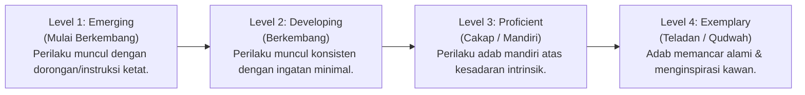

# P5-09: Master Rubrik Perilaku 4-Level PBIS (10 Karakter Muwashafat)

## Status Dokumen
* **Status**: 🌟 **A+ (Tervalidasi & Siap Diimplementasikan)**
* **Sub-Domain**: `05 Assessment Framework / 09 Rubrics`
* **Penanggung Jawab Keilmuan**: Dewan Keilmuan TUMBUH (*Pakar Metodologi Riset & Pakar Desain Kurikulum Adab*)

---

## 1. Arsitektur Master Rubrik 4-Level PBIS

Setiap Karakter dari **10 Karakter Utama Santri TUMBUH (*Muwashafat*)** dinilai menggunakan Rubrik Kontinuum 4-Level yang mendeskripsikan indikator perilaku teramati (*Observable Behavioral Descriptors*):

---

## 2. Matriks Master Rubrik Perilaku 10 Karakter Muwashafat

| Karakter Muwashafat | Level 1: Emerging | Level 2: Developing | Level 3: Proficient | Level 4: Exemplary (Qudwah) |
| :--- | :--- | :--- | :--- | :--- |
| **1. Salimul Aqidah** | Mengenal dasar tauhid; butuh pengingat menjauhi hal syubhat. | Memahami pembatal iman; konsisten tadabbur alam. | Menginternalisasi iman dalam keputusan harian mandiri. | Membentengi fikrah kawan & teladan keteguhan akidah. |
| **2. Shahihul Ibadah** | Sholat berjamaah dengan dorongan musyrif; bacaan dasar. | Sholat tepat waktu mandiri; gerakan & bacaan sesuai sunnah. | Rutin ibadah sunnah (rawatib/tahajjud) atas inisiatif pribadi. | Menjadi imam/muadzin & mengomandoi kekhusyukan jamaah. |
| **3. Matinul Khuluq** | Menjauhi kata kasar dengan teguran; sopan pada ustadz. | Tertib beradab dalam pergaulan asrama tanpa dorongan. | Menerapkan empati sosial & resolusi konflik damai. | Teladan adab mulia & penengah kedamaian restoran. |
| **4. Qawiyyul Jism** | Olahraga & kebersihan diri dengan bimbingan. | Menjaga bugar fisik mandiri & makan nutrisi sehat. | Menjaga kesehatan & menguasai P3K dasar. | Teladan pola hidup sehat & penggerak olahraga sunnah. |
| **5. Mutsaqqaful Fikr** | Menghafal pelajaran dengan bimbingan langsung. | Menguasai materi kelas & muraja'ah mandiri. | Berpikir kritis syar'i & analisis hikmah mendalam. | Mampu riset ilmiah & mengajar adik kelas (Badal). |
| **6. Mujahadatun Linafsih** | Menahan diri dari pelanggaran tata tertib jika diawasi. | Mengontrol amarah mandiri & tidak melampiaskan ego. | Disiplin diri tinggi melawan malas & hawa nafsu. | Istiqamah utuh & teladan ketahanan emosi/spiritual. |
| **7. Haritsun 'Ala Waqtih** | Tiba di kelas/masjid tepat waktu dengan pengingat. | Mengisi waktu luang dengan aktivitas bermanfaat. | Manajemen waktu mandiri (hafalan, studi, & istirahat). | Mengoptimalkan setiap detik untuk khidmah & karya. |
| **8. Munazhzham fi Syu'unih** | Merapikan lemari/kamar dengan arahan musyrif. | Menjalankan piket kamar mandiri & rapi terstruktur. | Pengelolaan administrasi & barang pribadi teratur. | Manajemen organisasi & pelopor ketertiban sistem. |
| **9. Qadirun 'Alal Kasb** | Mengenal konsep wirausaha & tidak boros dengan pengawasan. | Menjaga barang pribadi & merawat fasilitas asrama. | Menjalankan proyek wirausaha sederhana mandiri. | Menguasai literasi keuangan Islami & wirausaha mandiri. |
| **10. Nafi'un Lighairih** | Ikut serta dalam kerja bakti kamar dengan dorongan. | Membantu kawan yang membutuhkan secara sukarela. | Merancang kegiatan sosial & kepedulian ukhuwah. | Memimpin proyek khidmah masyarakat luas yang berdampak. |
