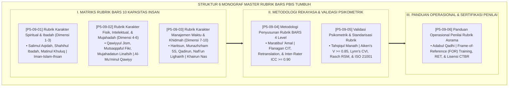

# P5-09: DOKUMEN INDUK MASTER RUBRIK PERILAKU 4 LEVEL PBIS
## *Arsitektur dan Rekayasa Standarisasi Rubrik Behaviorally Anchored Rating Scales (Rubrik Karakter Spiritual Dimensi 1–3 Form RKS-01, Rubrik Karakter Fisik-Intelektual-Mujahadah Dimensi 4–6 Form RKS-02, Rubrik Manajemen Waktu-Organisasi-Khidmah Dimensi 7–10 Form RKS-03, Metodologi Penyusunan BARS 4 Level Form MPB, Validasi Psikometrik Aiken's V & Rasch RSM Form VPR, Serta Panduan Operasional Penilai Rater Form POP) di Ekosistem TUMBUH Pesantren*

**Nomor Identifikasi**: `P5-09/DOKUMEN-INDUK-MASTER-RUBRIK-4-LEVEL-PBIS/2026`  
**Domain**: `05 Assessment Framework` > `09 Rubrics` (Gugus Sub-Domain 09: *Comprehensive 4-Level BARS Rubrics & Psychometric Standardization Systems*)  
**Klasifikasi Naskah**: *Master Architecture & Navigation Monograph* (Dokumen Induk Peta Jalan Riset & Navigasi 6 Monograf Ilmiah Sistem Master Rubrik BARS PBIS)  
**Rumpun Disiplin Pengkaji**: Desain Rubrik BARS 10 Kapasitas, Psikometri Terapan (Aiken's V, CVI, Rasch RSM), Frame-of-Reference Training, Fiqh Al-Maratib wal Ahkam  

---

> ### 💡 INTISARI EKSEKUTIF (EXECUTIVE SUMMARY)
>
> * **Kedudukan Fundamental Gugus Master Rubrik Perilaku 4 Level PBIS:**  
>   Gugus *Rubrics (Master Rubrik Perilaku 4 Level PBIS)* merupakan jantung kalibrasi dan instrumen operasionalisasi karakter (*The Operational Heart of Character Metrics*) dalam ekosistem TUMBUH. Gugus ini mengubah 10 Kapasitas Insan yang luhur dan idealis menjadi deskriptor perilaku empiris teramati (*Behaviorally Anchored Rating Scales / BARS*) yang terbagi dalam 4 tingkatan kematangan: **Level 1 (Dho'if / Terbimbing)**, **Level 2 (Maqbul / Dasar)**, **Level 3 (Jayyid / Mandiri)**, dan **Level 4 (Mumtaz / Qudwah)**.
> * **Integrasi Holistik Turats & Konsensus Sains Psikometri Modern:**  
>   Gugus riset ini memadukan khazanah agung Islam tentang trilogi *Iman-Islam-Ihsan*, mukmin kuat (*Al-Mu'minul Qawiyy*), manusia paling bermanfaat (*Khairun Nās*), hierarki amal (*Marātibul 'Amal*), verifikasi sebab hukum (*Tahqīqul Manāth*), dan adab kehakiman (*Adābul Qadhā'*) dengan konsensus sains psikometri dunia (*Flanagan CIT, Smith-Kendall BARS, Aiken's V, Lynn CVI, Rasch Rating Scale Model RSM, dan Bernardin FOR Training*).
> * **Struktur Lengkap 6 Berkas Monograf Riset Ilmiah:**  
>   Dokumen induk ini memetakan dan menghubungkan 6 berkas monograf penelitian akademik komprehensif (~165 KB total riset) yang menyajikan matriks rubrik lengkap 10 kapasitas insan, protokol 5 tahap rekayasa BARS, berita acara validasi ISO 21001, dan panduan teknis sertifikasi penilai CTBR.

---

## 📑 PETA NAVIGASI ENAM MONOGRAF RISET MASTER RUBRIK BARS PBIS

Berikut adalah daftar lengkap 6 monograf riset akademik dalam gugus **`09 Rubrics`**:

---

## 📚 DESKRIPSI RINGKAS 6 BERKAS MONOGRAF

1. **[P5-09-01: Rubrik Karakter Spiritual dan Ibadah (Dimensi 1–3)](file:///c:/xampp/htdocs/tumbuh/05%20Assessment%20Framework/09%20Rubrics/P5-09-01-Rubrik-Karakter-Spiritual-dan-Ibadah.md)**  
   *Membahas matriks BARS 4 tingkat untuk Dimensi Salimul Aqidah, Shahihul Ibadah, dan Matinul Khuluq, doktrin trilogi Iman-Islam-Ihsan, CASEL Self-Awareness, dan formulir Form RKS-01.*
2. **[P5-09-02: Rubrik Karakter Fisik, Intelektual, dan Mujahadah (Dimensi 4–6)](file:///c:/xampp/htdocs/tumbuh/05%20Assessment%20Framework/09%20Rubrics/P5-09-02-Rubrik-Karakter-Fisik-Intelektual-dan-Mujahadah.md)**  
   *Membahas matriks BARS 4 tingkat untuk Dimensi Qawiyyul Jism, Mutsaqqaful Fikr, dan Mujahadatun Linafsih, doktrin Al-Mu'minul Qawiyy, neurosains fungsi eksekutif, sleep hygiene, dan formulir Form RKS-02.*
3. **[P5-09-03: Rubrik Karakter Manajemen Waktu dan Khidmah (Dimensi 7–10)](file:///c:/xampp/htdocs/tumbuh/05%20Assessment%20Framework/09%20Rubrics/P5-09-03-Rubrik-Karakter-Manajemen-Waktu-dan-Khidmah.md)**  
   *Membahas matriks BARS 4 tingkat untuk Dimensi Haritsun 'ala Waqtih, Munazhzham 5S, Qadirun 'alal Kasb, dan Nafi'un Lighairih, doktrin Khairun Nas, Lean 5S Workplace, Service Learning, dan formulir Form RKS-03.*
4. **[P5-09-04: Metodologi Penyusunan Rubrik BARS 4 Level](file:///c:/xampp/htdocs/tumbuh/05%20Assessment%20Framework/09%20Rubrics/P5-09-04-Metodologi-Penyusunan-Rubrik-BARS-4-Level.md)**  
   *Membahas 5 tahap rekayasa konstruksi instrumen BARS, doktrin Maratibul 'Amal, Critical Incident Technique (CIT) John Flanagan, retranslasi pakar, reliabilitas ICC >= 0.90, dan lembar kerja Form MPB-BARS.*
5. **[P5-09-05: Validasi Psikometrik dan Standarisasi Rubrik](file:///c:/xampp/htdocs/tumbuh/05%20Assessment%20Framework/09%20Rubrics/P5-09-05-Validasi-Psikometrik-dan-Standarisasi-Rubrik.md)**  
   *Membahas pengujian validitas isi dan konstruk rubrik, doktrin Tahqiqul Manath salaf, koefisien Aiken's V, Content Validity Index (CVI), Rasch Rating Scale Model (RSM), standar ISO 21001, dan berita acara Form VPR-Validasi.*
6. **[P5-09-06: Panduan Operasional Penilai Rubrik Asrama](file:///c:/xampp/htdocs/tumbuh/05%20Assessment%20Framework/09%20Rubrics/P5-09-06-Panduan-Operasional-Penilai-Rubrik-Asrama.md)**  
   *Membahas panduan praktis dan kode etik penilai adab, doktrin Adabul Qadhi salaf, Frame-of-Reference (FOR) Training, Rater Error Training (RET), 8 aturan baku rater, dan sertifikasi Form POP-Rater (CTBR).*

---

## 🎯 STANDAR PENJAMINAN MUTU SISTEM MASTER RUBRIK PBIS

Penerapan gugus **Master Rubrik Perilaku 4 Level PBIS (Rubrics)** menjamin bahwa:
1. **Seluruh Indikator Karakter Terdefinisi Secara Eksak dan Transparan (*Crystal-Clear Behavioral Anchors*)**: Menghilangkan kebingungan santri dan multitafsir antar-pendidik mengenai standar akhlak mulia.
2. **Keadilan Penilaian Terjamin Berbasis Metodologi Psikometri Internasional (*Uncompromising Measurement Rigor*)**: Seluruh instrumen tervalidasi oleh dewan pakar lintas disiplin dan tersertifikasi ISO 21001.
3. **Pendidik Menguasai Keterampilan Penilaian yang Terkalibrasi (*Certified Behavioral Evaluators*)**: Seluruh guru dan musyrif terlatih memberikan evaluasi objektif yang adil, memotivasi, dan penuh kasih sayang.
