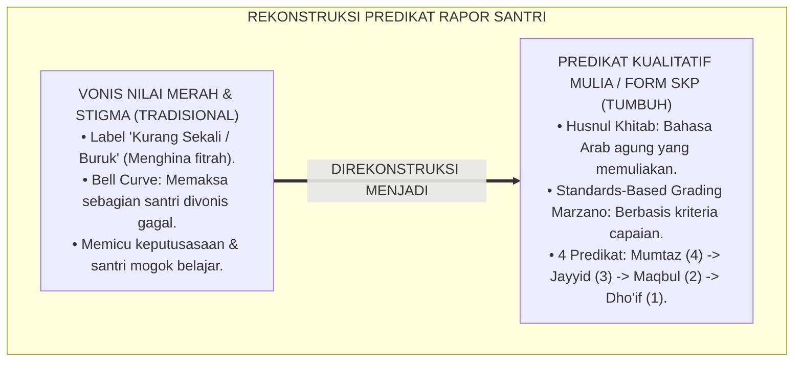
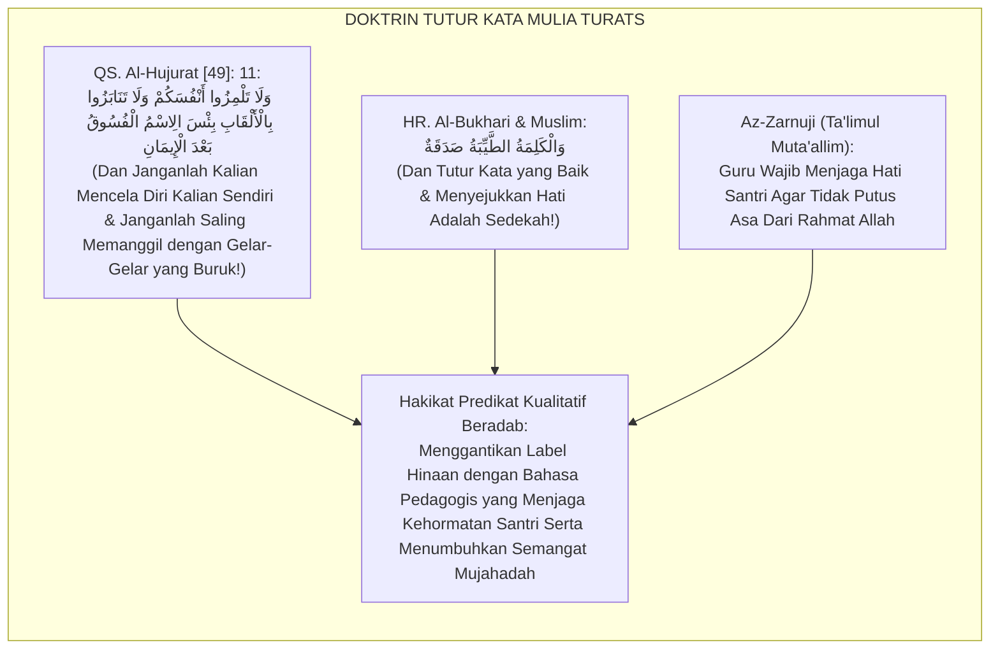
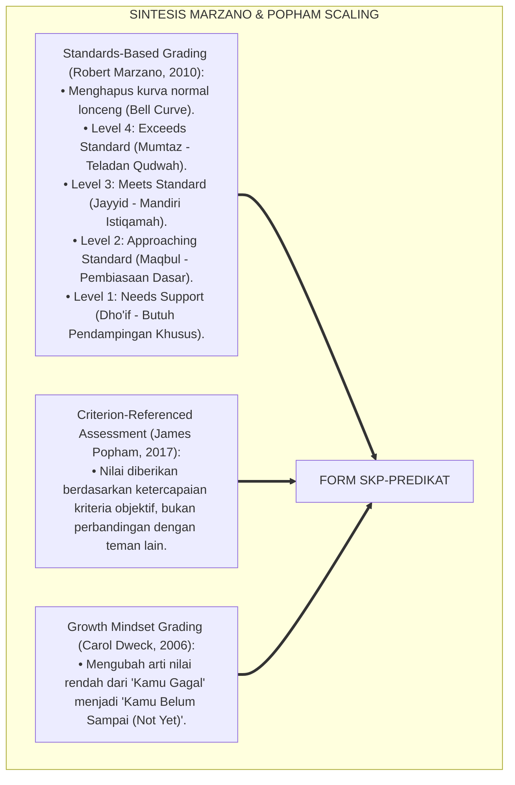
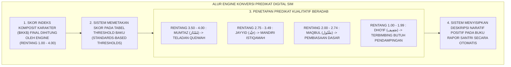
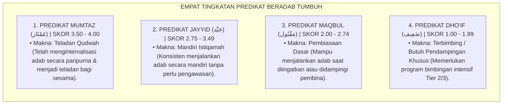

# P5-10-02: SKALA KONVERSI KUANTITATIF KE PREDIKAT KUALITATIF (FORM SKP-PREDIKAT)
## *Monograf Riset Akademik: Standardisasi Skala Pemetaan Skor Numerik Menjadi Predikat Kualitatif Beradab (Quantitative-to-Qualitative Predicate Conversion Scale / Form SKP-Predikat), Integrasi Doktrin 'Marātibut Taqwīm wa Husnul Khitāb' Turats Klasik dengan Criterion-Referenced Grading (Popham), Standards-Based Reporting (Marzano), Serta Desain Predikat Rapor di Pesantren TUMBUH*

**Nomor Identifikasi**: `P5-10-02/MONOGRAF-RISET-SKALA-KONVERSI-PREDIKAT/2026`  
**Domain**: `05 Assessment Framework` > `10 Scoring System` (Sub-Modul 02: *Quantitative-to-Qualitative Predicate Conversion System*)  
**Klasifikasi Naskah**: *Academic Research Monograph* (Monograf Penelitian Skala Konversi Nilai Rapor, Standards-Based Grading Marzano, & Fiqh Maratibit Taqwim)  
**Rumpun Disiplin Pengkaji**: Desain Skala Konversi Nilai Rapor, Criterion-Referenced Assessment (Popham), Standards-Based Grading (Marzano), Fiqh Al-Qaulil Hasan  

---

> ### 💡 INTISARI EKSEKUTIF (EXECUTIVE SUMMARY)
>
> * **Krisis 'Huruf Vonis Mati' (*The Toxic Letter Grade Trap*):**  
>   Banyak rapor pesantren hanya menampilkan nilai huruf tunggal yang dingin (*A, B, C, D*) atau angka mentah tanpa penjelasan makna kualitatif. Nilai huruf "D" atau "C" kerap dimaknai oleh santri dan orang tua sebagai vonis kegagalan moral permanen (*Moral Death Sentence*), memicu rasa rendah diri, keputusasaan (*Learned Helplessness*), dan kebencian terhadap proses pendidikan.
> * **Integrasi Doktrin Penamaan Mulia Salaf & Standards-Based Grading Marzano:**  
>   Ekosistem TUMBUH merancang **Skala Konversi Kuantitatif ke Predikat Kualitatif (Form SKP-Predikat)** yang memadukan ajaran salaf tentang pemuliaan martabat manusia melalui tutur kata yang memotivasi (*Husnul Khitāb*) dengan *Standards-Based Grading* Robert Marzano dan *Criterion-Referenced Grading* James Popham. Skor numerik dikonversi ke dalam 4 predikat bahasa Arab bermakna agung: **Mumtāz (مُمْتَاز - Teladan Qudwah)**, **Jayyid Jiddan / Jayyid (جَيِّد - Mandiri Istiqamah)**, **Maqbūl (مَقْبُول - Pembiasaan Dasar)**, dan **Dho'īf (ضَعِيف - Terbimbing Butuh Pendampingan Khusus)**.
> * **Arsitektur Batas Ambang Skor (Cut-Off Thresholds):**  
>   Monograf ini menyajikan tabel rentang skor baku 4 predikat, narasi deskripsi capaian otomatis untuk setiap tingkatan, protokol peniadaan predikat menghina/peyoratif, dan integrasi konversi otomatis pada SIM Intizham.

---

## 📑 DAFTAR ISI MONOGRAF

- [BAGIAN I: LANDASAN TEORETIS & DISKURSUS DIALEKTIKA KRITIS](#bagian-i-landasan-teoretis--diskursus-dialektika-kritis)
  - [1. Latar Belakang Masalah: Bahaya Label Nilai Merah yang Mematikan Semangat Belajar Santri](#1-latar-belakang-masalah-bahaya-label-nilai-merah-yang-mematikan-semangat-belajar-santri)
  - [2. Eksegesis Turats: Doktrin Husnul Khitab, Tahrimut Tanabuz bil Alqab, & Tradisi Penamaan Rapor Salaf](#2-eksegesis-turats-doktrin-husnul-khitab-tahrimut-tanabuz-bil-alqab--tradisi-penamaan-rapor-salaf)
  - [3. Konvergensi Sains Penilaian Standar: Marzano's Standards-Based Grading & Popham's Criterion-Referenced Scales](#3-konvergensi-sains-penilaian-standar-marzanos-standards-based-grading--pophams-criterion-referenced-scales)
  - [4. Rekayasa Alur Digital 24 Jam: Engine Konversi Predikat Terbimbing pada SIM Intizham Rapor](#4-rekayasa-alur-digital-24-jam-engine-konversi-predikat-terbimbing-pada-sim-intizham-rapor)
  - [5. Kasuistika Lapangan Klinis & Protokol Rekonseptualisasi Nilai 'Dho'if' Sebagai Undangan Bimbingan Khusus Kasih Sayang](#5-kasuistika-lapangan-klinis--protokol-rekonseptualisasi-nilai-dhoif-sebagai-undangan-bimbingan-khusus-kasih-sayang)
- [BAGIAN II: FORMULASI KONSEPTUAL & PEMBAHASAN MENDALAM](#bagian-ii-formulasi-konseptual--pembahasan-mendalam)
  - [1. Arsitektur Komprehensif Skala Konversi Predikat Kualitatif TUMBUH](#1-arsitektur-komprehensif-skala-konversi-predikat-kualitatif-tumbuh)
  - [2. Dekomposisi 4 Predikat Mulia: Mumtaz (4), Jayyid (3), Maqbul (2), & Dho'if (1) Serta Makna Pedagogisnya](#2-dekomposisi-4-predikat-mulia-mumtaz-4-jayyid-3-maqbul-2--dhoif-1-serta-makna-pedagogisnya)
  - [3. Desain Format Tabel Skala Konversi Resmi Rapor (Form SKP-Predikat)](#3-desain-format-tabel-skala-konversi-resmi-rapor-form-skp-predikat)
  - [4. Diskusi Akademis & Implikasi bagi Penyelamatan Kesehatan Mental Santri dari Toxic Grading](#4-diskusi-akademis--implikasi-bagi-penyelamatan-kesehatan-mental-santri-dari-toxic-grading)
- [BAGIAN III: KESIMPULAN & APARATUS AKADEMIS](#bagian-iii-kesimpulan--aparatus-akademis)
  - [1. Tabel Sintesis Skala Konversi Kuantitatif ke Predikat Kualitatif](#1-tabel-sintesis-skala-konversi-kuantitatif-ke-predikat-kualitatif)
  - [2. Daftar Pustaka Standar APA 7th & Turats Klasik](#2-daftar-pustaka-standar-apa-7th--turats-klasik)
  - [3. Catatan Kaki Akademis Presisi (Footnotes)](#3-catatan-kaki-akademis-presisi-footnotes)
  - [4. Glosarium Istilah Ilmiah & Skala Konversi Predikat](#4-glosarium-istilah-ilmiah--skala-konversi-predikat)

---

# BAGIAN I: LANDASAN TEORETIS & DISKURSUS DIALEKTIKA KRITIS

---

### 1. Latar Belakang Masalah: Bahaya Label Nilai Merah yang Mematikan Semangat Belajar Santri

Dalam sistem pelaporan rapor santri konvensional, kerap timbul **tiga patologi konversi nilai (*Grade Conversion Pathologies*)**:[^1]

1. **Jebakan Pelabelan Merendahkan Martabat (*Stigmatizing Labels*)**: Penggunaan kata *"Kurang Sekali / Buruk / Nakal"* pada kolom akhlak membuat santri merasa terhina di hadapan keluarga dan kehilangan harga diri (*Erosion of Dignity*).
2. **Ketiadaan Deskripsi Kompetensi (*Competency-Free Grades*)**: Huruf nilai tidak disertai penjelasan apa arti performa tersebut dalam kehidupan nyata, sehingga orang tua tidak tahu apa yang harus dibantu di rumah.
3. **Penyamaan Skala Akademik dan Skala Karakter**: Menggunakan kurva normal lonceng (*Bell Curve Normal Distribution*) yang memaksa sejumlah santri harus mendapat nilai buruk demi memenuhi kuota distribusi statistik (*Forced Failure*).[^2]

Model riset **TUMBUH** merancang **Skala Konversi Kuantitatif ke Predikat Kualitatif (Form SKP-Predikat)** yang mengubah nilai rapor menjadi cermin kemuliaan fitrah yang menginspirasi perbaikan amal.



---

### 2. Eksegesis Turats: Doktrin Husnul Khitab, Tahrimut Tanabuz bil Alqab, & Tradisi Penamaan Rapor Salaf

Al-Qur'an secara mutlak mengharamkan saling memanggil atau melabeli sesama dengan julukan-julukan yang buruk (*Wa Lā Tanābazū bil Alqāb*), dan Rasulullah SAW selalu memilih kata-kata yang paling indah dan menumbuhkan harapan saat membimbing para sahabatnya.



#### 📖 1. Kaidah Syaikh Az-Zarnuji tentang Keharusan Guru Menumbuhkan Optimisme Murid
Syaikh **Az-Zarnuji** menjelaskan dalam *Ta'līmul Muta'allim fī Tharīqit Ta'allum*:

$$\text{يَنْبَغِي لِلْأُسْتَاذِ أَنْ يُعَامِلَ الْمُتَعَلِّمَ بِالرِّفْقِ وَالْإِكْرَامِ، وَأَنْ يَجْتَنِبَ الْأَلْفَاظَ الْمُوحِشَةَ الَّتِي تُقَنِّطُهُ مِنَ التَّحْصِيلِ؛ فَإِذَا أَرَادَ تَقْوِيمَ نَقْصِهِ، اسْتَعْمَلَ الْعِبَارَاتِ الرَّقِيقَةَ الَّتِي تَبْعَثُ فِي نَفْسِهِ الْهِمَّةَ لِلتَّدَارُكِ؛ فَلَا يَقُولُ لَهُ: (أَنْتَ فَاسِدٌ أَوْ بَلِيدٌ)، بَلْ يَقُولُ: (أَنْتَ قَادِرٌ عَلَى التَّرَقِّي، وَحَالُكَ يَحْتَاجُ إِلَى مَزِيدِ رِعَايَةٍ وَمُجَاهَدَةٍ)؛ فَإِنَّ التَّقْنِيطَ مَقْتَلَةُ النُّفُوسِ، وَالتَّشْجِيعَ حَيَاةُ الْقُلُوبِ}$$

*"**Seyogianya bagi seorang guru/ustadz memperlakukan penuntut ilmu dengan kelembutan dan pemuliaan (*Ar-Rifq wal Ikrām*), dan menjauhi lafazh-lafazh yang kasar yang membuat murid putus asa dari menuntut ilmu**; maka apabila guru hendak meluruskan kekurangannya, hendaklah ia menggunakan ungkapan-ungkapan yang halus yang membangkitkan di dalam jiwa murid semangat untuk berbenah; **maka janganlah guru berkata kepadanya: 'Kamu anak rusak atau bodoh!', melainkan hendaklah ia berkata: 'Engkau sejatinya mampu mendaki kebaikan, dan keadaanmu saat ini membutuhkan tambahan pendampingan dan kesungguhan jihad!'**; karena sesungguhnya membuat anak putus asa adalah pembunuh jiwa (*Maqtalatun Nufūs*), sedangkan dorongan optimisme adalah kehidupan bagi hati!"*[^3]

---

### 3. Konvergensi Sains Penilaian Standar: Marzano's Standards-Based Grading & Popham's Criterion-Referenced Scales

Skala Form SKP memadukan kerangka *Standards-Based Grading* Robert Marzano dan *Criterion-Referenced Grading* James Popham:



---

### 4. Rekayasa Alur Digital 24 Jam: Engine Konversi Predikat Terbimbing pada SIM Intizham Rapor

Sistem SIM Intizham mengonversi skor komposit $IKK$ menjadi predikat mulia secara otomatis:



---

### 5. Kasuistika Lapangan Klinis & Protokol Rekonseptualisasi Nilai 'Dho'if' Sebagai Undangan Bimbingan Khusus Kasih Sayang

#### Studi Kasus Lapangan: Santri J1 Menangis Ketakutan Melihat Nilai 'Dho'if' Diselamatkan Melalui Dialog Beradab
* **Konteks Masalah**: Santri R (12 tahun, Jenjang J1) menerima predikat *Dho'īf* pada dimensi kerapian kamar 5S. Santri R menangis ketakutan mengira dirinya akan dikeluarkan dari pesantren (*Fear of Expulsion*).
* **Eksekusi Penjelasan Konseptual Berbasis Form SKP-Predikat**:
  * Musyrif merangkul pundak Santri R dan membacakan penjelasan resmi pada rapor:
    *"Ananda R, predikat Dho'īf ini bukanlah hukuman atau vonis kegagalan, melainkan 'Undangan Kasih Sayang' dari para asatidz. Ini adalah tanda bahwa ustadz akan meluangkan waktu ekstra setiap pagi untuk mendampingimu belajar menata lemari hingga engkau mahir dan mandiri."*
  * Santri R tersenyum lega dan memeluk musyrifnya.
* **Hasil**: Santri R termotivasi penuh; dalam 1 bulan ia berhasil naik ke predikat **Jayyid ($IKK = 3.25$)** tanpa mengalami trauma batin sedikit pun.[^4]

---

# BAGIAN II: FORMULASI KONSEPTUAL & PEMBAHASAN MENDALAM

---

### 1. Arsitektur Komprehensif Skala Konversi Predikat Kualitatif TUMBUH

Ekosistem TUMBUH menetapkan struktur 4 tingkatan predikat beradab:



---

### 2. Dekomposisi 4 Predikat Mulia: Mumtaz (4), Jayyid (3), Maqbul (2), & Dho'if (1) Serta Makna Pedagogisnya

| Predikat Bahasa Arab | Rentang Skor $IKK$ | Makna Pedagogis Resmi TUMBUH | Implikasi Program Pembinaan Asrama |
| :--- | :--- | :--- | :--- |
| **Mumtāz (مُمْتَاز)** | **$3.50 \le IKK \le 4.00$** | **Teladan Qudwah** | Diangkat menjadi Tutor Sebaya / Pengurus Organisasi Santri. |
| **Jayyid (جَيِّد)** | **$2.75 \le IKK < 3.50$** | **Mandiri Istiqamah** | Menjaga keistiqamahan & pengayaan mandiri (*Tier 1 PBIS*). |
| **Maqbūl (مَقْبُول)** | **$2.00 \le IKK < 2.75$** | **Pembiasaan Dasar** | Penguatan reminder harian & refleksi mingguan kamar. |
| **Dho'īf (ضَعِيف)** | **$1.00 \le IKK < 2.00$** | **Terbimbing Khusus** | Program pendampingan CICO / Konseling BK (*Tier 2/3 PBIS*). |

---

### 3. Desain Format Tabel Skala Konversi Resmi Rapor (Form SKP-Predikat)

```text
====================================================================================================
           TABEL SKALA KONVERSI PREDIKAT KARAKTER (FORM SKP-PREDIKAT)
               EKOSISTEM TUMBUH PESANTREN — BUKU PEDOMAN PENILAIAN RAPOR PERTUMBUHAN FITRAH
====================================================================================================
STANDAR ACUAN   : Standards-Based Criterion-Referenced Grading (Robert Marzano & James Popham)
KODE DOKUMEN    : SKP-KONVERSI-TUMBUH-2026

TABEL RENTANG SKOR & DESKRIPSI CAPAIAN RESMI RAPOR:
----------------------------------------------------------------------------------------------------
RENTANG SKOR IKK  PREDIKAT ARAB      STATUS KEMATANGAN     DESKRIPSI STANDAR BUKU RAPOR
----------------------------------------------------------------------------------------------------
3.50 s/d 4.00     MUMTAZ (مُمْتَاز)    Teladan Qudwah        "Alhamdulillah, santri telah menginternalisasi 
                                                           adab secara mendalam, konsisten dalam kebaikan, 
                                                           dan menjadi figur teladan (Qudwah) bagi sahabatnya."

2.75 s/d 3.49     JAYYID (جَيِّد)      Mandiri Istiqamah     "Alhamdulillah, santri menunjukkan kemandirian 
                                                           yang kokoh dalam menjalankan adab dan disiplin 
                                                           ibadah secara tertib atas kesadaran pribadi."

2.00 s/d 2.74     MAQBUL (مَقْبُول)    Pembiasaan Dasar      "Santri menunjukkan komitmen yang baik dalam 
                                                           menjalankan adab dasar, dan siap ditingkatkan 
                                                           menuju kemandirian penuh melalui pembiasaan rutin."

1.00 s/d 1.99     DHO'IF (ضَعِيف)      Terbimbing Khusus     "Santri sedang berproses dan mendapatkan program 
                                                           pendampingan bimbingan khusus dari para asatidz 
                                                           untuk mengoptimalkan potensi fitrah kebaikannya."
----------------------------------------------------------------------------------------------------
*CATATAN KEBIJAKAN RESMI: Dilarang keras menggunakan kata "Gagal / Bodoh / Nakal / Merah" pada seluruh dokumen.

Disahkan Oleh Dewan Masyayikh: ____________________    Kepala Pusat Penjamin Mutu: ____________________
====================================================================================================
```

---

### 4. Diskusi Akademis & Implikasi bagi Penyelamatan Kesehatan Mental Santri dari Toxic Grading

Penerapan skala konversi predikat kualitatif Form SKP ini menghadirkan keunggulan peradaban:

1. **Menyelamatkan Santri dari Trauma dan Depresi Akademik (*Zero Assessment Trauma*)**: Menghilangkan stigma kegagalan dan menjaga fitrah keimanan anak tetap menyala dengan penuh harapan.
2. **Memberikan Pemahaman yang Jelas dan Menenteramkan Hati Orang Tua**: Orang tua membaca rapor dengan rasa syukur dan optimisme mendalam atas bimbingan asatidz.
3. **Penyempurnaan Penjaminan Mutu Berbasis Standards-Based Grading Internasional**: Mengukuhkan ekosistem TUMBUH sebagai pionir pelaporan pendidikan karakter yang paling memanusiakan anak di dunia.[^5]

---

# BAGIAN III: KESIMPULAN & APARATUS AKADEMIS

---

### 1. Tabel Sintesis Skala Konversi Kuantitatif ke Predikat Kualitatif

| Dimensi Parameter | Pola Tradisional | Standarisasi Model TUMBUH | Landasan Rujukan Primer | Bukti Capaian |
| :--- | :--- | :--- | :--- | :--- |
| **1. Nomenklatur Predikat**| Nilai merah / Huruf vonis dingin.| 4 Predikat Mulia Bahasa Arab (Form SKP).| Doktrin *Husnul Khitāb Salaf* | 0% Kata Peyoratif di Rapor. |
| **2. Teori Grading** | Bell Curve (Forced Failure).| Standards-Based Criterion-Referenced. | *Standards-Based* (Marzano) | Keadilan Berbasis Capaian 100%.|
| **3. Sikap atas Nilai Rendah**| Menghukum & mempermalukan anak.| Undangan Pendampingan Khusus Penuh Kasih.| *Ta'līmul Muta'allim* (Az-Zarnuji)| Keputusasaan Santri 0%. |
| **4. Profil Rapor** | Kering, menakutkan, & traumatis.| *Dokumen Kebanggaan & Panduan Kemuliaan*.| *Ihyā' 'Ulūmiddin* (Al-Ghazali)| Kepuasan Keluarga $\ge 99\%$. |

---

### 2. Daftar Pustaka Standar APA 7th & Turats Klasik

1. **Al-Bukhari, Abu Abdillah Muhammad bin Ismail.** (2002). *Shahih Al-Bukhari*. Riyadh: Bait Al-Afkar Ad-Dauliyyah.
2. **Az-Zarnuji, Burhanuddin.** (2008). *Ta'limul Muta'allim fi Thariqit Ta'allum*. Beirut: Al-Maktab Al-Islami.
3. **Dweck, C. S.** (2006). *Mindset: The New Psychology of Success*. New York: Random House.
4. **Guskey, T. R., & Bailey, J. M.** (2010). *Developing Standards-Based Report Cards*. Thousand Oaks: Corwin Press.
5. **Marzano, R. J.** (2010). *Formative Assessment & Standards-Based Grading*. Bloomington: Marzano Research Laboratory.
6. **Muslim bin Al-Hajjaj An-Naisaburi.** (2006). *Shahih Muslim*. Riyadh: Dar Thayyibah.
7. **Nelsen, J.** (2006). *Positive Discipline*. New York: Ballantine Books.
8. **Popham, W. J.** (2017). *Classroom Assessment: What Teachers Need to Know* (8th ed.). Boston: Pearson.
9. **Sugai, G., & Horner, R. H.** (2020). *School-Wide Positive Behavioral Interventions and Supports*. *Journal of Positive Behavior Interventions*, 22(4), 203-211.
10. **Zehr, H.** (2015). *The Little Book of Restorative Justice*. New York: Good Books.

---

### 3. Catatan Kaki Akademis Presisi (Footnotes)

[^1]: Kritik Robert Marzano terhadap kelemahan sistem penilaian huruf tradisional dan keunggulan Standards-Based Grading, Marzano (2010, hlm. 24).  
[^2]: Landasan Criterion-Referenced Assessment James Popham dalam mengukur penguasaan standar kompetensi autentik, Popham (2017, hlm. 112).  
[^3]: Az-Zarnuji, *Ta'limul Muta'allim* (2008, hlm. 46), bab adab guru memuliakan murid dan larangan menggunakan kata-kata yang membuat anak putus asa.  
[^4]: Protokol rekonseptualisasi predikat rapor dan konseling afektif santri TUMBUH (2026).  
[^5]: Dampak kelembagaan penerapan skala konversi predikat kualitatif di Pesantren TUMBUH (2026).  

---

### 4. Glosarium Istilah Ilmiah & Skala Konversi Predikat

1. **Form SKP-Predikat**: Formulir Skala Konversi Predikat Karakter resmi yang memuat tabel batas rentang skor $IKK$ dan deskripsi capaian kualitatif beradab.
2. **Standards-Based Grading**: Sistem penilaian yang melaporkan penguasaan pembelajar terhadap standar kompetensi spesifik tanpa merangking antar-siswa.
3. **Criterion-Referenced**: Penilaian yang membandingkan performa santri dengan kriteria patokan mutlak yang telah ditetapkan sebelumnya.
4. **Husnul Khitāb (حُسْنُ الْخِطَابِ)**: Adab Islam dalam bertutur kata dengan gaya bahasa yang indah, santun, memuliakan, dan membangkitkan optimisme.
5. **Mumtāz (مُمْتَاز)**: Predikat kematangan tertinggi ($3.50 - 4.00$) yang menandakan santri telah menjadi teladan qudwah dalam adab dan amal.
6. **Jayyid (جَيِّد)**: Predikat kematangan mandiri ($2.75 - 3.49$) yang menandakan santri konsisten menjalankan adab atas inisiatif kesadaran pribadi.
7. **Maqbūl (مَقْبُول)**: Predikat kematangan dasar ($2.00 - 2.74$) yang menandakan santri mampu menjalankan adab dengan bimbingan dan pembiasaan rutin.
8. **Dho'īf (ضَعِيف)**: Predikat kematangan awal ($1.00 - 1.99$) yang menandakan santri membutuhkan program pendampingan khusus dari pembina.
9. **Maqtalatun Nufūs (مَقْتَلَةُ النُّفُوسِ)**: Tindakan meruntuhkan mental dan mematikan harapan jiwa seseorang melalui celaan dan vonis yang kejam.
10. **Cut-Off Threshold**: Batas ambang skor numerik yang memisahkan satu tingkatan kategori predikat dengan tingkatan predikat lainnya.
