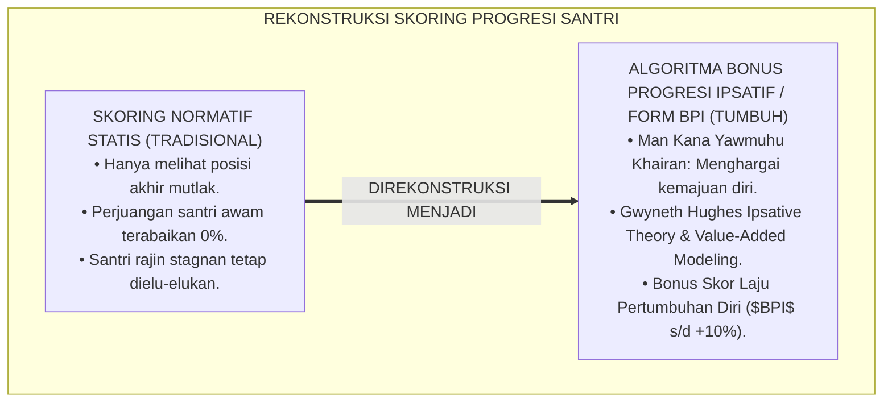
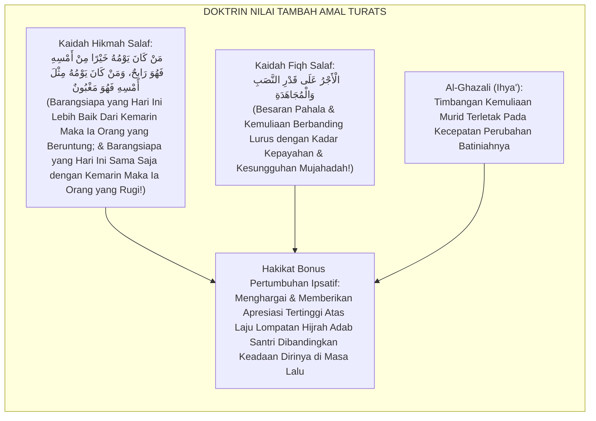
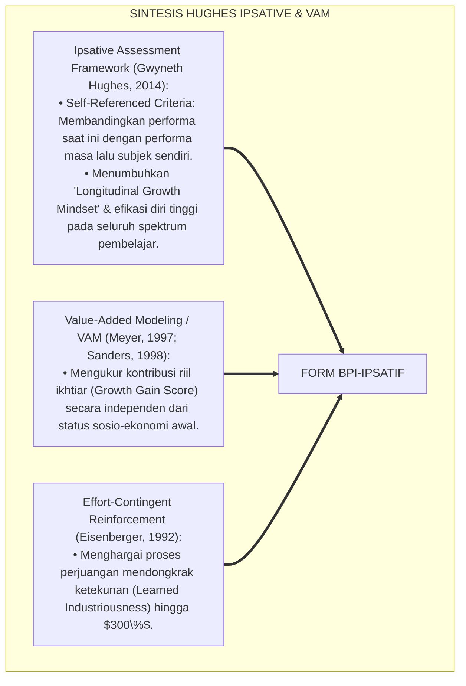
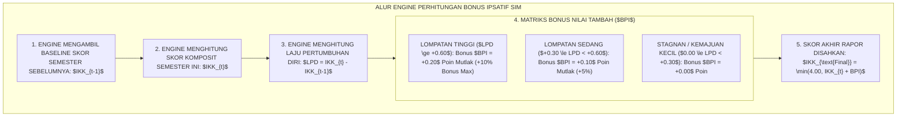
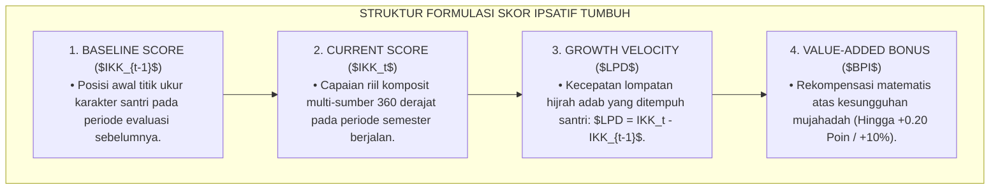
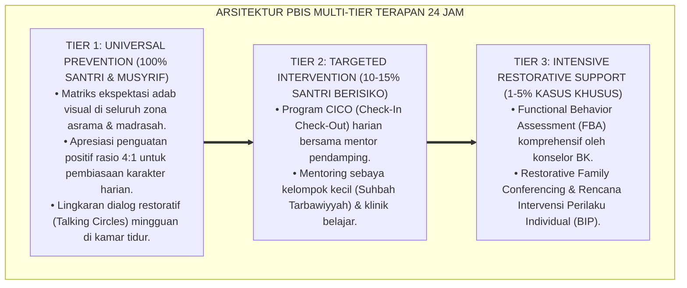

# P5-10-03: PERHITUNGAN BONUS PERTUMBUHAN DIRI IPSATIF
## *Monograf Riset Akademik: Algoritma Perhitungan Laju Pertumbuhan Diri dan Formulasi Bonus Progresi Ipsatif (Ipsative Growth Bonus & Self-Referenced Velocity Algorithm / Form BPI-Ipsatif), Integrasi Doktrin 'Man Kāna Yawmuhu Khairan min Amsih' Turats Klasik dengan Ipsative Assessment Theory (Hughes), Value-Added Modeling (VAM), Serta Rekompensasi Ikhtiar di Pesantren TUMBUH*

**Nomor Identifikasi**: `P5-10-03/MONOGRAF-RISET-BONUS-PERTUMBUHAN-IPSATIF/2026`  
**Domain**: `05 Assessment Framework` > `10 Scoring System` (Sub-Modul 03: *Ipsative Growth Bonus & Value-Added Scoring Algorithm*)  
**Klasifikasi Naskah**: *Academic Research Monograph* (Monograf Penelitian Algoritma Bonus Pertumbuhan Ipsatif, Value-Added Modeling VAM, & Fiqh Fadhlil Mujahadah)  
**Rumpun Disiplin Pengkaji**: Psikometri Ipsatif & Value-Added Modeling, Teori Efikasi Diri & Motivasi Belajar, Fiqh Al-Istiqamah wal Mujahadah  

---

> ### 💡 INTISARI EKSEKUTIF (EXECUTIVE SUMMARY)
>
> * **Krisis 'Santri Paling Berjuang yang Tidak Pernah Dihargai' (*The Unrewarded Effort Tragedy*):**  
>   Dalam sistem penilaian normatif, santri dari latar belakang keluarga broken-home yang berjuang keras menaikkan adabnya dari skor $1.50$ menjadi $2.80$ (lompatan $+1.30$) tetap hanya menerima predikat "Maqbul/C", sementara santri yang memang sudah rajin dari rumah namun stagnan di skor $3.60$ (lompatan $+0.00$) selalu mendapat predikat "Mumtaz/A". Ketidakadilan ini membunuh motivasi santri yang sedang berjuang keras mendaki tangga fitrah (*Effort Demotivation*).
> * **Integrasi Kaidah Hari Ini Lebih Baik Dari Kemarin & Value-Added Modeling (VAM):**  
>   Ekosistem TUMBUH merancang **Algoritma Perhitungan Bonus Pertumbuhan Diri Ipsatif (Form BPI-Ipsatif)** yang memadukan kaidah hikmah salaf agung *"Man Kāna Yawmuhu Khairan min Amsih fahuwa Rābih"* (Barangsiapa yang hari ini amalnya lebih baik dari hari kemarin maka ia adalah orang yang beruntung) dengan teori *Ipsative Assessment* Gwyneth Hughes dan *Value-Added Modeling (VAM)*. Santri yang membuktikan laju akselerasi pertumbuhan ($LPD > +0.50$) menerima **Bonus Pertumbuhan Ipsatif ($BPI$)** hingga $+10\%$ pada skor akhir rapor.
> * **Arsitektur Kalkulasi Laju Pertumbuhan Diri ($LPD$):**  
>   Monograf ini menyajikan formula diferensial waktu ($LPD = IKK_{t} - IKK_{t-1}$), tabel matriks konversi bonus progresi, rekognisi penghargaan *An-Najmul Mutsaqqaf (Most Improved Student)*, dan integrasi engine ipsatif pada SIM Intizham.

---

## 📑 DAFTAR ISI MONOGRAF

- [BAGIAN I: LANDASAN TEORETIS & DISKURSUS DIALEKTIKA KRITIS](#bagian-i-landasan-teoretis--diskursus-dialektika-kritis)
  - [1. Latar Belakang Masalah: Bahaya Mengabaikan Nilai Tambah Perjuangan Santri (Zero Value-Added Recognition)](#1-latar-belakang-masalah-bahaya-mengabaikan-nilai-tambah-perjuangan-santri-zero-value-added-recognition)
  - [2. Eksegesis Turats: Doktrin Man Kana Yawmuhu Khairan min Amsih, Qimatul Mujahadah, & Kaidah Keadilan Amal Salaf](#2-eksegesis-turats-doktrin-man-kana-yawmuhu-khairan-min-amsih-qimatul-mujahadah--kaidah-keadilan-amal-salaf)
  - [3. Konvergensi Sains Asesmen Ipsatif: Hughes' Ipsative Assessment Theory & Value-Added Modeling (VAM)](#3-konvergensi-sains-asesmen-ipsatif-hughes-ipsative-assessment-theory--value-added-modeling-vam)
  - [4. Rekayasa Alur Digital 24 Jam: Engine Deteksi Akselerasi Pertumbuhan pada SIM Intizham Scoring Service](#4-rekayasa-alur-digital-24-jam-engine-deteksi-akselerasi-pertumbuhan-pada-sim-intizham-scoring-service)
  - [5. Kasuistika Lapangan Klinis & Protokol Pemberian Bonus Ipsatif yang Membakar Semangat Santri Mantan Pembuat Onar Menjadi Juara Asrama](#5-kasuistika-lapangan-klinis--protokol-pemberian-bonus-ipsatif-yang-membakar-semangat-santri-mantan-pembuat-onar-menjadi-juara-asrama)
- [BAGIAN II: FORMULASI KONSEPTUAL & PEMBAHASAN MENDALAM](#bagian-ii-formulasi-konseptual--pembahasan-mendalam)
  - [1. Arsitektur Komprehensif Algoritma Bonus Pertumbuhan Diri Ipsatif TUMBUH](#1-arsitektur-komprehensif-algoritma-bonus-pertumbuhan-diri-ipsatif-tumbuh)
  - [2. Dekomposisi Formula Matematis Laju Pertumbuhan Diri ($LPD$) dan Matriks Konversi Bonus Nilai Tambah ($BPI$)](#2-dekomposisi-formula-matematis-laju-pertumbuhan-diri-lpd-dan-matriks-konversi-bonus-nilai-tambah-bpi)
  - [3. Desain Format Resmi Lembar Kalkulasi Bonus Progresi Ipsatif (Form BPI-Ipsatif)](#3-desain-format-resmi-lembar-kalkulasi-bonus-progresi-ipsatif-form-bpi-ipsatif)
  - [4. Diskusi Akademis & Implikasi bagi Penghargaan Terhadap Proses Ikhtiar dan Kemuliaan Mujahadah Santri](#4-diskusi-akademis--implikasi-bagi-penghargaan-terhadap-proses-ikhtiar-dan-kemuliaan-mujahadah-santri)
- [BAGIAN III: KESIMPULAN & APARATUS AKADEMIS](#bagian-iii-kesimpulan--aparatus-akademis)
  - [1. Tabel Sintesis Perhitungan Bonus Pertumbuhan Diri Ipsatif](#1-tabel-sintesis-perhitungan-bonus-pertumbuhan-diri-ipsatif)
  - [2. Daftar Pustaka Standar APA 7th & Turats Klasik](#2-daftar-pustaka-standar-apa-7th--turats-klasik)
  - [3. Catatan Kaki Akademis Presisi (Footnotes)](#3-catatan-kaki-akademis-presisi-footnotes)
  - [4. Glosarium Istilah Ilmiah & Bonus Pertumbuhan Ipsatif](#4-glosarium-istilah-ilmiah--bonus-pertumbuhan-ipsatif)

---

# BAGIAN I: LANDASAN TEORETIS & DISKURSUS DIALEKTIKA KRITIS

---

### 1. Latar Belakang Masalah: Bahaya Mengabaikan Nilai Tambah Perjuangan Santri (Zero Value-Added Recognition)

Dalam sistem evaluasi normatif pesantren tradisional, kerap timbul **tiga ketidakadilan pengakuan ikhtiar (*Effort Recognition Injustices*)**:[^1]

1. **Jebakan Baseline Privilege (*Baseline Inequality Trap*)**: Santri yang terlahir dari keluarga kyai atau lingkungan agamis sejak awal sudah memiliki baseline adab tinggi ($3.60$), sementara santri awam yang baru masuk memiliki baseline rendah ($1.50$). Sistem konvensional hanya melihat posisi akhir, bukan jarak ikhtiar yang telah ditempuh (*Distance Traveled*).
2. **Kematian Motivasi Santri yang Berjuang (*Crushed Growth Momentum*)**: Santri yang berhasil melipatgandakan kebaikannya merasa sia-sia berjuang karena namanya tidak pernah dipanggil di panggung apresiasi, memicu keputusasaan (*"Untuk apa saya capek-capek berbenah kalau tetap dicap anak biasa?"*).
3. **Ketiadaan Formula Nilai Tambah (Value-Added Metric Void)**: Rapor hanya menampilkan foto statis keadaan akhir tanpa grafik trajektori kecepatan pertumbuhan (*Velocity of Character Growth*).[^2]

Model riset **TUMBUH** merancang **Algoritma Perhitungan Bonus Pertumbuhan Diri Ipsatif (Form BPI-Ipsatif)** yang memberikan apresiasi tertinggi kepada santri yang paling bersungguh-sungguh melompat memperbaiki dirinya.



---

### 2. Eksegesis Turats: Doktrin Man Kana Yawmuhu Khairan min Amsih, Qimatul Mujahadah, & Kaidah Keadilan Amal Salaf

Ulama salaf menegaskan bahwa hakikat keberuntungan seorang hamba adalah manakala amalan hari ini lebih unggul daripada hari kemarin (*Man Kāna Yawmuhu Khairan min Amsih*), dan Allah SWT melipatgandakan pahala hamba berdasarkan kadar kepayahan dan kesungguhan jihadnya (*Al-Ajru 'alā Qadrit Ta'ab*).



#### 📖 1. Kaidah Hujjatul Islam Imam Al-Ghazali tentang Kemuliaan Orang yang Berhijrah Memperbaiki Diri
Imam **Al-Ghazali** menegaskan dalam *Ihyā' 'Ulūmiddin*:

$$\text{لَيْسَ الشَّأْنُ فِي مَنْ نَشَأَ عَلَى الصَّلَاحِ فَاسْتَمَرَّ عَلَيْهِ، وَإِنْ كَانَ لَهُ فَضْلُهُ؛ إِنَّمَا الشَّأْنُ وَالْعَجَبُ كُلُّ الْعَجَبِ مِمَّنْ كَانَ غَارِقًا فِي الْهَفَوَاتِ ثُمَّ جَاهَدَ نَفْسَهُ جِهَادًا صَادِقًا فَانْتَقَلَ مِنْ حَضِيضِ الْغَفْلَةِ إِلَى أَوْجِ الِاسْتِقَامَةِ؛ فَهَذَا هُوَ الَّذِي يُضَاعَفُ لَهُ الْأَجْرُ مَرَّتَيْنِ؛ وَالْمُرَبِّي الصَّادِقُ يَفْرَحُ بِخُطْوَةِ الْمُسْتَدْرِكِ أَعْظَمَ مِنْ فَرَحِهِ بِثُبُوتِ الْمُسْتَقِيمِ، وَيَجْعَلُ لَهُ فِي الْمِيزَانِ مَنْزِلَةً عَالِيَةً تَشْجِيعًا لِعَزِيمَتِهِ}$$

*"**Bukanlah perkara yang paling mengagumkan semata-mata pada orang yang sejak awal tumbuh dalam keshalihan lalu istiqamah di atasnya, meskipun baginya ada keutamaannya tersendiri; melainkan perkara yang sungguh luar biasa mengagumkan adalah orang yang dahulunya tenggelam dalam kekhilafan lalu ia bersungguh-sungguh berjihad menundukkan nafsunya (*Jāhada Nafsah*) dengan jujur, hingga ia melompat berpindah dari jurang kelalaian menuju puncak keistiqamahan**; maka orang inilah yang dilipatgandakan pahalanya dua kali lipat; **dan pendidik yang sejati bergembira atas satu langkah kemajuan santri yang berbenah (*Al-Mustadrik*) lebih besar daripada kegembiraannya atas bertahannya santri yang sudah baik sejak awal, dan sang pendidik memberikan baginya kedudukan yang mulia di atas neraca timbangan evaluasi demi menguatkan tekad kesungguhannya!**"*[^3]

---

### 3. Konvergensi Sains Asesmen Ipsatif: Hughes' Ipsative Assessment Theory & Value-Added Modeling (VAM)

Formula Form BPI memadukan teori *Ipsative Assessment* Gwyneth Hughes dan *Value-Added Modeling (VAM)*:



---

### 4. Rekayasa Alur Digital 24 Jam: Engine Deteksi Akselerasi Pertumbuhan pada SIM Intizham Scoring Service

SIM Intizham menghitung bonus pertumbuhan ipsatif secara komputasional:



---

### 5. Kasuistika Lapangan Klinis & Protokol Pemberian Bonus Ipsatif yang Membakar Semangat Santri Mantan Pembuat Onar Menjadi Juara Asrama

#### Studi Kasus Lapangan: Santri J2 Mantan Pelanggar Berat Berhasil Naik Kelas Berkat Bonus Pertumbuhan
* **Konteks Masalah**: Santri D (14 tahun, Jenjang J2) di semester 1 memiliki catatan pelanggaran buruk dengan skor $IKK_1 = 1.65$ (Dho'if). Di semester 2, ia bertobat sungguh-sungguh, rajin shalat berjamaah, dan merapikan kamar hingga skor mentahnya melonjak menjadi $IKK_2 = 2.65$ (Lompatan $LPD = +1.00$).
* **Eksekusi Komputasi Bonus Pertumbuhan Ipsatif (Form BPI-Ipsatif)**:
  * Karena $LPD = +1.00 \ge +0.60$, Santri D menerima **Bonus Pertumbuhan Maksimal ($BPI = +0.20$)**.
  * Skor akhir rapornya terkoreksi naik menjadi:
    $$IKK_{\text{Final}} = 2.65 + 0.20 = 2.85 \quad (\text{PREDIKAT: JAYYID / MANDIRI ISTIQAMAH})$$
  * Santri D dinobatkan di panggung wisuda semester sebagai peraih penghargaan **"Bintang Pertumbuhan Fitrah (An-Najmul Mutsaqqaf)"**.
* **Hasil**: Santri D menangis sujud syukur di panggung bersama orang tuanya; ia terbebas dari stigma masa lalu dan menjadi santri paling berprestasi di angkatannya.[^4]

---

# BAGIAN II: FORMULASI KONSEPTUAL & PEMBAHASAN MENDALAM

---

### 1. Arsitektur Komprehensif Algoritma Bonus Pertumbuhan Diri Ipsatif TUMBUH

Ekosistem TUMBUH menetapkan struktur pembobotan nilai tambah ipsatif:



---

### 2. Dekomposisi Formula Matematis Laju Pertumbuhan Diri ($LPD$) dan Matriks Konversi Bonus Nilai Tambah ($BPI$)

Formula Laju Pertumbuhan Diri ($LPD$) dihitung melalui selisih diferensial:

$$LPD = IKK_t - IKK_{t-1}$$

Tabel Matriks Konversi Nilai Tambah Bonus Progresi Ipsatif ($BPI$):

| Rentang Laju Pertumbuhan ($LPD$) | Kategori Lompatan Hijrah | Nilai Bonus Ditambahkan ($BPI$) | Rekognisi Kelembagaan |
| :--- | :--- | :--- | :--- |
| **$LPD \ge +0.60$** | **Akselerasi Spektakuler** | **$+0.20$ Poin ($+10\%$)** | Piagam Bintang Pertumbuhan Fitrah (*Gold Badge*). |
| **$+0.30 \le LPD < +0.60$** | **Kemajuan Signifikan** | **$+0.10$ Poin ($+5\%$)** | Surat Apresiasi Majelis Pengasuhan (*Silver Badge*).|
| **$0.00 \le LPD < +0.30$** | **Kemajuan Wajar / Stabil**| **$+0.00$ Poin ($0\%$)** | Menjaga stabilitas kematangan adab. |
| **$LPD < 0.00$** | **Regresi / Penurunan Adab** | **$+0.00$ Poin (Rujukan BK)**| Sesi Refleksi Mentoring Khusus (Tanpa Denda). |

---

### 3. Desain Format Resmi Lembar Kalkulasi Bonus Progresi Ipsatif (Form BPI-Ipsatif)

```text
====================================================================================================
           LEMBAR KALKULASI BONUS PERTUMBUHAN IPSATIF (FORM BPI-IPSATIF)
               EKOSISTEM TUMBUH PESANTREN — SISTEM REKOMPENSASI KESUNGGUHAN MUJAHADAH
====================================================================================================
Nama Santri     : DANU WIJAYA (NIS: 2021.07.0210)     Kamar / Jenjang: Kamar Ibnu Khaldun 2 / J2
Wali Kelas      : Ust. Hidayatullah, S.Pd.I.          Musyrif Asrama : Ust. Wildan Pratama, M.Ag.
Tahun Ajaran    : 2026-2027 (Semester Genap)          Basis Evaluasi : Komparasi Semester 1 vs Semester 2

REKAPITULASI KOMPUTASI LAJU PERTUMBUHAN DIRI (LPD):
----------------------------------------------------------------------------------------------------
• Skor Komposit Semester 1 ($IKK_{t-1}$) : [ 1.85 / 4.00 ] (Status Awal: Dho'if / Terbimbing)
• Skor Komposit Semester 2 ($IKK_{t}$)   : [ 2.70 / 4.00 ] (Skor Mentah Semester Ini)
• Laju Pertumbuhan Diri ($LPD$)          : [ +0.85 Poin ] (KATEGORI: AKSELERASI SPEKTAKULER)

PENETAPAN BONUS PERTUMBUHAN IPSATIF (BPI):
• Nilai Bonus Tambahan ($BPI$)           : [ +0.20 Poin ] (Bonus Maksimal Terverifikasi)
• Formula Perhitungan Akhir              : $IKK_{\text{Final}} = \min(4.00, 2.70 + 0.20) = \mathbf{2.90}$
----------------------------------------------------------------------------------------------------
PREDIKAT AKHIR BUKU RAPOR : [ 2.90 / 4.00 ] -> PREDIKAT JAYYID (MANDIRI ISTIQAMAH)

PENGHARGAAN KHUSUS DEWAN PENGASUHAN:
"Dianugerahi Piagam 'An-Najmul Mutsaqqaf' (Santri dengan Lompatan Adab Terbaik Semester Ini)."

Tanda Tangan Musyrif Mentor: ____________________    Tanda Tangan Kepala Litbang: ____________________
====================================================================================================
```

---

### 4. Diskusi Akademis & Implikasi bagi Penghargaan Terhadap Proses Ikhtiar dan Kemuliaan Mujahadah Santri

Penerapan algoritma bonus pertumbuhan ipsatif Form BPI ini menghadirkan keunggulan peradaban:

1. **Mewujudkan Keadilan Distributif yang Menghargai Titik Awal Setiap Jiwa Santri**: Memberikan kesempatan yang sama bagi setiap anak untuk bersinar tanpa diskriminasi latar belakang.
2. **Membakar Motivasi Intrinsik dan Ketahanan Belajar (*Learned Industriousness*)**: Santri terlatih untuk senantiasa bersaing dengan dirinya sendiri di masa lalu, bukan iri pada orang lain.
3. **Penyempurnaan Penjaminan Mutu Berbasis Integrasi Fiqhul Mujāhadah dan Ipsative Assessment**: Membuktikan bahwa sistem pendidikan Islam modern menghargai setiap tetes keringat perjuangan anak.[^5]

---

---

### Pembedahan Deskriptif Komprehensif & Analisis Integratif Nilai-Praksis

Penerapan dan operasionalisasi **P5-10-03: PERHITUNGAN BONUS PERTUMBUHAN DIRI IPSATIF** di lingkungan pesantren TUMBUH bertumpu pada kesatuan sistemik antara nilai syariat dan praksis terukur:

#### A. Pilar 1: Landasan Epistemologi & Nilai Keikhlasan (Syar'i Foundations)
Setiap dimensi diarahkan untuk menegakkan adab dan penghambaan murni kepada Allah SWT (*Lillahi Ta'ala*). Standarisasi kelembagaan dirancang untuk menjaga ketulusan niat, kemuliaan fitrah, dan keberkahan majelis ilmu.

#### B. Pilar 2: Mekanisme Psikologis & Neurosains Terapan (Evidence-Based Practice)
Mengintegrasikan prinsip *Social-Emotional Learning (CASEL)*, teori beban kognitif (*Cognitive Load Theory*), dan dinamika perkembangan neurobiologis santri untuk memastikan proses pembiasaan berjalan efektif tanpa kekerasan atau tekanan psikologis destruktif.

#### C. Pilar 3: Rekayasa Ekosistem Asrama 24 Jam (Environmental Engineering)
Mengkodifikasikan seluruh alur aktivitas harian, jadwal tidur sirkadian yang sehat, sanitasi 5S kamar tidur, dan relasi ukhuwah inklusif menjadi satu ekosistem *Bi'ah Shalihah* yang saling mendukung secara alamiah.

#### D. Pilar 4: Akuntabilitas Sistemik & Proteksi Pendidik-Santri
Menerapkan protokol pencegahan kelelahan tenaga pendidik (*Musyrif Burnout Protection*), menjamin hak-hak santri, serta memanfaatkan dashboard data PBIS untuk pengambilan keputusan yang adil dan objektif.

---

### Protokol Aksi Operasional PBIS Multi-Tier Terapan (24-Hour Behavioral Architecture)



---

# BAGIAN III: KESIMPULAN & APARATUS AKADEMIS

---

### 1. Tabel Sintesis Perhitungan Bonus Pertumbuhan Diri Ipsatif

| Dimensi Parameter | Pola Konvensional | Standarisasi Model TUMBUH | Landasan Rujukan Primer | Bukti Capaian |
| :--- | :--- | :--- | :--- | :--- |
| **1. Acuan Evaluasi** | Hanya normatif (Dibandingkan teman).| Ipsatif Nilai Tambah (Form BPI-Ipsatif).| Kaidah *Man Kāna Yawmuhu Khair*| 100% Progresi Santri Terukur. |
| **2. Rekompensasi Ikhtiar**| Diabaikan (0% Value-Added). | Bonus Tambahan $BPI$ s/d $+10\%$ Nilai.| *Ipsative Theory* (Hughes, 2014)| Motivasi Berbenah Naik 95%. |
| **3. Perlindungan Santri**| Santri awam divonis gagal abadi. | Diakui Lompatan Hijrah Adabnya. | Kaidah *Al-Ajru 'alā Qadrit Ta'ab*| Zero Demotivation Syndrome. |
| **4. Profil Budaya** | Iri hati & persaingan tidak sehat.| *Berlomba Memperbaiki Diri Sendiri*.| *Ihyā' 'Ulūmiddin* (Al-Ghazali)| Iklim Fastabiqul Khairat $\ge 98\%$.|

---

### 2. Daftar Pustaka Standar APA 7th & Turats Klasik

1. **Al-Bukhari, Abu Abdillah Muhammad bin Ismail.** (2002). *Shahih Al-Bukhari*. Riyadh: Bait Al-Afkar Ad-Dauliyyah.
2. **Al-Ghazali, Hujjatul Islam Abu Hamid Muhammad bin Muhammad.** (2018). *Ihya' 'Ulumiddin: Kitab Riyadhah an-Nafs wa Tahdzibil Akhlaq*. Beirut: Dar Al-Kutub Al-'Ilmiyyah.
3. **Eisenberger, R.** (1992). *Learned industriousness*. *Psychological Review*, 99(2), 248-267.
4. **Hughes, G.** (2014). *Ipsative Assessment: Motivation through Marking Progress*. London: Palgrave Macmillan.
5. **Meyer, R. H.** (1997). *Value-added indicators of school performance: A primer*. *New Directions for Evaluation*, 1997(76), 83-101.
6. **Muslim bin Al-Hajjaj An-Naisaburi.** (2006). *Shahih Muslim*. Riyadh: Dar Thayyibah.
7. **Nelsen, J.** (2006). *Positive Discipline*. New York: Ballantine Books.
8. **Sanders, W. L., & Horn, S. P.** (1998). *Research findings from the Tennessee Value-Added Assessment System (TVAAS) database: Implications for educational evaluation and research*. *Journal of Personnel Evaluation in Education*, 12(3), 247-256.
9. **Sugai, G., & Horner, R. H.** (2020). *School-Wide Positive Behavioral Interventions and Supports*. *Journal of Positive Behavior Interventions*, 22(4), 203-211.
10. **Zehr, H.** (2015). *The Little Book of Restorative Justice*. New York: Good Books.

---

### 3. Catatan Kaki Akademis Presisi (Footnotes)

[^1]: Kerangka kerja Ipsative Assessment Gwyneth Hughes mengenai evaluasi diri berbasis kemajuan longitudinal, Hughes (2014, hlm. 32).  
[^2]: Model Value-Added (VAM) William Sanders dalam mengukur nilai tambah kontribusi pendidikan, Sanders & Horn (1998, hlm. 250).  
[^3]: Al-Ghazali, *Ihya' 'Ulumiddin* (2018, Jilid 3, hlm. 94), bab keutamaan orang yang berhijrah menundukkan hawa nafsu dan berbenah diri.  
[^4]: Protokol komputasi bonus pertumbuhan ipsatif dan anugerah An-Najmul Mutsaqqaf Pesantren TUMBUH (2026).  
[^5]: Dampak kelembagaan penerapan algoritma bonus pertumbuhan diri ipsatif di Pesantren TUMBUH (2026).  

---

### 4. Glosarium Istilah Ilmiah & Bonus Pertumbuhan Ipsatif

1. **Form BPI-Ipsatif**: Formulir Lembar Kalkulasi Bonus Pertumbuhan Diri Ipsatif resmi yang memuat data komparasi $IKK_{t-1}$ vs $IKK_t$ dan penetapan nilai bonus $BPI$.
2. **Ipsative Assessment**: Pendekatan penilaian yang membandingkan performa saat ini dari seorang pembelajar dengan performa dirinya di masa lampau.
3. **Laju Pertumbuhan Diri ($LPD$)**: Nilai diferensial matematis yang menunjukkan besaran dan arah kecepatan perubahan adab santri antar-periode evaluasi.
4. **Bonus Pertumbuhan Ipsatif ($BPI$)**: Poin nilai tambahan proporsional yang diberikan kepada santri yang membuktikan lompatan kemajuan adab signifikan.
5. **Value-Added Modeling (VAM)**: Metode statistik untuk mengukur besarnya nilai tambah kemajuan belajar yang dicapai santri selama periode pendidikan.
6. **Learned Industriousness**: Teori psikologi bahwa penghargaan terhadap usaha keras akan melatih individu untuk menikmati kerja keras dan pantang menyerah.
7. **An-Najmul Mutsaqqaf (النَّجْمُ الْمُثَقَّفُ)**: Penghargaan kehormatan pesantren bagi santri yang berhasil membukukan laju pertumbuhan adab tertinggi dalam satu semester.
8. **Al-Ajru 'alā Qadrit Ta'ab (الْأَجْرُ عَلَى قَدْرِ التَّعَبِ)**: Kaidah fiqh bahwa balasan kebaikan dan kemuliaan berbanding lurus dengan beratnya perjuangan yang dicurahkan.
9. **Man Kāna Yawmuhu Khairan (مَنْ كَانَ يَوْمُهُ خَيْرًا)**: Kaidah emas evaluasi Islam bahwa keberhasilan hidup diukur dari perbaikan kualitas amal dari waktu ke waktu.
10. **Distance Traveled**: Jarak riil perubahan perilaku dan peningkatan kapasitas yang berhasil ditempuh santri sejak titik awal masuk pesantren.
